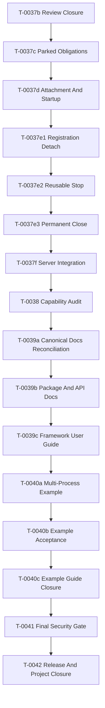

# Spine TS Project Completion Plan

Status: Waves 9 through 13 are complete, release-verified, integrated, and
remotely closed. The T-0203 complete-replica correction is implemented through
the T-0212 generic-routing removal checkpoint; deployment-correction release
closure is the remaining documented follow-up.

Plan date: 2026-07-12

Starting `main`: `40329cad`

Wave 5 packaging and deployment is complete under `T-0089`. Wave 6 Q&A and
T-0104 planning are complete. T-0105 exact system-event and Inbox contracts are
reviewed, verified, integrated, and pushed. T-0106 unified Entity Inbox handoff
is reviewed, release-verified, integrated, post-merge verified, and pushed.
T-0107 remote shard fan-out is reviewed, release-verified, integrated, and
post-merge verified. T-0108 configurable durable Stand registry is reviewed,
release-verified, integrated, post-merge verified, and pushed. T-0109 Stand
listener reconciliation is reviewed, release-verified, integrated, post-merge
verified, and pushed. T-0110 multi-node Gateway fan-in is reviewed,
release-gated, merged, post-merge verified, and pushed. T-0111 Distributed
Message Board and example migration is reviewed, release-gated, merged,
post-merge verified, and pushed. T-0112 documentation and Wave closure is
reviewed, release-gated, merged, post-merge verified, and pushed. Wave 6 is
durably closed. Wave 7's T-0121 through T-0128 scaling, discovery, Terraform,
deployment guidance, and closure sequence is reviewed, release-verified,
integrated, and post-merge verified. Its implementation follows
`build-protocol/planning/WAVE_7_SCALING_REDEPLOYMENT_PLAN.md`.

The pre-Wave-7 architecture review found that `EntityStateChanged` currently
uses a domain EventBus persistence-bypass path instead of a paired System
Context EventBus, and that Message Board discards complete normal subscription
payloads. T-0113 Q&A and planning are complete. The approved correction is
dependency-ordered as T-0114 through T-0119 in
`build-protocol/planning/T-0113_SYSTEM_CONTEXT_PLAN.md`. T-0114 EventBus
storing/forgetting policy is reviewed, release-verified, integrated,
post-merge verified, and pushed. T-0115 atomic System Context and Stand cutover
is reviewed, release-verified, merged as `4275a6d7`, post-merge verified, and
pushed. T-0116 lifecycle System events is reviewed, release-verified, merged as
`5ffe02b7`, post-merge verified, and pushed. T-0117 dispatch diagnostic System
events is reviewed, release-verified, merged as `fa9f4d71`, post-merge verified,
and pushed. T-0118 Message Board payload-first synchronization is reviewed,
release-verified, merged as `964d24c0`, post-merge verified, and pushed. T-0119
documentation and correction closure is reviewed, release-verified, merged as
`5d3ac54d`, post-merge verified, and pushed. The T-0114 through T-0119
correction sequence is complete and supplied Wave 7's required baseline.

## Post-Wave-13 Deployment Architecture Correction

On 2026-08-18 the human rejected the earlier role-split deployment path
and approved complete application replicas behind a node-local service-aware
HTTP/2 Coordinator. T-0203 is a high-risk planning-only prerequisite which
freezes explicit process count, complete-replica verification, direct
per-process Delivery observation, Gateway-to-node-to-process subscription
fan-out, process-local IntegrationBroker channels, and ordered removal of the
generic signal layer. It does not reopen Wave 13's accepted external-event
domain semantics or begin Wave 14 package/SPI work.

The approved architecture is recorded in D-0126 and
`build-protocol/planning/T-0203_COMPLETE_REPLICA_DEPLOYMENT_PLAN.md`. Product
planning is accepted. An unexpected child is replaced with bounded backoff
while surviving children keep serving. T-0204 is a completed predecessor in the
ordered deployment correction, not the next implementation task.
The Gateway-hosted Integration Hub for physically split server applications is
outside the first release. T-0212 completed the mandatory deletion of the
generic signal-routing layer after replacement acceptance; it is not a
retained fallback. The remaining closure reconciles only release commands,
current documentation, and acceptance evidence for this correction.

## Purpose

This is the executable plan from the current repository state to a completed
initial Spine TS framework release. Completion means all of the following are
true together:

- the accepted framework runtime is implemented and integrated;
- public TypeScript and Protobuf contracts are coherent and tested;
- package documentation, architecture documentation, and API reference match
  the implementation;
- the framework user guide describes supported workflows without exposing
  framework internals;
- the to-do example is runnable, documented, and proves the required real
  command, delivery, query, subscription, validation, refusal, gRPC, and
  managed complete-replica behavior;
- the final security review is clean or has explicit accepted exceptions;
- the full repository release gate passes with at least 90% branch coverage;
- generated output remains reproducible and untracked;
- durable task, work, review, decision, and status records are reconciled;
- all task subagents are closed and completed task worktrees are removed.

This plan is intentionally more prescriptive than a roadmap. A coordinator
should be able to execute each packet without first rebuilding project history.

## Post-Release Readiness Correction

On `2026-07-16`, the human identified JVM-style first-class domain rejections
as a missing release requirement. T-0044 reopens readiness until Proto-declared
rejections receive generated throwable TypeScript companions, handler-thrown
rejections become typed rejection events with rejected-command context, entity
work rolls back, rejection dispatch/client behavior is implemented, and current
docs/example coverage agree with the runtime.

The package manager remains pnpm for this Spine TS version. npm compatibility is
not part of T-0044 or the reopened completion frontier.

T-0044 is complete at reviewed endpoint `e5147c3a`, integrated as `74491343`,
post-merge verified, and remotely synchronized. Generated throwable companions,
rollback-safe rejection event publication, subscriber/reactor handling,
client-boundary redaction, current documentation, and the to-do proof are now
part of the accepted release. The temporary readiness reopening is closed.

## Post-Release JVM Parity Program

The accepted initial release remains complete. On `2026-07-22`, the human
opened a separate, four-wave JVM-parity program. T-0052 records and decomposes
Wave 1. The human subsequently started Wave 1; T-0053 through T-0067 are
implemented, reviewed, integrated, post-merge verified, and remotely
synchronized at their closure boundaries. The Wave 2 Q&A and T-0068 planning
are complete. The human started autonomous execution on 2026-07-24; T-0069
through T-0072 are implemented, reviewed, integrated, post-merge verified, and
remotely synchronized. Wave 2 is durably closed. The human completed Wave 3
Q&A and started autonomous implementation on 2026-07-26. The approved execution
plan is `build-protocol/planning/WAVE_3_PROTO_MODEL_MODULES_PLAN.md`.

T-0072 generic Entity query/codegen and durable current-record implementation
was committed as `608fb80a`, merged as `69d43c0a`, and corrected after
post-merge verification as `74d0192a` and `bfa2418f`. All specialist and final
security reviews are clean. The definitive full native gate on `bfa2418f`
passes with 130 files / 2,466 tests and 90.02% branch coverage, and
`origin/main` contains that verified endpoint.

T-0073 Proto model modules and external generation tooling was committed as
`5240b44f` and merged as `7eb1a616`. A clean-checkout correction in the commit
containing this record removes stale-build dependencies from repository Proto
generation and handler analysis. All specialist and security concerns are
clean. Definitive post-merge verification passes 140 files / 2,638 tests in
both native and coverage phases, with 90.01% branch coverage (8,412/9,345);
`origin/main` contains the verified correction endpoint. Wave 3 is durably
closed. Wave 4 Q&A is complete. T-0074 records the approved public contracts,
limitations, diagrams, authentication flows, extension points, and
dependency-ordered implementation plan in
`build-protocol/planning/WAVE_4_BROWSER_CLIENT_INTEROPERABILITY_PLAN.md`.
T-0075 implements the approved Wave 4 plan. All specialist and final security
reviews are closed. Task endpoint `470cd41f` is merged as `77105890`; the
post-merge native gate passes with 157 test files, 3,070 runnable tests, and
90.01% branch coverage. `origin/main` contains the verified merge. Wave 4 is
durably closed.

- **Wave 1:** handler-state `update` / `tryUpdate`, a Node client package,
  end-user `BlackBox`, Projection columns and Query DSL, `Environment`, a
  singleton `ServerEnvironment`, JVM-parity `Delivery`, a delivery client, and
  the in-memory `delivery-server/simple-server` gRPC topology including its
  machine-facing `AdminService`.
- **Wave 2:** the `@spine-event-engine/*` package-scope cutover; shared
  latest-state storage for Aggregate, Projection, and Process Manager; removal
  of Aggregate snapshot/event reconstruction; recent state/event history and
  the double-dispatch guard; and generic Entity columns and Query parity. The
  approved execution plan is
  `build-protocol/planning/WAVE_2_JVM_PARITY_PLAN.md`.
- **Wave 3:** independently published Proto model modules, generation,
  dependency linking, explicit registry composition, dynamic `Any` decoding,
  example migration, and fresh packed-tarball acceptance.
- **Wave 4:** `client-node`, framework-neutral `client-web`, separate
  `client-react`, browser access and TS/JVM service interoperability through
  universal gRPC-Web with optional Connect optimization, a standalone
  provider-neutral authentication gateway, opaque and signed application
  sessions, OIDC/Google/GitHub sign-in, a configurable Envoy reference, and the
  Projection-based Message Board example. Subscriptions are explicitly best-effort
  notifications with reconnect/re-query behavior and no completeness promise.
- **Wave 5:** storage-neutral application packaging/deployment contracts,
  combined and standalone production gateways, a durable subscription
  registry, containers, deterministic Compose, and minimal Kubernetes
  references. The approved plan is
  `build-protocol/planning/WAVE_5_PACKAGING_DEPLOYMENT_PLAN.md`.
- **Wave 6:** JVM-familiar sharded Inbox delivery for Aggregates and Process
  Managers, delivery-server shard fan-out and single-owner drain, EventBus-driven
  Stand, a configurable durable Stand subscription registry, one Gateway
  connected to all application nodes, and a Distributed Message Board.
- **Wave 7:** one Gateway dynamically discovers all current application nodes
  on GKE or GCE; operators scale identical nodes and perform compatible rolling
  or explicit incompatible replacements. It adds generic and platform-specific
  deployment packages, Terraform, scale-to-zero behavior, and detailed GKE/GCE
  guides. Cloud Run and multiple Gateways are excluded.
- **Wave 8:** correct the generic storage model and the Datastore/RDBMS adapters
  to use JVM-style per-record specifications and physical layouts; remove
  unsupported persisted inventions; correct the internal deployment,
  subscription, and authenticated-subscription Proto records; implement the
  controlling JVM-style `DeliveryMonitor`; complete the validation-package
  migration; migrate all
  examples and affected documentation; and finish with a repository-wide
  invention audit. T-0129 owns the
  [frozen plan and dependency split](planning/WAVE_8_STORAGE_CORRECTION_PLAN.md).
- **Wave 9:** server-side operational logging through LogLayer, direct Google
  Cloud Logging integration, JVM-style customizable Command, Event, and Entity
  state-update routing, Event-field
  `@Where` filters, implicit required Command and Entity IDs, and rejection
  conformance. T-0153 owns the frozen dependency plan.
- **Wave 10:** the beginner-guide and current reader-facing Markdown rewrite,
  canonical reference navigation, and copyright/license correction.
  Multiple-Gateway behavior is deferred to a later wave. Cloud Run remains
  outside the initial offering.
- **Wave 11:** fresh frozen `ts_type` support for `(is)` and `(every_is)`,
  generated and authored TypeScript interfaces with same-named runtime tokens,
  interface-based Command/Event/state-update routing through `.route(...)`, a
  To-Do Event-routing proof, generated-source provenance with no generated
  copyright headers, and beginner documentation. T-0178 owns the approved plan in
  `build-protocol/planning/WAVE_11_TS_TYPE_ROUTING_PLAN.md`; D-0113 records the
  accepted architecture decision.
- **Wave 12:** corrected sustained browser subscription delivery, MySQL
  query-plan execution, bounded delivered-Inbox cleanup, and confirmed runtime-document
  mismatches. T-0187 owns the frozen baseline, Human-Imposed Requirements
  Ledger, contract decisions, and dependency split in
  `build-protocol/planning/WAVE_12_RUNTIME_CORRECTNESS_PLAN.md`. Its execution is
  T-0188 browser RED/isolation, T-0189 the bounded browser fix,
  T-0190 MySQL normalized query execution, T-0191 exact Inbox removal, T-0192
  fenced cleanup, T-0193 documentation convergence, and T-0194 release closure.
- **Wave 13:** JVM-equivalent same-process and cross-process Bounded Context
  event exchange. T-0195 froze the
  [behavior/substitution plan](planning/WAVE_13_EXTERNAL_EVENTS_PLAN.md), T-0196
  retained 22 failing acceptance designs, T-0197a/b/c established exact wire,
  typed transport, handler-origin, and child-process seams, T-0198 supplied the
  same-host ZeroMQ message transport, T-0199/T-0200 integrated the broker into
  context/environment lifecycle and ThirdParty import, and T-0201 closed the
  [real two-process proof](tasks/T-0201-wave13-cross-process-acceptance/TASK.md).
  T-0202 owns documentation, final reviews/security, release verification,
  integration, and remote closure.
- **Wave 14:** establish publishable runtime/tooling/auth and cross-package SPI
  boundaries.
- **Wave 15:** add deliberate registry-integrity and tenant-admission controls.
- **Wave 16:** implement JVM-equivalent Projection catch-up with repository-level
  targeting, durable progress, Inbox coordination, restart, and live-event
  ordering. The existing local whole-read-side reset/replay helper is not
  catch-up and provides no completion credit.
- **Wave 17:** secure distributed node reachability by default and remediate
  current dependency advisories with an explicit networked audit lane.
- **Wave 18:** make provider coverage and JVM interoperability claims match
  executable release evidence, and close the remaining comparative parity
  decisions and documentation.
- **Wave 19:** multiple-Gateway behavior, subject to a future human Q&A and
  planning task. Earlier Waves create no provisional multiple-Gateway API.
  Cloud Run remains outside the initial offering.

The validated findings, rejected claims, dependency reasoning, and mandatory
ordering are frozen in
`build-protocol/planning/AGENTIC_REVIEW_REMEDIATION_PLAN.md`. Every roadmap item
that was previously deferred beyond Wave 11 moves behind this remediation
sequence. The binding execution order is runtime correctness, cross-context
event exchange, package/SPI boundaries, registry and tenant admission,
Projection catch-up, secure distributed defaults, release evidence, and only
then multiple-Gateway behavior.

Wave 6 Q&A, its original implementation, review, release verification,
integration, and documentation closure are complete. T-0113 records the
subsequent System Context and payload-first correction that must precede Wave 7.
Wave 7 Q&A and its dependency-ordered T-0121 through T-0128 plan were approved
under T-0120. The complete sequence is now reviewed, release-verified,
integrated, post-merge verified, and remotely synchronized. Do not publish
packages to npm until all waves are complete and publication is revisited with
the human.

Wave 8's T-0129 through T-0144 sequence is complete: the storage correction,
delivery-policy cutover, validation upgrade, example and documentation
convergence, invention audit, release verification, and post-merge proof are
clean. The subsequent T-0145 through T-0150 correction train is also complete,
reviewed, release-verified, merged to `main`, and remotely synchronized. It
removes the invented physical scope and revision fields, adopts native provider
tenancy and JVM-compatible typed value mapping, and closes the shared-runtime
cutover.

Wave 9 is complete under T-0153 through T-0167 and the T-0167A human-review
correction. T-0167A removes TypeScript interpretation of Java-specific
`(is).java_type` and `(every_is).java_type`, and the interface-routing APIs
built on them, while preserving exact/default routing and the canonical frozen
Proto definitions. Its approved scope and preliminary Wave 10 beginner-guide
structure are frozen in
`build-protocol/planning/WAVE_9_LOGGING_ROUTING_PLAN.md`. The dependency-ordered
implementation train, cross-wave audits, specialist and security concern
review, fixture convergence, release profile, fast-forward integration, and
post-main proof are complete and remotely synchronized.

T-0168 plans Wave 10 from the subsequently approved human decisions. It is a
planning-only milestone and must return the dependency-ordered proposal for
approval before product documentation, copyright headers, licenses, or package
metadata change. Multiple-Gateway behavior has been removed from Wave 10 and
is not implicitly authorized by this documentation/licensing program.

Wave 10 is complete under T-0168 through T-0176. The repository now carries the
canonical Apache 2.0 license metadata and 2026 CodeMatters headers, deterministic
future-year/copy/rename/header-placement enforcement, an exact 64-document
strict TypeScript-snippet inventory, rewritten package/example journeys,
canonical API and architecture references, and the approved ten-section
beginner guide. The integrated review wave and final release profile are clean
after one focused metadata-test wording correction. Multiple-Gateway behavior
remains deferred, and Cloud Run remains outside the initial offering.

T-0178 planned Wave 11 from the approved human decisions and the fresh upstream
`ts_type` contract. T-0180 froze the pinned upstream options contract; T-0181
implemented generated interface tokens and companions; T-0182 implemented and
verified same-module authored-interface discovery, conformance, immutable
compiler input snapshots, and rollback. T-0183 added interface-token routing
for Command, Event, and state updates. All four are reviewed, release-verified,
integrated, post-merge verified, tagged, and remotely synchronized. The
T-0184A root source-view transaction prerequisite and the resumed T-0184 To-Do
proof and beginner documentation are complete, integrated, and post-merge verified.
T-0186 closed manifest/marker publication, bounded recovery and
claim trust, package-build convergence, specialist/security review, repository
coverage, release verification, and post-merge proof. Wave 11 is complete at
the reviewed history now contained in `origin/main`. In accordance with the
repository cleanup policy, the remote has only `main` and no tags. The validated
agentic-review remediation occupies Waves 12 through 18; multiple-Gateway
behavior moves wholly to Wave 19. See
`build-protocol/DECISION_LOG.md#d-0113-generate-typescript-message-interfaces-and-route-by-their-tokens`.

T-0187 starts Wave 12 from the freshly fetched exact `origin/main` commit
`7b8a631ecb33210e5da4da9ffa2d8eb8aa59d497`. It is a high-risk planning-only
milestone: product code cannot change until the browser, MySQL, Inbox,
configuration, persistence, and verification contracts are durable and
reviewed. The protected human agentic-review folder in the coordination
checkout remains outside every task worktree and mutation. Wave 12 cannot leak
Wave 13 through 19 APIs.

T-0187 is reviewed, task-verified, merged as `1690eb7e`, post-merge verified,
pushed, and remotely closed. T-0188 through T-0192 have since supplied the
accepted browser, query, and Inbox behavior; T-0193 now reconciles its reader
documentation before T-0194 release closure.

The explicit stream assignments, profiles, ownership, telemetry limitation,
and shared-resource serialization are recorded in
`build-protocol/tasks/T-0187-wave12-plan/STREAM_DISPATCH.md` before child
dispatch.

Wave 12 uses the accelerated autonomous execution model frozen in its plan:
three isolated streams run browser T-0188/T-0189, query-provider T-0190, and
Inbox T-0191/T-0192 work concurrently with non-overlapping ownership. Existing
provider record-storage files stay exclusively with T-0190 until a recorded
handoff. Shared live/coverage resources, integration, documentation T-0193,
final security/release T-0194, and remote closure remain dependency-serialized.
No parallel task is declared durably closed while another unique remote branch
exists; all are reconciled into `origin/main` before the remote returns to only
`main` and no tags.

## Authored API And Example Quality Correction

T-0080 is a bounded corrective program opened after Wave 4. It does not answer
the Wave 5 Q&A or add runtime capability. It makes authored production/example
TypeScript and example Proto sources concise, documented, structurally owned,
and deterministically enforced, while moving the four Chat modules beneath one
discoverable `examples/chat/` family.

The planned dependency shape, pending orchestrator acceptance, is:

1. T-0080A-C: serial TSDoc, complete TypeScript name/standalone-function, and
   authored example Proto enforcement.
2. T-0080I: Chat physical/package migration so later consumer repairs target
   the final nested paths.
3. T-0080D: production foundations.
4. T-0080E/F/G: disjoint adapter, server, and auth/browser-client remediation
   after foundation contracts stabilize.
5. T-0080H: dependent client, delivery-client, testing, and Proto tooling
   remediation.
6. T-0080J/K: Chat model and application/web remediation after their production
   dependencies.
7. T-0080L/M/N: disjoint to-do, project-management, and datastore-orders
   remediation.
8. T-0080O: final generation, exact debt closure, cross-slice reconciliation,
   one final relevant review/verification boundary, integration, and remote
   synchronization.

Intermediate slices use focused checks and relevant review-sized endpoints.
The program pays for one final full `pnpm verify` in T-0080O; post-merge full
verification repeats only when the protocol's change-sensitive conditions
require it. Original copied Spine JVM Proto contracts and generated output are
never manually renamed or edited, and Spine JVM is not built.

Wave 1 uses frozen `core-java` commit
`a408b0d70dafd603efc55b89c8b4b6f3e8c19d3b` and frozen `delivery-server`
commit `21f2901f393e552208b97166f4eaeb942f9f5172`. Only the upstream
`simple-server` module is in scope, and the TypeScript server is in-memory only.
Redis, Hazelcast, human admin interfaces, and other delivery-server modules are
not Wave 1 work. The final upstream-delta audit found no delivery-server delta;
current core-java changes are the already deferred Wave 2 recent-history work.

## Authority And Reconciliation Rules

Use sources in this order when statements conflict:

1. Explicit human instructions in the current task.
2. Accepted decisions in `DECISION_LOG.md`, especially D-0085 and D-0086.
3. Current task `TASK.md` status and scope in the active task worktree.
4. `TECHNICAL_SPEC.md`, `RUNTIME_ARCHITECTURE.md`, `DEVELOPER_API.md`,
   `PROTOBUF_CONTRACT.md`, `TODO_EXAMPLE_SPEC.md`, and `CODE_QUALITY.md`.
5. `BUILD_PROTOCOL.md` for execution and quality procedure.
6. Timestamped work/review logs as historical evidence.

Historical text is not active state merely because it appears in a diff.
Reviewers must ignore superseded text unless the current task brief, current
status mirrors, or changed public documentation claims it as current behavior.

The candidate headers for T-0037b onward on root `main` do not override the
active T-0037b worktree. The active worktree's T-0037b status is canonical.
Bootstrap-era T000/T001 records are explicitly `Historical/closed`; their
dated pending body text is chronology, not unimplemented product work.

## Starting State

### Root

- Repository: `/Users/armiol/development/experiments/spine-ts`
- Branch: `main`
- Baseline at plan creation: `40329cad`
- T-0037a is integrated and post-merge verified.
- `human-review-1-jul.md` is user-owned and must never be read, edited, staged,
  committed, deleted, moved, or used as a project input.

### Active T-0037b

- Worktree:
  `/Users/armiol/development/experiments/spine-ts/.worktrees/T-0037b-bounded-generation-run-coordinator`
- Branch: `task/T-0037b-bounded-generation-run-coordinator`
- Safe-stop commit: `4adb0b4f`
- Implementation endpoint: `066c295d4860754be97341b802e05faa0da92370`
- The transient review package was removed after the recorded review completed.
- State: Round 5 is complete with two accepted P1 findings, every reviewer is
  closed, and no fix worker is assigned.
- Last coordinator verification: four files, 180 focused tests, both
  typechecks, ESLint, Prettier, and `git diff --check` passed.

### Historical Branches And Worktrees

Older branches that are not merged by ancestry are not automatically pending
product work. Their accepted changes are already represented on `main` through
later branch lines. Dirty or scratch-only worktrees are preserved archival
state. Do not merge, rebase, delete, or repair them during the critical path.
Handle optional archival cleanup only after release, with a separate explicit
maintenance task.

## Current Execution Status

Initial release closure through T-0042 and the prior completed tasks is
historical. T-0044 first-class domain rejections are complete, clean in every
canonical concern, and clean in the refreshed whole-task security review. The
reviewed endpoint `e5147c3a` is integrated as `74491343`; branch and post-merge
native gates each pass 75 files / 1,809 tests with 90.08% branch coverage, full
TypeScript/lint/format/TypeDoc/Proto/generated-clean checks, 204 server exports,
58 package imports, and 111 Markdown links. The task and merged main refs are
confirmed on `origin`. No implementation frontier remains; the accepted initial
release is restored to complete and release-ready.

In the prior closure, T-0041 was complete, integrated, post-merge verified,
remotely synchronized, and cleaned up, with a clean focused final security
review and one explicit human-accepted SF-013 residual. T-0042 release preflight,
real single-process and multi-process acceptance, package/import/link/command scans,
all final specialist dispositions, and the native branch gate are clean. The
branch gate passed 74 files / 1,780 tests in both ordinary and coverage runs at
90.04% branches. Closure-record review is clean. T-0042 is integrated at
`b3bb4adb`, and the native post-merge gate passed with the same evidence.
The remote task and integrated main refs were synchronized, and the clean
T-0042 worktree/local branch were removed while the remote task branch was
preserved. This final closure record is verified and pushed as the last release
gate. The dated Starting State above is historical plan-creation context.

## Initial Release Completion Record

- Framework runtime, public TypeScript/Protobuf contracts, package docs,
  architecture docs, user guide, to-do example, real single-process and local
  multi-process acceptance, and final security gate are complete together.
- Final branch and post-merge gates each passed 74 files / 1,780 tests with
  90.04% branch coverage and all TypeDoc/API, Proto, generated-clean, and
  58-import/107-link release checks.
- Capability taxonomy is closed at 27 `IMPLEMENTED`, 4
  `DOCUMENTED_EXCLUSION`, and zero defect/security/example/status routes.
- T-0042 task endpoint `2a7e4652` is preserved on
  `origin/task/T-0042-release-readiness-project-closure`; integration merge is
  `b3bb4adb`; the first remotely synchronized post-merge evidence commit is
  `40d48f1b`.
- The T-0042 worktree and local task branch are removed. No other historical
  worktree qualifies for non-force cleanup: the sole merged one is dirty, and
  the rest are unmerged archival branches.
- Root `human-review-1-jul.md` remains user-owned, untouched, and untracked.
- The final closure commit cannot record its own content-addressed SHA without
  self-reference. Its contract is therefore explicit: run the full native gate
  against that exact commit, push it to `origin/main`, and confirm the remote
  ref externally without creating another status-only commit.
- The ZeroMQ multipart-allocation post-completion obligation is complete. T-0043
  records the durable report in
  [`ZEROMQ_MULTIPART_LIMIT_RESEARCH.md`](research/ZEROMQ_MULTIPART_LIMIT_RESEARCH.md),
  has a clean documentation review, is integrated as `31fc4bbe`, and has its
  clean task worktree/local branch removed while preserving the remote task
  branch. It was not unfinished initial-release work and did not reopen the
  accepted release.

Post-completion obligation: immediately after T-0042 establishes project
completion, research public ZeroMQ/libzmq and zeromq.js issue trackers,
documentation, and technical discussions for the accepted D-0093 multipart-
allocation residual. Report whether the behavior is already known, documented
workarounds or upstream proposals, and whether Spine TS appears to have found a
previously undocumented limitation. This research follows completion and does
not block the initial release definition of done. T-0043 owns the tracked
research, review, push, and cleanup closure, now complete.

## Initial Release Scope

### Included

- Protobuf-first domain modeling and copied Spine wire contracts.
- Generated handler registry for bare decorators.
- Command/event buses, aggregate, process manager, and projection execution.
- Framework-owned transactions, state validation, and default command routing.
- Storage, event journal, inbox, claims, shard leases, bounded delivery loops,
  delivery-attempt accounting, and exhaustion gate.
- Environment-owned delivery readiness, generation coordination, lifecycle,
  startup recovery, detach, reusable stop, permanent close, and server ordering.
- Query and subscription services and real local gRPC-compatible server.
- Process-local IntegrationBroker typed message channels.
- Framework and example testing utilities.
- Public docs, API reference, architecture notes, guides, and runnable example.

### Explicitly Not Release Blocking

Do not create tasks for these unless a new human decision changes scope:

- distributed multi-host transport;
- production process supervision;
- retry delay, backoff, jitter, or timer policy;
- public monitor, scheduler, health, action, or dead-letter APIs;
- production transport topology or adapter policy;
- projection `CATCH_UP` delivery through the inbox worker;
- legacy `IMPORT_EVENT` support;
- aggregate import/importers, `ImportBus`, or aggregate `@Apply` delivery;
- JVM source-level compatibility;
- production persistence, authentication, deployment, tracing, or health checks
  in the to-do example.

Existing public compatibility symbols may remain only with their already
accepted narrow framework/testing/legacy descriptions. Do not expand them.

## Definition Of Done

The project is complete only when every item below has evidence on final
`main`:

### Framework

- T-0037b, T-0037c, T-0037d, T-0037e1, T-0037e2, T-0037e3, and T-0037f are
  complete, reviewed, merged in order, and post-merge verified.
- `ServerEnvironment` is the sole environment delivery owner.
- Startup recovery settles before listener intake.
- Network intake stops before detach and delivery quiescence.
- Endpoint-dependent contexts/resources remain open until quiescence is
  established.
- Shared and owned environment cleanup preserve their distinct ownership.
- No public lifecycle implementation details or speculative policy leak.
- Compatibility and Protobuf/type-URL tests pass.

### Documentation

- Root and all six package READMEs describe current supported behavior.
- `docs/USER_GUIDE.md` covers installation, generation, decorated handlers,
  context assembly, command/event execution, query/subscription, storage,
  delivery, server lifecycle, testing, and supported limitations.
- `docs/api/README.md` and generated TypeDoc match all public exports.
- `docs/architecture/README.md` and protocol architecture/spec files distinguish
  implemented behavior from accepted exclusions.
- No docs promise future retry, monitoring, topology, or catch-up policy.
- Every command and code snippet uses only supported public APIs.

### Example

- A clean generation/build produces the ignored handler registry and compiled
  app.
- The app starts a real local gRPC-compatible server.
- Black-box tests prove acknowledgement, asynchronous handling, projection
  delivery, query, subscription, validation failure, and business refusal.
- Real managed-process tests demonstrate complete replicas, Coordinator
  forwarding, direct Delivery observation, and Gateway subscription fan-out.
- Example source passes all forbidden end-user API scans.
- Example README and user guide are copy-paste accurate.

### Quality And Release

- Every per-task review concern has a recorded clean or accepted disposition
  when relevant, or a concrete justified N/A disposition:
  style/maintainability, documentation, TypeScript/API docs, and
  performance/reliability.
- One final project-wide security review is clean or every exception is
  explicit, narrow, durable, and human-accepted.
- `pnpm --config.verify-deps-before-run=false verify` passes natively.
- Global branch coverage is at least 90% with useful margin where practical.
- Protobuf lint and generated-clean checks pass.
- `git diff --check` passes and final tracked/untracked inspection is clean
  except the untouched user-owned file.
- All subagents are closed; completed clean worktrees are removed.

## Critical Path



Runtime children are strictly serial because each owns a prerequisite lifecycle
contract. After T-0037f, research for T-0039 and T-0040 may run in parallel,
but edits and integration remain in the order above so docs and example target
stable runtime behavior.

## Fast Execution Protocol

Apply this packet to every implementation or docs task.

### 1. Frame And Start

1. Confirm the dependency is integrated on `main` and post-merge verification
   passed.
2. Confirm the selected execution surface supports every required model profile
   and explicit model/reasoning dispatch. Desktop support is sufficient when a
   separate shell CLI is stale; update or switch only an incapable selected
   surface.
3. Inspect actual repository state, frame one coherent milestone, and record its
   functional acceptance criteria and genuinely high-risk assumptions.
4. Classify the milestone as micro, standard, or high-risk under
   `BUILD_PROTOCOL.md`; promote it if implementation exposes a higher-risk
   boundary.
5. Read the task brief, current accepted decisions, affected public docs, and
   relevant Spine JVM server evidence for server-module work.
6. Invoke the requirements splitter on Sol High only for the selective planning
   triggers in `BUILD_PROTOCOL.md`; use a short orchestrator outline otherwise.
7. Perform and record the canonical skill-applicability check once; reuse it
   while scope, roles, and inventory stay stable.
8. Create one branch/worktree for the task when write isolation is useful.
9. Create one concise record for a micro task, or task/work/review records for
   standard and high-risk work, before code/doc edits.
10. Record baseline SHA, branch, worktree, author agent, and start timestamp.
11. For every child, record its existing role or dispatched function, scope,
    expected model, and reasoning before dispatch; confirm both were explicit
    dispatch fields. Record exposed runtime metadata, or the immutable role
    profile plus an honest self-introspection limitation, before acceptance.

### 2. Implement

1. A micro task may be implemented directly by the orchestrator. Otherwise use
   one Terra Medium author at a time for overlapping production files.
2. For runtime changes, write deterministic RED tests first, then GREEN code,
   then a small refactor only when needed.
3. Keep public exports unchanged unless the task explicitly owns a public API.
4. Update durable records only at the meaningful resumability boundaries in
   `BUILD_PROTOCOL.md`.
5. Commit generated Protobuf and handler-registry output never.
6. Stop the slice if it begins owning behavior assigned to a later task.

### 3. Mechanical Verification

Use Luna Low/Medium for focused tests, deterministic checks, and failure-log
classification during implementation/fix loops:

```bash
pnpm --config.verify-deps-before-run=false exec vitest run <focused-test-files>
pnpm --config.verify-deps-before-run=false typecheck:build:generated
pnpm --config.verify-deps-before-run=false exec eslint <changed-ts-files>
pnpm --config.verify-deps-before-run=false exec prettier --check <changed-files>
git diff --check
```

Add `docs:check` when public docs, TSDoc, exports, or declarations change. Add
focused Protobuf checks only when proto sources or generation tooling change.

### 4. Pre-Review Lint

Before spawning reviewers, perform a lightweight local audit and record it:

1. Canonical task status equals work-log and review-log current status.
2. No stale `pending`, `candidate`, `awaiting review`, or prior-round claim is
   presented as current state.
3. No duplicated constant/helper was added where an existing owner exists.
4. No package-internal type, callback, cursor, registration, generation,
   obligation, retry, or lifecycle primitive leaks from a public root.
5. Public docs describe current observable behavior only and do not claim
   future policy.
6. Historical superseded text is clearly historical and not treated as active.
7. Example/doc code passes the end-user API prohibition scan when touched.
8. Generated output and review-package scratch material are untracked only.

### 5. Targeted Review

1. Resolve and record the immutable endpoint with `git rev-parse HEAD`.
2. Generate the review package with literal baseline and endpoint SHAs. Never
   pass moving `HEAD` as the endpoint.
3. Record a relevance disposition for all four existing concerns:
   style/maintainability, documentation, TypeScript/API docs, and
   performance/reliability. Spawn only relevant lanes, each bounded to its
   concern, the milestone diff, and affected execution paths. A skipped lane
   requires a concrete N/A reason.
4. Run genuinely independent relevant lanes concurrently using available
   execution-surface capacity. Sequence only for dependencies or capacity, then
   aggregate and deduplicate the complete wave before any finding returns to
   implementation.
5. Prompts must state exact task scope, accepted exclusions, public boundary,
   review package, and the historical-text rule.
6. Close every reviewer immediately after collecting its result.
7. Classify findings as P0, P1, P2, or P3. If there are blocking or accepted
   task-scope findings, record the complete batch first and return
   it to the existing implementation context when available. Use one fresh fix
   worker only when that context cannot continue. Verify locally, commit,
   regenerate the package, and rerun only substantively affected lanes.
   Mechanical and record-only corrections receive deterministic checks, not a
   specialist re-review.
8. Run no more than two complete review waves. Beyond that, continue only for
   unresolved P0/P1 risk or explicit human direction; use one final targeted
   batch for accepted P2 findings.
9. Do not run a per-task security lane.

### 6. Accept And Integrate

1. After convergence, run focused checks plus the change-sensitive final gate
   from `BUILD_PROTOCOL.md`. Full `pnpm verify` is required once for runtime,
   test, contract, generated, dependency, or shared-build changes; micro and
   documentation-only tasks use their relevant deterministic gates.
2. Record exact verification evidence and reconcile every applicable task,
   work, review, or combined-micro record.
3. Commit the reconciled task records with the accepted task endpoint. Do not
   create a separate record-only commit merely to name that commit.
4. Merge into root `main` without staging unrelated files.
5. Prove whether the merged tree equals the verified task tree. Run post-merge
   focused checks; repeat full `pnpm verify` only when mainline movement,
   conflict resolution, shared infrastructure, tree differences, or high-risk
   integration requires it.
6. Record post-merge evidence in one mainline closure update when durable
   project state must change. Never create a second follow-up solely to name
   the closure commit itself.
7. Push the completed task branch and updated `main` to `origin`, inspect and
   reconcile every remote ref, then delete the completed branch and every tag;
   closure requires exactly `origin/main` and no remote tags.
8. Remove the completed worktree only when Git reports it clean.

## Runtime Execution Packets

The packets in this section are retained execution history for completed
pre-Wave-8 work. Their legacy `PAUSED` coordinator terminology records the
then-current internal protocol; it is not a current public delivery status or
acceptance criterion.

### T-0037b: Bounded Generation Run Coordinator

**Entry:** Resume the existing worktree at `4adb0b4f`. Do not reimplement or
reopen completed Round 1-5 review work.

**Immediate actions:**

1. Confirm the worktree is clean and all status mirrors say Round 5 has two
   accepted findings pending a fix, with every reviewer closed and no fixer
   assigned.
2. Preserve endpoint `066c295d...` and its package as Round 5 review evidence;
   do not repeat the clean documentation or TypeScript/API lanes.
3. Return the two accepted P1 findings recorded in the current review log to the
   existing Terra Medium implementation context: cap one active turn to one
   successor admission, and keep synchronous `worker.start()` invariant throws
   outside ordinary promise-rejection settlement.
4. Use focused TDD, verify the complete batch, freeze a new literal endpoint,
   and rerun only style/maintainability and performance/reliability unless the
   fix changes another concern.

**Acceptance behavior:**

- readiness starts are serialized;
- pending readiness is a lossless canonical scope union bounded by live
  tenant/configured scope cardinality, not notification count;
- only `PAUSED` shards continue within a finite obligation;
- `FAILED`, `SKIPPED`, `STOPPED`, and rejected starts do not spin;
- rejected evidence retains exact scope and last-safe progress without keeping
  the obligation object;
- retirement closes admission, stops, awaits quiescence, classifies, invokes
  caller consumption/reporting, and permanently retires/cleans up in order;
- reporting or inert cleanup failure cannot reactivate a quiescent generation;
- inability to prove quiescence prohibits replacement and later phases;
- same-operation retry resumes without duplicating completed stop work;
- no coordinator concept or new export appears in the public package root.

**Focused gate:** coordinator tests, delivery-worker runtime tests, T-0036
delivery loop/worker regressions, generated typecheck, lint/format, docs/API
export check if declarations changed, then final task `pnpm verify`.

**Exit:** merge to `main`, post-merge verify, record integration, remove clean
worktree. T-0037c may start only afterward.

### T-0037c: Parked Delivery Obligations

**Objective:** Add one finite internal table for unresolved operational
obligations and one-time cause reporting.

**Files:** new internal delivery record module, minimal T-0037b settlement
integration, focused tests, task/work/review logs, current architecture wording.

**TDD sequence:**

1. Prove repeated rejection cannot increase key/cause cardinality beyond live
   registration/configured-shard bounds plus one shared record.
2. Add canonical keys for registration+scope, generation+shard, and at most one
   shared generation-spanning record.
3. Prove deterministic representative selection and saturating occurrence
   counts at `Number.MAX_SAFE_INTEGER`.
4. Prove selected causes report once while unresolved operational work remains.
5. Prove later rejection installs at most one fresh representative without
   retaining error history.
6. Prove successful re-evaluation consumes only work actually re-evaluated.
7. Prove owner-removal reclassification coalesces without arbitrary subset
   keys or duplicate causes.
8. Prove fulfilled `FAILED` creates operational readiness only, not a cause.

**Boundary:** no real registrations, startup, retirement, public monitoring,
timing policy, or public export.

**Focused gate:** parked-obligation tests, T-0037b coordinator tests, delivery
worker regressions, typecheck/lint/format/diff, public-leak scan, final verify.

### T-0037d: Environment Attachment And Startup

**Objective:** Make `ServerEnvironment` the sole internal owner of attachment,
one current generation, readiness routing, finite startup recovery, and
registration-scoped failed-start rollback.

**Files:** `server-environment.ts`, small internal environment lifecycle
modules, minimal access changes to T-0037a/b/c, focused environment tests, logs,
architecture wording.

**TDD sequence:**

1. Prove caller-owned registrations share one generation while server-owned
   environment registration is exclusive.
2. Close new direct exact-drain admission before attachment and await every
   already-admitted exact drain in scope.
3. Buffer persistence readiness during route installation in a canonical
   bounded transition owner; transfer each scope once before startup admission.
4. Prove no row loses both owners and exact drain never overlaps the
   environment worker for the same work.
5. Enumerate startup scopes from T-0037a descriptors using the actual context
   storage factory and tenant index.
6. Await one finite startup recovery result before attachment readiness.
7. Attribute rejected evidence by registration/scope; do not fail startup for
   fulfilled `FAILED` alone or disjoint sibling rejection.
8. Roll back only the failed registration and preserve siblings.
9. For a sole failed attach, invoke T-0037b retirement in order and clear a
   quiescent retired slot despite reporting/inert cleanup error.
10. For quiescence failure, retain the slot and endpoint dependencies; retry the
    same operation without duplicated closure/stop, then permit one fresh attach.

**Boundary:** no `Server.start()` listener wiring, ordinary detach, reusable
stop, permanent close, public registration API, timing policy, or topology.

**Focused gate:** environment attachment/startup/race tests, context handoff
tests, T-0037b/c tests, server environment regressions, public export scan,
typecheck/lint/format/diff, final verify.

### T-0037e1: Registration Detach Lifecycle

**Objective:** Add registration-scoped non-last detach and ordinary last-detach
retirement without owning reusable stop or permanent close.

**TDD sequence:**

1. Non-last detach closes only departing readiness, awaits its work barrier,
   consumes/reports only eligible departing/newly orphaned records, and keeps
   sibling generation identity and endpoints usable.
2. Non-last failure retry resumes registration cleanup/reporting only and never
   stops/retires the generation or clears its slot.
3. Ordinary last detach invokes T-0037b's primitive and clears only a proven
   quiescent retired slot.
4. Reporting and inert cleanup failures still permit safe slot clearing before
   propagation and one later fresh first attach.
5. Quiescence failure retains unsafe ownership; same-operation retry completes
   remaining phases once.
6. Detach/attach races linearize: attach either joins before stop or waits and
   joins one fresh generation after safe retirement.

**Boundary:** no reusable stop, permanent close, facilities, failed-start
rollback, server integration, public detach/registration API, or examples.

**Focused gate:** detach/race/retry tests, T-0037d regressions, public leak/API
checks, typecheck/lint/format/diff, final verify.

### T-0037e2: Reusable Generation Stop

**Objective:** Implement the sole package-internal reusable stop and exact-once
transition to one fresh generation while registrations survive.

**Required four phases:**

1. Rebind every surviving registration and readiness route with per-unit
   checkpoints.
2. Transfer every configured, startup, buffered, and retained canonical scope
   once into fresh pending admission with separate checkpoints.
3. Publish the sole fresh candidate.
4. Reopen later-write admission.

**TDD sequence:**

1. Explicit stop creates the candidate even without a racing attach.
2. A racing eligible attach waits and joins the same candidate.
3. Writes during transition remain in the bounded transition owner and are
   admitted without an unrelated trigger.
4. Construction failure creates no candidate; retry creates exactly one.
5. Partial rebind/transfer failure retains the candidate and per-unit progress;
   external retry resumes without repeats or self-looping.
6. Quiescence failure retains old generation and dependencies; retry resumes
   after completed closure/stop.
7. Separate reporting and inert retirement failures still complete all four
   replacement phases before propagating the original error once.
8. Internal-access tests prove no server/handoff caller invokes the primitive
   directly and no public explicit-stop API/docs exist.

**Focused gate:** reusable-stop transition/race/retry tests, T-0037d/e1
regressions, public-leak scans, typecheck/lint/format/diff, final verify.

### T-0037e3: Permanent Environment Close

**Objective:** Implement serialized live-registration/retained-owner close
refusal and owner-free zero-registration/no-generation permanent admission,
followed by ordered owned-facility teardown outside the lifecycle serial gate.

**Integrated ownership outcome:** T-0037d owns failed-start generation
retirement, T-0037e1 owns last-detach retirement, and T-0037e2 owns reusable-stop
retirement. They preserve D-0085 stop/await/classify/consume-report/retire order,
quiescence retention, safe slot clearing, and cause-once behavior. T-0037e3
refuses those retained owners and adds no generation-retirement caller. This
supersedes the former T-0037e3 current-generation retirement assignment because
the integrated lifecycle exposes no owner-free state that can execute it.

**TDD sequence:**

1. Close with live registrations refuses before any lifecycle mutation.
2. Retained failed-start, unsafe last detach, and incomplete reusable stop each
   refuse without permanent admission, generation/slot/dependency/facility, or
   error-state mutation; the exact predecessor retry remains usable.
3. Close/attach race has one serialized winner; owner-free close first
   permanently rejects the later attach.
4. Close first followed synchronously by eager `stopDelivery()` and an attach
   waiter cancels that stop only while it is both unadmitted and not completed,
   rejects/clears its waiters, commits permanent admission, and releases
   `#serial` without awaiting the stop or any facility.
5. With an owned facility close held by a deterministic deferred promise, the
   queued cancelled stop and waiter reject before that facility settles while
   the coalesced public close attempt remains pending; a later attach rejects
   from permanent state. Releasing the facility then lets close complete.
6. Stop first in a no-generation environment, attach a waiter while that stop is
   running, then invoke close second. The stop's turn sets `completed` and
   releases its waiter behind close; close does not cancel the retained stop,
   commits permanent admission after the stop turn, the queued attach rejects
   from permanent state, waiter settlement lets the stop promise resolve
   normally, and `#stop` clears through its existing completion handler.
7. Facility teardown outside `#serial` attempts every owned facility in stable
   order, closes successful facilities exactly once, and retries only failed
   facilities on a later public `close()` attempt.
8. Existing T-0037d/e1/e2 tests remain authoritative for unsafe quiescence
   retention, safe slot clearing after reporting/inert cleanup failure, and
   unreported-versus-already-reported causes.
9. Public close TSDoc explicitly says an in-use close rejects non-destructively
   and performs no owned-facility teardown. If this wording ships, the package
   README must state the same observable behavior. Neither names internal stop.

**Boundary:** no server/listener integration, ordinary detach, reusable stop,
failed-start rollback, generation retirement, parked-record handling, public
lifecycle option, retry timing, or topology.

**Focused gate:** permanent close/refusal/race/facility tests including deferred-
facility/cancelled-stop settlement and completed stop-first waiter settlement,
T-0037d/e1/e2 regressions, static retirement-caller scans, matching public
TSDoc/README checks, typecheck/lint/format/diff, final verify.

### T-0037f: Server Lifecycle Integration

**Objective:** Wire the stable environment lifecycle into `Server.start()` and
`RunningServer.close()` without reproducing environment logic.

**Startup order:**

1. Build contexts/resources.
2. Attach contexts and install readiness.
3. Await finite startup recovery.
4. Open listener.

**Close order:**

1. Stop network intake and sessions.
2. Detach registration and await delivery quiescence while endpoint
   dependencies remain open.
3. Surface eligible causes once.
4. Close contexts and resources.
5. Close environment/facilities only when server-owned and exclusive.

**TDD sequence:**

1. Listener never opens before successful recovery.
2. Caller-owned failed startup cleans only server-owned contexts/resources and
   leaves the environment/facilities reusable.
3. Caller-owned quiescence failure defers endpoint-dependent cleanup; explicit
   retry resumes T-0037d rollback and permits a later fresh server attachment.
4. Server-owned failed startup retires safely before contexts/resources and
   permanent environment close; quiescence failure retains all dependencies.
5. Non-last running-server close leaves sibling server/generation usable;
   failure retry is registration-scoped and non-retiring.
6. Last close retires the generation and respects owned environment ordering.
7. Transport/storage never close beneath active delivery; no `PAUSED` run starts
   after stop admission.
8. Existing host, port, base URL, listener failure, shared/owned environment,
   and retryable/idempotent close contracts remain compatible.
9. README/TSDoc describe observable startup recovery, close ordering, errors,
   and caller-owned reuse without exposing registrations/generations/internal
   stop or adding public exports/options.

**Focused gate:** server startup/close/failure/race tests; all T-0037 environment
and delivery suites; context handoff tests; server API export test; docs check;
typecheck/lint/format/diff; final verify.

**Exit:** Reconcile D-0085/D-0086 and T-0037 parent status as implemented,
merge, post-merge full verify, and remove the clean worktree. The framework
runtime then enters release audit, not another speculative runtime roadmap.

## Framework Closure Packets

### T-0038: Accepted Capability Audit

**Objective:** Prove the integrated framework satisfies the accepted initial
release contract and classify every remaining statement as implemented,
documented exclusion, stale historical text, or real defect.

**Method:**

1. Create a traceability matrix from `TECHNICAL_SPEC.md`,
   `PROTOBUF_CONTRACT.md`, `DEVELOPER_API.md`, `RUNTIME_ARCHITECTURE.md`,
   `TODO_EXAMPLE_SPEC.md`, and `CODE_QUALITY.md` to implementation/tests/docs.
2. Audit public exports from package roots and `scripts/check-api-docs.mjs`.
3. Audit compatibility tests for message shapes and type URLs.
4. Audit end-user API prohibitions in example and guide snippets.
5. Audit accepted exclusions so conceptual/future text is not mislabeled as a
   missing implementation.
6. Record evidence in a durable release-readiness matrix under
   `build-protocol/release/`.

**Finding rule:**

- Documentation/status mismatch moves to T-0039.
- Example-only gap moves to T-0040.
- Security issue moves to T-0041.
- A mandatory framework behavior defect creates the smallest possible numbered
  T-0038 child, with one behavior owner and one regression test. Do not create a
  broad new roadmap or add excluded production policy.

**Known checks:** command acknowledgement and asynchronous handling; aggregate,
process manager, projection, query, subscription, validation, lifecycle,
storage, managed complete-replica deployment, delivery, generated registry,
default route, custom route, wire shape, and type URL.

**Gate:** clean results for every relevant review concern and justified N/A
dispositions for the rest over the matrix and any audit-only status changes. If
code defects are found, complete and integrate their tiny T-0038 children,
rerun the matrix, then close T-0038.

### T-0039a: Canonical Specification And Status Reconciliation

**Objective:** Make protocol specifications and durable status records describe
the final implemented runtime and its explicit exclusions.

**Files:** protocol specs/architecture/decision task status records only. Do not
rewrite public user guidance in this slice.

**Required work:**

- update current delivery lifecycle wording after T-0037f;
- mark D-0085/D-0086 implementation outcomes without changing decisions;
- reconcile T-0037 parent/children and current work/review status mirrors;
- close stale T000/T001 bootstrap headers with factual historical notes;
- remove stale claims that implemented behavior is pending;
- preserve explicit future/out-of-scope policy;
- avoid mass-editing historical event entries.

**Gate:** docs/status lint, links, formatting/diff, clean relevant review
concerns with justified N/A dispositions, and exact changed-file scope.

### T-0039b: Package READMEs And API Reference

**Objective:** Reconcile root/package READMEs, public TSDoc, API overview, and
TypeDoc with the final public surface.

**Required surfaces:** root README; `packages/{core,proto,server,storage,
transport,testing}/README.md`; `docs/api/README.md`; public TSDoc; TypeDoc.

**Required checks:**

- every exported symbol is covered by API checks;
- examples compile against public package imports;
- no internal coordinator, obligation, registration, generation, cursor,
  lifecycle access, endpoint, or storage implementation detail leaks;
- lifecycle docs state only observable `Server`, `RunningServer`, and
  `ServerEnvironment` behavior;
- legacy compatibility symbols retain narrow accepted wording;
- package limitations agree with accepted exclusions;
- links and command snippets are valid.

**Gate:** generated typecheck, `docs:check`, API export tests, README snippet
checks where available, format/diff, and clean relevant review concerns with
justified N/A dispositions.

### T-0039c: Framework User Guide Closure

**Objective:** Make `docs/USER_GUIDE.md` sufficient for a new framework user to
build and run a server application without reading internal source.

**Required journey:**

1. Install and generate Protobuf-ES output.
2. Model IDs, state, commands, and events with Spine conventions.
3. Write bare-decorated aggregate/process-manager/projection handlers with
   valid explicit return types.
4. Generate and load the framework-owned handler registry.
5. Assemble storage, bounded contexts, and server environment.
6. Start and close a server with correct lifecycle expectations.
7. Post commands and understand immediate acknowledgement/asynchronous work.
8. Query and subscribe to state.
9. Handle validation and business refusal.
10. Test through `@spine-ts/testing` and real gRPC clients.
11. Understand delivery guarantees, replay-safe handler expectations, managed
    complete-replica deployment boundaries, and supported limitations.

**Prohibitions:** no framework envelopes in ordinary handlers, no schema-bearing
decorators, no `@Apply`, no manual transactions, no internal IDs, no default
target extraction, no handler materialization, no internal lifecycle APIs.

**Gate:** compile or test all practical snippets, end-user API scan, docs check,
links, format/diff, and clean relevant review concerns with justified N/A
dispositions.

## Example Closure Packets

### T-0040a: Historical Local Multi-Process To-Do Mode

**Superseded:** The deployment correction removed this same-host signal-routing
mode and its ZeroMQ implementation. The retained text below records the former
audit requirement; it is not a current implementation or release gate.

**Objective:** Satisfy the remaining example requirement by demonstrating real
same-host multi-process bus behavior with the existing transport abstraction
and retired adapter.

**Design investigation first:** Identify the smallest supported public runtime
composition that allows a parent/test process and a child worker process to
exchange a real to-do signal over local IPC. Reuse existing runtime routing and
transport APIs. Do not expose package internals merely to make the example pass.

**Implementation requirements:**

- add a purpose-specific example worker entry point or test fixture;
- spawn a real Node child process;
- allocate a private temporary IPC directory and deterministic logical IDs;
- perform a readiness handshake before sending work;
- route at least one generated to-do command/event payload through the real bus
  transport and prove handling in the other process;
- close sockets, child process, temporary files, server, contexts, and
  environment deterministically on success and failure;
- bound all waits with useful timeout diagnostics;
- retain local-only, single-host scope and make no production supervision claim.

**Escalation rule:** If the demonstration needs a missing mandatory public
framework seam, stop example edits, create one tiny T-0038 framework child,
review/integrate it, then resume T-0040a. Never import `packages/**/src`
internals from committed example application code.

**Gate:** child-process/IPC focused test natively, transport/runtime regressions,
typecheck/lint/format/diff, generated cleanliness, and clean relevant review
concerns with justified N/A dispositions.

### T-0040b: To-Do Black-Box Acceptance

**Objective:** Consolidate the to-do app as the release specimen for supported
public behavior after the final environment lifecycle lands.

**Acceptance suite:**

- clean Protobuf and handler-registry generation;
- standalone server on an ephemeral loopback port;
- immediate successful command acknowledgement;
- eventual aggregate/projection handling through asynchronous delivery;
- query-all, query-by-ID, and supported column filtering;
- subscription activation, updates, cancellation, and shutdown;
- validation error with packed Spine validation details;
- business refusal for invalid complete/reopen transitions;
- default-route missing/invalid first-field ID rejection before handler call;
- generated registry failure and recovery behavior;
- server close waits for delivery lifecycle and leaves no listener/session;
- managed complete-replica lifecycle and Coordinator acceptance;
- no private framework source imports except explicitly isolated framework test
  fixtures that are not presented as application code.

**Static audit:** reject framework envelopes, `packCommand`/`packEvent` in
handlers, schema-bearing decorators, aggregate `@Apply`, transaction controls,
`EventIdSchema`, default-route extraction helpers, and handler materializers.

**Gate:** example build and focused suite, native loopback and managed-process
run, public API scan, generated clean check, coverage, format/diff, clean
relevant review concerns with justified N/A dispositions, then final task
verify.

### T-0040c: To-Do README And User Guide Closure

**Objective:** Make the example independently runnable and accurately explain
single-process development plus deployer-configured managed complete replicas.

**README:** concise prerequisites, generation/build, start, smoke command,
focused tests, demonstrated features, and explicit non-production limitations.

**User guide:** command variants, queries, subscriptions, validation/refusal,
generated registry, lifecycle/shutdown, managed deployment guidance, and links
to framework guidance.

**Verification:** run every documented command from a clean generated state;
execute the client smoke against a real server; check links and imports; ensure
no future production policy is claimed; run docs/status lint and every relevant
review concern, recording justified N/A dispositions for the rest.

## Security And Release Packets

### T-0041: Final Project Security Gate

**Objective:** Perform the one project-wide security review after framework,
docs, and example are stable.

**Review scope:** all public packages, generated-code boundaries, server/gRPC,
transport, storage, delivery, query/subscription, handler analyzer/
registry loader, testing utilities, example, docs, and dependencies.

**Required threat checks:**

- unsafe deserialization and `Any` unpacking;
- schema/type URL confusion and malformed wire records;
- validation/default-route bypass;
- tenant isolation in storage, delivery, query, and subscription;
- command/query authorization extension points and documented trust model;
- local IPC directory permissions, endpoint injection, identity, and same-host
  trust boundary;
- path traversal, symlink, module URL, and generated-registry loading;
- sensitive payload/error/stack logging;
- unbounded payloads, queues, subscriptions, regex work, retained errors,
  delivery records, retry loops, and child-process waits;
- listener/session and shutdown resource leaks;
- dependency vulnerabilities and install-script risk.

**Execution:**

1. Create a repository-grounded threat model and security findings log.
2. Run lockfile/dependency audit using the approved package-manager mechanism;
   distinguish runtime, development-only, unreachable, and accepted findings.
3. Spawn the dedicated final security reviewer only now.
4. For findings, create small security fix children grouped by one trust
   boundary, use regression tests, run every relevant task-review concern with
   justified N/A dispositions for the rest, and rerun security review for each
   affected boundary.
5. Repeat the final security review until clean or until a human explicitly
   accepts a documented residual risk.

**Exit:** committed threat model/report, no unresolved security findings, and
all security/fix agents closed.

### T-0042: Release Readiness And Project Closure

**Objective:** Produce final evidence that the framework, docs, guide, example,
and repository are ready together.

**Preflight:**

1. Confirm all prior tasks are integrated and no active product branch remains.
2. Confirm task/work/review statuses agree and no active reviewer/fix state is
   stale.
3. Regenerate all ignored outputs from a clean generated state.
4. Confirm no generated output is tracked and no source artifact is stale.
5. Confirm all public docs and examples reference current public imports.

**Final gates:**

```bash
pnpm --config.verify-deps-before-run=false verify
git diff --check
git status --short
git ls-files 'packages/*/generated/**' 'examples/*/generated/**'
```

Run the full verify gate natively because loopback and managed-process tests
require real OS resources. Record test-file/test counts, all coverage dimensions,
TypeDoc/API counts, Proto lint, and generated-clean results.

Also run explicit release smoke checks:

- after generated build output exists, run the standalone versioned package
  export and Markdown link check: `pnpm check:release-readiness`;
- start the to-do server on an ephemeral port;
- post, query, subscribe, cancel, and close through real clients;
- run managed replica, Coordinator, Delivery, and external-event acceptance;
- run forbidden end-user API scans;
- run stale status/docs wording scans;
- run package build/import smoke for every public package export;
- verify all relative Markdown links and documented commands.

**Final review:** one release-readiness review package covering changes since
the last accepted release-audit baseline. Run style/maintainability,
documentation, TypeScript/API docs, and performance/reliability lanes. Re-run
security only if release fixes touched a security boundary. Fix and repeat
until clean.

**Closure records:**

- mark the completion plan and release matrix complete;
- reconcile T000/T001 and all active roadmap/task status mirrors;
- record final main SHA and exact verification evidence;
- record explicit initial-release exclusions;
- close every subagent;
- remove every completed clean task worktree;
- leave historical dirty worktrees untouched unless a separate cleanup task is
  explicitly authorized;
- confirm `human-review-1-jul.md` remains untouched and untracked.

The project is complete only after the closure commit itself is verified on
`main`.

## Completed Post-Release Milestone

### T-0084: Application Hosting And Beginner Documentation

T-0084 is complete. It adds one concise framework-owned host for native gRPC
and browser HTTP transports, removes generic hosting boilerplate from Message Board,
splits human READMEs from agent references across all modules, verifies every
example startup, and leaves the Message Board server and UI running after reviewed
integration. Its reviewed tree passed the release profile with 3,250 tests and
90.01% branch coverage, merged as `2a911ba0`, and passed focused post-merge and
live browser acceptance. Its canonical ledger is in
`build-protocol/tasks/T-0084-app-host-docs/TASK.md`.

### T-0086: Message Board Example

T-0086 is complete. It renames Chat to Message Board, adds Proto-owned username
and message validation with server-derived UI feedback, displays messages
oldest-first with relative times, and supplies a polished Shadcn-based browser
interface. The reviewed task tree passes 3,265 tests with exactly 90.00% global
branch coverage, merged as `18090c2f`, and passes post-merge generation/build
plus real Chromium, Firefox, and WebKit acceptance. Its canonical ledger is in
`build-protocol/tasks/T-0086-message-board/TASK.md`.

### T-0087: Message Board Live Status And Keyboard Posting

T-0087 is complete. It gives the browser page the exact `Message Board` title,
replaces misleading connection text with one lifecycle-accurate badge, removes
the redundant board fragment, and adds Command+Enter/Control+Enter posting with
an accessible hint and IME protection. The reviewed task gate passed with
96.36% branch coverage and 100% function/line coverage across runtime changes;
post-merge verification passed 29 focused tests plus Chromium, Firefox, and
WebKit acceptance. It merged as `b9e3fdf5`. Its canonical ledger is in
`build-protocol/tasks/T-0087-message-board-live-status/TASK.md`.

### T-0100: DDD And CQRS README Vocabulary

T-0100 is complete. The repository entry point and relevant package and example
READMEs now introduce Spine TS through Bounded Contexts, commands, events,
Aggregates, Process Managers, and query-side Projections while preserving the
existing beginner-friendly visual style. All 34 READMEs received an explicit
changed or no-change disposition. The reviewed tree and identical merged tree
passed `pnpm verify:task --no-tests`; it merged as `f15da527`. Its canonical
ledger is in `build-protocol/tasks/T-0100-cqrs-ddd-readmes/TASK.md`.

### T-0101: Beginner-Oriented README Journeys

T-0101 is complete. All 34 repository READMEs received an explicit beginner-
usability disposition; the Message Board guide now teaches local startup,
CQRS flow, browser and native-gRPC topology, live-update limits, and production
deployment in a gradual reader journey. Orders, Projects, and To-Do now include
source-backed flow diagrams and handler excerpts. The reviewed branch and its
clean integrated tree passed `pnpm verify:task --no-tests`; it merged as
`c476a599`. Its canonical ledger is in
`build-protocol/tasks/T-0101-beginner-readmes/TASK.md`.

### T-0102: Preserve Message Board Username After Posting

T-0102 is complete. A successful Message Board post now preserves the username
while clearing the message text. The focused React suite passes all 31 tests,
with 98.5% statement, 97.14% branch, and 100% function/line coverage for the
changed source. The reviewed task and its clean integrated tree passed the
coverage-enabled task profile; it merged as `8491d9bc`. Its canonical ledger is
in `build-protocol/tasks/T-0102-preserve-message-board-username/TASK.md`.

## Parallelism Without Rework

Use parallelism only where outputs do not block or overwrite each other:

- During each runtime implementation, a sidecar researcher may inspect JVM
  evidence while the coordinator prepares deterministic RED tests, but only one
  author edits the task worktree.
- Relevant reviewer lanes run concurrently after local pre-review lint when
  genuinely independent and capacity allows. Sequence only for dependencies or
  capacity, aggregate the complete wave before fixes, and give every canonical
  concern a durable clean, accepted, or justified N/A disposition.
- After T-0037f, docs inventory, example acceptance inventory, and security
  threat-model preparation may run concurrently as read-only work.
- T-0039 and T-0040 edits do not run concurrently because example documentation
  should link to stable final framework guidance.
- Security fixes are grouped by disjoint trust boundary only when their files
  and behavior do not overlap.

Never parallelize two authors in the same lifecycle module or spawn duplicate
reviewers for one lane. The expected speedup comes from smaller slices, focused
inner gates, concurrent reviewer lanes, immutable review endpoints, and no
repeated discovery work.

## Blocker Policy

Stop only for a real blocker:

- an accepted requirement cannot be satisfied without changing a human-owned
  product decision;
- required external source/dependency access remains unavailable after approved
  native execution is attempted;
- repository corruption or conflicting user-owned changes make safe progress
  impossible;
- a final security residual risk requires human acceptance.

Test failures, review findings, coverage drops, merge conflicts, sandboxed
loopback/IPC failures, and difficult implementation are not blockers. Diagnose,
request the already-authorized native execution when needed, fix, and continue.

## Progress Reporting Template

At every safe stop or task merge, record:

```text
Current task and canonical status:
Baseline and current endpoint SHA:
Completed implementation/review rounds:
Focused verification evidence:
Remaining findings:
Active subagents and roles:
Worktree status:
Immediate next action:
Critical-path tasks remaining:
```

Do not claim completion from a prior run. Re-run the relevant command and cite
fresh output before every completion or release statement.
