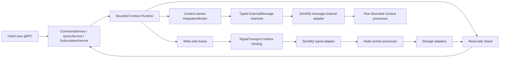

# Technical Specification

Navigation: [README](README.md) | Next: [Protobuf Contract](PROTOBUF_CONTRACT.md)

## Purpose

The framework provides a TypeScript/Node.js implementation of the core server-side ideas of Spine Event Engine:

- Protobuf-first domain modeling.
- Command, event, query, and subscription APIs compatible with Spine wire messages.
- Strict read-side/write-side segregation.
- Asynchronous processing of domain signals.
- OOP domain code with generic entity base classes.
- Annotation-like handler declaration using modern TypeScript decorators when they fit.
- Local multi-process execution over an abstract bus transport initially backed by ZeroMQ.

The framework does not need source-level compatibility with Spine JVM. It should feel familiar to JVM Spine users by preserving names, concepts, message contracts, and domain modeling conventions.

Wave 12 implements this runtime contract. A healthy browser subscription remains active across ordinary
successive updates through the supported Gateway/gRPC-Web topology. Best-effort
delivery permits reconnect/re-query after a real disconnect and does not
promise gap-free notifications; it does not redefine normal successive updates
as a disconnect. Normalized provider plans are capability-gated execution
contracts: MySQL pushes every admitted filter, order, and bound into contained,
parameterized SQL instead of fetching a storage group for Node filtering.
Delivered Inbox rows are removed in bounded cleanup pages through an atomic
current-ownership-plus-exact-delete provider operation after their optional
`keepUntil` deduplication protection ends.
`keepUntil` is not a retention setting: Wave 12 adds no second retention
configuration, timer, or scheduler.

## Corrected Implementation Order

Human review on `2026-07-01` reset the roadmap. The framework must now be
implemented in this order:

1. Storage factory, `Storage` contract, in-memory storage implementation, and
   event store.
2. `CommandBus`, `EventBus`, dispatching mechanisms, and JVM-like handler
   annotations/decorators for command handlers, event subscribers, event
   reactors, command-producing methods, and related dispatch endpoints.
3. `BoundedContext`, assembly, and registration.
4. Entity kinds, repositories, signal routing, and aggregate storage. Aggregates
   load latest persisted state and mutate inside transactions; events are a
   traceability journal, not aggregate replay input.
5. Delivery, `Inbox`, signal endpoints, and transactions during event
   dispatch.
6. `Stand` and entity-updated system events.
7. Real gRPC `CommandService`, `QueryService`, and `SubscriptionService`
   interfaces matching Spine JVM protobuf definitions.
8. Previously omitted details.
9. To-do example app. If the example reveals a missing framework feature,
   implement the framework feature first and then continue the example.

This order supersedes the abandoned command-execution-first `T-0012` branch
line.

## Non-Negotiable Constraints

1. Use Buf's Protobuf-ES stack for Protobuf-to-TypeScript generation.
2. Use Spine JVM Protobuf definitions as-is, beginning with `spine/options.proto`, copying required `.proto` files into the TS framework source tree.
3. Preserve Spine modeling conventions, including command files ending in `commands.proto`, event files ending in `events.proto`, and entity state messages declaring `(entity).kind`.
4. Maintain strict read-side/write-side segregation.
5. Process commands, events, and other signals asynchronously.
6. Use ZeroMQ only as a local IPC broker backbone behind a transport abstraction.
7. Support multiple Node.js processes for command handling, event handling, read-side projection updates, query serving, subscription streaming, delivery, and system tasks.
8. Prefer OOP APIs and TypeScript generics over procedural registration.
9. Provide annotation-like handler declaration through standard TypeScript decorators if viable, with code generation or explicit registration as fallback where decorators cannot express the needed metadata.
10. Use `@spine-event-engine/validation` `2.0.0-snapshot.7` for message
    validation and add framework-level state-transition validation where that
    package does not cover stateful rules such as `(set_once)`.
11. Generated Protobuf-ES files must live under `packages/<package>/generated/`,
    must be ignored by Git, and must be regenerated during builds.
12. Production code may import generated code directly. Do not add generated
    facades unless a later task records a concrete reason.

## End-User Handler API Invariants

These invariants come from human clarification on `2026-07-07` and are
blocking requirements for all framework and example work.

- Normal end-user handler code must work with generated domain messages and
  generated Spine context messages, not framework signal envelopes.
- `Command`, `Event`, and other framework envelope messages are framework
  internals for ordinary command/event handler code. End users may use them only
  in explicitly documented low-level integration points.
- `@Assign`, `@Command`, and `@React` handlers must declare explicit return
  types.
- `@Assign` handlers return at least one generated domain event message, either
  as one event message, an array type, or a tuple type.
- `@React` handlers return generated domain event messages or explicit `void`
  for a no-emission reaction.
- `@Command` handlers return at least one generated domain command message,
  either as one command message, an array type, or a tuple type.
- Generated domain message return provenance must resolve to generated
  Protobuf-ES imports, generated namespace/value imports, or local aliases
  proven back to those generated imports.
- Public TypeScript signatures may use singular message types, `T[]`,
  `readonly T[]`, `Array<T>`, `ReadonlyArray<T>`, or tuple/readonly tuple
  notation for emitted messages. `@Assign` and `@Command` still require at
  least one emitted schema in the declared return type; `@React` may emit none.
- `@Subscribe` handlers must declare an explicit `void` return type.
- New aggregate behavior must not introduce or depend on `@Apply`; aggregates
  are non-event-sourced, matching current Spine JVM behavior.
- End-user application code must not start, commit, roll back, or otherwise
  control framework entity transactions. Entity transactions are opened,
  validated, committed, and rolled back by the framework runtime.
- End-user application code must not create framework-internal `Event` envelopes
  or internal `EventId` values. The framework wraps returned domain event
  messages and generates internal event IDs.
- End-user application code must use bare decorators such as `@Assign`,
  `@Command`, `@React`, and `@Subscribe`. Schema-bearing decorators such as
  `@Assign(SomeSchema)` are forbidden in end-user app code unless a narrow
  legacy/testing exception is documented in the task.
- Generated registry/build-time tooling must infer handler signal schemas from
  explicit parameter types and emitted schemas from explicit return types.
- Handler discovery and materialization of decorated declarations into
  canonical metadata is framework/generated-registry responsibility. End-user
  applications must not define helper adapters such as
  `materializeDecoratedEntityHandlers()`, and must not import or call such
  materialization helpers from ordinary application code.
- Example applications are part of the public API contract. A framework task is
  incomplete if an example uses framework envelopes, explicit schema decorators,
  or other internals that the public handler model forbids.

## Generated Handler Registry Contract

Bare handler decorators are source declarations, not complete runtime metadata.
The generated registry is the framework bridge from decorated TypeScript
classes to canonical handler metadata. T-0015a defined the contract, and
T-0015c implements the build-time analyzer that produces structured analysis
records. T-0015d adds the internal package-level registry writer that renders
guarded generated source under ignored `generated/` output. T-0015e adds
explicit runtime loading from filesystem paths or clean `file:` URLs. Broad
automatic package scanning and global runtime loading remain out of scope.
T-0015g wires the first application package, the to-do example, by generating
`examples/todo/generated/handler/generated-handler-registry.ts` during
`proto:generate` and loading the compiled registry during context creation.

Build-time tooling must read ordinary application source, find bare
`@Assign`, `@Command`, `@React`, and `@Subscribe` methods, and infer schemas
from TypeScript signatures:

- the first parameter must have an explicit generated domain message type;
- a second context parameter is allowed for all four decorator kinds and is not
  a signal schema source;
- `@Assign` must have an explicit generated domain event return type with at
  least one emitted event schema;
- `@Command` must have an explicit generated domain command return type with at
  least one emitted command schema;
- `@React` must have an explicit generated domain event return type or explicit
  `void`; it may emit generated event schemas or nothing;
- `@Subscribe` must have an explicit `void` return type and no emitted schemas;
- framework `Command`/`Event` envelopes, schema-bearing decorators,
  application-defined materialization helpers, and `@Apply` are invalid in ordinary app code.

T-0015c verifies imported generated message names and companion schema runtime
value exports by inspecting generated module source. Command/event role
classification comes from descriptor-backed `.proto` identity tied to the
specific imported schema export. Source files ending in `commands.proto` are
commands, source files ending in `events.proto` are events, and neutral source
file names have no handler signal/emitted role. Neutral schemas remain usable
for entity state, and neutral, missing, malformed, or unrelated descriptor data
fails closed for handler signal and emitted-schema roles.

The generated module must export a registry value with this logical shape:

```typescript
interface GeneratedHandlerRegistry {
  readonly version: 1;
  readonly entities: readonly GeneratedEntityHandlers[];
}

interface GeneratedEntityHandlers {
  readonly entityType: EntityClass;
  readonly stateSchema: DescriptorMessageSchema;
  readonly handlers: readonly GeneratedHandlerMetadata[];
}

interface GeneratedHandlerMetadata {
  readonly kind:
    | "command-assignment"
    | "command-reaction"
    | "event-subscription"
    | "event-reaction";
  readonly methodName: string;
  readonly signalSchema: DescriptorMessageSchema;
  readonly emittedSchemas: readonly DescriptorMessageSchema[];
  readonly parameterCount: 1 | 2;
}
```

`emittedSchemas` is non-empty for `@Assign` and `@Command`, contains generated
event schemas or is empty for `@React`, and is empty for `@Subscribe`. The
generated registry must preserve source declaration order and `parameterCount`
within each entity. Ingested records become canonical handler metadata with the
same public arity; explicit/schema-bearing registrations default to
`parameterCount: 1` unless framework-generated ingestion supplies a
different value. It must not include `event-application` records for new
aggregate behavior.

Runtime invocation follows canonical metadata. One-argument handlers are called
as `handler(signal)`. Generated two-argument command assignees are called as
`handler(command, context)` with the generated `CommandContext` from the
incoming command envelope, or an empty generated `CommandContext` when the
envelope has none. Generated two-argument event subscribers are called as
`handler(event, context)` with the generated `EventContext` from the incoming
event envelope, or an empty generated `EventContext` when the envelope has
none. `@Apply`/event-application handlers remain one-argument only.

Generated registry files belong under ignored generated output locations such
as `packages/<package>/generated/`; they are regenerated build artifacts and
must not be committed. T-0015d adds a deterministic build-time writer that
renders the version-1 registry source from analyzer output and writes it only
when explicitly invoked, after validating analyzer diagnostics, generated-root
ownership, Git-ignore coverage, and symlink safety. T-0015e adds the first
runtime discovery anchor: framework code may load one or more explicit
filesystem paths or clean `file:` URLs, or build the conventional runtime file
location `generated/handler/generated-handler-registry.js` from a package or
app root. Discovery does not scan package trees, load registries globally, or
perform broad automatic runtime discovery; those behaviors remain out of scope
for this slice. Non-`file:` URL schemes and `file:` URLs with query or hash
aliases fail deterministically before import. Discovery validates the top-level
module shape, reports deterministic import/export/module errors, and ingests
the loaded registries through `HandlerRegistryIngestor` into a caller-supplied
`HandlerMetadataRegistry`.

For an application package, registry generation runs after generated protobuf
files are present and before `tsc -b`. The generated TypeScript source remains
ignored under `generated/`; the compiled JavaScript lives under the package
output tree. Runtime code should pass the compiled package root to
`GeneratedRegistryDiscovery.conventionalModulePath()` or otherwise provide the
exact compiled registry module path. Missing or invalid registry modules fail
while building the context, before command routing invokes an end-user handler.

## Command Target ID And Default Routing

Default command routing follows the Spine JVM first-field convention.

- The first field of a command message in Protobuf declaration order, not by
  numeric field index, is the default target entity ID.
- For commands handled through the default command route, the first command
  field is required and must be set before the command reaches any end-user
  handler.
- The default command route must reject a command whose first field is absent,
  blank, or not assignable to the repository ID type before invoking handler
  code.
- End-user handlers must not contain defensive target-ID extraction such as
  `requireTaskId(command.id)` for the default route. The default route performs
  this validation and passes only route-valid commands to handlers.
- Custom command routing may override the default route in the corresponding
  entity repository. When custom routing is used, the default first-field
  requirement is not enforced unless the custom route explicitly chooses that
  behavior. Such overrides must be explicit, tested, and documented in the task
  that introduces them.
- Generated or registered routing metadata must preserve Protobuf declaration
  order so the first-field route cannot accidentally become field-number based.

## High-Level Architecture



The gRPC services remain the public remote API. Runtime command/event routing
uses `SignalTransport`; JVM-aligned cross-context external events use the
separate typed message-channel SPI and exact integration Protobuf contracts.
ZeroMQ supplies same-host implementations for both authorities without merging
their routing or lifecycle concepts.

## Package Boundaries

The exact package manager and build tooling are deferred to the build protocol, but the framework should be split conceptually into these packages:

- `proto`: copied Spine `.proto` definitions, Buf configuration, and generated Protobuf-ES schemas.
- `core`: signal envelopes, type URL registry, metadata registry, validation facade, actor/tenant context, and common errors.
- `server`: bounded context, repositories, entities, buses, delivery, read-side stand, lifecycle, and gRPC service implementations.
- `transport`: distinct SignalTransport routing and typed integration
  message-channel interfaces, with in-memory and same-host ZeroMQ adapters.
- `storage`: record storage abstractions and initial in-memory storage.
- `testing`: black-box bounded-context testing utilities.
- `example-todo`: standalone server-side to-do list example.

The generated Protobuf-ES output for each package belongs in that package's
`generated/` directory, not under `src/`, and is not version-controlled.

## Runtime Roles

- Main service process: provides gRPC endpoints, server assembly, process supervision, and public API routing.
- Command worker: subscribes to command types and executes command assignees/receptors.
- Event worker: subscribes to event types, executes supported subscribers and
  reactors, and delivers supported event inbox rows. Legacy stored/wire
  `IMPORT_EVENT` delivery rows remain deprecated compatibility data and fail
  closed; Wave 13 external-event import is instead context-owned broker work
  that enters the normal EventBus with `EventContext.external = true`.
- Projection worker: maintains read-side projections from delivered events.
- Query worker: serves read-side queries when query workload is moved out of the main process.
- Subscription worker: maintains subscription streams and fan-out state.
- Delivery worker: drains inbox/outbox-like delivery queues and retries failed work.
- System worker: records diagnostics, command logs, entity lifecycle events, and internal monitoring data.

A deployment can run all roles in one process for tests and development, but production design assumes roles can be split into several local Node.js processes.

## Compatibility Target

Compatibility is defined at the Protobuf message and behavior level:

- A command/event/query/subscription encoded by the TS framework must use the same Spine message shapes and type URL conventions.
- Domain `.proto` files valid for Spine JVM should remain valid for the TS framework if they avoid JVM-only build tooling assumptions.
- Server behavior should preserve command acknowledgement, asynchronous command handling, event production, rejection handling, query response, subscription update, entity lifecycle, and validation semantics described in the JVM research docs.

## Out of Scope for the Initial Specification

- Implementing code.
- Choosing final package manager, linter, test runner, or bundler.
- Implementing distributed multi-host transport.
- Replacing the JVM compiler ecosystem.
- Architecture diagrams beyond the minimal orientation diagram above.
