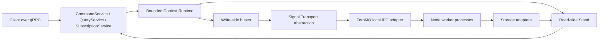

# Technical Specification

Navigation: [README](README.md) | Next: [Protobuf Contract](PROTOBUF_CONTRACT.md)

## Purpose

The framework provides a TypeScript/Node.js implementation of the core server-side ideas of Spine Event Engine:

- Protobuf-first domain modeling.
- Command, event, query, and subscription APIs compatible with Spine wire messages.
- Strict read-side/write-side segregation.
- Asynchronous processing of domain signals.
- OOP domain code with generic entity base classes.
- Annotation-like handler declaration using modern TypeScript decorators when they fit.
- Local multi-process execution over an abstract bus transport initially backed by ZeroMQ.

The framework does not need source-level compatibility with Spine JVM. It should feel familiar to JVM Spine users by preserving names, concepts, message contracts, and domain modeling conventions.

## Non-Negotiable Constraints

1. Use Buf's Protobuf-ES stack for Protobuf-to-TypeScript generation.
2. Use Spine JVM Protobuf definitions as-is, beginning with `spine/options.proto`, copying required `.proto` files into the TS framework source tree.
3. Preserve Spine modeling conventions, including command files ending in `commands.proto`, event files ending in `events.proto`, and entity state messages declaring `(entity).kind`.
4. Maintain strict read-side/write-side segregation.
5. Process commands, events, and other signals asynchronously.
6. Use ZeroMQ only as a local IPC broker backbone behind a transport abstraction.
7. Support multiple Node.js processes for command handling, event handling, read-side projection updates, query serving, subscription streaming, delivery, and system tasks.
8. Prefer OOP APIs and TypeScript generics over procedural registration.
9. Provide annotation-like handler declaration through standard TypeScript decorators if viable, with code generation or explicit registration as fallback where decorators cannot express the needed metadata.
10. Use `@spine-event-engine/validation-ts` for message validation and add framework-level state-transition validation where that package does not cover stateful rules such as `(set_once)`.

## High-Level Architecture

The gRPC services remain the public remote API. Internally, the runtime may dispatch work to local worker processes through the transport abstraction. The transport contract deals in Spine signal envelopes and type URL topics; ZeroMQ is only one implementation.

## Package Boundaries

The exact package manager and build tooling are deferred to the build protocol, but the framework should be split conceptually into these packages:

- `proto`: copied Spine `.proto` definitions, Buf configuration, and generated Protobuf-ES schemas.
- `core`: signal envelopes, type URL registry, metadata registry, validation facade, actor/tenant context, and common errors.
- `server`: bounded context, repositories, entities, buses, delivery, read-side stand, lifecycle, and gRPC service implementations.
- `transport`: bus transport interfaces and the ZeroMQ adapter.
- `storage`: record storage abstractions and initial in-memory storage.
- `testing`: black-box bounded-context testing utilities.
- `example-todo`: standalone server-side to-do list example.

## Runtime Roles

- Main service process: owns gRPC endpoints, server assembly, process supervision, and public API routing.
- Command worker: subscribes to command types and executes command assignees/receptors.
- Event worker: subscribes to event types and executes subscribers/reactors/importers.
- Projection worker: maintains read-side projections from delivered events.
- Query worker: serves read-side queries when query workload is moved out of the main process.
- Subscription worker: maintains subscription streams and fan-out state.
- Delivery worker: drains inbox/outbox-like delivery queues and retries failed work.
- System worker: records diagnostics, command logs, entity lifecycle events, and internal monitoring data.

A deployment can run all roles in one process for tests and development, but production design assumes roles can be split into several local Node.js processes.

## Compatibility Target

Compatibility is defined at the Protobuf message and behavior level:

- A command/event/query/subscription encoded by the TS framework must use the same Spine message shapes and type URL conventions.
- Domain `.proto` files valid for Spine JVM should remain valid for the TS framework if they avoid JVM-only build tooling assumptions.
- Server behavior should preserve command acknowledgement, asynchronous command handling, event production, rejection handling, query response, subscription update, entity lifecycle, and validation semantics described in the JVM research docs.

## Out of Scope for the Initial Specification

- Implementing code.
- Choosing final package manager, linter, test runner, or bundler.
- Implementing distributed multi-host transport.
- Replacing the JVM compiler ecosystem.
- Architecture diagrams beyond the minimal orientation diagram above.

