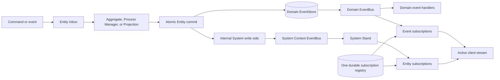

# System Context And Payload-First Subscription Plan

Status: Approved; implementation not started

## Goal

Correct the system-event boundary introduced during Wave 6. Each domain
Bounded Context receives one internal paired System Context. Domain events use
the domain EventBus and EventStore. System events use only the System Context
EventBus and, when explicitly enabled, the System Context's separate event
storage.

Message Board consumes complete `EntityStateUpdate` values directly. Queries
remain authoritative for initial state and recovery, but are not issued after
ordinary valid updates.

## Resulting Runtime

## Invariants

1. System-event schemas cannot be registered with or posted through a domain
   EventBus.
2. Domain and system EventStores never share a storage context.
3. Forgetting a system event means normal validation, dispatch, and subscriber
   notification without append. It is not an “already stored” event.
4. System events are produced only after the corresponding durable entity
   commit. Their failure cannot roll back committed domain state or events.
5. A System Context has no recursive System Context.
6. Raw System Contexts are internal and absent from CommandService,
   QueryService, application context lists, and public posting APIs.
7. The domain Stand remains the authoritative query reader. The System Stand
   observes system events and does not copy domain Entity state.
8. The paired context owns one internal subscription runtime: one durable
   registry, reconciliation timer, attachment map, consumer map, and close
   operation. It classifies each target using domain Stand metadata, asks the
   domain Stand to observe event targets on the domain EventBus, and asks the
   System Stand to observe Entity targets on the system EventBus. The Stands do
   not start independent reconciliation timers or consumer maps.
9. The existing domain subscription storage namespace is preserved so an
   upgrade does not orphan durable subscription definitions.
10. The single subscription runtime reconciles a complete durable snapshot
    every ten seconds, preserving the existing interval and cleanup semantics.
11. The public domain Bounded Context owns one terminal, coalesced paired-close
    attempt. It drains both event sources, closes every paired resource, and
    closes the shared registry exactly once. Repeated calls return the same
    promise and outcome; a failed hook is not retried by another `close()` call.
12. Subscription delivery remains best effort. No replay-complete,
    cluster-complete, or exactly-once guarantee is introduced.

## System Events In Scope

The implementation emits the following messages for operations already present
in Spine TS:

| Event                         | Emission point                                                          |
| ----------------------------- | ----------------------------------------------------------------------- |
| `EntityCreated`               | After the first durable record for an Entity is committed.              |
| `EntityStateChanged`          | After a committed state change.                                         |
| `EntityArchived`              | After an active-to-archived transition is committed.                    |
| `EntityUnarchived`            | After an archived-to-active transition is committed.                    |
| `EntityDeleted`               | After an undeleted-to-deleted transition is committed.                  |
| `EntityRestored`              | After a deleted-to-active transition is committed.                      |
| `CommandDispatchedToHandler`  | After a command is accepted for dispatch to its Entity handler.         |
| `EventDispatchedToSubscriber` | After an event is accepted for a Projection subscriber.                 |
| `EventDispatchedToReactor`    | After an event is accepted for an Aggregate or Process Manager reactor. |

Lifecycle events are transition-only. A no-op lifecycle assignment emits
nothing. A rolled-back or rejected entity operation emits no creation, state,
or lifecycle event.

`EventImported` remains a copied compatibility message and is not emitted.
`MigrationApplied` remains dormant until Spine TS has a real migration
operation. This plan does not invent either feature.

## Persistence Policy

Domain EventBuses preserve their existing storing behavior.

System EventBuses forget events by default. A narrow Bounded Context builder
setting may enable system-event persistence. The setting controls only the
paired System Context and uses the application-selected `StorageFactory` with a
reserved System Context storage name.

The public builder method is `persistSystemEvents()`. Its TSDoc states that the
default is forgetting, persistence uses the paired System Context storage, and
the setting does not place system events in the domain EventStore. No public
System Context or general system-event posting API is added.

Do not copy the complete JVM `SystemSettings` surface. Command logging,
tracing, posting executors, and system repositories remain outside this
correction.

## Dependency-Ordered Tasks

### T-0114: EventBus Persistence Policy

Make storing versus forgetting an operational EventBus policy.

Acceptance:

- storing preserves current domain persistence and duplicate-ID behavior;
- forgetting validates, dispatches, and notifies without opening or appending
  domain event storage;
- direct public `new EventBus(eventStore)` construction retains its existing
  storing behavior and call shape;
- the forgetting policy remains package-internal and is selected only while
  assembling the paired System Context;
- stored replay and stored follow-up behavior remain available for actual
  already-persisted domain events;
- focused tests distinguish storing, already-stored, and forgotten posting;
- no public settings hierarchy is added;
- public export and TypeDoc checks prove that T-0114 adds no accidental API.

Verification: focused EventBus and storage tests, affected package typechecks,
coverage-enabled task profile.

### T-0115: Atomic System Context And Stand Cutover

Build the internal System Context first and route `EntityStateChanged` through
its EventBus. This is one atomic runtime task because context construction,
Stand activation, services, repository injection, and close ownership overlap.

Acceptance:

- domain and system contexts have distinct EventBuses, Stands, and storage
  contexts;
- tenant mode is preserved;
- the paired context owns the only reconciliation timer, attachment map,
  consumer map, durable registry, and registry close;
- `SubscriptionService` attaches active streams to this pair-owned runtime
  rather than either Stand's private consumer map;
- target classification uses domain Stand state metadata: domain-event targets
  attach through the domain Stand to the domain EventBus, while Entity targets
  attach through the System Stand to the system EventBus;
- both Stands receive attachment work from the single runtime and never start
  independent registry reconciliation;
- domain-event subscriptions observe only the domain bus;
- Entity subscriptions observe only the system bus;
- both observers feed the same active client stream without duplicates;
- `EntityStateChanged` never registers with, traverses, or touches the domain
  EventBus/EventStore;
- EventBus construction carries an internal `domain` or `system` role. The
  default public constructor remains a storing domain bus. Domain schema
  registration and posting reject every `spine.system.*` event; system buses
  reject non-system event schemas. The role selector is not public;
- a matrix test covers every in-scope system-event schema through domain
  registrar and endpoint paths and proves zero domain EventStore operations;
- reconciliation remains a complete snapshot every ten seconds, including
  activation, cancellation, restart, and deletion convergence;
- system-post failures are bounded diagnostics after a successful commit;
- `persistSystemEvents()` is the only new public option and has complete TSDoc,
  TypeDoc, export-surface, default-forget, and separate-storage tests;
- partial builds clean every acquired resource;
- close first stops domain command/event intake, then drains and finishes the
  domain buses while the system bus remains open;
- after domain work can no longer publish system events, close drains the
  system bus, stops the subscription timer, detaches all domain/system
  observers and consumers, and finishes the system bus and its optional store;
- close then closes the domain Stand, System Stand, shared registry exactly
  once, tenant index, repository storage, and pair-owned metadata;
- every acquired close hook is attempted in dependency order and independent
  failures are aggregated. Repeated close returns the same promise and outcome,
  with no hook retry or second invocation;
- injected-failure tests cover every stage and prove no reconciliation timer,
  observer attachment, consumer, Stand, EventBus/EventStore, registry, or
  pair-metadata leak.

Verification: context, repository, EventBus, Stand, SubscriptionService,
tenant, restart/reconciliation, failure, and lifecycle tests; release profile
after review because shared runtime and persistence changed.

### T-0116: Entity Lifecycle System Events

Emit creation and lifecycle events from committed repository transitions.

Acceptance:

- emit `EntityCreated`, `EntityStateChanged`, `EntityArchived`,
  `EntityUnarchived`, `EntityDeleted`, and `EntityRestored` with correct IDs,
  signal IDs, states, versions, timestamps, tenant context, and entity kind;
- preserve deterministic per-commit ordering;
- emit nothing for rejected, rolled-back, or no-op transitions;
- Entity subscriptions remove archived/deleted/no-longer-matching rows and can
  deliver restored/unarchived rows according to the existing wire protocol;
- no event uses the domain bus.

Verification: focused tests across Aggregate, Process Manager, and Projection
families, including multitenancy and subscription transitions.

### T-0117: Dispatch Diagnostic System Events

Emit supported dispatch diagnostics after accepted handler dispatch.

Acceptance:

- command handlers emit `CommandDispatchedToHandler`;
- Projection subscribers emit `EventDispatchedToSubscriber`;
- Aggregate and Process Manager reactors emit `EventDispatchedToReactor`;
- receiver, payload, entity type, dispatch time, origin, and tenant context are
  correct;
- routing/refusal before handler admission emits no false dispatch event;
- diagnostic emission failure does not repeat or roll back handler work;
- no diagnostic uses the domain bus.

Verification: focused handler-family and routing tests, including Process
Manager `@Assign` and reactor paths; explicit single-tenant and multitenant
tests prove tenant propagation, refusal-before-admission silence, and
post-failure isolation.

### T-0118: Message Board Payload-First Synchronization

Replace normal-update queries with deterministic local application.

Acceptance:

- initial state comes from a Query;
- a valid `state` update is decoded, identity-checked, board-checked, upserted,
  and sorted oldest-first;
- `noLongerMatching` removes by decoded ID and is idempotent;
- a multi-update batch is validated before publishing any row change;
- wrong update kind, wrong `Any` type, missing/undecodable identity or state,
  identity mismatch, foreign-board state, or an unusable empty batch schedules
  one coalesced authoritative Query;
- reconnect resynchronization replaces the full row set;
- `gapPossible` queries authoritatively;
- a valid normal update performs no Query;
- a successful post relies on subscription contents while connected and
  performs one Query while disconnected;
- every applied valid live batch advances a local update generation. A recovery
  Query captures that generation. If a newer live batch, board switch, or
  unmount occurs before the Query completes, its result cannot replace current
  rows. A newer live batch during required recovery schedules one coalesced
  follow-up Query, and only a result whose captured generation is still current
  may replace the full row set;
- logging reports applied payloads and explicit recovery reasons.

Keep the update reducer example-local. Do not generalize it into
`client-react` without another real consumer.

Verification: React unit tests for update, replacement, removal, batching,
ordering, malformed recovery, query counts, post behavior, unmount, and stale
completion, including a live update racing an older recovery Query and a board
switch; real browser smoke through the local server.

### T-0119: Documentation And Correction Closure

After runtime interfaces stabilize, update every affected current claim.

Required surfaces:

- server README and agent reference;
- framework user guide and architecture diagrams;
- Message Board README, web reference, and relevant source logging/TSDoc;
- Distributed Message Board topology documentation;
- Wave 6 decision/completion records that currently place
  `EntityStateChanged` on the domain EventBus or describe updates only as
  refresh hints.

Explain the separate buses, optional system-event persistence, best-effort
subscription limits, payload-first normal delivery, and authoritative recovery
without internal task jargon in human documentation.

Verification: deterministic documentation policy checks, links and snippets,
relevant specialist review, then one final release profile for the converged
runtime and examples.

## Review And Integration Strategy

- Run the one approved Sol/high architecture pass only once; it is complete.
- Use one Terra/medium implementation owner per dependency-ordered task.
- Use focused tests and coverage before specialist review.
- Run only relevant existing reviewer lanes and return one aggregated finding
  batch to the current implementation owner.
- T-0115 and the final correction boundary require reliability and API review
  at high reasoning because they change persistence and lifecycle ownership.
- Push every task commit to `origin` immediately.
- Merge tasks in numeric order, verify the merged tree according to the build
  protocol, push `main`, and confirm remote refs after each closure.

Implementation begins only after explicit human authorization.
