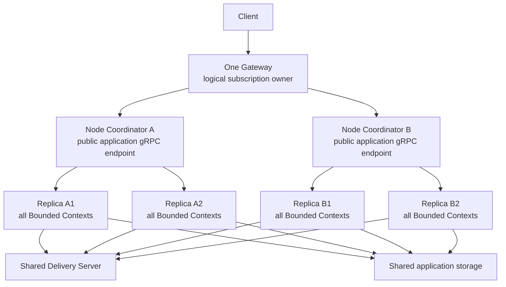
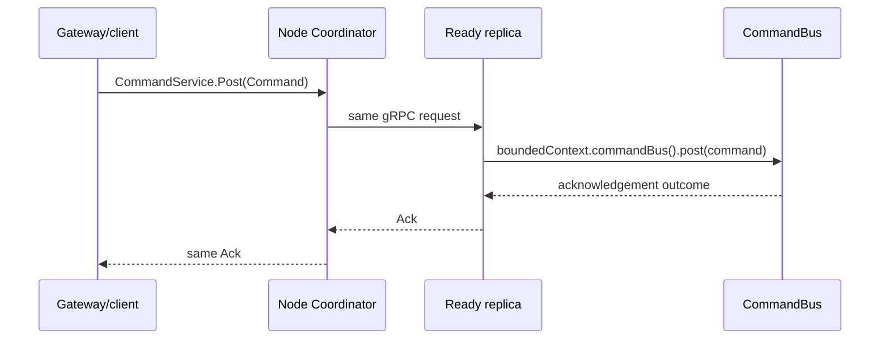
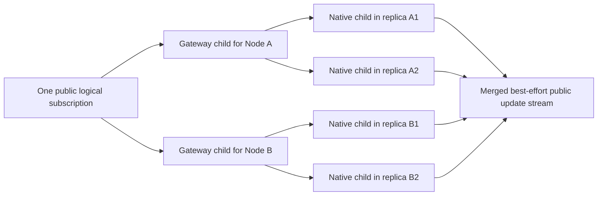
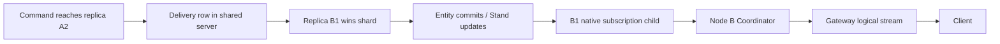

# T-0203 Complete-Replica Deployment and Subscription Plan

## Status and authority

This is a **high-risk, planning-only** post-Wave-13 architecture correction.
Wave 13 itself is complete at Spine TS commit
`7980f0ebf5257d4df285ae07650c4ebb8d6eb1f2`; the new work does not reopen its
domain-event semantics. It replaces the deployment assumptions that put normal
command/event traffic and IntegrationBroker channels on same-host ZeroMQ.

The plan is accepted. The final lifecycle question was resolved in favor of
degraded service with bounded child replacement; product implementation starts
at T-0204.

Authority, in order:

1. `build-protocol/tasks/T-0203-complete-replica-deployment-plan/HUMAN_REQUIREMENTS.md`;
2. the current human conversation which approved Option 1 and complete
   application replicas;
3. `AGENTS.md` and `build-protocol/BUILD_PROTOCOL.md`;
4. current accepted decisions, with the supersessions named below;
5. current technical, runtime, developer API, and Wave 13 documents where they
   do not conflict with the new human decision.

## Baseline and current-state conclusion

- Fresh `origin/main`: `7980f0ebf5257d4df285ae07650c4ebb8d6eb1f2`.
- Origin exposed exactly `main` and no tags at planning start.
- T-0195 through T-0202 are complete. T-0202's converged release run passed
  4,268 tests with 90.30% branch coverage.
- T-0203 is the next unused task ID.
- The protected primary checkout is intentionally not the implementation
  baseline and remains unmodified.

### What remains from Wave 13

No product feature remains unfinished. The following implemented behavior is
retained:

- one context-owned internal IntegrationBroker per Bounded Context;
- status, wanted-configuration, and event exchanges;
- exact `ExternalMessage`, `ExternalEventsWanted`, `ExternalEventType`,
  `BoundedContextOnline`, and `ChannelId` Protobuf contracts;
- domestic/external generated handler metadata and EventBus filtering;
- requested domestic-event publication and imported-event loop prevention;
- tenant and Event/EventId preservation;
- corrupt external-frame ERROR logging and drop-with-continuation;
- `ThirdPartyContext` with application schema lookup;
- an in-memory implementation of the JVM-aligned `TransportFactory` SPI.

The following Wave 13/deployment conclusions are superseded:

- Production must not require an explicitly supplied IntegrationBroker channel
  factory.
- Cross-process IntegrationBroker exchange is not part of a deployed server
  application whose processes are complete replicas.
- The ZeroMQ message-channel adapter and its cross-process broker acceptance are
  removed after replacement acceptance exists.
- `ContextTransport`, `RuntimeTransportBinding`, `SignalTransport`, and runtime
  routing plans are not retained as a second way into `CommandBus`/`EventBus`.

## Frozen first-release topology



The invariant is exact:

> Every application process started for one deployed server application
> contains the complete set of that application's Bounded Contexts.

No process is a “command worker,” “event worker,” “projection worker,” or
“subscription worker.” Those remain responsibilities inside each complete
replica. Delivery leases decide which replica performs durable entity work.

## Responsibilities by owner

| Owner               | Owns                                                                                                                                                                                 | Does not own                                                                                |
| ------------------- | ------------------------------------------------------------------------------------------------------------------------------------------------------------------------------------ | ------------------------------------------------------------------------------------------- |
| Gateway             | Authentication, durable logical subscriptions, deployment-node membership, one child per Node Coordinator, public update relay                                                       | IntegrationBroker traffic, Delivery observation, entity work, worker processes              |
| Node Coordinator    | Explicit local process count, child lifecycle, complete-replica verification, READY membership, one-child unary selection, all-child subscription fan-out, public node gRPC endpoint | Domain routing, Bounded Contexts, IntegrationBroker, durable subscriptions, Delivery leases |
| Application replica | Complete application/Bounded Context assembly, Buses, local IntegrationBrokers, ephemeral native subscriptions, direct Delivery observation, entity work                             | Other replicas' lifecycle, durable logical subscriptions, public node discovery             |
| Delivery Server     | Inbox rows, shard update hints, exclusive shard sessions and fencing                                                                                                                 | Subscription ownership, process selection, IntegrationBroker exchange                       |
| Storage             | Shared durable application/entity/event/subscription-binding data selected by the application                                                                                        | Process supervision or live notification fan-out                                            |

## Process startup contract

The managed entrypoint takes an explicit positive safe-integer `processCount`.
There is no CPU inspection and no implicit “number of cores” default.

The planned public shape is intentionally small:

```ts
await ManagedServerApplication.run({
  processCount: deployment.processCount,
  moduleUrl: import.meta.url,
  createServer: async ({ host, port }) => {
    return assembleCompleteApplicationServer({ host, port });
  },
});
```

The same entry module is executed in the parent and every child. In the parent,
the framework starts the Coordinator and forks the module N times. In a child,
the framework invokes `createServer()` once with a loopback host and ephemeral
port. Application functions are never serialized across processes.

`processCount: 1` still creates one coordinator parent plus one full child. The
managed deployment path never has a topology shortcut. Existing direct
`Server.run()` remains available for explicit single-process development,
testing, and a future browser-only runtime.

### Private child-control seam

Node's existing parent/child IPC carries only bounded lifecycle facts:

- startup hello and private generation identity;
- internal listener endpoint;
- READY, DRAIN, CLOSE, and terminal failure state.

It never carries Commands, Events, Queries, SubscriptionUpdates,
ExternalMessages, InboxMessages, or application payloads. Those continue over
their established Protobuf/HTTP2 or storage boundaries. The private control
seam is not a public Proto contract or an application-facing configuration
surface.

### Complete-replica construction

The framework starts the same application entry module for every managed child,
and that module invokes the same `createServer()` assembly. The framework user
is responsible for making that assembly a complete replica and for deploying
the same application code and configuration to every node.

The framework does not add runtime application manifests, schema or handler
digests, build attestations, Delivery-strategy identities, behavioral sampling,
or restrictions on custom strategies. Complete-replica behavior is proven by
real application acceptance through the normal services, Buses, Delivery, and
subscriptions in the dependent tasks.

## Node Coordinator service behavior

The Coordinator is a service-aware Connect/HTTP2 proxy over the existing Spine
services. It is not a Bounded Context and performs no domain target routing.

### Commands



One READY child is selected in round-robin order. A request already sent is not
retried on another child because retrying a Command could duplicate its effect.
The selected child's normal `SpineServices` performs context selection and its
`CommandBus` performs target dispatch.

### Queries

One READY child receives the QueryService request and reads shared application
storage through its normal Stand/query path. The first implementation also does
not retry an admitted query automatically; a failed call returns its normal
gRPC failure and the next request can select another child.

### Subscriptions

Subscriptions are not round-robin:



At each level:

1. `Subscribe` retains one logical definition and creates one native child in
   every current member.
2. `Activate` activates every child and merges their update streams with
   cancellation and backpressure.
3. `Cancel` removes and closes every child.
4. A later member receives every retained definition and activation before it
   becomes eligible for unary traffic or Delivery pickup.
5. Each level rewrites only its child subscription ID. Update payloads, actor,
   tenant, Event/EventId, state, and public logical ID semantics are unchanged.

The Gateway keeps the only durable logical `SubscriptionBindings`. The Node
Coordinator keeps an in-memory node-child map. Each replica uses
`InMemorySubscriptionRegistry`; managed assembly rejects a persistent native
Stand registry. Standalone `Server.run()` may continue using its existing
storage-backed registry.

The current `DynamicUnaryForwarder` behavior is extracted into one neutral
internal membership/fan-out kernel used by both the Gateway adapter and Node
Coordinator. It is not duplicated and does not make deployment depend on auth.

## Why updates reach the correct client

The subscription is installed everywhere, so the location of the change no
longer matters:

### Command-caused change



### Domestic Event-caused change

The replica whose EventBus observes the domestic Event either emits the event
subscription update directly or writes the routed entity Inbox row. Whichever
replica later wins Delivery and commits a Projection/Aggregate/Process Manager
state change has the same active native subscription and emits the state
update.

### External Event-caused change

A domestic event imported from another local Bounded Context, or an event
published through `ThirdPartyContext`, enters the receiving replica's normal
EventBus as external. External receptors create normal shared Inbox work.
Delivery may assign that work to any complete replica. Event updates originate
where the Event is observed; resulting state updates originate where the entity
commit occurs. Both paths are already subscribed.

No cross-process IntegrationBroker is involved.

## Delivery wiring disposition

The previously reported cross-node notification defect is **not present on
current main**. Current code already provides:

- Delivery Server Admin fan-out on Inbox/shard transitions;
- `RemoteDelivery.source` snapshot and update observation over HTTP/2;
- `DeliverySupervisor` bounded reconnect and snapshot recovery;
- remote exclusive shard pickup, renewal, fencing, and release;
- a real two-child-process test proving both application environments observe
  one update while exactly one drains the shard.

This became true after the earlier missing-wiring report. T-0094 on 2026-08-02
connected `RemoteDelivery` ports and lifecycle to `ServerEnvironment`. T-0107
on 2026-08-04 completed the behavior: `015ef122` connected every environment's
supervisor to remote observations, `c9f9e4e0` and `5067b502` added real gRPC and
two-process fan-out proof, and `d8891091` added remote commit fencing. Later
T-0107 corrections covered shutdown lease release, reconnect snapshots, and
fault recovery.

The new work preserves and integrates this machinery rather than redesigning
it.

Every managed child must independently create/open its `RemoteDelivery`, attach
its `DeliverySupervisor`, and complete its initial snapshot before READY. The
Coordinator neither observes nor forwards Delivery notifications.

Managed multi-process mode requires an explicitly remote/shared Delivery
facility and an explicitly selected shard strategy. It does not enforce a
numeric relationship between `processCount` and shard count. Examples configure
both and use at least as many shards as processes; framework documentation
explains that the values remain independent.

### Readiness and graceful drain

Child states are:

```text
STARTING -> SYNCHRONIZING -> READY -> DRAINING -> CLOSED
```

- STARTING: run the application's complete assembly and private listener.
- SYNCHRONIZING: open IntegrationBrokers and Delivery observation, validate the
  required readiness gates, and install all current subscriptions.
- READY: eligible for unary requests and new Delivery shard pickup.
- DRAINING: removed from unary selection and new Delivery pickup, but active
  Delivery work may finish and its subscription updates remain connected.
- CLOSED: subscription children, private listener, contexts, environment, and
  process are closed in order.

Node shutdown first makes the public readiness endpoint false/unregisters the
node, stops new unary admission, drains worker Delivery activity while keeping
subscription relays alive, then closes subscriptions and children. Pending
shared Inbox work remains available to other replicas/nodes.

## IntegrationBroker factory and naming

The application-facing setting is renamed:

```ts
ServerEnvironment.when(EnvironmentType.Production).use({
  storageFactory,
  integrationChannelFactory, // optional
  typeRegistry,
  delivery,
});
```

If `integrationChannelFactory` is absent in any environment, resolution creates
one `InMemoryTransportFactory`. The process-wide `ServerEnvironment` owns it,
all Bounded Context brokers in that process share it, and environment close
closes it once. Production still requires `storageFactory` and its complete
generated application `typeRegistry`.

The underlying JVM-aligned SPI type may remain named `TransportFactory`; the
setting name explains what it configures. The obsolete generic
`ServerEnvironment.transport` is not renamed to `signalTransport`; it is
removed with the signal-routing subsystem.

## ZeroMQ and generic signal-layer removal

This is a mandatory first-release deletion, not optional comparative cleanup.
It is intentionally T-0212 rather than an early task: T-0211 must first retain
real command, query, subscription, Delivery, domestic/external Event, and
provider acceptance through the replacement HTTP/2 topology. The next task
then deletes the old implementation completely, and T-0213 proves no hidden
fallback remains.

Removal is ordered after real managed HTTP/2 acceptance. It includes:

- ZeroMQ `SignalTransport` and message-channel adapters;
- ZeroMQ config/scope/endpoint-manifest code and native dependency;
- `SignalTransport`, signal topics/subscriptions/routing descriptors;
- `ServerRuntimeRoutingPlan`, `createContextRoutingPlan`, and related metadata;
- `RuntimeTransportBinding` and `SingleProcessServerRuntime` transport bridge;
- `ContextTransport` and `ContextTransportGroup`;
- Server startup/close phases that open those bindings;
- Todo's old parent-bypasses-gRPC child fixture and tests;
- Wave 13's cross-process ZeroMQ broker fixture;
- public exports, API inventory, TSDoc, guides, security claims, cleanup
  exceptions, and release gates which require local IPC.

The in-memory IntegrationBroker channel SPI remains. Commands and Events enter
only through normal gRPC services, Buses, handler emission, or the documented
low-level local Event endpoint/ThirdPartyContext.

## Current component disposition

| Current component                         | Disposition                                                  | Reason                                                                |
| ----------------------------------------- | ------------------------------------------------------------ | --------------------------------------------------------------------- |
| IntegrationBroker and exact Proto         | Preserve                                                     | Correct JVM-aligned domain behavior.                                  |
| InMemoryTransportFactory                  | Preserve and make default                                    | Process-local BC exchange under complete replicas.                    |
| ZeroMQ message transport                  | Remove after replacement                                     | Cross-process integration is no longer required in one deployed app.  |
| SignalTransport and ZeroMQ signal adapter | Remove after replacement                                     | Bypasses normal gRPC service/Buses and duplicates serialization.      |
| ContextTransport/RuntimeTransportBinding  | Remove                                                       | No JVM authority and no remaining accepted use case.                  |
| ServerEnvironment `transportFactory`      | Rename to optional `integrationChannelFactory`               | Clear application configuration meaning.                              |
| ServerEnvironment `transport`             | Remove, not rename                                           | Its only owner is the rejected generic signal layer.                  |
| Delivery Server Admin observation         | Preserve                                                     | Correct multi-process/multi-node work notification.                   |
| Delivery shard leases/fencing             | Preserve                                                     | Correct single-owner work execution.                                  |
| Gateway DynamicUnaryForwarder             | Deepen/extract neutral kernel                                | Already implements node unary selection plus durable logical fan-out. |
| Gateway durable SubscriptionBindings      | Preserve                                                     | Sole durable logical subscription owner.                              |
| StorageSubscriptionRegistry               | Preserve for standalone server                               | Managed children use in-memory registries instead.                    |
| GKE/GCE ApplicationNode discovery         | Preserve                                                     | Discovered endpoint becomes Node Coordinator.                         |
| ProcessServerCoordinator                  | Preserve as child-local shutdown helper or rename internally | It is not the Node Coordinator.                                       |
| Cross-application Integration Hub         | Exclude                                                      | Future physically split server applications only.                     |

## No new public wire contract

The implementation adds no new Protobuf services or messages. It reuses:

- CommandService, QueryService, and SubscriptionService between Gateway,
  Coordinator, and replicas;
- existing subscription definitions and updates;
- Delivery Server Inbox, Shard, and Admin services;
- current IntegrationBroker Protobuf only inside a process.

Private Node IPC lifecycle frames are not application signals and are neither
persisted nor exposed.

## Behavioral RED acceptance matrix

The implementation must retain failing-before evidence before each product
slice. The final topology must prove all of these:

1. Production resolves without an integration factory and two Bounded Contexts
   exchange an external event through one shared in-memory factory.
2. A configured custom integration factory still overrides the default and is
   closed once.
3. `processCount` rejects missing, zero, fractional, negative, and unsafe values
   without CPU inspection.
4. `processCount: 1` starts a coordinator parent and one separate complete child.
5. `processCount: 4` starts four distinct application PIDs behind one endpoint.
6. Every child executes the configured application entry module, invokes its
   local `createServer()`, and reports the actual private listener before READY.
7. A command sent to the Coordinator enters exactly one child's normal
   CommandService and CommandBus and returns its Ack.
8. Repeated commands use all READY children in round-robin order.
9. A selected-child command failure is not retried on another child.
10. A query returns through the selected child's normal QueryService/Stand.
11. No READY child returns gRPC UNAVAILABLE without invoking application code.
12. One public subscription creates one native child in every process on every
    current deployment node.
13. Activation merges updates from all native children into one public stream
    with the public logical subscription ID.
14. Cancellation removes every child and leaves no active stream/listener.
15. A process joining later receives every active definition before READY.
16. A deployment node joining later receives every durable Gateway definition
    before it becomes a subscription source.
17. A command-caused state change in a sibling process reaches the original
    client subscription.
18. A domestic Event emitted in any process reaches a matching event
    subscription and any resulting state subscription.
19. A ThirdParty/external Event imported in one process reaches its external
    event subscription; resulting entity work may run on another process/node
    and its state update reaches the same client.
20. A Gateway restart rehydrates durable definitions and rebuilds only
    ephemeral Coordinator/process children.
21. Coordinator and worker storage contain no durable logical subscription
    registry records in managed mode.
22. Every READY child directly observes one Delivery Server notification.
23. Exactly one child/node wins the shard and commits each Inbox row.
24. Work written on node A may be drained on node B without a Coordinator or
    Gateway Delivery hop.
25. Work arriving during an active drain is not stranded.
26. Delivery Admin stream failure/overflow recovers from a fresh snapshot.
27. A draining process takes no new shard but completes active fenced work and
    emits its final subscription update before stream close.
28. A new/replacement process cannot take unary or Delivery work until current
    subscriptions are installed.
29. Same-process IntegrationBroker acceptance for one/many consumers, wanted
    changes, tenant, EventId, loop prevention, ThirdParty, and corrupt-frame
    continuation remains green.
30. No runtime import/export/docs/example/package dependency references
    SignalTransport, ContextTransport, RuntimeTransportBinding, ZeroMQ, or the
    removed cross-process broker adapter.
31. Browser/local explicit single-process Server use remains green and imports
    no managed Node process implementation.
32. GKE and GCE discovery route to ready Coordinators through scale up, down,
    zero, return, and compatible replacement.
33. An unexpected READY-child exit immediately removes that incarnation from
    unary selection and subscription membership while surviving READY children
    continue serving.
34. The Coordinator starts at most one replacement for the failed logical slot,
    and the replacement has a fresh immutable incarnation identity.
35. Replacement delays follow the configured exponential sequence, never
    exceed its cap, and do not spin under a fake-clock crash loop.
36. A child which remains READY for the configured healthy interval resets its
    slot's backoff to the initial delay.
37. Simultaneous child failures never exceed the configured concurrent-start
    limit and do not create unbounded timers, listeners, or child records.
38. A replacement cannot become READY until the initial Delivery snapshot and
    all current subscription definitions are complete.
39. If no child is READY, the Coordinator remains alive and keeps replacing,
    but public readiness is false and application calls receive UNAVAILABLE;
    readiness returns when one synchronized replacement is admitted.
40. A command interrupted by child exit fails normally and is never retried on
    a replacement or surviving child.
41. Graceful DRAINING/CLOSED exits schedule no replacement, and Coordinator
    close cancels and awaits every pending delay and child start.

## Dependency-ordered implementation tasks

### T-0204 — Integration factory default and terminology

**Owns:** ServerEnvironment integration setting/property, BoundedContext broker
lookup, API inventory/TSDoc, focused environment/broker tests.

**Outcome:** `integrationChannelFactory` is optional in Production and defaults
once per process to `InMemoryTransportFactory`. No generic signal setting is
renamed in this slice because it will be removed later.

**Gate:** RED 1–2, generated build, focused server tests, API docs.

### T-0205 — Provider-neutral backend membership kernel

**Owns:** a neutral internal membership/fan-out module under the deployment
boundary, migration adapters in auth, and current Gateway dynamic tests.

**Outcome:** current Gateway behavior is unchanged, while unary selection,
definition retention, child activation, update relay, membership generations,
and cleanup can also be composed by the Node Coordinator without auth/server
dependency cycles.

**Gate:** current Gateway scale/restart/subscription suites plus new recursive
ID rewriting/backpressure tests. No process spawning yet.

### T-0206 — Managed complete-replica process lifecycle

**Depends on:** T-0204.

**Owns:** managed server application API, parent/child lifecycle, internal IPC,
private listener startup, process-count validation, readiness, termination, and
real child fixtures.

**Outcome:** one parent controls exactly N complete application children; no
client operation is proxied yet.

**Gate:** RED 3–6 and 33–41; no orphan process, listener, timer, or IPC handle on
every failure path.

### T-0207 — Node Coordinator unary HTTP/2 services

**Depends on:** T-0205 and T-0206.

**Owns:** Coordinator Connect/HTTP2 listener and clients, READY member pool,
CommandService and QueryService forwarding, health/readiness, deadlines,
cancellation, bounded request sizes, and error mapping.

**Outcome:** one public node endpoint fronts N complete replicas; normal child
SpineServices/Buses remain the sole application intake.

**Gate:** RED 7–11 through real HTTP/2, including no command retry.

### T-0208 — Hierarchical subscription fan-out

**Depends on:** T-0205 and T-0207.

**Owns:** Coordinator SubscriptionService composition, ephemeral worker-child
registry, ID rewriting, stream merge/backpressure, late membership sync,
managed in-memory Stand registry validation, and Gateway integration tests.

**Outcome:** Gateway logical subscription -> every node Coordinator -> every
ready replica, with only Gateway durability.

**Gate:** RED 12–21, including Gateway restart, late node/process, and storage
absence proofs.

### T-0209 — Direct Delivery readiness and drain

**Depends on:** T-0206 and T-0208.

**Owns:** managed-child Delivery readiness admission, explicit-strategy
validation, DRAINING lifecycle, active-work quiescence, and remote
multi-process/multi-node fixtures. It does not change lease authority.

**Outcome:** every child observes Delivery directly; subscription streams stay
alive through active entity work; no child becomes READY before snapshot and
subscription synchronization.

**Gate:** RED 22–28 plus existing remote supervisor/fencing/overflow suites.

### T-0210 — Complete-replica external-event acceptance

**Depends on:** T-0204, T-0208, and T-0209.

**Owns:** end-to-end fixtures only unless they expose a product defect returned
to the owning task.

**Outcome:** normal domestic and ThirdParty external Events cross local Bounded
Contexts through the process in-memory broker; all resulting entity work uses
Delivery; subscription updates can originate on any process/node.

**Gate:** RED 17–19 and 29 in real processes without transport publication or
test forwarders.

### T-0211 — Provider entrypoints and examples

**Depends on:** T-0207 through T-0210.

**Owns:** generic/GKE/GCE entrypoints, Message Board and Todo managed
deployment, explicit process/shard configuration, Compose/Kubernetes/Terraform
references, and real example acceptance.

**Outcome:** discovered `ApplicationNode` endpoints are Coordinators; examples
show one-node-many-process and many-node-many-process deployments without
ZeroMQ or role-split children.

**Gate:** RED 31–32, example command/query/subscription/Delivery smoke, scale
zero/return, and documented-command tests.

### T-0212 — Remove ZeroMQ and generic signal routing

**Depends on:** T-0211 green replacement acceptance.

**Owns:** the complete removal inventory above across server/transport/tests,
dependencies, exports, docs, cleanup ledgers, and generated API inventory.

**Outcome:** no old path remains available, configured, or documented. The
transport package retains only the JVM-aligned integration channel SPI and its
in-memory adapter unless Wave 14 later moves that SPI.

**Gate:** RED 30, package import smoke, dependency lock audit, API docs, all
normal server/Buses/broker tests.

### T-0213 — Architecture, beginner docs, reviews, release closure

**Depends on:** T-0204 through T-0212 integrated.

**Owns:** governing specs/decision/status reconciliation, package READMEs,
beginner deployment guide, diagrams, examples, complete specialist/security
review, release verification, isolated integration, post-merge proof, push,
and remote cleanup.

**Outcome:** all current docs teach complete replicas, explicit process and
shard configuration, Coordinator HTTP/2 behavior, direct Delivery observation,
Gateway-only subscription durability, process-local integration, and the
future Integration Hub exclusion. Historical D-0007/D-0064 and Wave 13 records
remain truthful history with explicit supersession.

**Gate:** deterministic preflight, one converged `pnpm verify:release`, live
multi-process and multi-node evidence serialized outside V8 coverage,
repository-wide >=90% branch coverage, applicable changed executable >=90%
line/branch coverage, post-main checks, origin exactly `main`, no tags.

## Ownership and handoff rules

- Only one writer owns `ServerEnvironment`, `Server`, managed lifecycle, the
  neutral membership kernel, Gateway subscriptions, or shared Delivery
  lifecycle at a time.
- T-0205 hands the frozen neutral member interface to T-0207/T-0208.
- T-0206 hands the frozen child state/control interface to T-0207/T-0209.
- T-0208 hands subscription-synchronized readiness to T-0209.
- T-0212 begins only after T-0211 has retained real replacement evidence.
- Documentation follows stable behavior; status/decision ledgers change with
  the owning implementation checkpoint.
- The project instructions normally prescribe explicit specialist roles and
  profiles. This planning turn used no subagents because the active runtime
  instruction forbids spawning unless the user asks. Implementation dispatch
  must record explicit configured role/model/reasoning under then-current
  instructions.

## Review and verification dispositions

Each product task receives deterministic preflight and concern-specific review.
The consolidated program review includes:

- style/maintainability: package ownership, deep modules, deletion completeness;
- TypeScript/API: managed startup surface, integration setting rename, internal
  fan-out boundary, declarations and compatibility;
- performance/reliability: process lifecycle, HTTP/2 backpressure, membership,
  Delivery fencing/readiness/drain, bounded resources;
- documentation: beginner topology, public setup, examples, historical truth;
- final security: private child listener/IPC, Gateway-to-Coordinator and
  Coordinator-to-child trust boundaries, request limits, node discovery,
  termination, dependency removal.

One full specialist wave is collected after behavioral convergence, followed
by one consolidated correction batch and only affected-lane re-review.

## Explicit exclusions

- Gateway-hosted cross-application Integration Hub;
- physically split Bounded Context applications in release one;
- multiple Gateways;
- Cloud Run;
- CPU auto-detection or automatic shard-count changes;
- live process-count resizing;
- a new public process-control or subscription Protobuf service;
- subscription durability in Node Coordinator or replicas;
- Delivery notification proxying through Gateway/Coordinator;
- domain target routing in Node Coordinator;
- automatic command retry;
- ZeroMQ retained as a hidden fallback;
- role-specialized application children;
- changes to Delivery lease semantics or broker-specific Inbox/retry/dedup.

## Frozen unexpected-child replacement policy

The Coordinator keeps the node serving at reduced capacity and replaces an
unexpectedly exited application child. It does not fail the whole node, because
that node may be the deployment's only node.

- The configured `processCount` defines stable logical worker slots. An
  unexpected exit immediately removes that child incarnation from unary and
  subscription membership and starts replacement for the same slot.
- Surviving READY children continue accepting unary calls, observing Delivery,
  and producing subscription updates. An in-flight unary call owned by the
  failed child fails normally; it is never retried automatically.
- Each replacement receives a new immutable incarnation identity, builds the
  complete application, opens its direct Delivery observation and initial
  snapshot, and installs all active subscriptions before entering READY.
- Restarts continue indefinitely. There is no permanent attempt limit which
  could leave the only node degraded forever. Instead, the framework bounds
  restart rate and resource use with per-slot exponential backoff, one
  in-flight replacement per slot, and a Coordinator-wide concurrent-start
  limit.
- Managed startup accepts optional restart settings with defaults of 250 ms
  initial delay, 30 seconds maximum delay, 60 seconds continuously READY before
  resetting a slot's backoff, and the smaller of four or `processCount`
  concurrent child starts. Delay doubles after each pre-reset failure and is
  capped. Values are finite safe positive integers, the maximum delay cannot be
  below the initial delay, and the concurrent-start limit cannot exceed
  `processCount`.
- Initial node readiness requires the complete configured cohort to have
  synchronized successfully at least once. After that first readiness, the
  node stays ready while at least one child is READY. At zero READY children it
  remains alive and keeps replacing, but reports unready and rejects application
  calls until a synchronized child returns.
- Expected exits during DRAINING/CLOSED never restart. Coordinator shutdown
  cancels and awaits backoff timers and pending child starts before returning.
- Delivery leases remain Delivery Server authority. The Coordinator does not
  forge release after a crash; normal lease expiry/fencing makes unfinished
  Inbox work available to another eligible replica.
- Unexpected exits and crash-loop state changes are logged with safe slot,
  incarnation, attempt, delay, and reason-code facts. Raw child errors and
  application payloads are not logged.
