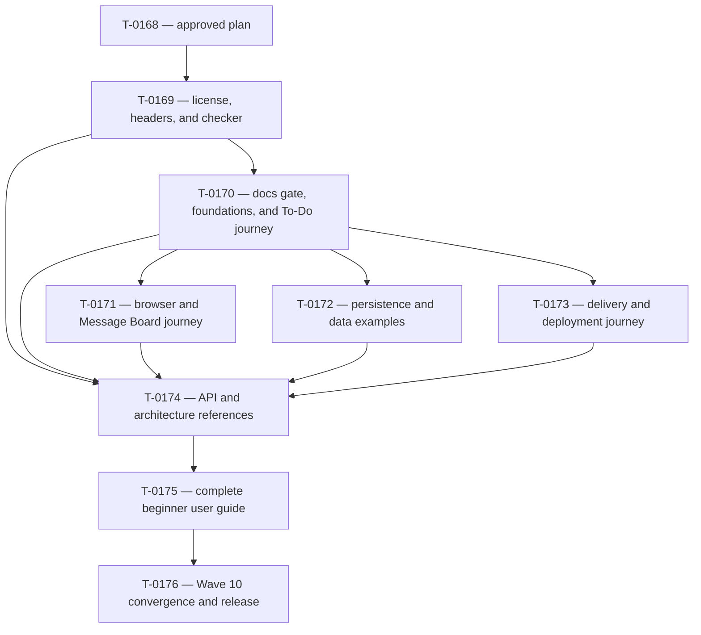

# Wave 10 Beginner Documentation And Copyright Plan

Status: Complete, reviewed, release-verified, and integration-ready

## Outcome

Wave 10 will give a beginner one gradual path from a domain idea to a tested,
observable, deployable Spine TS application. Concise README files will orient
the reader, the user guide will teach complete workflows, and dense reference
documents will hold exhaustive contracts and limits. The repository will also
carry one consistent Apache 2.0 licensing declaration and the exact approved
CodeMatters header on every eligible authored TypeScript, TSX, and Proto file.

Multiple-Gateway behavior is deferred to a later wave. Cloud Run remains
outside the initial offering.

## Approved Documentation Layers

1. **README — introduction.** Explain what a package or example is, when a
   beginner needs it, the shortest successful path, and where to continue.
2. **USER_GUIDE — guided application journey.** Explain concepts gradually and
   use working examples to take a reader from domain discovery through
   deployment.
3. **REFERENCE/TypeDoc/focused guides — exhaustive detail.** Hold complete API,
   provider, limits, operational, deployment, and compatibility contracts.

## Approved Beginner Guide Structure

1. Discover the domain with EventStorming and divide it into Bounded Contexts.
2. Create a Node.js/TypeScript project and add Spine TS.
3. Describe IDs, Commands, Events, Entity states, columns, and rejections in
   Proto, then generate TypeScript.
4. Implement Aggregates, Process Managers, Projections, handlers, exact/default
   routing, `@Where`, and rejection behavior.
5. Send Commands; read, query, and subscribe to Entity state; reconnect and
   design idempotent client behavior.
6. Choose in-memory, MySQL, or Datastore persistence; understand tenancy,
   physical layouts, typed mappings, and migrations.
7. Test domain behavior, handlers, storage, clients, and application flows.
8. Configure application/framework logging and operational observability.
9. Package and deploy combined or distributed applications on the supported
   GKE/GCE paths.
10. Continue with Message Board, Distributed Message Board, To-Do, Orders, and
    Projects examples.

## Approved Copyright Header

```text
/*
 * Copyright 2026, CodeMatters. All rights reserved.
 *
 * Licensed under the Apache License, Version 2.0 (the "License"); you may not use this file except
 * in compliance with the License. You may obtain a copy of the License at
 *
 * https://www.apache.org/licenses/LICENSE-2.0
 *
 * Unless required by applicable law or agreed to in writing, software distributed under the License
 * is distributed on an "AS IS" BASIS, WITHOUT WARRANTIES OR CONDITIONS OF ANY KIND, either express
 * or implied. See the License for the specific language governing permissions and limitations under
 * the License.
 */
```

## Reader-Facing Documentation Boundary

The implementation wave must give every current reader-facing file one
`changed` or `reviewed-no-change` disposition. The 64-file scope is:

- root `README.md` and `REFERENCE.md`;
- `interop/envoy/README.md`;
- `docs/USER_GUIDE.md`, `docs/api/README.md`,
  `docs/architecture/README.md`,
  `docs/BROWSER_CLIENT_AUTH_EXTENSION_GUIDE.md`;
- every tracked `README.md`, `REFERENCE.md`, and `USER_GUIDE.md` beneath
  `examples/`;
- every tracked package `README.md` and `REFERENCE.md`, plus the Proto
  distribution README.

The following Markdown is deliberately outside the rewrite:

- `build-protocol/**`, except the canonical task/plan/review/work and completion
  records needed to execute and close Wave 10;
- `spine-jvm-docs/**`, which is implementation research rather than product
  guidance;
- `docs/T-0046-datastore-remediation-plan.md`,
  `docs/firestore-storage-extension-analysis.md`, and
  `docs/spine-ts-extra-concepts-vs-core-jvm.md`, which are historical analysis;
- `docs/project-management-load-test-plan.md`, which is an unimplemented task
  specification rather than current product guidance;
- `compatibility-tests/jvm/README.md` and
  `packages/delivery-client/test/e2e/README.md`, which are framework-maintainer
  test instructions rather than application guidance;
- `packages/server/test-fixtures/proto/entity-metadata/README.md` and
  `scripts/fixtures/missing-snippet-context.md`, which are test fixtures;
- `AGENTS.md`, human review files, generated TypeDoc output, and untracked
  scratch material.

Excluded historical text is not silently made current. If a current
reader-facing document links to it, the implementation must either link to a
current canonical replacement or label the historical purpose plainly.

## Reader-Writing Rules

Every changed document must:

1. start with the reader's goal before configuration or limits;
2. introduce one new concept at a time and explain unexplained DDD/CQRS terms;
3. use short paragraphs, lists, tables, and small diagrams when they make a
   relationship easier to understand;
4. keep code examples complete enough to place in an application;
5. move exhaustive option tables, provider ceilings, environment-variable
   matrices, and operational edge cases to the canonical reference layer;
6. replace repetitive or unnatural AI prose, including needless use of
   “own/owned/ownership”, without banning the word when responsibility is the
   precise subject;
7. preserve the document's established headings, emoji, navigation pattern,
   examples, and general visual style unless the approved reader journey
   requires a clearer order;
8. state present behavior only—no task numbers, wave history, review language,
   planned capability, or unsupported deployment promise;
9. link once to the canonical dense explanation instead of copying it; and
10. use locally resolving relative links for repository content.

## Canonical Topic Targets

The guide and READMEs will use these targets rather than repeating dense prose:

| Topic                                                  | Canonical handoff target                       |
| ------------------------------------------------------ | ---------------------------------------------- |
| Public API names and signatures                        | TypeDoc, introduced by `docs/api/README.md`    |
| Runtime and Bounded Context architecture               | `docs/architecture/README.md`                  |
| Proto model package contract                           | `packages/proto/REFERENCE.md`                  |
| Proto generation tooling                               | `packages/proto-tools/REFERENCE.md`            |
| Server assembly, handlers, routing, filtering, logging | `packages/server/REFERENCE.md`                 |
| Node client contract                                   | `packages/client-node/REFERENCE.md`            |
| Browser client contract                                | `packages/client-web/REFERENCE.md`             |
| React client contract                                  | `packages/client-react/REFERENCE.md`           |
| Browser authentication and gateway extension           | `docs/BROWSER_CLIENT_AUTH_EXTENSION_GUIDE.md`  |
| Authentication API contract                            | `packages/auth/REFERENCE.md`                   |
| Delivery client behavior                               | `packages/delivery-client/REFERENCE.md`        |
| Delivery server behavior and finite limits             | `packages/delivery-server/REFERENCE.md`        |
| Generic storage and queries                            | `packages/storage/REFERENCE.md`                |
| MySQL physical layout and operation                    | `packages/storage-rdbms/REFERENCE.md`          |
| Datastore physical layout and operation                | `packages/storage-datastore/REFERENCE.md`      |
| Packaging and common deployment contracts              | `packages/deployment/REFERENCE.md`             |
| GKE operation                                          | `packages/deployment-gke/REFERENCE.md`         |
| GCE operation                                          | `packages/deployment-gce/REFERENCE.md`         |
| Envoy reference                                        | `interop/envoy/README.md`                      |
| Message Board runnable flow                            | `examples/message-board/README.md`             |
| Distributed Message Board runnable flow                | `examples/distributed-message-board/README.md` |
| To-Do runnable flow                                    | `examples/todo/README.md`                      |
| Orders runnable flow                                   | `examples/orders/README.md`                    |
| Projects runnable flow                                 | `examples/projects/README.md`                  |

The implementation may refine a target when inventory proves another current
document is already canonical, but it must not leave two documents claiming to
be the exhaustive source for the same topic.

Every guide section has one primary onward handoff. It may link specific API
symbols or runnable examples additionally, but it must not send the reader to
several competing “full” explanations.

| Guide section                   | Primary onward handoff                         |
| ------------------------------- | ---------------------------------------------- |
| 1. Begin with the domain        | `docs/architecture/README.md`                  |
| 2. Create a project             | `packages/server/README.md`                    |
| 3. Describe the model in Proto  | `packages/proto/REFERENCE.md`                  |
| 4. Implement behavior           | `packages/server/REFERENCE.md`                 |
| 5. Send Commands and read state | `packages/client-node/REFERENCE.md`            |
| 6. Persist application data     | `packages/storage/REFERENCE.md`                |
| 7. Test the application         | `packages/testing/REFERENCE.md`                |
| 8. Run and observe it           | `packages/server/REFERENCE.md` logging section |
| 9. Package and deploy it        | `packages/deployment/REFERENCE.md`             |
| 10. Continue from examples      | `examples/message-board/README.md`             |

## Copyright Eligibility And Placement

The migration operates on Git-visible source candidates and fails closed when
Git enumeration is unavailable.

- Eligible: 490 tracked `.ts` files, 12 tracked `.tsx` files, and 29 tracked
  Spine-TS-authored `.proto` files (19 example model files, 6 server fixture
  files, and the 4 paths declared by `ownedSources` in
  `packages/proto/proto/spine-sources.json`). The starting migration total is
  531 files.
- Excluded: exactly the 43 upstream paths declared by `sources` in
  `packages/proto/proto/spine-sources.json`, including the vendored gRPC health
  Proto. Their upstream notices remain unchanged. A directory-prefix guess is
  forbidden because owned and upstream Proto coexist beneath
  `packages/proto/proto/`.
- Ignored/untracked generated output and build output are never rewritten.
- A new eligible authored source is checked even before it is staged. A new
  excluded third-party/frozen Proto source must be added to the canonical
  provenance manifest's `sources` list and must retain its upstream notice.
  Checker-local provenance exceptions are forbidden.

Header placement is deterministic:

- after a shebang in the three executable TypeScript entry points;
- otherwise at byte zero before TypeScript/TSX imports or declarations;
- in every eligible TypeScript and TSX file, followed by exactly one empty line
  before the next import, declaration, ordinary comment, or TSDoc block;
- before `syntax` in an eligible Proto file.

## Copyright Checker Contract

`pnpm lint:copyright` will run one small Node checker with fixture tests. It
must:

1. enumerate tracked and non-ignored untracked `.ts`, `.tsx`, and `.proto`
   files through Git and fail closed if that enumeration fails;
2. require the exact approved CodeMatters header and placement on every
   eligible authored file;
3. reject the CodeMatters header anywhere in excluded frozen/third-party
   sources, derive that exclusion from the canonical Proto provenance manifest,
   and verify that those sources retain a non-CodeMatters copyright notice;
4. accept the exact 2026 header across the Wave 10 migration;
5. after 2026, compare each candidate with the merge-base version from
   `origin/main`: new files and files whose content outside the recognized
   header changed require the current calendar year;
6. use Git rename detection to map a renamed path to its merge-base path, then
   compare both files after removing the recognized header; a header-only
   correction and a content-identical rename are not content changes and do not
   advance the year. Because Git does not report an unstaged rename's untracked
   destination, also compare a new untracked candidate's header-normalized
   content with merge-base files deleted in the worktree. Exactly one match is
   treated as the old path; multiple matches fail closed as ambiguous. This
   fallback is read-only and never stages or rewrites user work;
7. include staged, unstaged, and untracked authored work in the current-year
   decision;
8. fail with sorted, path-specific diagnostics for missing, malformed,
   misplaced, stale-year, and forbidden headers; and
9. expose time, base-content lookup, and file enumeration to deterministic
   tests rather than changing the machine clock or depending on a remote.

The checker runs from `pnpm lint`, `pnpm verify:task`, and
`pnpm verify:release`. It does not run from plain TypeScript builds, application
startup, Proto generation, or an individual Vitest invocation. No publication
pipeline exists yet; the later publication task must include
`pnpm lint:copyright` in its preflight rather than Wave 10 inventing a package
publisher.

## License And Manifest Contract

- Copy the current `core-jvm/LICENSE` byte-for-byte as the root `LICENSE`.
- Add `"license": "Apache-2.0"` to the 18 framework manifests under
  `packages/*/package.json`.
- Do not add publication metadata to the root private workspace or the seven
  private example-application/model manifests merely to make every JSON file
  look alike.
- Extend package-metadata tests to prove the complete framework-package set has
  the SPDX value and private examples are not misclassified as publication
  targets.

## Verification Principles

- Copyright checker fixture tests cover eligible TS/TSX/Proto, shebang
  placement, excluded upstream notices, missing/malformed/forbidden headers,
  new content, changed content, unchanged old content, header-only edits,
  staged renames, unstaged untracked-destination renames, ambiguous rename
  candidates, staged/unstaged/untracked inputs, deterministic year injection, and
  fail-closed Git behavior.
- The canonical Proto workflow updates the four changed `ownedSources`
  checksums and proves the normalized frozen descriptor digest is unchanged;
  copyright comments must not rewrite the descriptor lock. Generated
  TypeScript remains ignored and untracked.
- Documentation checks cover all 64 in-scope dispositions, relative links,
  README-to-REFERENCE navigation, TypeScript snippets, package/example names,
  current-behavior wording, and prohibited internal execution-history terms.
- Human documentation review focuses on teaching quality, pace, factual
  accuracy, natural prose, and preserved README look and feel; deterministic
  formatting and links run first.
- Documentation-only slices use `verify:task -- --no-tests` after their focused
  snippet/link suites. Shared copyright tooling/package metadata runs the
  release profile after review convergence. Wave closure runs one final release
  profile against the integrated documentation and checker.

The dependency graph and per-task ownership below incorporate the completed
read-only requirements split.

## Proposed Dependency Train

The split follows reader journeys, not Markdown file types. Each documentation
task leaves one coherent family useful by itself and supplies stable targets to
the final guide.



### T-0169 — License, headers, and deterministic enforcement

Own the root `LICENSE`, all 18 `packages/*/package.json` manifests, the 531
eligible TS/TSX/Proto headers, the four changed `ownedSources` checksums and
unchanged descriptor-digest proof through canonical regeneration, one checker
plus fixture tests, copyright-only root package-script wiring, `verify-task`
wiring/tests, and the durable future publication-preflight requirement.
T-0169 must not edit the docs-snippet command or checker.

This is one cohesive task rather than a checker-only task followed by a bulk
task. Main must never contain a wired checker that fails solely because the
approved migration is incomplete. Internal checkpoint commits may review the
checker before the mechanical migration, but the task integrates only when the
whole repository passes it.

Its internal, pushed checkpoints are fixed:

1. checker and adversarial fixtures, still unwired from repository gates;
2. root license, 18 manifests, and the complete mechanical 531-file migration;
3. four owned-source checksum updates, unchanged descriptor-digest proof, final
   script/gate wiring, and converged verification.

### T-0170 — Domain model, server, testing, and To-Do journey

First add the general `pnpm docs:snippets:check` command and strict checker
behavior. It enumerates every TypeScript fence in an explicit document set and
type-checks public package imports/calls against built package-export
declarations; it must not replace public modules with permissive `any` stubs.
Every Wave 10 documentation task runs it over its complete owned path list, and
T-0176 runs it over all 64 paths.
T-0170 exclusively owns this docs script entry and docs checker; it must not
edit copyright commands or copyright gate wiring.

Also own the root README/REFERENCE; core, Proto, Proto tooling, server, testing,
and transport README/REFERENCE families; the Proto distribution README; and
the To-Do README/REFERENCE/USER_GUIDE. Teach one complete server-side path from
domain messages through behavior, startup, and tests. Preserve exact/default
routing only; do not restore Java-specific semantic routing or advertise an
`@Route` decorator.

### T-0171 — Browser, authentication, and Message Board journey

Own auth and all three client package README/REFERENCE families,
`docs/BROWSER_CLIENT_AUTH_EXTENSION_GUIDE.md`, and the complete Message Board
root/app/model/web/deploy/container README/REFERENCE family. Teach the path from
a browser action to authenticated Command/query/subscription use, reconnection,
and the supported single-Gateway deployment shapes without duplicating dense
security and protocol tables.

### T-0172 — Persistence, queries, and data-oriented examples

Own storage, storage-rdbms, and storage-datastore README/REFERENCE families plus
Orders and Projects README/REFERENCE files. Teach model `(column)` declarations,
typed Stringifier symmetry, Query pushdown, actual MySQL table and Datastore kind
layouts, native provider tenancy, migrations, and test setup. Unmarked Proto
fields remain only in authoritative `bytes`; Bounded Context names are never a
physical partition.

### T-0173 — Delivery and deployment journey

Own delivery-client, delivery-server, deployment, deployment-gce, and
deployment-gke README/REFERENCE families; Distributed Message Board
README/REFERENCE; and `interop/envoy/README.md`. Teach local/remote delivery,
combined/distributed packaging, containers, discovery, GKE/GCE operation, and
shutdown by linking exact finite limits to the corresponding reference.
Multiple-Gateway behavior and Cloud Run remain absent except for a clear
supported-scope statement where needed.

### T-0174 — Canonical API and architecture references

Own `docs/api/README.md` and `docs/architecture/README.md`. Reconcile them only
after package/example contracts are stable. Remove duplicated tutorial prose,
retain exhaustive public/runtime facts, and establish the final canonical link
targets consumed by the guide. T-0174 also exclusively owns changes to the
shared TypeScript-snippet checker and its tests only if the converged reader
documents require updated policy or exact path/content expectations. The
general strict command belongs to T-0170 so every journey can use it; T-0171
through T-0173 must not edit shared checker policy concurrently.

Explicitly remove active claims that TypeScript routing consumes
`(is).java_type` or `(every_is).java_type`. Frozen Proto options may be
described only as preserved wire definitions. Do not present `@Route` as a
TypeScript API. Current routing guidance uses `CommandRouting`, `EventRouting`,
and `StateUpdateRouting` with exact `route()` declarations and
`replaceDefault()`. A deterministic reader-scope scan enforces these absences.

### T-0175 — Beginner `docs/USER_GUIDE.md`

Rewrite the guide completely under the approved ten-section structure. Use
Message Board as the primary continuous example and small To-Do, Orders,
Projects, and Distributed Message Board examples where they teach a feature
better. Each section starts slowly, completes a useful step, and ends with
intentional links to canonical detail. Replace large mechanical paragraphs with
short prose, tables, lists, code, and small Mermaid diagrams. All TypeScript
snippets must pass the snippet checker and reflect the exact public API.

### T-0176 — Documentation and release convergence

Reconcile the 64-file disposition ledger, run cross-document factual scans,
prove every relative and canonical handoff link, run all snippet/package/docs
checks, perform the relevant final documentation/API/reliability review, and
run one converged `verify:release`. This task fixes only cross-family
contradictions found at integration; it does not become another general rewrite
or add deferred runtime behavior.

## Parallelism And Ownership

- T-0169 integrates before T-0170 because both add root `package.json` script
  entries and project rules prohibit parallel writers even when they would edit
  different JSON keys.
- T-0171 through T-0173 wait for T-0170's strict docs-snippet command, then
  proceed in parallel with disjoint Markdown ownership.
- T-0174 waits for all four journey families so its dense references do not
  race package truth, and for T-0169 so all shared tooling/package metadata is
  stable.
- T-0175 waits for every canonical target. T-0176 is serial closure.
- No task changes runtime behavior, public TypeScript/Proto contracts, or
  generated TypeScript. A documentation contradiction that appears to require
  runtime correction is a blocker and becomes a later explicitly approved task.

## Task Acceptance And Review Matrix

| Task   | Deterministic evidence                                                                              | Specialist concerns                                                                                     | Verification                                                                              |
| ------ | --------------------------------------------------------------------------------------------------- | ------------------------------------------------------------------------------------------------------- | ----------------------------------------------------------------------------------------- |
| T-0169 | checker fixtures, live 531/43 inventory, manifest SPDX test, Proto checksum/descriptor regeneration | style/maintainability and documentation/license; API and reliability N/A                                | `verify:release`                                                                          |
| T-0170 | strict wired snippet command, disposition list, snippets, links, names, end-user API audit          | style for shared checker; documentation and TypeScript/API; reliability for server behavior claims      | `verify:release` for shared docs tooling                                                  |
| T-0171 | disposition list, snippets, links, auth-secret wording scan                                         | documentation, TypeScript/API, and reliability; security facts cross-checked but no new security review | `verify:task -- --no-tests` after focused snippet tests                                   |
| T-0172 | disposition list, snippets, links, schema/layout/tenancy claim matrix                               | documentation, TypeScript/API, and performance/reliability                                              | `verify:task -- --no-tests` after focused snippet tests                                   |
| T-0173 | disposition list, snippets, links, topology/limit/deferral scan                                     | documentation, TypeScript/API, and performance/reliability                                              | `verify:task -- --no-tests` after focused snippet tests                                   |
| T-0174 | canonical-target uniqueness, strict snippets, links, semantic-routing/API absence scan              | documentation, TypeScript/API, and performance/reliability                                              | `verify:release` if shared snippet tooling changes; otherwise `verify:task -- --no-tests` |
| T-0175 | ten-section structure, beginner pacing audit, snippets, diagrams, links, example paths              | documentation, TypeScript/API, and performance/reliability                                              | `verify:task -- --no-tests` after focused snippet tests                                   |
| T-0176 | complete 64-file disposition, all deterministic docs gates, merged-tree scan                        | final affected documentation/API/reliability re-review; style and security N/A with recorded reasons    | `verify:release` and change-sensitive post-merge proof                                    |

Every task preserves a concrete review disposition for all four canonical
concerns. Documentation review must quote the complete human-requirements
ledger. Copyright tooling receives maintainability review; Markdown tasks do
not summon a style reviewer merely for prose formatting. Security review is N/A
because Wave 10 changes no authentication/runtime boundary; security-sensitive
claims still require source-backed documentation review and secret-safe
examples.

## Exact Reader-Document Ownership

This planning table is the static concurrency contract and the input to
T-0176's final disposition reconciliation. It is not a permanent runtime
inventory. Every row must end Wave 10 as either `changed` or
`reviewed-no-change`.

| Task   | Exact path                                          |
| ------ | --------------------------------------------------- |
| T-0170 | `README.md`                                         |
| T-0170 | `REFERENCE.md`                                      |
| T-0170 | `packages/core/README.md`                           |
| T-0170 | `packages/core/REFERENCE.md`                        |
| T-0170 | `packages/proto/README.md`                          |
| T-0170 | `packages/proto/REFERENCE.md`                       |
| T-0170 | `packages/proto-tools/README.md`                    |
| T-0170 | `packages/proto-tools/REFERENCE.md`                 |
| T-0170 | `packages/server/README.md`                         |
| T-0170 | `packages/server/REFERENCE.md`                      |
| T-0170 | `packages/testing/README.md`                        |
| T-0170 | `packages/testing/REFERENCE.md`                     |
| T-0170 | `packages/transport/README.md`                      |
| T-0170 | `packages/transport/REFERENCE.md`                   |
| T-0170 | `packages/proto/proto/README.md`                    |
| T-0170 | `examples/todo/README.md`                           |
| T-0170 | `examples/todo/REFERENCE.md`                        |
| T-0170 | `examples/todo/USER_GUIDE.md`                       |
| T-0171 | `packages/auth/README.md`                           |
| T-0171 | `packages/auth/REFERENCE.md`                        |
| T-0171 | `packages/client-node/README.md`                    |
| T-0171 | `packages/client-node/REFERENCE.md`                 |
| T-0171 | `packages/client-react/README.md`                   |
| T-0171 | `packages/client-react/REFERENCE.md`                |
| T-0171 | `packages/client-web/README.md`                     |
| T-0171 | `packages/client-web/REFERENCE.md`                  |
| T-0171 | `docs/BROWSER_CLIENT_AUTH_EXTENSION_GUIDE.md`       |
| T-0171 | `examples/message-board/README.md`                  |
| T-0171 | `examples/message-board/REFERENCE.md`               |
| T-0171 | `examples/message-board/app/README.md`              |
| T-0171 | `examples/message-board/app/REFERENCE.md`           |
| T-0171 | `examples/message-board/model/README.md`            |
| T-0171 | `examples/message-board/model/REFERENCE.md`         |
| T-0171 | `examples/message-board/web/README.md`              |
| T-0171 | `examples/message-board/web/REFERENCE.md`           |
| T-0171 | `examples/message-board/deploy/README.md`           |
| T-0171 | `examples/message-board/deploy/REFERENCE.md`        |
| T-0171 | `examples/message-board/deploy/container/README.md` |
| T-0172 | `packages/storage/README.md`                        |
| T-0172 | `packages/storage/REFERENCE.md`                     |
| T-0172 | `packages/storage-rdbms/README.md`                  |
| T-0172 | `packages/storage-rdbms/REFERENCE.md`               |
| T-0172 | `packages/storage-datastore/README.md`              |
| T-0172 | `packages/storage-datastore/REFERENCE.md`           |
| T-0172 | `examples/orders/README.md`                         |
| T-0172 | `examples/orders/REFERENCE.md`                      |
| T-0172 | `examples/projects/README.md`                       |
| T-0172 | `examples/projects/REFERENCE.md`                    |
| T-0173 | `packages/delivery-client/README.md`                |
| T-0173 | `packages/delivery-client/REFERENCE.md`             |
| T-0173 | `packages/delivery-server/README.md`                |
| T-0173 | `packages/delivery-server/REFERENCE.md`             |
| T-0173 | `packages/deployment/README.md`                     |
| T-0173 | `packages/deployment/REFERENCE.md`                  |
| T-0173 | `packages/deployment-gce/README.md`                 |
| T-0173 | `packages/deployment-gce/REFERENCE.md`              |
| T-0173 | `packages/deployment-gke/README.md`                 |
| T-0173 | `packages/deployment-gke/REFERENCE.md`              |
| T-0173 | `examples/distributed-message-board/README.md`      |
| T-0173 | `examples/distributed-message-board/REFERENCE.md`   |
| T-0173 | `interop/envoy/README.md`                           |
| T-0174 | `docs/api/README.md`                                |
| T-0174 | `docs/architecture/README.md`                       |
| T-0175 | `docs/USER_GUIDE.md`                                |
