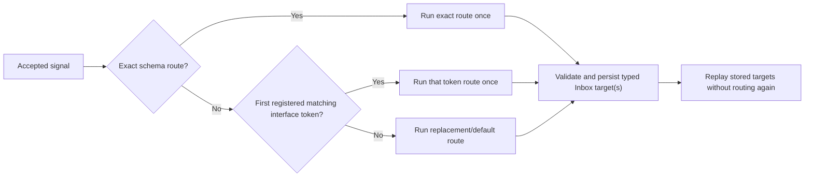

# Wave 11: TypeScript Interfaces And Interface-Based Routing

Status: Requirements split complete; specialist review pending

## Purpose

Wave 11 adopts the fresh upstream `ts_type` contract for `(is)` and
`(every_is)`. It teaches Spine's TypeScript generation step to produce or find
the declared interfaces, verifies that generated messages conform to them,
emits same-named runtime tokens, and lets existing routing declarations accept
those tokens through `.route(...)`.

The wave also corrects the generated-source policy: generated TypeScript says
that it is generated, identifies its stable Proto source, and never carries a
CodeMatters copyright header.

The canonical human requirements are recorded in
[`T-0178`](../tasks/T-0178-wave11-plan/TASK.md).

## Authority And Upstream Pin

The new frozen source is
`base/src/main/proto/spine/options.proto` from
`SpineEventEngine/base-libraries`:

- pinned `master`: `51cb428771e5af8a944675fb8e26e9eb2c3d0dfe`;
- introducing commit: `680092af8b7d1a7a916946c58feb541d5c614034`;
- source SHA-256:
  `894468a9ee427d4805accae79ef83cbdf5aacb09e41193b4d5cc965b3ede0ad9`;
- `EveryIsOption.ts_type`: field `3`;
- `IsOption.ts_type`: field `2`.

The upstream comments define simple, top-level TypeScript interface names.
`(is).ts_type` always refers to an existing interface.
`(every_is).ts_type` generates the interface only when `generate` is `true`;
otherwise it refers to an existing interface. Java-oriented fields remain in
the frozen contract but have no TypeScript behavior.

The upstream change deliberately does not prescribe the concrete TypeScript
representation. The interface/token form below is a Spine TS contract, not a
claim about JVM runtime implementation.

## Approved User Model

### Proto declaration

The To-Do event file will declare one generated common interface:

```proto
option (every_is) = {
  generate: true
  ts_type: "TaskEvent"
};

message TaskAssigned {
  option (is).ts_type = "TaskAssignmentEvent";

  TaskId task = 1;
  TaskListId list = 2;
  spine.core.UserId assignee = 3;
}
```

`TaskEvent` is generated because the file option says `generate: true`.
`TaskAssignmentEvent` is authored in the application's ordinary TypeScript
source because `(is)` never generates an interface.

### Authored interface and inheritance

The authored interface may extend another interface from the same Proto model
module:

```ts
import type { UserId } from "@spine-event-engine/core";
import type { TaskId } from "../generated/spine/examples/todo/task_id_pb.js";
import type { TaskListId } from "../generated/spine/examples/todo/task_list_id_pb.js";
import type { TaskEvent } from "../generated/interfaces/task-event.js";

export interface TaskAssignmentEvent extends TaskEvent {
  readonly task?: TaskId;
  readonly list?: TaskListId;
  readonly assignee?: UserId;
}
```

Here, _model module_ means the application/package root described by
`spine-proto.json`, not one TypeScript file. The declared interface and every
interface in its `extends` chain must resolve inside that model module after
realpath normalization. Property types may come from dependencies, as `UserId`
does above. Re-exporting an external parent through a local barrel does not make
it local.

### Generated companion

The post-Buf phase emits an interface companion under
`generated/interfaces/`. The same export name works in both TypeScript
namespaces:

```ts
import type { TaskEvent as AuthoredParent } from "./task-event.js";
import type { TaskAssigned, TaskUnassigned } from "../spine/examples/todo/task_events_pb.js";
import { MessageInterfaces, type MessageInterface } from "@spine-event-engine/core";

/** Generated by Spine TypeScript from spine/examples/todo/task_events.proto. */
export interface TaskAssignmentEvent extends AuthoredParent {}

/** Generated by Spine TypeScript from spine/examples/todo/task_events.proto. */
export const TaskAssignmentEvent: MessageInterface<
  TaskAssignmentEvent,
  TaskAssigned | TaskUnassigned
> = MessageInterfaces.define(/* generated membership */);
```

The exact formatting may change during implementation, but the public naming
does not: `MessageInterface` is the immutable token type and
`MessageInterfaces.define()` is the generated-code factory. Application code
does not manually construct tokens.

Generated message aliases explicitly include every applicable generated or
authored interface. The TypeScript compiler, using the model module's own
configuration, is the assignability authority.

### Routing use

```ts
const routing = EventRouting.create<UserId>()
  .route(TaskReassignedSchema, (event) => [event.previousAssignee, event.newAssignee])
  .route(TaskAssignmentEvent, (event) => [event.assignee])
  .replaceDefault(() => []);
```

The overload is `.route(...)` for both schemas and generated interface tokens.
Wave 11 does not restore `routeSemantic()` and does not add `@Route`.

Resolution is:

1. an exact `MessageSchema` route;
2. the first matching interface-token route in explicit registration order;
3. the replacement/default route.

Exact routes win regardless of call position. When two interface tokens match,
the first registered token wins. Spine TS does not infer interface specificity
or reorder application declarations.



## Generation Pipeline

The semantic phase is part of model generation, not a separate manual command:

```mermaid
flowchart LR
    A["Authored Proto + authored TS"] --> B["Buf generates staged TS"]
    B --> C["Read frozen ts_type options"]
    C --> D["Emit provisional interfaces/tokens"]
    D --> E["Build model-module TypeScript program"]
    E --> F["Validate locality, inheritance, and assignability"]
    F --> G["Augment message types and finalize tokens"]
    G --> H["Rewrite imports and module exports"]
    H --> I["Atomically publish generated tree"]
```



Any diagnostic before the final step leaves the previously published generated
tree unchanged. Temporary directories, worktree roots, and absolute paths
never enter output.

## Generated-Source Contract

- Generated TypeScript has no copyright header and contains no `CodeMatters`
  notice.
- The file-level block says Spine TypeScript generated the file and warns not
  to edit it manually.
- Generated declarations name the stable Proto import path that produced them.
- A multi-source registry gives each generated declaration its own provenance;
  its file-level notice remains generic.
- Buf output copied from a copyright-bearing Proto source is normalized before
  publication, so the source header does not leak into generated TypeScript.
- Generated outputs are excluded from authored-source copyright requirements.
  Enforcement rejects a CodeMatters header when one appears in a known
  generator-owned output.
- Authored TS/TSX/Proto retains the 2026 header and exactly one following blank
  line. Wave 11 does not weaken that rule.

## To-Do Domain Proof

The example remains a small, plausible task-management domain.

### Model changes

- Add a real `TaskListId`.
- `CreateTask` carries `TaskId`, `TaskListId`, and title.
- Task state retains its list and optional current assignee.
- Add `AssignTask`, `ReassignTask`, and `UnassignTask`.
- Add `TaskAssigned`, `TaskReassigned`, and `TaskUnassigned`.
- Every Task event carries enough list identity for `TaskList` routing.
- `TaskAssigned` and `TaskUnassigned` declare
  `(is).ts_type = "TaskAssignmentEvent"`.
- `TaskReassigned` has no `TaskReassignmentEvent`; its old/new-assignee fan-out
  is an exact-schema route.
- Commands carry no `(is)`/`(every_is)` marker in this example.

### Projection benefit

`TaskList`, keyed by `TaskListId`, registers one `TaskEvent` route instead of
one route per Task event. An assignee-oriented Projection, keyed by `UserId`,
registers one shared `TaskAssignmentEvent` route for assignment and
unassignment, plus one exact `TaskReassigned` route for two-target fan-out.

This demonstrates why an interface is useful: the repository expresses the
business grouping once, while each concrete event keeps its own schema and
handler.

## Dependency-Ordered Task Train

```text
T-0179 generated-source policy
  -> T-0180 fresh frozen options.proto
    -> T-0181 generated interface tokens
      -> T-0182 authored interface discovery and conformance
        -> T-0183 repository routing
          -> T-0184 To-Do proof
            -> T-0185 beginner documentation
              -> T-0186 release convergence
```

The train is serial. Adjacent tasks deliberately share generator or public
contract files, so parallel writers would create temporary inconsistencies and
conflicting ownership.

### T-0179: Generated-source provenance and copyright policy

Classification: high-risk shared build/release behavior.

Primary ownership:

- all TypeScript-producing generator entry points under `scripts/`;
- `packages/proto-tools/src/generation/` writer paths;
- handler registry, rejection, entity-column, Proto-module, and tracked-fixture
  writers;
- generated-clean and copyright enforcement plus focused tests;
- tracked generator-owned outputs.

Acceptance:

- normalize every generated TypeScript family to the generated-source contract;
- classify generator-owned paths deterministically rather than by Git ignored
  state alone;
- prove a second generation is byte-identical;
- prove a failed staged generation preserves previous output;
- reverse existing tests that currently require copyright on tracked generated
  artifacts.

TDD starts with old-header, missing-notice, unstable/absolute provenance,
multi-source declaration, and atomic-rollback failures. Run cheap preflight,
changed-branch coverage, then `verify:release`. Review TypeScript/API docs,
style/maintainability, performance/reliability, and generated prose.

### T-0180: Freeze the fresh upstream options contract

Classification: high-risk serialized-contract intake.

Primary ownership:

- `packages/proto/proto/spine/options.proto`;
- `spine-sources.json`, frozen descriptor digest, package Proto manifest, and
  curated exports;
- descriptor compatibility, provenance, and source-verification tests;
- narrow Proto package provenance documentation.

Acceptance:

- ingest the exact pinned upstream bytes, never a reconstructed equivalent;
- verify field numbers, source checksum, descriptor digest, exports, and
  manifest inventories;
- retain Java fields unchanged while exposing `ts_type` to TS generation;
- preserve unknown-option compatibility and deterministic regeneration.

Run cheap preflight then `verify:release`. TypeScript/API and documentation
review are required. Performance/reliability is N/A because no runtime
algorithm changes.

### T-0181: Generate interfaces and immutable runtime tokens

Classification: high-risk public/generated contract.

Primary ownership:

- `MessageInterface` and `MessageInterfaces` in `packages/core`;
- a new post-Buf interface generator under `packages/proto-tools`;
- the staged generator integration point and external-consumer fixtures.

Acceptance:

- `(every_is).generate = true` emits the interface and same-named token under
  `generated/interfaces/`;
- file-level scope includes eligible nested messages;
- messages accumulate file and message declarations;
- tokens are immutable, generated-only, and carry concrete schema membership;
- empty/invalid names, duplicate outputs, JVM-only options, and irreconcilable
  names fail before publication;
- a packed external consumer imports one identifier in both type and value
  position;
- no semantic string map, transport tag, `routeSemantic`, or `@Route` appears.

Focused tests must cover nested messages, both options together, deterministic
output, invalid declarations, token immutability, and declaration emit. Target
at least 90% branch coverage for changed production files; run cheap preflight
then `verify:release`. All four specialist lanes are relevant.

### T-0182: Discover authored interfaces and prove conformance

Classification: high-risk compiler/domain contract.

Primary ownership:

- new authored-interface discovery/conformance modules in `proto-tools`;
- the T-0181 generator integration seam and diagnostic types;
- package-root compiler fixtures and external-consumer tests.

Acceptance:

- resolve `(is).ts_type` and non-generated `(every_is).ts_type` only to a
  top-level authored interface in the same model module;
- resolve the entire `extends` chain and keep every parent in that module;
- allow external property types;
- use the model module's TypeScript program as assignability authority;
- emit generated companions/tokens for authored interfaces and relevant local
  parents;
- reject missing, ambiguous, non-interface, nested, generic-unbound, cyclic,
  re-export-laundered, symlink/path-escaping, incompatible, and incomplete
  declarations with stable diagnostics;
- preserve prior output on every failure.

Each rejection receives a RED fixture; successful fixtures cover local
inheritance, external property types, cumulative file/message options, and
nested messages. Target at least 90% changed-file branch coverage; cheap
preflight then `verify:release`; all four specialist lanes are relevant.

### T-0183: Route Commands, Events, and state updates by interface token

Classification: high-risk public dispatch and replay behavior.

Primary ownership:

- the three routing declaration modules under
  `packages/server/src/repository/`;
- repository route selection and construction validation;
- server root exports and focused routing/replay tests.

Acceptance:

- overload `.route(...)` with `MessageInterface` for all three signal kinds;
- retain exact-schema and replacement/default behavior;
- apply exact, then interface registration order, then default precedence;
- validate duplicates, forged tokens, incomplete membership, result
  cardinality, target types, and the existing 1,000-target cap before handoff;
- type interface callbacks to the declared interface/concrete member union;
- evaluate application routing once per accepted admission and zero times on
  durable replay;
- change no Inbox/provider serialized format.

RED/GREEN covers both interface registration orders, parent/child matches,
exact precedence independent of call order, invalid tokens, Command unicast,
Event/state zero-one-many, and admission/replay callback counts. Target at
least 90% branch coverage for changed routing files; cheap preflight then
`verify:release`; all four specialist lanes are relevant.

### T-0184: Demonstrate the contract in To-Do

Classification: high-risk example-domain and serialized-contract proof.

Primary ownership:

- To-Do Proto model, authored `TaskAssignmentEvent`, Aggregate, Projections,
  context assembly, generated-model configuration, tests, and smoke scripts;
- no shared Gateway implementation.

Acceptance:

- implement the exact domain model and routes above;
- prove `TaskListId` persistence and TaskList aggregation;
- prove assign, reassign, and unassign behavior;
- prove `TaskEvent` removes per-event TaskList route declarations;
- prove exact `TaskReassigned` produces two assignee targets and wins over
  interface routes;
- prove `TaskAssignmentEvent` routes assignment/unassignment;
- prove zero, one, and many target outcomes;
- repository scan proves `TaskReassignmentEvent` does not exist;
- native black-box, startup, Proto-module, smoke, and loopback
  multi-process behavior remain green.

Use focused TDD and at least 90% coverage for changed example production code,
then bounded `verify:task` with native loopback permissions. All four specialist
lanes are relevant; security is deferred unless the example exposes a new trust
boundary.

### T-0185: Teach the feature to beginners

Classification: standard documentation milestone after public contracts stop
moving.

Primary ownership:

- current reader-facing core, proto, proto-tools, and server README/reference
  material;
- `docs/USER_GUIDE.md`, API/architecture maps, and the To-Do guides;
- no historical build-protocol narrative rewrite.

Acceptance:

- explain the Proto declaration, generated versus authored interfaces,
  same-name type/token import, local inheritance boundary, and compiler errors;
- show `.route(Schema, ...)` and `.route(Token, ...)` with exact -> registered
  token -> default precedence;
- explain route-once admission and stored-target replay;
- state that TS uses `ts_type`, ignores Java-only fields, and creates no
  transport semantic tags;
- explain generated-file provenance and no-copyright policy;
- use the real To-Do model and never mention `TaskReassignmentEvent`;
- remove now-stale exact-only and “Java semantic is ignored entirely” claims;
- keep every README's existing look and feel, while dense detail remains in
  references.

Run deterministic snippet, link, API, audience, provenance, and prohibited-name
checks plus `verify:task -- --no-tests`. Documentation and TypeScript/API docs
review are required; style and reliability are concrete N/A dispositions.

### T-0186: Converge, release, and close Wave 11

Classification: high-risk release closure.

Primary ownership is limited to convergence corrections, task/review/work
records, decision/status mirrors, release evidence, tags, and integration.

Acceptance:

- scan for absent `TaskReassignmentEvent`, `routeSemantic`, `@Route`, generated
  copyright headers, absolute provenance paths, and hidden multi-Gateway work;
- verify every generated TS family has the correct notice/provenance;
- collect one complete relevant reviewer wave and one consolidated correction
  batch; re-review only affected lanes;
- record all canonical review dispositions, including concrete N/A reasons;
- run cheap preflight then one converged `verify:release` with repository branch
  coverage at or above 90%;
- run the existing final security reviewer;
- merge, post-merge verify, push `main` and task tags only to `origin`, and close
  task agents/worktrees.

## Review And Verification Policy

Implementation uses one `gpt-5.6-terra` / medium writer at a time. Mechanical
verification uses `gpt-5.6-luna` / low or medium. Public contract,
compatibility, dispatch, build atomicity, and reliability reviews use the
existing Terra/high specialist roles. Documentation review uses the existing
Luna/medium role. Each task records explicit profile dispatch before the child
runs and records the runtime-metadata limitation when the surface does not
expose telemetry.

Every implementation task begins with behavior RED evidence and runs the cheap
preflight before its one selected expensive profile. `verify:release` is used
for shared generation, Proto, core, server, and final convergence. The isolated
To-Do and documentation tasks use bounded `verify:task` profiles unless their
actual diff expands into shared runtime/build behavior.

## Security Disposition

The plan introduces no new network, authentication, secret, or tenant boundary.
Generated-source path containment and compiler input confinement are
correctness and supply-chain concerns and receive fail-closed tests plus
reliability review. The existing final security reviewer runs in T-0186. An
earlier security lane is opened only if implementation changes a trust boundary
or accepts executable input outside the model module.

## Explicit Wave 12 Deferral

Wave 11 does not implement multiple Gateway instances, selection, failover,
coordination, lifecycle, configuration, or deployment guidance. It does not add
provisional Gateway API. Multiple-Gateway work belongs wholly to Wave 12.
Cloud Run remains outside the initial offering.
