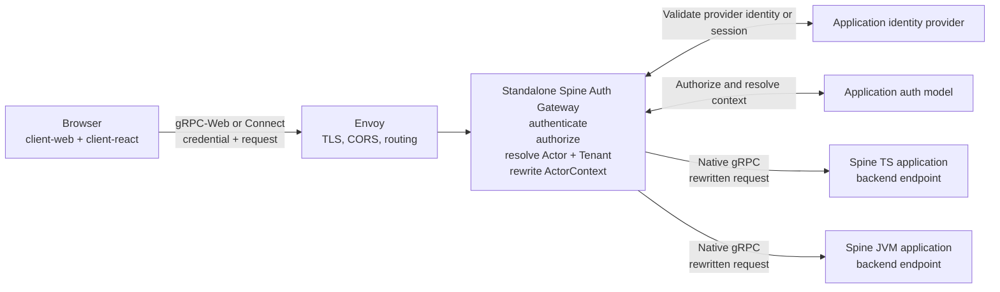
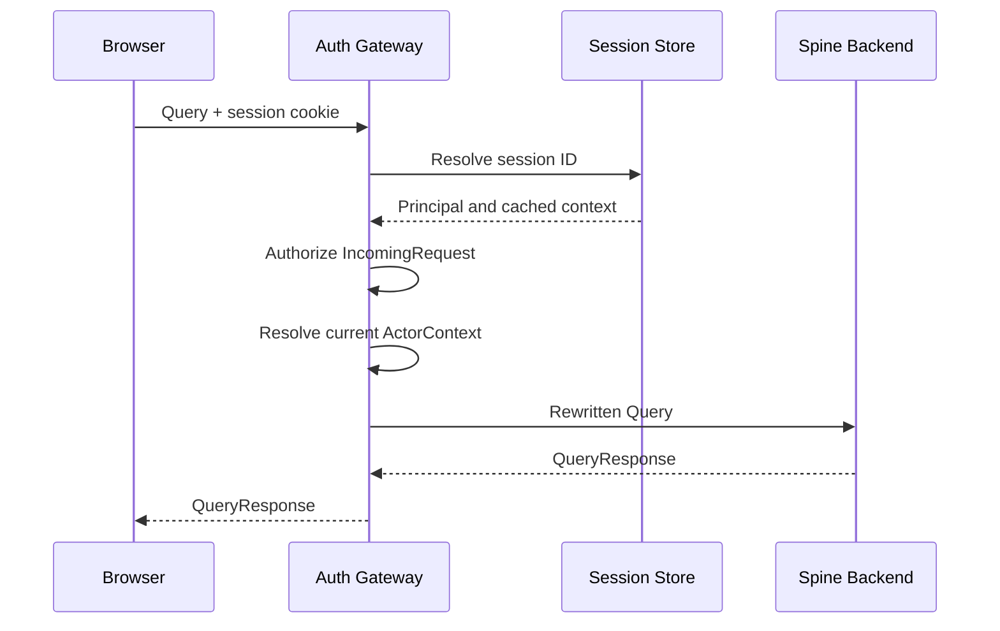
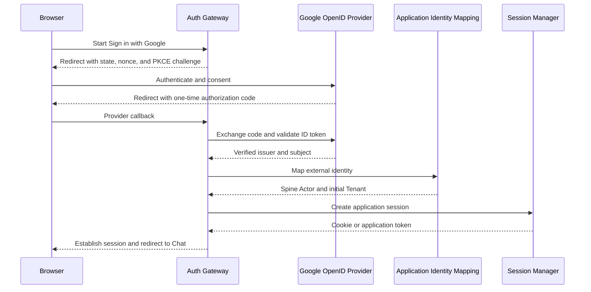
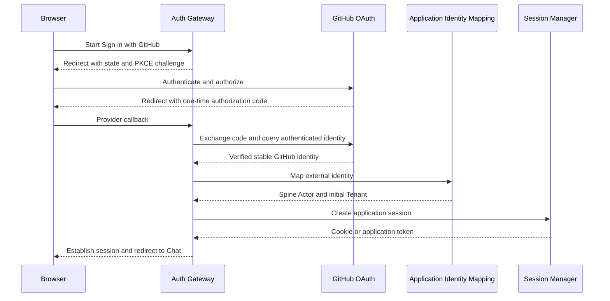

# Wave 4 Browser Client and Interoperability Plan

Status: Q&A complete; approved scope awaiting autonomous implementation start

Planning task: `T-0074`

Starting point: `origin/main@8a627719`

## Outcome

A browser application can use a framework-neutral Spine client, an optional
React adapter, and either gRPC-Web or Connect to post commands, send queries,
and create and activate entity or explicitly exposed event subscriptions
against an unmodified Spine TS or Spine JVM backend.

An independently deployed, provider-neutral Spine authentication gateway can
authenticate and authorize each incoming request, resolve a trusted
`ActorContext`, and forward a rewritten native-gRPC request to either backend.
The bounded contexts do not configure or execute authentication routines.

The continuing Chat example proves the browser, React, authentication,
projection-query, projection-subscription, model-package, Envoy, and TS/JVM
interoperability contracts. Chat messages are entities, normally standalone
Projections, and are never modeled as domain events merely for transport to
the UI.

## Human Decisions Ledger

### Wave boundary

- Wave 4 owns browser access, browser/Node client packaging, TS/JVM service
  interoperability, the standalone authentication gateway, React integration,
  the Chat browser example, and a configurable Envoy reference template.
- Wave 5 owns production container, Compose, Kubernetes, health, readiness,
  secrets, and storage-neutral deployment contracts. It productionizes the
  Envoy template created and tested in Wave 4.
- Wave 6 owns horizontal cross-node subscription propagation. The earlier
  "cluster-complete while connected" guarantee is superseded. Wave 6 provides
  best-effort cluster-wide notification reachability, not complete delivery.
- Wave 4 does not modify Spine JVM.
- No package is published to npm in Wave 4. Publication must be reconsidered
  after all accepted waves are complete.

### Packages

- The existing `@spine-event-engine/client` implementation transforms into
  `@spine-event-engine/client-node`; it is not discarded and reimplemented.
- Add `@spine-event-engine/client-web` as the framework-neutral browser client.
- Add `@spine-event-engine/client-react` as a separate optional React adapter.
  React is a peer dependency and does not enter the `client-web` dependency or
  declaration surface.
- Add `@spine-event-engine/auth` as the provider-neutral contracts and runtime
  used by applications to assemble a standalone authentication gateway.
- Do not publish a `client-core` package. Transport-neutral client
  implementation is an internal build/source concern shared by the two client
  packages.
- Keep Node-only Entity column generation with `client-node`.

### Browser transport

- gRPC-Web is the universal browser protocol and required interoperability
  baseline.
- Connect is an explicit optional optimization for compatible endpoints.
- Protocol selection is explicit. Do not guess, probe, or silently fall back.
- The authentication gateway accepts gRPC-Web and Connect and forwards native
  gRPC. This gives the same public browser contract to TS and JVM backends.
- Browser-native gRPC is not claimed. The reference Envoy configuration owns
  TLS, CORS, routing, request limits, and public endpoint composition.

### Client terminology

The framework domain API uses verbs that describe the Spine protocol:

```ts
await client.post(command);
const response = await client.send(query);

const subscription = await client.createSubscription(topic);
await subscription.activate();

for await (const update of subscription.updates) {
  // Consume a Projection state or an explicitly exposed event update.
}

await subscription.cancel();
```

`use...` is reserved for React-specific hooks. A React hook observes the state
of an existing request or subscription; it does not rename `post`, `send`,
`create`, `activate`, or `cancel`.

### Subscription semantics

Subscriptions are live notifications, not authoritative state.

- There is no completeness, exactly-once, or global-order guarantee.
- Duplicate and missing updates are possible.
- No promise is made that every intermediate entity state is observed.
- Updates that are delivered must match the requested type and topic.
- A detected transport interruption produces a lifecycle notification.
- The browser client performs bounded automatic reconnection.
- Reconnection is governed by a finite injected policy: attempts and/or elapsed
  retry time are bounded, only one retry timer and one activation pipeline may
  exist per logical subscription, and exhaustion transitions exactly once to
  `failed` with no later reconnect work.
- After reconnection, entity subscriptions re-send an authoritative query.
- Event subscriptions emit `gapPossible` and continue by default. End-user code
  can react to the notification.
- If a framework-owned bounded buffer overflows, the framework terminates the
  affected stream rather than knowingly discarding buffered messages while
  continuing to report a healthy stream.
- The framework cannot signal a loss it cannot observe. Documentation must not
  imply that a continuously open socket proves complete delivery.
- Wave 6 makes notifications produced by any application node reachable
  through a subscription attached to any node on a best-effort basis. It does
  not strengthen delivery completeness.

The public lifecycle model includes at least:

```ts
type SubscriptionLifecycle =
  "connecting" | "connected" | "resynchronizing" | "gapPossible" | "failed" | "closed";
```

Lifecycle notifications remain separate from domain/entity updates. Commands
are never automatically retried.

Each logical subscription owns a monotonically changing lifecycle generation
and cancellation signal. `cancel()` and close are idempotent and terminal:
they invalidate queued or in-flight reconnect work, cancel retry timers,
prevent future activation, and dispose any stream returned after the terminal
generation won the race. React unmount performs the same terminal cleanup.

## Standalone Authentication Gateway

### Responsibility

Spine TS and Spine JVM applications do not configure authentication and
authorization routines. They trust the `ActorContext` in a request that
reaches their public Spine service implementation.

`@spine-event-engine/auth` supplies a separately deployed, protocol-aware
gateway runtime. Application code supplies identity-provider configuration,
session behavior, external-identity mapping, tenant resolution, and
authorization policy.



The reference topology exposes only the gateway and places backends on a
private route. This is a documented security assumption and configurable
default, not a deployment prohibition. Framework users may replace or bypass
the topology and then own the resulting trust boundary.

### Why the gateway is protocol-aware

A generic edge authorization decision is insufficient because actor and tenant
live inside Protobuf envelopes. The gateway decodes and rewrites:

- `Command.context.actor_context`;
- `Query.context`;
- `Topic.context`;
- `Subscription.topic.context` for activation and cancellation.

It can also base policy on a packed command, Query target and filters,
subscription target and filters, and allowlisted HTTP/RPC transport facts.
Content-aware policy composes Wave 3 model modules into a `TypeRegistry`; a
type-URL-only policy need not register application schemas.

### `IncomingRequest`

Do not introduce the vague name `SpineOperation`. The authorization boundary
uses a discriminated `IncomingRequest` union:

```ts
type IncomingRequest =
  | IncomingCommand
  | IncomingQuery
  | IncomingSubscription
  | IncomingSubscriptionActivation
  | IncomingSubscriptionCancellation;

interface IncomingCommand {
  readonly kind: "command";
  readonly command: Command;
  readonly message: Message | undefined;
  readonly messageType: string;
  readonly requestedContext: ActorContext;
  readonly transport: TransportRequestContext;
}

interface IncomingQuery {
  readonly kind: "query";
  readonly query: Query;
  readonly target: Target;
  readonly requestedContext: ActorContext;
  readonly transport: TransportRequestContext;
}
```

The transport view exposes only documented, allowlisted data such as RPC
service/method, origin, request/correlation ID, reliably known peer address,
user agent, and selected metadata. Credentials are passed to authenticators
and are never included in ordinary diagnostics.

```mermaid
flowchart LR
    Raw["Incoming request"]
    Decode["Decode Protobuf envelope"]
    Authenticate["Authenticate application session"]
    Principal["Authenticated principal"]
    Authorize["Authorize IncomingRequest"]
    Resolve["Resolve trusted Actor + Tenant"]
    Rewrite["Create and inject ActorContext"]
    Forward["Forward to TS/JVM backend"]

    Raw --> Decode
    Decode --> Authenticate
    Authenticate --> Principal
    Principal --> Authorize
    Decode --> Authorize
    Authorize --> Resolve
    Resolve --> Rewrite
    Rewrite --> Forward
```



### Resolved context

The authentication model resolves the final context using the authenticated
principal and all relevant request facts.

- `actor` is gateway-resolved.
- `tenant_id` is gateway-resolved or gateway-approved.
- `timestamp` is gateway-generated or normalized.
- `zone_id` and `language` are validated client hints.
- A client may request a tenant, language, and zone, but does not establish
  their trusted values.

```ts
interface AuthorizedRequestContext {
  readonly actor: UserId;
  readonly tenant?: TenantId;
  readonly timestamp: Timestamp;
  readonly zoneId?: ZoneId;
  readonly language?: Language;
}
```

An informational context-resolution handshake returns the current actor,
tenant, and session expiry to the client:

```ts
const authentication = await client.authenticate();

authentication.actor;
authentication.tenant;
authentication.expiresAt;
```

These values support UI state and protocol-valid request construction; they
are not proof. Each later request validates its application session, authorizes
its `IncomingRequest`, and reconstructs the trusted context. A client actor or
tenant that differs from the newly resolved value is rejected with a
context-stale result before forwarding; it is never silently changed into a
different actor or tenant for command execution. When the values agree, the
gateway still replaces the client-supplied object with its own freshly
constructed trusted `ActorContext`. Commands are not automatically retried
after a context-stale result.

```mermaid
sequenceDiagram
    participant B as Browser
    participant G as Auth Gateway
    participant P as Application Policy
    participant S as Spine TS/JVM

    B->>G: Resolve context + session credential
    G->>P: Authenticate and resolve
    P-->>G: Actor A, Tenant T
    G-->>B: Actor A, Tenant T, expiry

    B->>G: Query + credential + claimed A/T
    G->>P: Re-authenticate and authorize query
    P-->>G: Resolved Actor A, Tenant T
    G->>G: Compare A/T; reject mismatch
    G->>G: Construct trusted ActorContext
    G->>S: Trusted Query
    S-->>G: QueryResponse
    G-->>B: QueryResponse
```

### Sessions and request credentials

The package supports two application-session strategies with distinct
revocation contracts.

#### Opaque stored session

The gateway creates an unpredictable session ID, stores the session through an
application-selected `SessionManager`, and places the ID in a protected cookie.

```http
Set-Cookie: __Host-chat-session=<random>;
            Secure;
            HttpOnly;
            Path=/;
            SameSite=Lax
```

The cookie carries only the application session ID. A later request performs a
local session lookup, not another Google or GitHub login.



The framework supplies the interface and an in-memory example implementation.
Applications choose production persistence and retention.

```ts
interface OpaqueSessionManager {
  create(identity: ResolvedApplicationIdentity): Promise<StoredSession>;
  resolve(sessionId: SessionId): Promise<ResolvedSession>;
  revoke(sessionId: SessionId): Promise<void>;
}
```

#### Signed application-session token

The gateway or an existing application authentication server may issue a
signed, audience- and expiry-bound application token. The browser sends it as
a bearer credential:

```http
Authorization: Bearer <application-session-token>
```

The gateway verifies it locally and authorizes the current request. It does not
contact the external identity provider. Documentation must cover the
revocation trade-off: an opaque stored session can be deleted immediately,
whereas a self-contained token normally remains usable until expiry unless the
application adds a denylist, key rotation, or another revocation mechanism.

Both browser cookie sessions and application bearer credentials are
first-class. Provider access and refresh tokens remain server-side by default
and are never forwarded to the Spine backend.

```ts
interface ResolvedApplicationIdentity {
  readonly externalIdentity: ExternalIdentity;
  readonly principal: AuthenticatedPrincipal;
  readonly actor: UserId;
  readonly defaultTenant?: TenantId;
}

interface SignedSessionTokenStrategy {
  issue(identity: ResolvedApplicationIdentity): Promise<SignedSessionToken>;
  verify(token: SignedSessionToken): Promise<ResolvedSession>;
}

interface SignedTokenRevocation {
  revoke(tokenId: string): Promise<void>;
  isRevoked(tokenId: string): Promise<boolean>;
}
```

`SignedTokenRevocation` is an optional capability, not a promise that every
signed-token strategy revokes immediately. A strategy without it relies on
expiry and key/application policy as documented. The gateway accepts either an
`OpaqueSessionManager` or a `SignedSessionTokenStrategy`; it does not pretend
their revocation behavior is identical.

Session validation is distinct from request authorization. Session validation
may use a local signature, lookup, or safe cache. Authorization still evaluates
every `IncomingRequest`. Applications decide the freshness of roles, tenant
membership, and identity mappings.

### Third-party sign-in

Wave 4 supplies:

- standards-based OpenID Connect authorization-code support;
- first-class configurable Google OpenID Connect sign-in;
- first-class configurable GitHub OAuth web-flow sign-in;
- a provider extension interface for other SSO/OAuth mechanisms;
- application-owned mapping from external identity to Spine actor and tenant;
- authorization-code, PKCE, state/nonce, redirect, expiry, and secret-handling
  guidance consistent with current OAuth/OIDC security practice.

#### Google



#### GitHub



The provider identity is not automatically the domain actor ID:

```ts
const identityMapping: IdentityMapping = {
  async resolve(identity) {
    if (identity.issuer === "https://accounts.google.com") {
      return users.findOrCreateForGoogleSubject(identity.subject);
    }
    if (identity.issuer === "https://github.com") {
      return users.findOrCreateForGitHubId(identity.subject);
    }
    throw new UnsupportedIdentityProvider(identity.issuer);
  },
};
```

Provider integrations obtain identity. Application mapping owns provisioning,
roles, permitted/default tenants, disabled-user policy, and the choice of
whether an unknown external identity may create an actor.

`IdentityMapping` returns `ResolvedApplicationIdentity`. The opaque-session
manager or signed-token strategy persists or encodes that resolved application
identity, not merely the external provider subject. A later session resolution
therefore yields the principal and cached actor/default-tenant mapping needed
by authorization. Per-request policy still rechecks the selected tenant and may
refresh or reject stale mappings.

References:

- [OAuth 2.0 Security Best Current Practice](https://www.rfc-editor.org/rfc/rfc9700.html)
- [OpenID Connect Core](https://openid.net/specs/openid-connect-core-1_0-18.html)
- [Google OpenID Connect](https://developers.google.com/identity/openid-connect/openid-connect)
- [GitHub OAuth web flow](https://docs.github.com/en/apps/oauth-apps/building-oauth-apps/authorizing-oauth-apps)

### Subscription authorization

`Subscribe`, `Activate`, and `Cancel` are separately authenticated and
authorized. Reconnection repeats the complete sequence.

The implementation must prevent one authenticated principal from stealing
another principal's returned `Subscription`. The exact binding mechanism is an
implementation design subject to security review; no general signed
client-context token has been approved. A narrow protected subscription
binding is permitted but not frozen by this plan.

`Subscribe`, `Activate`, and `Cancel` each receive an independent authorization
decision. Activation specifically reauthorizes opening the update stream; it
does not replace or weaken the authorization already required for creation or
cancellation. A configurable stream lifetime can force reconnection and
reauthorization. Wave 4 does not promise instantaneous revocation of a stream
that is already open; that limitation is public and prominent.

The gateway relay propagates cancellation and terminal errors in both
directions. Browser disconnect, credential/session expiry, forwarding failure,
or explicit cancellation aborts the native call and disposes backend
subscription resources. Relay queues are bounded independently by message
count and bytes; backpressure prevents unbounded reads, and crossing either
bound terminates the stream deterministically. Teardown is bounded and
idempotent so repeated disconnect/reconnect cycles retain no active native
stream, subscription, timer, or queued payload.

## React Adapter

`@spine-event-engine/client-react` is a separate browser-capable package with
React as an optional peer dependency. It consumes the public `client-web`
contract and imports no Node-only API. It owns:

- a client provider/context;
- request-result observation;
- Entity query result observation;
- entity and exposed-event subscription observation;
- subscription lifecycle observation;
- cancellation and cleanup on component unmount;
- React Strict Mode correctness.

It does not own:

- command/query/subscription creation semantics;
- a normalized global entity cache;
- Suspense integration;
- server-side rendering;
- a particular external state manager;
- Vue, Angular, Svelte, or other framework adapters.

React-specific hooks may use React's required `use...` convention. The
following is lifecycle pseudocode, not render-body TypeScript:

```text
effect:
  queryRequest = client.send(createMessageQuery(roomId))
  subscription = await client.createSubscription(topic)
  await subscription.activate()

render:
  queryState = observe request state through a React hook
  subscriptionState = observe the stable subscription handle through a React hook

cleanup:
  cancel the request/subscription generation and await bounded disposal
```

The concrete implementation must not create promises or activate
subscriptions unsafely during render. Stable controllers/resources and effects
are implementation details to be frozen by Slice D tests and compile-checked
examples. Hooks observe only stable handles/resources established through that
lifecycle. Spine operations retain `post`, `send`, `create`, `activate`, and
`cancel`.

Browser acceptance covers current Chromium, Firefox, and WebKit. Legacy
browsers, service workers, SSR, and edge-worker runtimes are not Wave 4
guarantees.

## Chat Example

The continuing Chat example uses React through `client-react` and the Wave 3
`users-model` and `chat-model` packages.

Chat messages are entities. Prefer one bounded standalone Projection per
message rather than one unbounded conversation state:

```proto
message ChatMessageView {
  option (entity).kind = PROJECTION;

  MessageId id = 1;
  ChatRoomId room = 2 [(column) = true];
  spine.core.UserId author = 3 [(column) = true];
  string text = 4;
  google.protobuf.Timestamp posted_at = 5 [(column) = true];
}
```

A separate room summary is permitted:

```proto
message ChatRoomView {
  option (entity).kind = PROJECTION;

  ChatRoomId id = 1;
  string title = 2;
  uint32 participant_count = 3;
  MessageId latest_message = 4;
}
```

The browser:

- signs in through the standalone auth gateway;
- posts commands such as `PostMessage`;
- sends a Query for `ChatMessageView` rows filtered by room;
- creates and activates a Projection subscription;
- observes subscription lifecycle through the React adapter;
- re-sends the authoritative Query after reconnection.

Domain events such as `MessagePosted` may drive Projections and may be
separately subscribed when explicitly exposed, but the browser must not model
the chat message entity itself as an event.

## TS/JVM Interoperability

Freeze a suitable current Spine JVM commit during Wave 4 implementation
preflight, before Slice A starts, and record it in the first implementation
task. Do not modify that source.

Acceptance exercises both paths:

```text
Browser → Envoy → Auth Gateway → Spine TS backend
Browser → Envoy → Auth Gateway → unmodified Spine JVM backend
```

The maintained, configurable Envoy template begins in Wave 4 and is
productionized in Wave 5. Tests cover:

- gRPC-Web against both backends;
- optional Connect against the gateway;
- commands, queries, Projection subscriptions, and explicitly exposed event
  subscriptions;
- both bearer and cookie application sessions;
- invalid credentials and unauthorized requests stopped at the gateway;
- fabricated or stale actor/tenant context rejected before forwarding;
- matching actor/tenant context replaced with a freshly constructed trusted
  `ActorContext`;
- `Subscribe`/`Activate`/`Cancel` ownership;
- credential expiry and visible lifecycle transitions;
- reconnection, reauthentication, reauthorization, and Entity re-query;
- cancel/unmount racing reconnect and late Subscribe/Activate completion;
- finite retry exhaustion, single-timer behavior, and no post-terminal work;
- blocked browser consumers, relay queue bounds, browser disconnect, backend
  errors, and repeated reconnect without retained stream/subscription
  resources;
- Chromium, Firefox, and WebKit;
- no source modification to Spine JVM.

## Public Limitations

Every limitation below must appear in the end-user guide, package docs,
generated API reference where relevant, the Chat guide, and the
agent-oriented extension guide:

- Subscriptions are not authoritative or complete.
- Duplicate, missing, and differently ordered updates are possible.
- A healthy-looking transport cannot prove that every update was delivered.
- Entity resynchronization restores an authoritative current view but not
  intermediate history.
- Event gaps may occur and are not replayed by Wave 4.
- Cross-node propagation is not Wave 4; Wave 6 is still best effort.
- Authentication at the gateway does not protect a backend route that a
  deployment exposes around the gateway.
- Actor and tenant returned to a browser are informational, not credentials.
- Signed session tokens trade local validation for delayed revocation.
- Signed-token revocation is conditional; only strategies implementing an
  explicit revocation capability may claim it.
- Opaque sessions require an application-selected durable store for
  production continuity.
- Third-party sign-in does not define application provisioning or permission
  policy.
- Provider access/refresh tokens are sensitive server-side material.
- Already-open subscriptions are not instantaneously revoked; reauthorization
  occurs on reconnect/expiry.
- The reference Envoy/network topology is customizable guidance, not an
  enforced global deployment policy.
- React support excludes SSR, Suspense, normalized caching, and external state
  managers in Wave 4.
- npm publication remains deferred.

## Agent-Oriented Developer Documentation

Documentation is a release gate, not a final cleanup slice. It must provide:

- one authoritative package/responsibility map;
- invariants and "must not" rules for every extension point;
- complete type signatures and compile-checked examples;
- configuration reference with defaults and failure behavior;
- cookie versus bearer decision tables;
- opaque versus signed-session decision tables;
- Google, GitHub, generic OIDC, and custom-provider recipes;
- identity-to-Actor and tenant-resolution recipes;
- authorization examples for each `IncomingRequest` kind;
- session persistence, cache, expiry, refresh, and revocation guidance;
- request/credential redaction and safe diagnostic guidance;
- subscription lifecycle and reconnection state machines;
- React lifecycle and Strict Mode examples;
- Envoy customization and trust-assumption guidance;
- TS and JVM backend interoperability recipes;
- testing fixtures for authentication, authorization, sessions, reconnect,
  Projection subscriptions, and third-party provider callbacks;
- explicit ownership, concurrency, resource, and error semantics so an agent
  can extend the framework without reconstructing the design from history.

Diagrams and third-party flows from this plan are retained or linked from the
developer guide. Examples must not contain fictitious APIs without a
compile-check or explicit pseudocode label.

## Dependency-Ordered Implementation Slices

### Preflight — frozen JVM fixture

Select and record the suitable current Spine JVM commit and immutable fixture
inputs before any production slice starts. All later interoperability work
consumes this frozen source and does not modify it.

### A — Shared client split

Transform the existing client into `client-node`, establish the internal
transport-neutral client boundary, and add `client-web`. Preserve behavior
while making gRPC-Web required and Connect explicit. Add lifecycle/reconnect
contracts, finite retry policy, terminal cancellation generation, and
browser-safe UUID/runtime dependencies.

### B — Auth contracts and gateway

Add `auth`, `IncomingRequest`, session contracts, context resolution,
authorization, protocol rewriting, model registry integration, and native-gRPC
forwarding. Cover every request envelope, the two-step subscription protocol,
bounded relay queues, bidirectional cancellation/error propagation, and
idempotent backend cleanup. Security review begins at this serialized trust
boundary.

### C — Sessions and federated sign-in

Implement opaque and signed application-session strategies, cookie and bearer
credentials, generic OIDC, Google, GitHub, provider extensions, callback
security, identity mapping, and informational context resolution.

### D — React adapter and Chat

Add `client-react`; complete the Chat Projection model, browser UI, lifecycle
handling, authentication UI, query/resubscribe behavior, and real browser
tests.

### E — Envoy and cross-runtime acceptance

Consume the already-frozen JVM source, create the maintained configurable Envoy
template, and prove real browser-to-gateway-to-TS/JVM behavior. Preserve the
template for Wave 5 production hardening.

### F — Documentation and closure

Reconcile all package, API, user, security, extension, example, and
architecture documentation. Run fresh-reader/agent tests, all relevant
specialist concerns, the final security gate, full native coverage, merge,
post-merge verification, and remote synchronization.

Slices may be decomposed further at implementation start. Parallel writers are
permitted only for independent ownership; auth contracts must freeze before
gateway/provider streams overlap, and the shared client boundary must freeze
before React integration.

## Verification and Review

Wave 4 is high-risk because it creates public packages, browser/runtime
boundaries, credential/session flows, serialized request rewriting, and
cross-runtime security assumptions.

- Use behavior-first tests for each slice.
- Use real browsers for browser-visible acceptance.
- Use real TS and frozen unmodified JVM backends for interoperability.
- Run deterministic mechanical checks before specialist review.
- All four canonical specialist concerns apply.
- A final security review is mandatory for OAuth/OIDC callback security,
  session fixation/replay/revocation, cookie/CSRF/CORS behavior, token
  validation, context rewriting, subscription ownership, credential
  redaction, model decoding, forwarding limits, and deployment trust claims.
- Run the full native gate with at least 90% branch coverage before integration
  and again on merged `main`.
- Push each commit immediately to `origin`; a task is not closed until its task
  branch and merged `main` are remotely synchronized.

## Closed Questions

No product question remains open. Exact class/function shapes, retry bounds,
session-store implementations, JVM fixture commit selection, and the protected
subscription-binding mechanism are implementation details subject to the
frozen behavior above, focused tests, specialist review, and final security
review. Slice B/C API design must concretely freeze CSRF defenses, signed-token
algorithm/key lifecycle, and subscription ownership binding before release;
those are security implementation decisions and become human blockers only if
evidence requires changing the approved public behavior.
