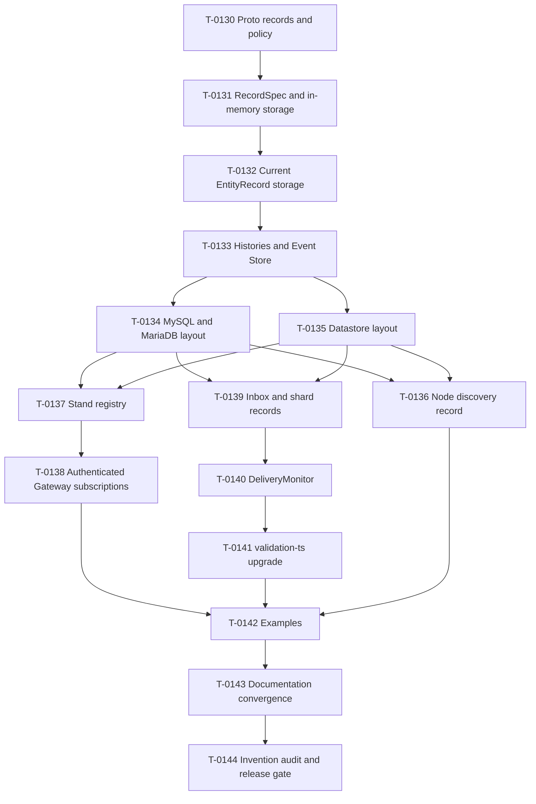

# Wave 8 Storage Correction Plan

Status: Reviewed and ready for implementation

Navigation: [Completion plan](../PROJECT_COMPLETION_PLAN.md) | [Task ledger](../tasks/T-0129-wave8-storage-correction/TASK.md)

## Outcome

Wave 8 replaces the current shared physical storage layout with the
record-oriented model used by Spine JVM, removes unapproved persistent
mechanisms, and makes delivery failure policy configurable through
`DeliveryMonitor`. It finishes only when examples and documentation teach the
new behavior and a repository-wide audit finds no unresolved invention.

## Execution Rules

- T-0130 through T-0144 execute in order unless the dependency graph explicitly
  permits harmless preparation. Only one production writer owns overlapping
  files.
- Every runtime behavior begins with a focused failing test. Generated output
  remains ignored and is regenerated by verification.
- Each task keeps narrow TSDoc and public claims current. T-0142 and T-0143 own
  all-example execution and broad documentation after runtime APIs stabilize.
- Feature-branch commits are pushed to `origin` immediately. No Spine JVM build,
  npm publication, migration-remote push, or old-layout migration is allowed.
- T-0144 runs the one final `verify:release`; earlier slices use focused
  `verify:task` and do not repeatedly pay the repository-wide gate.

### Integration-train correction

T-0131 removes public constructor fields and accessors that direct consumers in
later tasks still use. The deterministic repository build therefore cannot be
green after T-0131 alone, and a compatibility alias would violate the approved
removal boundary. T-0131 through T-0142 form one stacked integration train:

- each task receives its focused RED/GREEN proof, required specialist review,
  commit, and immediate feature-branch push;
- each accepted task becomes the immutable base of the next dependent task;
- the train does not merge into `main` while an assigned legacy consumer still
  fails the repository build;
- T-0142 must restore the complete deterministic task profile before the train
  merges to `main`; T-0143 and T-0144 then execute from that integrated base.

This is a sequencing correction only. It does not permit compatibility fields,
temporary runtime aliases, weakened tests, or ownership leakage. Every direct
legacy consumer remains owned by its existing task; deterministic failure
inventory proves the handoff until that task removes it.

## Dependency Graph

## T-0130: Approved Proto Records And Proto Policy

Freezes every Wave 8 serialized record before runtime migration.

- Ownership: `packages/proto/proto/**`, Proto manifests and exports,
  descriptor/contract tests, and deterministic authored-Proto checks.
- RED-first acceptance: descriptors reject the old deployment and Stand
  messages, then prove the exact approved packages, names, typed IDs, field
  names, numbers, labels/cardinality, scalar or message types, `type_name`,
  oneof/map membership, source order, and file/package type-URL options for node
  discovery, `SubscriptionRecord`, and `GatewayAuthenticatedSubscription`.
  Public facets export the client, auth, and deployment records. The package's
  existing `generated/*.js` compatibility subpath remains a public low-level
  surface; curated root/facet tests freeze the intended convenient imports.
  Compile/import tests reject obsolete `spine.system.*` paths and old names.
  The checker rejects authored
  `optional` fields and incorrect declaration/comment spacing while preserving
  manifest-frozen copied Proto unchanged.
- Removal boundary: no aliases, legacy packages, version fields, primitive IDs,
  revision/generation fields, or extra persisted messages in the new contracts.
  The two old private sources remain only as intermediate build inputs until
  T-0136 and T-0137 migrate their consumers; they are not exported aliases and
  T-0144 rejects either one in the completed Wave.
- Descriptor evidence is a checked-in literal expectation, not values copied
  from the generated descriptor under test. It pins:
  `spine.deployment.NodeRegistrationId.value = 1`;
  `ApplicationNodeEndpoint.origin = 1` and non-optional
  `tls_server_name = 2`; `ApplicationNodeLease.node_id = 1`, `endpoint = 2`,
  `when_expires = 3`, and `registration_id = 4`;
  `spine.client.SubscriptionRecord.id = 1`, `subscription = 2`, `status = 3`,
  `when_created = 4`, and `when_activation_expires = 5`, with
  `SubscriptionStatus.SS_UNSPECIFIED = 0`, `PENDING = 1`, and `ACTIVE = 2`;
  and `spine.auth.GatewayAuthenticatedSubscription.id = 1`, `subscription = 2`,
  and `when_expires = 3`. The fixture also pins message/scalar types, required
  and validation options, packages, type-URL prefixes, source order, and the
  absence of optional/oneof/map/reserved members unless this ledger says so.
- Review: style/maintainability for checker code, documentation, and
  TypeScript/API docs. Reliability is N/A because this slice has no runtime
  persistence consumer.
- Verification: focused `verify:task` for Proto generation, lint, descriptors,
  generated cleanliness, and changed source coverage.

## T-0131: JVM-Style RecordSpec And In-Memory Storage

Replaces storage-key/fingerprint identity with the source type, ID type, record
type, ID extraction, and columns that define a JVM-style record specification.

- Dependencies: T-0130.
- Ownership: `packages/storage/src/{record,storage,memory,query,event}/**` and
  mirrored tests, limited in `event` to the direct `RecordSpec` consumer.
- RED-first acceptance: two Entity source types storing `EntityRecord` remain
  physically distinct; ordinary records default their source to their record
  type; column materialization, context and tenant isolation, queries, compare-
  and-set, and batch behavior remain correct.
- Public contract: `RecordSpec<I, R>` remains exported from
  `@spine-event-engine/storage`. Its sole constructor argument is exactly an
  object containing `recordType: GenMessage<R>`, `extractId: (record: R) => I`,
  exactly one of `idSchema: GenMessage<I & Message>` or non-blank
  `idKind: string`, optional `columns: readonly RecordColumn<R>[]`, and optional
  `sourceType: GenMessage<Message>`; `sourceType` defaults to `recordType`.
  Read-only `sourceType`, `idType`, `recordType`, and `columns` accessors expose
  the specification. The old `schema`, `storageKey`, and
  `compatibilityFingerprint` accessors/inputs are removed without aliases.
  Compile-time consumer tests and public TSDoc/REFERENCE freeze this surface.
- Removal boundary: delete compatibility fingerprints, spec metadata, and
  compatibility-oriented canonical layout machinery. Do not add a replacement
  hash or persisted descriptor.
- Review: style/maintainability, TypeScript/API docs, and
  performance/reliability; documentation receives narrow public-claim review
  if package prose changes.
- Verification: the shared deterministic profile is run through its expected
  downstream compile failure and the complete failure inventory is recorded.
  Focused package typecheck and coverage must pass. The stacked train restores
  and passes the complete `verify:task` no later than T-0142.

## T-0132: Current EntityRecord Storage

Makes each Entity class derive and use its own current-state record
specification.

- Dependencies: T-0131.
- Ownership: Entity record/scanning code in storage,
  `packages/server/src/{entity,repository,context}/**`, the exact frozen JVM
  `spine/server/entity/entity.proto` source plus its Proto manifest/export
  integration, and focused tests. The frozen source is copied unchanged from
  analyzed core-jvm commit `0779b5fa42ca5cebd0d2935fc3a3489ab47846dc`;
  no JVM build is required.
- Supporting ownership includes only the handler metadata/generated-registry
  paths needed to attach hidden immutable state-schema metadata to the Entity
  class. Applications do not declare that static property themselves.
- RED-first acceptance: `SpecScanner` accepts only the Entity class and derives
  its ID and state schemas, lifecycle/version fields, and `(column)` metadata;
  multiple columns unpack the state once; repositories persist and restore the
  approved `EntityRecord`; provider queries can consume materialized columns.
- TypeScript erases the Entity generic schema at runtime. Deterministic build
  tooling may therefore attach immutable schema metadata to the Entity class
  itself. It must not create a separate runtime metadata registry or require
  end-user storage-descriptor boilerplate.
- Removal boundary: no caller-supplied schemas, metadata registry, compatibility
  hash, JSON-in-`Any`, or alternative current-state record.
- Review: all four concerns because public Entity storage and query semantics
  change.
- Verification: coverage-enabled focused `verify:task` over storage/server
  Entity paths.

## T-0133: Histories And Event Store

Moves state history, event history, and Event Store data to their own approved
record specifications.

- Dependencies: T-0132.
- Ownership: `packages/storage/src/{entity,event,internal,memory}/**`, repository
  commit/history paths, and focused tests.
- RED-first acceptance: enabled histories use separate grouped record storage;
  disabled histories create and write none; Event Store remains an independent
  append-oriented record family; ordering and retention remain correct; tests
  assert only provider-supported atomicity.
- Removal boundary: delete commit receipts, replay receipts/maps/tables,
  receipt-driven replay semantics, and layout fingerprints. Do not add commit
  markers or reconstruct current Entity state from events.
- Review: style/maintainability, TypeScript/API docs, and
  performance/reliability; documentation if public claims change.
- Verification: coverage-enabled focused `verify:task`.

## T-0134: MySQL And MariaDB Record Layout

Replaces shared tables with one table per record source and JVM-compatible
default names.

- Dependencies: T-0133.
- Ownership: `packages/storage-rdbms/**`, package-local documentation, and live
  provider fixtures.
- RED-first acceptance: default table names use the source Proto full name with
  dots replaced by underscores; Entity and non-Entity families are separated;
  `(column)` values use native SQL columns and provider predicates/order; no
  user-column index is auto-created. Startup diagnoses missing/incompatible
  required columns and primary keys, accepts harmless compatible additions,
  never alters existing tables, and supports custom names and create
  operations. Live tests cover commit, rollback, and injected mid-write failure
  for MySQL InnoDB/MyISAM and MariaDB InnoDB/Aria, explicitly distinguishing
  transactional atomicity from safe, reported partial progress on
  nontransactional engines. InnoDB failure rolls the whole unit back. MyISAM
  and Aria write immutable event/state-history and Event Store rows before the
  current Entity row; a failure rejects with the original storage operation
  error, leaves only that deterministic prefix, starts no automatic retry or
  claim/receipt record, and permits an identical later retry to idempotently
  complete the missing suffix. Divergent immutable collisions fail.
- Public contract: `MysqlStorageFactory.newBuilder()` returns exported
  `MysqlStorageFactoryBuilder`. The builder supplies `setOptions(options)`,
  `setTableName(recordType, name)`, grouped
  `setTableName(sourceType, recordType, name)`,
  `useOperationFactory(factory)`, and asynchronous
  `build(): Promise<MysqlStorageFactory>`. Exported
  `CreateOperationFactory` receives the resolved table specification and
  returns the create-table operation. Exact source-plus-record registration
  wins over record-only registration, which wins over the JVM default name.
  Public TSDoc, REFERENCE examples, and compile-time consumer tests freeze the
  API. The implementation task must add the exact generic declarations for
  both table-name overloads and `CreateOperationFactory` to its TASK before its
  RED test; a record-only create factory applies to every matching record type,
  while an exact source-plus-record table registration has the stated naming
  precedence.
- Removal boundary: delete shared records/columns tables, spec metadata, schema
  hashes, and false multi-table atomicity claims for nontransactional engines.
- Review: all four concerns.
- Verification: provider-focused `verify:task`; no all-example run.

## T-0135: Datastore Record Layout

Replaces shared kinds with JVM-familiar per-record kinds and customization.

- Dependencies: T-0133.
- Ownership: `packages/storage-datastore/**`, package-local documentation,
  emulator fixtures, and bounded cloud fixtures.
- RED-first acceptance: the default kind is the source Proto full name; each
  Entity and non-Entity family is separate; `(column)` values are native
  properties used for provider-side filter/order; custom record layouts and
  record/entity storage creators are selected by source type.
- Public contract: `DatastoreStorageFactory.newBuilder()` returns exported
  `DatastoreStorageFactoryBuilder` with `setClient(client)`, record-only and
  grouped `organizeRecords(...)` overloads, `useRecordStorage(...)`,
  `useEntityStorage(...)`, and synchronous
  `build(): DatastoreStorageFactory`. Exported `RecordLayout`,
  `CreateRecordStorage`, and `CreateEntityStorage` are the callback/layout
  types. An exact custom storage creator wins over an exact grouped layout,
  which wins over a record-only layout, which wins over the JVM default kind.
  Public TSDoc, REFERENCE examples, and compile-time consumer tests freeze the
  API. The implementation task must freeze the exact generic callback inputs
  and return types before RED: record creators receive the `StorageContext`,
  resolved `RecordSpec`, Datastore client, and finite scan bound and return a
  `RecordStorage`; entity creators receive the `EntityStorageInput` and client
  and return the provider entity handle. Exact source-plus-record creator wins
  over record-only creator; exact source-plus-record layout then wins over
  record-only layout and the JVM default.
- Removal boundary: delete shared/canonical kinds, stored compatibility
  metadata, old-layout readers, and fallback scans presented as pushdown.
- Review: all four concerns.
- Verification: emulator-focused `verify:task`, plus bounded live checks when
  credentials are available; unavailable optional cloud credentials are
  recorded honestly and do not replace emulator coverage.

## T-0136: Node Discovery Persistence

Uses the corrected `spine.deployment` record directly.

- Dependencies: T-0130, T-0131, T-0134, and T-0135.
- Ownership: `packages/deployment/**` and directly affected GKE/GCE tests.
- RED-first acceptance: stable node identity uses `spine.server.NodeId`,
  registration fencing uses `NodeRegistrationId`, endpoint and expiry round-
  trip through the Proto, and provider layout customization reaches this
  record family.
- Provider tests prove both MySQL table customization and Datastore layout or
  custom-storage selection reach the node-discovery record.
- README, REFERENCE, deployment guide, and stale-string tests remove the old
  `ApplicationNodeLease:v1`, encoding-version, and versioned-key claims.
- Removal boundary: delete encoding version and primitive node/registration
  IDs and delete the old private
  `spine/system/deployment/application_node_lease.proto`. Do not add old-lease
  migration, Cloud Run, logging, or Gateway scaling.
- Review: documentation, TypeScript/API docs, and performance/reliability;
  style if production structure changes.
- Verification: focused `verify:task`.

## T-0137: Stand Subscription Persistence

Persists one `spine.client.SubscriptionRecord` per subscription.

- Dependencies: T-0130, T-0134, and T-0135.
- Ownership: `packages/server/src/stand/**` and mirrored tests.
- RED-first acceptance: the explicit subscription ID is the storage ID; the
  approved fields round-trip; `SubscriptionStatus`, `status`, and
  `SS_UNSPECIFIED` are used; creation, activation expiry, cancellation, pending
  cleanup, polling, restart, and custom registry behavior remain correct.
- Provider tests prove MySQL and Datastore customization reaches
  `SubscriptionRecord`.
- Removal boundary: delete revision, generation, control/staging records,
  JSON-in-`Any`, the old private
  `spine/system/server/stand_subscription.proto`, and arbitrary global capacity
  coordination. Do not promise complete update delivery or multiple-Gateway
  behavior.
- Review: all four concerns.
- Verification: coverage-enabled focused `verify:task`.

## T-0138: Authenticated Gateway Subscription Persistence

Persists the approved authenticated subscription instead of durable binding
coordination records.

- Dependencies: T-0137.
- Ownership: authenticated-subscription code in `packages/auth/**`,
  `packages/server/src/server/durable-subscription-bindings.ts`,
  `packages/server/src/server/browser-server.ts`, `packages/server/src/index.ts`,
  their mirrored tests including `packages/server/test/server/server.test.ts`
  and `packages/server/test/index.test.ts`, and focused Browser/Gateway tests.
- RED-first acceptance: subscription ID, subscription, and `when_expires`
  round-trip directly; expiry and single-Gateway restart behavior remain
  correct; the Topic retains the resolved Actor/Tenant context; an inspected
  backend contains no other Gateway coordination record.
- Provider tests prove MySQL and Datastore customization reaches
  `GatewayAuthenticatedSubscription`.
- Removal boundary: delete quota, cleanup, reservation, fence, admission-token,
  principal-fingerprint identity, receipt, and other unapproved persistence.
- Review: all four concerns.
- Verification: coverage-enabled focused `verify:task`.

## T-0139: Inbox And Shard Records

Persists `InboxMessage` directly and uses shard ownership as the only delivery
exclusion mechanism.

- Dependencies: T-0133 through T-0135.
- Ownership: Inbox, shard-registry, lease, and pickup files under
  `packages/server/src/delivery/**`; all `packages/delivery-client/**` source,
  tests, exports, README, and REFERENCE related to `RemovalQuarantine`, remote
  quarantine, or removal fingerprints; plus focused tests.
- RED-first acceptance: pending and delivered `InboxMessage` rows round-trip;
  delivered rows provide deduplication; `ShardSessionRecord` represents shard
  ownership; two workers cannot own one shard; no per-message claim or separate
  dedup record is acquired. Provider tests prove MySQL and Datastore
  customization reaches `InboxMessage` and shard-session records. Remote
  delivery tests prove uncertain removal no longer writes or consults
  `RemovalQuarantine` or fingerprints and uses no replacement persistent type.
- The provider conformance matrix covers every surviving durable family:
  current `EntityRecord`, grouped state-history `EntityRecord`, grouped
  event-history `Event`, Event Store `Event`, `InboxMessage`, shard-session
  record, `SubscriptionRecord`, `GatewayAuthenticatedSubscription`,
  `ApplicationNodeLease`, and TenantIndex. TenantIndex stores the existing
  `spine.core.TenantId` directly in its own layout, replacing the generic
  `StringValue` record without inventing another Proto.
- Removal boundary: delete JSON-in-`Any`, message claims, dedup guards, delivery
  attempts, and quarantine persistence. T-0140 owns monitor policy.
- Review: style/maintainability, TypeScript/API docs, and
  performance/reliability; documentation if public claims change.
- Verification: coverage-enabled focused `verify:task` with concurrency and
  corruption cases.

## T-0140: Controlling DeliveryMonitor

Replaces attempt/exhaustion policy with JVM-style failure actions.

- Dependencies: T-0139.
- Ownership: remaining `packages/server/src/delivery/**`, builder/export
  surfaces, and delivery tests.
- RED-first acceptance: `FailedReception` exposes the message and error plus
  asynchronous mark-delivered/repeat-dispatch actions; default failure marks
  delivered; repeat redispatches; continuation, start/completion, reception-
  failure, pickup-failure, and already-picked hooks are observed. Monitor and
  action exceptions are contained. Adversarial sequences prove a thrown hook
  or action produces no unhandled rejection, permits independent targets to
  continue, and safely releases or retains the affected shard. Graceful stop
  prevents later pickup/dispatch, releases the shard, and lets a replacement
  worker acquire it without concurrent duplicate delivery. A durable mark
  failure leaves the row
  pending, stops later same-target messages, continues independent targets,
  releases the shard, and permits a later run. Stop waits for every in-flight
  dispatch and action to settle before releasing ownership; no replacement can
  concurrently dispatch that shard.
- Public contract: exported class `DeliveryMonitor` defines
  `shouldContinueAfter(stage)`, `onDeliveryStarted(shard)`,
  `onDeliveryCompleted(stats)`, `onReceptionFailure(reception)`,
  `onShardPickUpFailure(failure)`, and `onShardAlreadyPicked(failure)`.
  Callbacks may return their value directly or through `Promise`; void hooks
  may return `void | Promise<void>`. Exported `FailedReception` exposes
  read-only `message` and `error` plus `markDelivered()` and
  `repeatDispatching()`, each returning an exported `ReceptionAction` whose
  `execute()` returns `Promise<void>`. Pickup callbacks analogously return the
  exported action supplied by `FailedPickUp` or `AlreadyPickedUp`. The default
  monitor marks failed reception delivered, returns a non-throwing failed
  delivery result for genuine pickup failure, and returns a non-throwing
  skipped result when another node owns the shard. `DeliveryMonitor` is
  instantiable and every callback accepts either its direct result or a
  `Promise` of it. Remove old observer-only
  callback names (`onStarted`, `onPage`, `onSkipped`, `onFailure`,
  `onCompleted`) and delivery-attempt/retry-decision exports; retain a delivery
  result/statistics type only where the new completion callback and public
  delivery method require it. Root-export and declaration tests freeze the
  cutover.
- Deterministic fallback semantics are hook-specific: a start or continuation
  hook failure touches no later row, stops that shard, and releases it; a
  reception callback/action failure falls back once to mark-delivered; if that
  durable action fails, the row remains pending and later same-target messages
  stop while independent targets continue; pickup callback/action failure
  returns failed without ownership; already-picked callback/action failure
  returns skipped; completion callback failure occurs only after settled work
  and release and cannot change persisted rows. No path rejects the scheduler
  loop or creates an unhandled rejection.
- Removal boundary: delete delivery attempts, exhaustion thresholds, retry
  decision machinery, quarantine/dead-letter behavior, and related public
  exports. Do not add timers, backoff, scheduler policy, or failure records.
- Review: all four concerns.
- Verification: coverage-enabled focused `verify:task` with failure and
  concurrency coverage.

## T-0141: validation-ts Upgrade

Moves consumers to the latest compatible validation package without redesigning
validation.

- Dependencies: T-0140 for final consumer stabilization; it may be prepared
  earlier without blocking storage work.
- Ownership: dependency manifests/lockfile, imports, and focused validation
  compatibility tests.
- RED-first acceptance: tests expose the old package/version boundary, then
  prove constraints, packed violations, server validation, and examples use
  the renamed current package without widening framework APIs. The canonical
  target is the old-to-new mapping `@spine-event-engine/validation-ts`
  `2.0.0-snapshot.4` to `@spine-event-engine/validation`
  `2.0.0-snapshot.7`.
- Dependency evidence at planning time: the npm registry exposes
  `@spine-event-engine/validation-ts` snapshot `.4`, while the upstream `dev`
  branch at `57f30687` declares `@spine-event-engine/validation`
  `2.0.0-snapshot.7`. Implementation must recheck npm and upstream. If `.7` is
  still unpublished, record the external dependency gate, continue every
  independent Wave 8 task, keep current installation prose truthful, and do
  not invent vendoring or a Git dependency. Documentation teaches the renamed
  package/version only after the registry dependency resolves.
- Review: TypeScript/API docs and performance/reliability; documentation if
  installation prose changes. Style is N/A for manifest-only changes.
- Verification: focused `verify:task` across validation consumers.

## T-0142: Example Migration

Moves every example to the settled storage, delivery, and validation APIs.

- Dependencies: T-0136 through T-0141.
- Ownership: `examples/**` production code and tests.
- RED-first acceptance: static/focused tests reject old layouts and removed
  retry policy; provider configuration uses the new hooks; Message Board and
  Distributed Message Board contain no quarantine or revoked-session facility;
  examples contain no `RemovalQuarantine` import, construction, or replacement;
  all example builds and focused behavior/startup tests pass.
- Removal boundary: no replacement quarantine/session record and no unrelated
  example feature.
- Review: documentation and TypeScript/API docs, style/maintainability for code,
  and performance/reliability only where runtime topology claims change.
- Verification: coverage-enabled `verify:task` plus the all-example suite.

## T-0143: Documentation Convergence

Aligns every current public claim with the stabilized Wave 8 runtime.

- Dependencies: T-0142.
- Ownership: all affected package READMEs/REFERENCES, framework and example
  guides, architecture/provider/deployment/delivery docs, diagrams, and current
  governing records.
- Acceptance: deterministic checks first find every stale shared-table/kind,
  fingerprint, receipt, claim, attempt/exhaustion, quarantine, revoked-session,
  old Proto name, `ApplicationNodeLease:v1` or versioned discovery-storage key,
  `@spine-event-engine/validation-ts` import/link, `RemovalQuarantine`, or false
  atomicity claim. Corrected docs
  teach per-record layouts, customization, structural validation, engine
  limits, `DeliveryMonitor`, the resolved validation package status, and the
  no-migration cutover in beginner order. If snapshot `.7` remains externally
  blocked, docs explicitly retain the currently installable package/version
  and describe the pending rename only in the internal task record, never as a
  usable end-user command. Deterministic checks also validate every
  README-to-REFERENCE link and audience statement, USER_GUIDE presence and
  navigation, example command/path, Mermaid diagram, and Markdown link.
- Review: documentation and TypeScript/API docs; performance/reliability for
  provider, transaction, and delivery claims. Style is N/A for prose-only work.
- Verification: `verify:task -- --no-tests` after deterministic docs checks.

## T-0144: Invention Audit And Wave 8 Closure

Proves that the repository contains only approved persistence and APIs before
Wave 9 begins.

- Dependencies: all earlier Wave 8 tasks.
- Ownership: audit records and deterministic audit scripts. Runtime findings
  return as one batch to the responsible implementation context. If that
  context is unavailable, reopen its task on a corrective branch with the same
  ledger, relevant reviewers, and focused verification before T-0144 resumes;
  this task does not design replacements.
- Acceptance: inventory every persisted record and serialization boundary,
  public API, hidden limit, retry/quota/cleanup mechanism, delivery,
  subscription, auth, deployment and provider layout, example, and current
  documentation claim. Classify each as human-approved, a JVM counterpart, an
  approved TypeScript-specific necessity, removed, or requiring a human
  decision. The deterministic inventory names `RemovalQuarantine` and all other
  forbidden Wave 8 artifacts explicitly. No unresolved invention or decision
  may cross into Wave 9.
- Review: all four canonical concerns over their affected evidence.
- Verification: deterministic preflight followed by the single
  `verify:release`; merge, focused post-merge proof or a repeated full gate when
  the protocol requires it, and remote-ref verification close Wave 8.
- Exclusions: Wave 9 logging/Cloud Logging/copyright work, Wave 10 multiple
  Gateways, Cloud Run, npm publication, migration tooling, and JVM builds.
