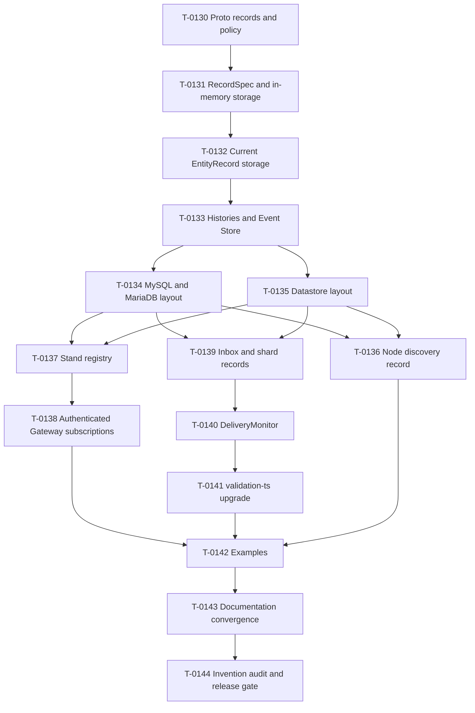

# Wave 8 Storage Correction Plan

Status: Planning review pending

Navigation: [Completion plan](../PROJECT_COMPLETION_PLAN.md) | [Task ledger](../tasks/T-0129-wave8-storage-correction/TASK.md)

## Outcome

Wave 8 replaces the current shared physical storage layout with the
record-oriented model used by Spine JVM, removes unapproved persistent
mechanisms, and makes delivery failure policy configurable through
`DeliveryMonitor`. It finishes only when examples and documentation teach the
new behavior and a repository-wide audit finds no unresolved invention.

## Execution Rules

- T-0130 through T-0144 execute in order unless the dependency graph explicitly
  permits harmless preparation. Only one production writer owns overlapping
  files.
- Every runtime behavior begins with a focused failing test. Generated output
  remains ignored and is regenerated by verification.
- Each task keeps narrow TSDoc and public claims current. T-0142 and T-0143 own
  all-example execution and broad documentation after runtime APIs stabilize.
- Feature-branch commits are pushed to `origin` immediately. No Spine JVM build,
  npm publication, migration-remote push, or old-layout migration is allowed.
- T-0144 runs the one final `verify:release`; earlier slices use focused
  `verify:task` and do not repeatedly pay the repository-wide gate.

## Dependency Graph

## T-0130: Approved Proto Records And Proto Policy

Freezes every Wave 8 serialized record before runtime migration.

- Ownership: `packages/proto/proto/**`, Proto manifests and exports,
  descriptor/contract tests, and deterministic authored-Proto checks.
- RED-first acceptance: descriptors reject the old deployment and Stand
  messages, then prove the exact approved packages, names, typed IDs, field
  order, field names, and type URLs for node discovery, `SubscriptionRecord`,
  and `GatewayAuthenticatedSubscription`. The checker rejects authored
  `optional` fields and incorrect declaration/comment spacing while preserving
  manifest-frozen copied Proto unchanged.
- Removal boundary: no aliases, legacy packages, version fields, primitive IDs,
  revision/generation fields, or extra persisted messages.
- Review: style/maintainability for checker code, documentation, and
  TypeScript/API docs. Reliability is N/A because this slice has no runtime
  persistence consumer.
- Verification: focused `verify:task` for Proto generation, lint, descriptors,
  generated cleanliness, and changed source coverage.

## T-0131: JVM-Style RecordSpec And In-Memory Storage

Replaces storage-key/fingerprint identity with the source type, ID type, record
type, ID extraction, and columns that define a JVM-style record specification.

- Dependencies: T-0130.
- Ownership: `packages/storage/src/{record,storage,memory,query}/**` and mirrored
  tests.
- RED-first acceptance: two Entity source types storing `EntityRecord` remain
  physically distinct; ordinary records default their source to their record
  type; column materialization, context and tenant isolation, queries, compare-
  and-set, and batch behavior remain correct.
- Removal boundary: delete compatibility fingerprints, spec metadata, and
  compatibility-oriented canonical layout machinery. Do not add a replacement
  hash or persisted descriptor.
- Review: style/maintainability, TypeScript/API docs, and
  performance/reliability; documentation receives narrow public-claim review
  if package prose changes.
- Verification: coverage-enabled focused `verify:task`.

## T-0132: Current EntityRecord Storage

Makes each Entity class derive and use its own current-state record
specification.

- Dependencies: T-0131.
- Ownership: Entity record/scanning code in storage and
  `packages/server/src/{entity,repository,context}/**`, plus focused tests.
- RED-first acceptance: `SpecScanner` accepts only the Entity class and derives
  its ID and state schemas, lifecycle/version fields, and `(column)` metadata;
  multiple columns unpack the state once; repositories persist and restore the
  approved `EntityRecord`; provider queries can consume materialized columns.
- Removal boundary: no caller-supplied schemas, metadata registry, compatibility
  hash, JSON-in-`Any`, or alternative current-state record.
- Review: all four concerns because public Entity storage and query semantics
  change.
- Verification: coverage-enabled focused `verify:task` over storage/server
  Entity paths.

## T-0133: Histories And Event Store

Moves state history, event history, and Event Store data to their own approved
record specifications.

- Dependencies: T-0132.
- Ownership: `packages/storage/src/{entity,event,internal,memory}/**`, repository
  commit/history paths, and focused tests.
- RED-first acceptance: enabled histories use separate grouped record storage;
  disabled histories create and write none; Event Store remains an independent
  append-oriented record family; ordering and retention remain correct; tests
  assert only provider-supported atomicity.
- Removal boundary: delete commit receipts, replay receipts/maps/tables,
  receipt-driven replay semantics, and layout fingerprints. Do not add commit
  markers or reconstruct current Entity state from events.
- Review: style/maintainability, TypeScript/API docs, and
  performance/reliability; documentation if public claims change.
- Verification: coverage-enabled focused `verify:task`.

## T-0134: MySQL And MariaDB Record Layout

Replaces shared tables with one table per record source and JVM-compatible
default names.

- Dependencies: T-0133.
- Ownership: `packages/storage-rdbms/**`, package-local documentation, and live
  provider fixtures.
- RED-first acceptance: default table names use the source Proto full name with
  dots replaced by underscores; Entity and non-Entity families are separated;
  `(column)` values use native SQL columns and provider predicates/order; no
  user-column index is auto-created. Startup diagnoses missing/incompatible
  required columns and primary keys, accepts harmless compatible additions,
  never alters existing tables, and supports custom names and create
  operations. Live tests cover MySQL InnoDB/MyISAM and MariaDB InnoDB/Aria.
- Removal boundary: delete shared records/columns tables, spec metadata, schema
  hashes, and false multi-table atomicity claims for nontransactional engines.
- Review: all four concerns.
- Verification: provider-focused `verify:task`; no all-example run.

## T-0135: Datastore Record Layout

Replaces shared kinds with JVM-familiar per-record kinds and customization.

- Dependencies: T-0133.
- Ownership: `packages/storage-datastore/**`, package-local documentation,
  emulator fixtures, and bounded cloud fixtures.
- RED-first acceptance: the default kind is the source Proto full name; each
  Entity and non-Entity family is separate; `(column)` values are native
  properties used for provider-side filter/order; custom record layouts and
  record/entity storage creators are selected by source type.
- Removal boundary: delete shared/canonical kinds, stored compatibility
  metadata, old-layout readers, and fallback scans presented as pushdown.
- Review: all four concerns.
- Verification: emulator-focused `verify:task`, plus bounded live checks when
  credentials are available; unavailable optional cloud credentials are
  recorded honestly and do not replace emulator coverage.

## T-0136: Node Discovery Persistence

Uses the corrected `spine.deployment` record directly.

- Dependencies: T-0130, T-0131, T-0134, and T-0135.
- Ownership: `packages/deployment/**` and directly affected GKE/GCE tests.
- RED-first acceptance: stable node identity uses `spine.server.NodeId`,
  registration fencing uses `NodeRegistrationId`, endpoint and expiry round-
  trip through the Proto, and provider layout customization reaches this
  record family.
- Removal boundary: delete encoding version and primitive node/registration
  IDs. Do not add old-lease migration, Cloud Run, logging, or Gateway scaling.
- Review: documentation, TypeScript/API docs, and performance/reliability;
  style if production structure changes.
- Verification: focused `verify:task`.

## T-0137: Stand Subscription Persistence

Persists one `spine.client.SubscriptionRecord` per subscription.

- Dependencies: T-0130, T-0134, and T-0135.
- Ownership: `packages/server/src/stand/**` and mirrored tests.
- RED-first acceptance: the explicit subscription ID is the storage ID; the
  approved fields round-trip; `SubscriptionStatus`, `status`, and
  `SS_UNSPECIFIED` are used; creation, activation expiry, cancellation, pending
  cleanup, polling, restart, and custom registry behavior remain correct.
- Removal boundary: delete revision, generation, control/staging records,
  JSON-in-`Any`, and arbitrary global capacity coordination. Do not promise
  complete update delivery or multiple-Gateway behavior.
- Review: all four concerns.
- Verification: coverage-enabled focused `verify:task`.

## T-0138: Authenticated Gateway Subscription Persistence

Persists the approved authenticated subscription instead of durable binding
coordination records.

- Dependencies: T-0137.
- Ownership: authenticated-subscription code in `packages/auth/**`, the server
  durable-binding owner, and focused Browser/Gateway tests.
- RED-first acceptance: subscription ID, subscription, and `when_expires`
  round-trip directly; expiry and single-Gateway restart behavior remain
  correct; the Topic retains the resolved Actor/Tenant context; an inspected
  backend contains no other Gateway coordination record.
- Removal boundary: delete quota, cleanup, reservation, fence, admission-token,
  principal-fingerprint identity, receipt, and other unapproved persistence.
- Review: all four concerns.
- Verification: coverage-enabled focused `verify:task`.

## T-0139: Inbox And Shard Records

Persists `InboxMessage` directly and uses shard ownership as the only delivery
exclusion mechanism.

- Dependencies: T-0133 through T-0135.
- Ownership: Inbox, shard-registry, lease, and pickup files under
  `packages/server/src/delivery/**`, plus focused tests.
- RED-first acceptance: pending and delivered `InboxMessage` rows round-trip;
  delivered rows provide deduplication; `ShardSessionRecord` represents shard
  ownership; two workers cannot own one shard; no per-message claim or separate
  dedup record is acquired.
- Removal boundary: delete JSON-in-`Any`, message claims, dedup guards, delivery
  attempts, and quarantine persistence. T-0140 owns monitor policy.
- Review: style/maintainability, TypeScript/API docs, and
  performance/reliability; documentation if public claims change.
- Verification: coverage-enabled focused `verify:task` with concurrency and
  corruption cases.

## T-0140: Controlling DeliveryMonitor

Replaces attempt/exhaustion policy with JVM-style failure actions.

- Dependencies: T-0139.
- Ownership: remaining `packages/server/src/delivery/**`, builder/export
  surfaces, and delivery tests.
- RED-first acceptance: `FailedReception` exposes the message and error plus
  asynchronous mark-delivered/repeat-dispatch actions; default failure marks
  delivered; repeat redispatches; continuation, start/completion, reception-
  failure, pickup-failure, and already-picked hooks are observed. Monitor and
  action exceptions are contained. A durable mark failure leaves the row
  pending, stops later same-target messages, continues independent targets,
  releases the shard, and permits a later run.
- Removal boundary: delete delivery attempts, exhaustion thresholds, retry
  decision machinery, quarantine/dead-letter behavior, and related public
  exports. Do not add timers, backoff, scheduler policy, or failure records.
- Review: all four concerns.
- Verification: coverage-enabled focused `verify:task` with failure and
  concurrency coverage.

## T-0141: validation-ts Upgrade

Moves consumers to the latest compatible validation package without redesigning
validation.

- Dependencies: T-0140 for final consumer stabilization; it may be prepared
  earlier without blocking storage work.
- Ownership: dependency manifests/lockfile, imports, and focused validation
  compatibility tests.
- RED-first acceptance: tests expose the old package/version boundary, then
  prove constraints, packed violations, server validation, and examples use
  the renamed current package without widening framework APIs.
- Dependency evidence at planning time: the npm registry exposes
  `@spine-event-engine/validation-ts` snapshot `.4`, while the upstream `dev`
  branch at `57f30687` declares `@spine-event-engine/validation`
  `2.0.0-snapshot.7`. Implementation must recheck npm and upstream. If `.7` is
  still unpublished, record the external dependency gate, continue every
  independent Wave 8 task, and do not invent vendoring or a Git dependency.
- Review: TypeScript/API docs and performance/reliability; documentation if
  installation prose changes. Style is N/A for manifest-only changes.
- Verification: focused `verify:task` across validation consumers.

## T-0142: Example Migration

Moves every example to the settled storage, delivery, and validation APIs.

- Dependencies: T-0136 through T-0141.
- Ownership: `examples/**` production code and tests.
- RED-first acceptance: static/focused tests reject old layouts and removed
  retry policy; provider configuration uses the new hooks; Message Board and
  Distributed Message Board contain no quarantine or revoked-session facility;
  all example builds and focused behavior/startup tests pass.
- Removal boundary: no replacement quarantine/session record and no unrelated
  example feature.
- Review: documentation and TypeScript/API docs, style/maintainability for code,
  and performance/reliability only where runtime topology claims change.
- Verification: coverage-enabled `verify:task` plus the all-example suite.

## T-0143: Documentation Convergence

Aligns every current public claim with the stabilized Wave 8 runtime.

- Dependencies: T-0142.
- Ownership: all affected package READMEs/REFERENCES, framework and example
  guides, architecture/provider/deployment/delivery docs, diagrams, and current
  governing records.
- Acceptance: deterministic checks first find every stale shared-table/kind,
  fingerprint, receipt, claim, attempt/exhaustion, quarantine, revoked-session,
  old Proto name, validation package, or false atomicity claim. Corrected docs
  teach per-record layouts, customization, structural validation, engine
  limits, `DeliveryMonitor`, and the no-migration cutover in beginner order.
- Review: documentation and TypeScript/API docs; performance/reliability for
  provider, transaction, and delivery claims. Style is N/A for prose-only work.
- Verification: `verify:task -- --no-tests` after deterministic docs checks.

## T-0144: Invention Audit And Wave 8 Closure

Proves that the repository contains only approved persistence and APIs before
Wave 9 begins.

- Dependencies: all earlier Wave 8 tasks.
- Ownership: audit records and deterministic audit scripts. Runtime findings
  return as one batch to the responsible implementation context; this task does
  not design replacements.
- Acceptance: inventory every persisted record and serialization boundary,
  public API, hidden limit, retry/quota/cleanup mechanism, delivery,
  subscription, auth, deployment and provider layout, example, and current
  documentation claim. Classify each as human-approved, a JVM counterpart, an
  approved TypeScript-specific necessity, removed, or requiring a human
  decision. No unresolved invention or decision may cross into Wave 9.
- Review: all four canonical concerns over their affected evidence.
- Verification: deterministic preflight followed by the single
  `verify:release`; merge, focused post-merge proof or a repeated full gate when
  the protocol requires it, and remote-ref verification close Wave 8.
- Exclusions: Wave 9 logging/Cloud Logging/copyright work, Wave 10 multiple
  Gateways, Cloud Run, npm publication, migration tooling, and JVM builds.
