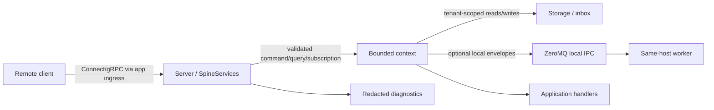
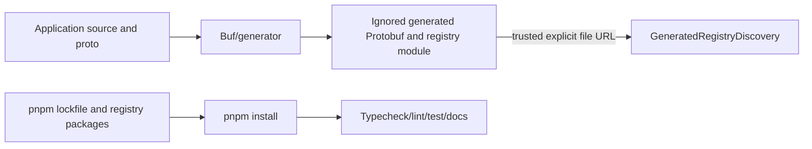

# Spine TS Threat Model

Status: T-0041 working threat model; TM entries remain hypotheses, not confirmed
findings. Wave 5 fixes are implemented; coordinator verification, canonical
review, and dedicated security re-review are pending.

Baseline: `39f2c6f7`. Immutable implementation and review endpoints are recorded
in the T-0041 task, work, and review logs.

Committed canonical wave 5 finding basis: `b43cf705`. The wave 5 implementation
endpoint has no coordinator-owned commit hash yet; its immutable endpoint and
verification evidence remain log-owned in the T-0041 task, work, and review
records until the coordinator commits it. No security acceptance is claimed.

## Scope and assumptions

This STRIDE model covers public packages, generated Protobuf/registry boundaries,
Connect/Node services, storage, delivery, subscriptions, local ZeroMQ IPC,
tests, docs, build scripts, and dependencies. Canonical scope/exclusions remain
in `README.md:15-24`, `build-protocol/TECHNICAL_SPEC.md:260-293`, and
`build-protocol/PROJECT_COMPLETION_PLAN.md:797-836`.

- Consumers own TLS, authentication, authorization, rate limits, secrets,
  production persistence adapters, and deployment. Framework storage, tenant,
  and delivery behavior remains in scope. The framework defaults to `127.0.0.1`
  (`packages/server/src/server/server.ts:18-19,55-57`).
- A remote caller can submit malformed RPC data only if the consumer exposes a
  listener; it cannot alter source, generated modules, lockfile, or IPC paths
  without a separate host/deployment compromise.
- ZeroMQ is same-host IPC. It requires an absolute path; preparation and the
  immediate pre-native recheck enforce canonical final-directory identity and
  POSIX owner/exact-0700 rules (`adapter-config.ts`; `signal-transport.ts`).
- Tenant validation is not authenticated identity-to-tenant authorization.

## System and build flows

## Assets, attackers, and entry points

| Asset                    | Evidence                                                                                  |
| ------------------------ | ----------------------------------------------------------------------------------------- |
| Command/event integrity  | Exact `Any` packing/unpacking: `packages/core/src/index.ts:303-327`.                      |
| Tenant state/delivery    | Tenant records and service paths: `tenant-records.ts:12-71`; `spine-services.ts:198-327`. |
| Availability/lifecycle   | `runtime.ts:47-58`; `server.ts:84-113`.                                                   |
| Registry/build integrity | `generated-registry-discovery.ts:122-171`; `package.json:36-48`.                          |
| IPC and diagnostics      | `signal-transport.ts:592-602`; `signal-intake.ts:58-115`.                                 |

Entry points: listener creation, public service methods, `Any` decoding,
storage replay, generated-registry load/register, ZeroMQ operations, and
`pnpm` installation. Realistic attackers are an exposed caller, an
authenticated-but-unauthorized caller, a same-host user with IPC-path access,
and a supply-chain/source-control attacker.

## Trust boundaries

| ID    | Boundary                                | Evidence/control                                                                                                   |
| ----- | --------------------------------------- | ------------------------------------------------------------------------------------------------------------------ |
| TB-01 | Network client -> Connect/Node listener | Loopback default; broader ingress/TLS/auth/rate policy is consumer-owned (`server.ts:18-19,55-57`).                |
| TB-02 | RPC request -> bounded context          | Route/type/tenant validation (`spine-services.ts:198-268,293-327`).                                                |
| TB-03 | Context -> storage                      | Tenant slices (`tenant-records.ts:12-71`).                                                                         |
| TB-04 | Persisted records -> replay/delivery    | Bounded delivery reads (`delivery-loop.ts:195-205,352-360`).                                                       |
| TB-05 | Framework -> handler                    | Validated envelopes cloned before callbacks (`runtime-transport.ts:187-220`).                                      |
| TB-06 | Framework -> same-host ZeroMQ peer      | Absolute canonical private directory, identity recheck, and timeouts (`adapter-config.ts`; `signal-transport.ts`). |
| TB-07 | Source/proto -> generator               | Buf scripts and ignored-output policy (`package.json:18-35`; `CODE_QUALITY.md:41-47`).                             |
| TB-08 | Generated module -> Node import         | File-only normalized IDs, no query/hash, export/version validation (`generated-registry-discovery.ts:174-258`).    |
| TB-09 | Registry package -> installation        | Lockfile integrity and companion audit/signature evidence.                                                         |
| TB-10 | Diagnostics -> consumer                 | Named scalar allowlist (`signal-intake.ts:58-115`).                                                                |

## Top abuse paths

1. An exposed caller submits forged tenant context or malformed `Any` data,
   attempting cross-tenant access or schema confusion at TB-01 through TB-03.
2. An exposed caller opens payload-heavy HTTP/2 sessions or subscriptions and
   becomes a slow consumer, attempting resource exhaustion at TB-01/TB-02.
3. A corrupt persisted row or failing endpoint repeatedly exercises delivery,
   lease, retry, and retained-attempt work at TB-04.
4. A same-host attacker with IPC-path access injects oversized V8 frames or
   manipulates endpoints at TB-06.
5. A developer/CI compromise substitutes a generated module or dependency at
   TB-07 through TB-09.

## Threat register

Severity is conditional review priority, not a vulnerability determination.

| ID     | STRIDE | Asset / boundary                                                                    | Realistic prerequisite and abuse path                                                                                                                                           | Existing controls / evidence                                                                                                                                                                                                                                                                                                                                                       | Investigation / status                                                                                                                                                                                                                                                                               | Conditional severity                              |
| ------ | ------ | ----------------------------------------------------------------------------------- | ------------------------------------------------------------------------------------------------------------------------------------------------------------------------------- | ---------------------------------------------------------------------------------------------------------------------------------------------------------------------------------------------------------------------------------------------------------------------------------------------------------------------------------------------------------------------------------- | ---------------------------------------------------------------------------------------------------------------------------------------------------------------------------------------------------------------------------------------------------------------------------------------------------- | ------------------------------------------------- |
| TM-001 | S/E    | Tenant identity and authorization; TB-01/TB-02                                      | Consumer exposes RPC without binding an authenticated principal to the request tenant; caller forges tenant context.                                                            | Tenant-mode checks reject absent/unexpected tenants (`spine-services.ts:217-227,261-265,297-302`).                                                                                                                                                                                                                                                                                 | Hypothesis; verify command/query/subscription auth-extension documentation. Deployment owns identity binding.                                                                                                                                                                                        | High if exposed                                   |
| TM-002 | T/I    | Tenant-scoped state, inbox, and updates; TB-02..04                                  | Caller has a valid tenant context or a corrupt persisted record and attempts propagation into another tenant's storage/delivery stream.                                         | Tenant slices and propagation tests (`tenant-records.ts:12-71`; `storage/test/event/event-store.test.ts:36-61`); restored subscription tenant equality (`spine-services.ts:733-760`).                                                                                                                                                                                              | Hypothesis; inspect storage, delivery, query, and subscription propagation end to end.                                                                                                                                                                                                               | High if bypassed                                  |
| TM-003 | T/E    | Signal type integrity and handlers; TB-01/TB-02/TB-05                               | Exposed caller supplies malformed bytes, mismatched schema/type URL, or invalid default-route ID to confuse dispatch.                                                           | Exact `Any` URL/malformed-byte handling (`core/index.ts:318-327`; `core/test/index.test.ts:548-577`) and pre-enqueue envelope validation (`runtime-transport.ts:187-220`).                                                                                                                                                                                                         | Hypothesis; focused malformed-wire, type-URL, validation, and default-route tests are review evidence.                                                                                                                                                                                               | High if handler reached                           |
| TM-004 | D      | Listener, query-result, memory, and CPU availability; TB-01/TB-02                   | Exposed caller sends large messages or many sessions, or an authorized caller runs broad queries against a large tenant.                                                        | SF-007 finite Connect bounds and native regressions (`server.ts`; `spine-services.test.ts`); SF-009 implicit 1,000-row storage cap with tenant-first integration coverage (`spine-services.ts`; `spine-services.test.ts`).                                                                                                                                                         | SF-007/SF-009 implemented; security re-review pending. Deployment still owns connection/rate limits and may choose lower bounds.                                                                                                                                                                     | High before fixes; residual Medium deployment DoS |
| TM-005 | D      | Subscription memory/CPU and update delivery; TB-01/TB-02                            | Caller able to reach Subscribe or Cancel creates valid inactive/active work, many unknown-ID removals, or becomes a slow consumer in one `SpineServices` instance.              | SF-008 default-100 Set reservations cover pending, inactive, active, recovery, and ambiguous initial persistence; unknown removals have a separate equal bound. Exact owner claims and cancel markers fence cross-instance recovery/cancel races; strict inactive decoding leaves malformed rows inert (`spine-services.ts`; `subscription-records.ts`; `spine-services.test.ts`). | Wave 5 fixes implemented; coordinator, canonical, and security re-review pending. Each instance has independent limits. A crashed owner can leave a stale claim because no lease/reclamation contract exists; distributed/per-tenant quotas and rates remain deployment-owned.                       | High before fix; residual Medium at scale         |
| TM-006 | D/T    | Delivery availability and persisted attempt/lease integrity; TB-03/TB-04            | Failing endpoint or corrupt row repeatedly triggers retry, retained attempt, lease, scan, or cleanup work.                                                                      | Read/failure/resume caps (`delivery-loop.ts:195-214,352-360`) and delivery retry/retention tests under `packages/server/test/delivery/`.                                                                                                                                                                                                                                           | Hypothesis; inspect corrupt-row isolation, lease fencing, retained attempts, exhaustion, and retry termination.                                                                                                                                                                                      | Medium; High if unbounded                         |
| TM-007 | S/T/D  | Local IPC integrity, confidentiality, availability; TB-06                           | Same-host attacker controls a configured path component or already has access to the trusted-peer directory and attempts endpoint substitution, spoofing, or oversized V8 work. | SF-010 lexical link policy, canonical creation, exact POSIX owner/mode, prepared dev/inode, and immediate bind/connect rechecks (`signal-transport.ts`; deterministic and native tests in `signal-transport.test.ts`).                                                                                                                                                             | SF-010 implemented pending re-review. Path substitution after the final check remains because pathname ZeroMQ cannot bind relative to a held directory descriptor; use a canonical directory under a non-attacker-writable parent. Oversized trusted-peer frames remain a hypothesis, not a finding. | Medium with local prerequisite                    |
| TM-008 | T/E    | Generated registry and Node execution integrity; TB-07/TB-08                        | Attacker controls generated root, explicit module ref, or generated file and obtains execution during dynamic import.                                                           | File-only canonicalization, no query/hash, export/version checks (`generated-registry-discovery.ts:174-258`).                                                                                                                                                                                                                                                                      | Hypothesis; dynamic import intentionally executes trusted local code; inspect root/symlink/module-ref assumptions.                                                                                                                                                                                   | High with write access                            |
| TM-009 | T/E    | Developer/CI host and released artifacts; TB-09                                     | Registry, lockfile, package account, or install-script supply chain is compromised during install.                                                                              | Frozen lock integrity, zero-advisory audits, 235 verified signatures, and exact Buf/ZeroMQ script evidence in the companion report.                                                                                                                                                                                                                                                | Evidence observation; no current advisory. Re-audit after dependency/lock changes.                                                                                                                                                                                                                   | High impact, Low current likelihood               |
| TM-010 | I/R    | Sensitive payloads, stacks, paths, diagnostics; TB-10                               | Caller induces a failure and can observe protocol errors, logs, background failure hooks, or retained failure objects.                                                          | Named scalar diagnostic allowlist (`signal-intake.ts:58-115`) and handler-secret redaction test (`signal-transport.test.ts:584-593`).                                                                                                                                                                                                                                              | Hypothesis; inspect Connect errors, stacks, transport failures, delivery failures, and example child output.                                                                                                                                                                                         | Medium if sensitive data exposed                  |
| TM-011 | D      | Listener, session, subscription, worker, storage lifecycle; TB-01/TB-03/TB-04/TB-06 | Stalled client, failed startup/close, slow subscription, worker fault, or storage cleanup failure leaves resources live.                                                        | Retryable ordered server cleanup (`server.ts:84-113`), runtime drain contract (`runtime.ts:179-216`), and lifecycle tests under `packages/server/test/server/`.                                                                                                                                                                                                                    | Hypothesis; inspect success/failure/race cleanup across listeners, sessions, subscriptions, workers, sockets, and storage.                                                                                                                                                                           | Medium; High if repeatable remotely               |
| TM-012 | D      | Build/runtime CPU; TB-02/TB-07                                                      | Developer-controlled pathological source or caller-controlled complex filter causes disproportionate regex/analyzer work.                                                       | Public filter count/depth/path limits (`spine-services.ts:1206-1460`); analyzer inputs are developer-controlled source.                                                                                                                                                                                                                                                            | Hypothesis; inspect analyzer regexes and adversarial source/filter tests for superlinear behavior.                                                                                                                                                                                                   | Low remotely; Medium in CI                        |

## Severity and deployment residuals

High means integrity/confidentiality compromise is plausible if prerequisite
fails. Medium means bounded/local impact or developer/same-host prerequisite.
Low means direct control plus non-default prerequisite. Severity changes most if
a consumer broad-binds, fails to bind identity to tenant, or permits untrusted
IPC/generated-output writes.

Deployment owns TLS, authn/authz, rate limits, host/process isolation,
production persistence adapters/deployment, retry monitoring, and log
aggregation. Framework storage, tenant, delivery, type validation, structural
limits, IPC privacy, lifecycle cleanup, and diagnostic redaction remain in
scope.

## Exact focus paths/tests

- `packages/core/src/index.ts`; `packages/core/test/index.test.ts`.
- `packages/server/src/services/spine-services.ts` and service tests.
- `packages/storage/src/{memory/tenant-records.ts,event/event-store.ts}` and
  `packages/storage/test/event/event-store.test.ts`.
- `packages/server/src/{runtime,delivery,handler,server,context}` and tests.
- `packages/transport/src/zeromq` and `packages/transport/test/zeromq`.
- `package.json`, manifests, `pnpm-lock.yaml`, build scripts, companion report.
