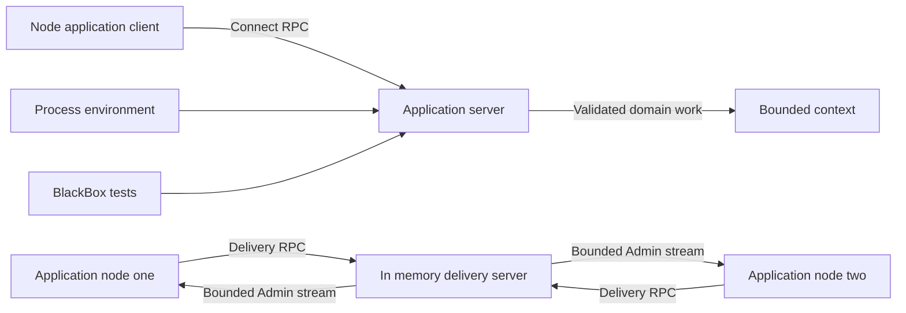
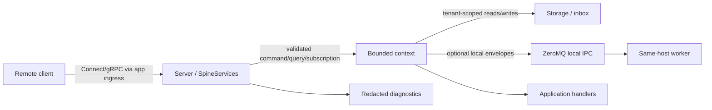
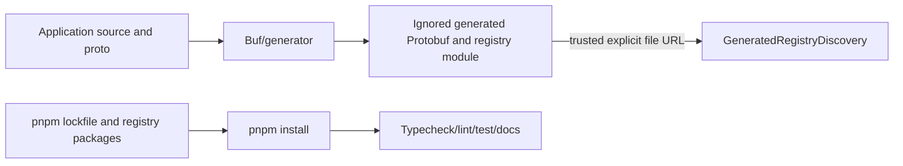

# Spine TS Threat Model

Status: T-0041 final threat model, integrated, post-merge verified, and remotely
synchronized. SF-013 is the human-accepted Medium same-UID local IPC availability
residual under D-0093. D-0094 remains accepted; D-0096 is coordinator-verified
and canonically clean. Final focused security review and full verification pass.

T-0212 removed the legacy transport implementation. Its threat-model
reconciliation is pending T-0213 security review; this document is not
redesigned by the deletion task.

Baseline: `39f2c6f7`. Immutable implementation and review endpoints are recorded
in the T-0041 task, work, and review logs.

Wave 1 extension status: draft for T-0067 final security review. The T-0041
model and accepted SF-013 residual remain unchanged; the extension below adds
only the public client, singleton environment, BlackBox, and remote in-memory
delivery topology introduced after that gate.

Committed canonical wave 5 finding basis: `b43cf705`. Earlier production
implementation evidence is `c7f8a901`; the later test-only maintainability
correction is `fdd9da0a`. D-0091 implementation evidence is `da730e04`. Later
provenance/review/status commits are not implementation evidence. The preceding
canonical review and Canonical Wave 23 are clean; SF-012 is clean and D-0093
records the human's explicit SF-013 residual-risk acceptance. The focused final
security review is clean and the full native task gate passes.

## Scope and assumptions

This STRIDE model covers public packages, generated Protobuf/registry boundaries,
Connect/Node services, storage, delivery, subscriptions, local ZeroMQ IPC,
tests, docs, build scripts, and dependencies. Canonical scope/exclusions remain
in `README.md:15-24`, `build-protocol/TECHNICAL_SPEC.md:260-293`, and
`build-protocol/PROJECT_COMPLETION_PLAN.md:797-836`.

- Consumers own TLS, authentication, authorization, rate limits, secrets,
  production persistence adapters, and deployment. Framework storage, tenant,
  and delivery behavior remains in scope. The framework defaults to `127.0.0.1`
  (`packages/server/src/server/server.ts:18-19,55-57`).
- A remote caller can submit malformed RPC data only if the consumer exposes a
  listener; it cannot alter source, generated modules, lockfile, or IPC paths
  without a separate host/deployment compromise.
- ZeroMQ is same-host IPC. It requires an absolute path; preparation and the
  immediate pre-native recheck enforce canonical final-directory identity and
  POSIX owner/exact-0700 rules (`adapter-config.ts`; `signal-transport.ts`).
- Tenant validation is not authenticated identity-to-tenant authorization.

## Wave 1 extension

### Validated context and scope

The human-approved Wave 1 context already resolves the service-context questions
that would otherwise block threat ranking:

- Node.js is the only supported runtime.
- The application server defaults to loopback. The standalone delivery server
  also defaults to `127.0.0.1`, and a non-loopback bind is an explicit
  unauthenticated, cleartext, trusted-network deployment. Public-Internet
  exposure is unsupported.
- Application payload sensitivity and identity-to-tenant authorization remain
  consumer/deployment concerns. Framework tenant propagation and storage
  isolation remain in scope.
- The delivery server is in-memory only and intentionally loses state on
  restart. Redis, Hazelcast, durable delivery-server persistence, packaging,
  live TS/JVM execution, and human administration are outside Wave 1.
- `BlackBox` is test-only and runner-neutral; it is not a production isolation
  or authorization boundary.

These assumptions are binding human decisions in
`build-protocol/tasks/T-0052-jvm-feature-parity-wave-1/TASK.md` and
`build-protocol/planning/WAVE_1_JVM_PARITY_PLAN.md`. If a deployment exposes
either listener outside its trusted boundary, the likelihood of TM-001,
TM-004, and TM-013 through TM-016 rises materially.

### Added system model

### Added assets and boundaries

| ID    | Boundary / asset                             | Existing controls and evidence                                                                                                                                                                                                                          |
| ----- | -------------------------------------------- | ------------------------------------------------------------------------------------------------------------------------------------------------------------------------------------------------------------------------------------------------------- |
| TB-11 | Node client -> application server            | Public facade owns/cancels bounded command observation and subscriptions; network message limits remain at `packages/server/src/server/server.ts` and client bounds at `packages/client-node/src/client`.                                               |
| TB-12 | Application node -> delivery Inbox/Shard RPC | Loopback default, finite inbound limit, FIFO mutation admission capped at 100, canonical Command/Event record validation, and finite retained-message/byte/tracked-shard budgets in `packages/delivery-server/src/server` and `src/core`.               |
| TB-13 | Delivery Admin stream -> supervisor          | ACK-before-update protocol, server queue cap 100, client buffer 1..1,000, bounded reconnects/deadlines, cancellation, and sanitised protocol failures in `packages/delivery-server/src/admin` and client.                                               |
| TB-14 | Remote delivery payload -> local worker      | Command/Event-only decoding, 1 MiB payload and 4 MiB RPC limits, batch/page caps, detached values, authoritative pending-row reread, and direct removal without local quarantine/receipt state in `packages/delivery-client/src/wire` and `src/remote`. |
| TB-15 | Process environment -> singleton facilities  | Resolve-once environment type/configuration, canonical package-root imports, terminal close, and test-only reset under `packages/server/src/server`.                                                                                                    |
| TB-16 | Test caller -> `BlackBox` local runtime      | Fixed actor/tenant/zone scopes, bounded eventual waits, owned client/subscription/server cleanup, and no runner dependency under `packages/testing/src/black-box`.                                                                                      |

Availability-critical assets are delivery shard ownership, Inbox integrity,
bounded observer/scheduler capacity, and deterministic shutdown. Integrity-
critical assets are worker/session identity, tenant-scoped application state,
and delivered Inbox rows used as deduplication facts. Confidentiality of application
payloads depends on the trusted network because Wave 1 adds no TLS or
authentication.

### Added attacker model

Realistic attackers are a caller who can reach a consumer-exposed application
listener, a peer already present on the delivery trusted network, a tenant-aware
caller not independently authorised for its claimed tenant, and a malicious or
corrupt delivery peer returning malformed wire values. They cannot modify
source, generated descriptors, lockfiles, local process memory, or test-only
configuration without a separate host/build compromise.

### Added abuse paths and hypotheses

| ID     | Threat source / abuse path                                                                                                                                 | Existing controls                                                                                                                                                                                                                                                                                                                                                                                           | Gap / residual and priority                                                                                                                                              |
| ------ | ---------------------------------------------------------------------------------------------------------------------------------------------------------- | ----------------------------------------------------------------------------------------------------------------------------------------------------------------------------------------------------------------------------------------------------------------------------------------------------------------------------------------------------------------------------------------------------------- | ------------------------------------------------------------------------------------------------------------------------------------------------------------------------ |
| TM-013 | A trusted-network peer forges a worker and releases another worker's shard, disrupting ownership and enabling duplicate work.                              | Worker and shard shapes are validated; pickup is serialized and exclusive.                                                                                                                                                                                                                                                                                                                                  | Frozen `ReleaseShard` is worker-agnostic in `shard-service.ts`. High if exposed; Medium residual inside the explicitly trusted topology. Final reviewer must adjudicate. |
| TM-014 | A reachable peer floods mutations, large messages, or slow Admin subscriptions to exhaust memory/CPU or block useful delivery.                             | 4 MiB inbound/full-record/response cap with explicit over-page rejection, 100 pending mutations and 1..100 batch records, 100 queued server updates, finite retained-message (10,000), serialized-byte (32 MiB), and tracked-shard (1,000) budgets, released-shard pruning, bounded Admin/expiration responses, 128-byte worker/node IDs enforced by client and server, cancellation, and ordered shutdown. | Deployment still owns connection/rate limits. Medium under trusted-network scope; High if exposed publicly.                                                              |
| TM-015 | A malicious/corrupt delivery peer returns mismatched shards, workers, payload kinds, timestamps, counts, or oversized responses to confuse local dispatch. | Server admission and client decoding both require complete client-decodable Command/Event records, valid enums/timestamps, 1 MiB payloads, and byte/count bounds; observations are detached and failures stable.                                                                                                                                                                                            | Residual availability loss from a hostile peer; Medium only if the trusted server is compromised.                                                                        |
| TM-016 | A timeout loses a non-idempotent mutation response; an application retries blindly and duplicates writes/removals or releases a newer owner's shard.       | Mutations are single-attempt; `DeliveryOutcomeUnknownError` provides read/observation reconciliation; remote removal rereads the authoritative pending row and calls `removeOne` directly.                                                                                                                                                                                                                  | Operators must reconcile unknown outcomes and keep downstream effects idempotent. Medium integrity risk from consumer misuse remains.                                    |
| TM-017 | Duplicate module graphs or late environment mutation create inconsistent singleton facilities, storage, node identity, or cleanup ownership.               | Canonical package roots, resolve-once configuration, stable instance identity, explicit close, and test-only reset are covered in server package tests.                                                                                                                                                                                                                                                     | Developer/build misconfiguration rather than a remote attack; Low production security priority, Medium correctness priority.                                             |
| TM-018 | A consumer treats `BlackBox` actor/tenant selection or its ephemeral listener as a production authentication/isolation control.                            | Package placement, runner-neutral test API, owned ephemeral lifecycle, and documentation identify test scope.                                                                                                                                                                                                                                                                                               | Documentation misuse risk only; Low if guide/package claims remain explicit.                                                                                             |

### Wave 1 dependency evidence

The T-0067 production audit reports zero known vulnerabilities. The initial full
audit found patched development-only advisories under ESLint/TypeDoc; T-0067b
owns a minimal transitive lockfile refresh. Final acceptance requires both the
production and full audits to report zero known vulnerabilities after that
correction is integrated.

### Wave 1 focus paths

| Path                                                      | Reason                                                        | Related threats |
| --------------------------------------------------------- | ------------------------------------------------------------- | --------------- |
| `packages/delivery-server/src/core/shard-service.ts`      | Worker-agnostic release and stale takeover semantics.         | TM-013, TM-016  |
| `packages/delivery-server/src/core/mutation-admission.ts` | Mutation serialization, abort point, and capacity bound.      | TM-014          |
| `packages/delivery-server/src/admin/admin-service.ts`     | Machine-facing bounded stream and cancellation cleanup.       | TM-014          |
| `packages/delivery-server/src/server/delivery-server.ts`  | Listener limits, cleartext bind, and ordered shutdown.        | TM-014          |
| `packages/delivery-client/src/client/client.ts`           | Deadlines, retries, unknown mutation outcomes, and ownership. | TM-015, TM-016  |
| `packages/delivery-client/src/wire/codec.ts`              | Malformed wire, payload, byte, page, and batch validation.    | TM-015          |
| `packages/delivery-client/src/remote/adapters.ts`         | Quarantine and reconciliation before endpoint/removal.        | TM-016          |
| `packages/server/src/delivery/delivery-supervisor.ts`     | Bounded scheduling, recovery, fencing, and shutdown.          | TM-014, TM-016  |
| `packages/server/src/server/server-environment.ts`        | Singleton configuration and facility lifecycle.               | TM-017          |
| `packages/testing/src/black-box/black-box.ts`             | Test-only actor/tenant scopes and owned resource cleanup.     | TM-018          |

This extension is a hypothesis register, not a clean-security conclusion. The
existing final security reviewer must confirm or reject each residual after
T-0067 documentation and T-0067b dependency correction converge.

## System and build flows

## Assets, attackers, and entry points

| Asset                    | Evidence                                                                                                                                               |
| ------------------------ | ------------------------------------------------------------------------------------------------------------------------------------------------------ |
| Command/event integrity  | Exact `Any` packing/unpacking: `packages/core/src/index.ts:303-327`.                                                                                   |
| Tenant state/delivery    | Provider tenant catalogs: `packages/server/src/context/tenant-index.ts`; tenant-aware service paths: `packages/server/src/services/spine-services.ts`. |
| Availability/lifecycle   | `runtime.ts:47-58`; `server.ts:84-113`.                                                                                                                |
| Registry/build integrity | `generated-registry-discovery.ts:122-171`; `package.json:36-48`.                                                                                       |
| IPC and diagnostics      | `signal-transport.ts:723-897`; `signal-intake.ts:58-115`.                                                                                              |

Entry points: listener creation, public service methods, `Any` decoding,
storage replay, generated-registry load/register, ZeroMQ operations, and
`pnpm` installation. Realistic attackers are an exposed caller, an
authenticated-but-unauthorized caller, a same-host user with IPC-path access,
and a supply-chain/source-control attacker.

## Trust boundaries

| ID    | Boundary                                | Evidence/control                                                                                                                                                                                                                                                                                                                                                                                                 |
| ----- | --------------------------------------- | ---------------------------------------------------------------------------------------------------------------------------------------------------------------------------------------------------------------------------------------------------------------------------------------------------------------------------------------------------------------------------------------------------------------- |
| TB-01 | Network client -> Connect/Node listener | Loopback default; broader ingress/TLS/auth/rate policy is consumer-owned (`server.ts:18-19,55-57`).                                                                                                                                                                                                                                                                                                              |
| TB-02 | RPC request -> bounded context          | Route/type/tenant validation (`spine-services.ts:198-268,293-327`).                                                                                                                                                                                                                                                                                                                                              |
| TB-03 | Context -> storage                      | Tenant slices (`tenant-records.ts:12-71`).                                                                                                                                                                                                                                                                                                                                                                       |
| TB-04 | Persisted records -> replay/delivery    | Bounded delivery reads (`delivery-loop.ts:195-205,352-360`).                                                                                                                                                                                                                                                                                                                                                     |
| TB-05 | Framework -> handler                    | Validated envelopes cloned before callbacks (`runtime-transport.ts:187-220`).                                                                                                                                                                                                                                                                                                                                    |
| TB-06 | Framework -> same-host ZeroMQ peer      | Canonical preparation/recheck (`signal-transport.ts:723-897`); setup and publish gates plus close/drain (`signal-transport.ts:110-163,180-233,249-290,307-364,401-455,524-546`); lifecycle/composition/boundary regressions (`signal-transport.test.ts:72-256,328-410,522-590,770-781,1602-1785`); fresh unrestricted/native 49/49 evidence is in the current Wave 22 correction entry in `work-logs/T-0041.md`. |
| TB-07 | Source/proto -> generator               | Buf scripts and ignored-output policy (`package.json:18-35`; `CODE_QUALITY.md:41-47`).                                                                                                                                                                                                                                                                                                                           |
| TB-08 | Generated module -> Node import         | File-only normalized IDs, no query/hash, export/version validation (`generated-registry-discovery.ts:174-258`).                                                                                                                                                                                                                                                                                                  |
| TB-09 | Registry package -> installation        | Lockfile integrity and companion audit/signature evidence.                                                                                                                                                                                                                                                                                                                                                       |
| TB-10 | Diagnostics -> consumer                 | Named scalar allowlist (`signal-intake.ts:58-115`).                                                                                                                                                                                                                                                                                                                                                              |

## Top abuse paths

1. An exposed caller submits forged tenant context or malformed `Any` data,
   attempting cross-tenant access or schema confusion at TB-01 through TB-03.
2. An exposed caller opens payload-heavy HTTP/2 sessions or subscriptions and
   becomes a slow consumer, attempting resource exhaustion at TB-01/TB-02.
3. A corrupt persisted row or failing endpoint repeatedly exercises bounded
   delivery drains, lease fencing, acknowledgement, and cleanup at TB-04.
4. A same-host attacker with IPC-path access injects oversized V8 frames or
   manipulates endpoints at TB-06.
5. A developer/CI compromise substitutes a generated module or dependency at
   TB-07 through TB-09.

## Threat register

The table preserves evidence and dispositions at the wave where each threat was
adjudicated. Pending-review wording in individual rows is historical and is
superseded by the final status above: canonical review, focused final security
review, and full task verification are clean; SF-013 remains accepted.

Severity is conditional review priority, not a vulnerability determination.

| ID     | STRIDE | Asset / boundary                                                                    | Realistic prerequisite and abuse path                                                                                                                                                                | Existing controls / evidence                                                                                                                                                                                                                                                                                                                                                                                                                                                                                                                                                                                | Investigation / status                                                                                                                                                                                                                                                                        | Conditional severity                              |
| ------ | ------ | ----------------------------------------------------------------------------------- | ---------------------------------------------------------------------------------------------------------------------------------------------------------------------------------------------------- | ----------------------------------------------------------------------------------------------------------------------------------------------------------------------------------------------------------------------------------------------------------------------------------------------------------------------------------------------------------------------------------------------------------------------------------------------------------------------------------------------------------------------------------------------------------------------------------------------------------- | --------------------------------------------------------------------------------------------------------------------------------------------------------------------------------------------------------------------------------------------------------------------------------------------- | ------------------------------------------------- |
| TM-001 | S/E    | Tenant identity and authorization; TB-01/TB-02                                      | Consumer exposes RPC without binding an authenticated principal to the request tenant; caller forges tenant context.                                                                                 | Tenant-mode checks reject absent/unexpected tenants (`spine-services.ts:217-227,261-265,297-302`).                                                                                                                                                                                                                                                                                                                                                                                                                                                                                                          | Hypothesis; verify command/query/subscription auth-extension documentation. Deployment owns identity binding.                                                                                                                                                                                 | High if exposed                                   |
| TM-002 | T/I    | Tenant-scoped state, inbox, and updates; TB-02..04                                  | Caller has a valid tenant context or a corrupt persisted record and attempts propagation into another tenant's storage/delivery stream.                                                              | Complete generated tenant boundaries (`packages/storage/src/internal/tenancy.ts`), provider-native catalogs/namespaces/databases, Event Store isolation tests, and restored subscription tenant equality.                                                                                                                                                                                                                                                                                                                                                                                                   | Hypothesis; inspect storage, delivery, query, and subscription propagation end to end.                                                                                                                                                                                                        | High if bypassed                                  |
| TM-003 | T/E    | Signal type integrity and handlers; TB-01/TB-02/TB-05                               | Exposed caller supplies malformed bytes, mismatched schema/type URL, or invalid default-route ID to confuse dispatch.                                                                                | Exact `Any` URL/malformed-byte handling (`core/index.ts:318-327`; `core/test/index.test.ts:548-577`) and pre-enqueue envelope validation (`runtime-transport.ts:187-220`).                                                                                                                                                                                                                                                                                                                                                                                                                                  | Hypothesis; focused malformed-wire, type-URL, validation, and default-route tests are review evidence.                                                                                                                                                                                        | High if handler reached                           |
| TM-004 | D      | Listener, query-result, memory, and CPU availability; TB-01/TB-02                   | Exposed caller sends large messages or many sessions, or an authorized caller runs broad queries against a large tenant.                                                                             | SF-007 bounds are at `server.ts:18-21,48-58,202-212,420-436,610-624,795-800`, with validation/native regressions at `server.test.ts:60-69` and `spine-services.test.ts:309-404`. SF-009 query cap is at `spine-services.ts:1340-1437,1482`, with missing/zero-format, tenant-first, and maximum regressions at `spine-services.test.ts:856-921,1070-1108`. Native evidence is at `work-logs/T-0041.md:122-131,163-217`.                                                                                                                                                                                     | Canonical review clean; prior security disposition retained. Deployment still owns connection/rate limits and may choose lower bounds.                                                                                                                                                        | High before fixes; residual Medium deployment DoS |
| TM-005 | D      | Subscription memory/CPU and update delivery; TB-01/TB-02                            | Caller able to reach Subscribe or Cancel creates valid inactive/active work, many unknown-ID removals, or becomes a slow consumer in one `SpineServices` instance.                                   | SF-008 default-100 reservations and unknown-removal admission are at `spine-services.ts:124-146,511-535,960-980,1468-1510`, with representative capacity and failure regressions at `spine-services.test.ts:2429-2595,2648-2675`. Exact owner claims, cancel markers, CAS fencing, and strict persisted decoding remain implemented. D-0090 remains exactly at `spine-services.ts:1468-1501` and `spine-services.test.ts:2429-2495`; focused and coordinator native evidence is at `work-logs/T-0041.md:122-131,201-232`.                                                                                   | Canonical review clean; prior security disposition retained. Each instance has independent limits. A crashed owner can leave a stale claim because no lease/reclamation contract exists; distributed/per-tenant quotas and rates remain deployment-owned.                                     | High before fix; residual Medium at scale         |
| TM-006 | D/T    | Persisted replay/delivery availability and lease integrity; TB-03/TB-04             | Failing endpoint or corrupt row repeatedly triggers finite delivery, lease, scan, acknowledgement, or cleanup work.                                                                                  | Bounded Inbox reads, complete-worker lease fencing, contained `DeliveryMonitor` actions, finite `DeliverySupervisor` controls, and durable-record size guards. There is no persisted attempt, quarantine, receipt, or marker state.                                                                                                                                                                                                                                                                                                                                                                         | Current correction verification covers direct rows, stale fencing, acknowledgement recovery, failure containment, and bounded supervision.                                                                                                                                                    | Medium; High if unbounded                         |
| TM-007 | S/T/D  | Local IPC integrity, confidentiality, availability; TB-06                           | Same-host attacker controls a configured path component or already has access to the trusted-peer directory and attempts endpoint substitution, spoofing, or oversized serialization/multipart work. | SF-010 canonical preparation and identity controls are at `signal-transport.ts:723-897`; private 8,388,608-byte native per-frame receive caps cover Subscriber, Request, and Reply. Raw-peer +1-byte and valid-continuation regressions passed; full native file 53/53 passed. D-0093 requires Buf binary encoding for Proto signals and protocol-prefix consumption.                                                                                                                                                                                                                                       | SF-013 remains technically present because multipart receive materializes all individually bounded frames before JavaScript ignores trailers. The human accepts this Medium same-UID local availability residual for the initial release; final re-review follows the D-0093 wire correction. | Medium with local prerequisite                    |
| TM-008 | T/E    | Generated registry and Node execution integrity; TB-07/TB-08                        | Attacker controls generated root, explicit module ref, or generated file and obtains execution during dynamic import.                                                                                | File-only canonicalization, no query/hash, export/version checks (`generated-registry-discovery.ts:174-258`).                                                                                                                                                                                                                                                                                                                                                                                                                                                                                               | Hypothesis; dynamic import intentionally executes trusted local code; inspect root/symlink/module-ref assumptions.                                                                                                                                                                            | High with write access                            |
| TM-009 | T/E    | Developer/CI host and released artifacts; TB-09                                     | Registry, lockfile, package account, or install-script supply chain is compromised during install.                                                                                                   | Frozen lock integrity, zero-advisory audits, 235 verified signatures, and exact Buf/ZeroMQ script evidence in the companion report.                                                                                                                                                                                                                                                                                                                                                                                                                                                                         | Evidence observation; no current advisory. Re-audit after dependency/lock changes.                                                                                                                                                                                                            | High impact, Low current likelihood               |
| TM-010 | I/R    | Sensitive payloads, stacks, paths, diagnostics; TB-10                               | Caller induces a failure and can observe protocol errors, logs, background failure hooks, or retained failure objects.                                                                               | Named scalar diagnostic allowlist (`signal-intake.ts:58-115`) and handler-secret redaction test (`signal-transport.test.ts:1089-1120`).                                                                                                                                                                                                                                                                                                                                                                                                                                                                     | Hypothesis; inspect Connect errors, stacks, transport failures, delivery failures, and example child output.                                                                                                                                                                                  | Medium if sensitive data exposed                  |
| TM-011 | D      | Listener, session, subscription, worker, storage lifecycle; TB-01/TB-03/TB-04/TB-06 | Stalled client, failed startup/close, slow subscription, worker fault, or storage cleanup failure leaves resources live.                                                                             | Retryable server/runtime cleanup remains at `server.ts:84-113` and `runtime.ts:179-216`. ZeroMQ setup gates are at `signal-transport.ts:180-233,249-290,307-364,401-455`; publish gate/track/send and publisher-close-before-drain are at `signal-transport.ts:110-163,524-546`. Wave 21 publish/close and request cleanup regressions are at `signal-transport.test.ts:72-256,328-410`; composition and boundary regressions remain at `signal-transport.test.ts:522-590,770-781,1602-1785`. Fresh unrestricted/native 49/49 evidence is in the current Wave 22 correction entry in `work-logs/T-0041.md`. | Canonical review clean. Request recheck coverage characterizes the already-present gate; SF-011 and SF-012 do not alter this lifecycle disposition.                                                                                                                                           | Medium; High if repeatable remotely               |
| TM-012 | D      | Build/runtime CPU; TB-02/TB-07                                                      | Developer-controlled pathological source or caller-controlled complex filter causes disproportionate regex/analyzer work.                                                                            | Public filter count/depth/path limits (`spine-services.ts:1206-1460`); analyzer inputs are developer-controlled source.                                                                                                                                                                                                                                                                                                                                                                                                                                                                                     | Hypothesis; inspect analyzer regexes and adversarial source/filter tests for superlinear behavior.                                                                                                                                                                                            | Low remotely; Medium in CI                        |

## Severity and deployment residuals

High means integrity/confidentiality compromise is plausible if prerequisite
fails. Medium means bounded/local impact or developer/same-host prerequisite.
Low means direct control plus non-default prerequisite. Severity changes most if
a consumer broad-binds, fails to bind identity to tenant, or permits untrusted
IPC/generated-output writes.

Deployment owns TLS, authn/authz, rate limits, host/process isolation,
production persistence adapters/deployment, retry monitoring, and log
aggregation. Framework storage, tenant, delivery, type validation, structural
limits, IPC privacy, lifecycle cleanup, and diagnostic redaction remain in
scope.

## Exact focus paths/tests

- `packages/core/src/index.ts`; `packages/core/test/index.test.ts`.
- `packages/server/src/services/spine-services.ts` and service tests.
- `packages/storage/src/{memory/tenant-records.ts,event/event-store.ts}` and
  `packages/storage/test/event/event-store.test.ts`.
- `packages/server/src/{runtime,delivery,handler,server,context}` and tests.
- `packages/transport/src/zeromq` and `packages/transport/test/zeromq`.
- `package.json`, manifests, `pnpm-lock.yaml`, build scripts, companion report.

## D-0091 Coordinator Correction Evidence

SF-011 raw publish and request peers now use the exact topic routing key and an
8,388,609-byte envelope frame, excluding route mismatch as an alternate reason
for handler non-reachability. Reply-to-Request retains its 8,388,609-byte reply,
and all three paths retain later valid continuation. Fresh final-state evidence
is focused transport security 5/5, complete native transport 53/53, and complete
affected server 149/149. Four-lane canonical review and focused security
re-review are now clean.

## D-0093 Wire Correction Progress

The private ZeroMQ command/event path now uses generated Buf Protobuf binary;
reserved non-Proto kinds and the private request-result wrapper remain V8.
Focused native-IPC tests cover exact Buf bytes, raw decode, malformed traffic
continuation, generated Proto reply rejection, and prefix-only trailer use.
This does not reduce SF-013: multipart trailers are ignored only after native
materialization, so aggregate multipart allocation remains explicitly accepted
and unbounded for an authorized same-UID peer.

## D-0094 Type And Reply Boundary Progress

The public transport type contract now binds command/event topics to generated
`Command`/`Event` envelopes while preserving caller-selected envelopes for
reserved non-Proto kinds. The private reply boundary now uses Buf
`isMessage()` without a schema, so generated-message-shaped results, including
objects carrying a string `$typeName`, are rejected before the V8 result
wrapper. Plain non-generated private results remain supported; the wrapper is
not a Spine `Ack`. Responder-continuation coverage proves a generated-result
failure does not poison a later plain-result request on the same registration.

The wire boundary remains route frame 1 plus Buf payload frame 2 for inbound
command/event traffic and private result frame 1 for requester replies. The
8,388,608-byte ceiling is per inbound frame, not a fixed allocation bound;
trailers are ignored only after native multipart allocation. SF-013 therefore
remains accepted and unbounded in aggregate. RED exposed the missing correlated
public contract/export and stale private-object command/event fixtures; GREEN
passed the required 87 native transport/runtime/cross-process regressions, 63
additionally affected server regressions, both typechecks, focused ESLint, and
the intentional 18/6 export boundary.

## D-0096 Predicate Boundary Progress

Separate public predicates fix the operation and topic paths without inspecting
envelopes or validating untrusted input. The operation helper observes
`operation.topic.signalKind` and narrows the correlated operation union. The
topic helper observes only top-level `topic.signalKind`, narrows only that
member, and leaves the unobserved routing descriptor widened. This correction
changes no trust boundary, wire codec, frame handling, allocation behavior, or
SF-013 disposition. Affected canonical re-review and focused final security
review are clean.
