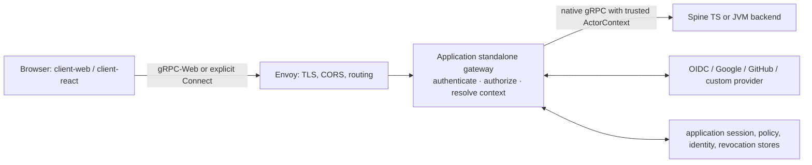
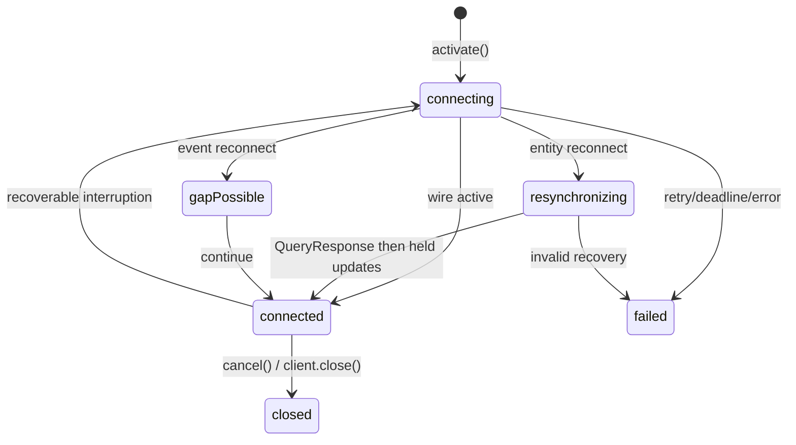
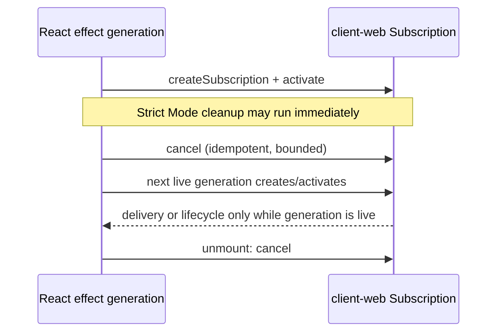

# Browser client, authentication, and gateway extension guide

This guide follows one browser action through an application gateway to a
Spine backend. Start here after the package READMEs when you need to compose
sign-in, Commands, Queries, and subscriptions without exposing a native
backend. For declarations, use the [API index](api/README.md).

The framework packages are available as experimental npm snapshots. Install
`@spine-event-engine/client-web@2.0.0-snapshot.3` (or the explicit
`@spine-event-engine/client-web@snapshot` tag); do not use an unqualified
npm install.

## Responsibilities

| Part                                    | Responsibility                                                                                                     | Outside its scope                                                     |
| --------------------------------------- | ------------------------------------------------------------------------------------------------------------------ | --------------------------------------------------------------------- |
| `@spine-event-engine/client-web`        | Browser-safe `Client`, explicit gRPC-Web/Connect selection, bounded reconnect and session helper                   | Identity-provider protocol, authorization, durable cache              |
| `@spine-event-engine/client-node`       | Native Node transport and Node-only entity query/codegen helpers                                                   | Browser transport or React                                            |
| `@spine-event-engine/client-react`      | Effect-scoped React observations of an application `ClientRequest`                                                 | RPC construction, SSR, Suspense, cache, service worker, state manager |
| `@spine-event-engine/auth`              | Gateway contracts, sessions, OIDC flow, authorization/context rewrite, subscription access checks                  | An HTTP listener, application policy, identity provisioning           |
| Application gateway / HTTP adapter      | Listener lifecycle, credential extraction, cookies, callback/exchange endpoints, composition of auth collaborators | A direct browser-to-backend route by accident                         |
| Envoy template                          | TLS, CORS, limits, public method routing, gRPC-Web and explicit binary Connect pass-through                        | Authentication or authorization                                       |
| Spine TS or JVM backend                 | Domain services receiving a trusted rewritten `ActorContext`                                                       | Authentication routines                                               |
| Provider adapter and application stores | Provider verification/JWKS, user provisioning, durable/shared sessions, keys, revocation                           | Browser-visible provider tokens                                       |



The arrows are trust boundaries. Envoy and the gateway are customizable
guidance, not framework-enforced deployment policy. A backend route exposed
around the gateway is **not** protected by gateway authentication; its operator
accepts that risk.

## Browser client: explicit protocol and lifecycle

Use gRPC-Web as the universal browser path. Use Connect only when the endpoint
is separately configured for it. `Client.forConnect()` sends binary
`application/proto`; it never probes a server and never falls back to gRPC-Web.

<!-- docs-snippet-path: examples/message-board/web/src/index.tsx -->

```ts
import { Client, BrowserSession } from "@spine-event-engine/client-web";

const session = BrowserSession.cookie({ maxRequestMs: 10_000 });
const client = Client.forGrpcWeb("https://api.example.test", {
  credentials: session.credentials,
  onRequestMetadata: () => session.requestMetadata(),
  onReauthenticateBeforeReconnect: (signal) =>
    session.reauthenticate(resolveInformationalContext, { signal }),
});
const request = client.asGuest();

declare function resolveInformationalContext(request: {
  signal: AbortSignal;
}): Promise<{ actor?: string; tenant?: string; expiresAt?: Date } | undefined>;
void request;
```

`BrowserSession.cookie()` uses Fetch `credentials: "include"`; cookie values
never enter JavaScript metadata. `BrowserSession.bearer({ token })` keeps a
bearer in memory only and uses `credentials: "omit"`. The optional
`onRequestMetadata` runs synchronously for every outbound call. It must return
fresh metadata only; it must not pretend that informational actor/tenant facts
are credentials.

| Setting                       |                      Default | Failure or invariant                                                                                          |
| ----------------------------- | ---------------------------: | ------------------------------------------------------------------------------------------------------------- |
| `BrowserSession.maxRequestMs` |                    10,000 ms | Positive safe integer, at most 60,000 ms; expiry aborts Fetch/refresh work started by the session.            |
| Update queue                  | 64 updates / 1,048,576 bytes | Overflow is terminal; updates are never silently dropped.                                                     |
| Lifecycle queue               |                   32 notices | Overflow is terminal.                                                                                         |
| Reconnect                     |        5 retries / 30,000 ms | Retry starts after the initial attempt; default delay is 250 ms exponential, ±20% jitter, capped at 5,000 ms. |
| Remote Cancel                 |   1,000 ms per accepted wire | `cancel()` is idempotent and terminal. A reconnect can create more than one accepted wire to clean.           |

The framework operations are `post`, `send`, `createSubscription`, `activate`,
and `cancel`. Commands are never automatically retried. `updates` and
`lifecycle` are separate single-consumer streams with no cross-stream ordering
guarantee.



### Subscription truth and recovery

Subscriptions are hints, never authoritative or complete. Duplicate, missing,
and differently ordered updates are possible. A healthy-looking transport does
not prove every update arrived. Entity resynchronization restores current
authoritative state, **not** intermediate history. Event gaps can occur and are
not replayed. Fixed gateway fan-in is best effort and does not provide
cluster-complete propagation.

For an entity subscription, provide an `authoritativeQuery`; client-web
evaluates it only during reconnect, verifies a byte-equivalent Topic target,
replaces only request context, delivers the `QueryResponse` before held wire
updates, and emits `resynchronizing`. An event subscription emits
`gapPossible` then continues. Application code must re-query after reconnect
or an observed gap when its UI needs authoritative state.

<!-- docs-snippet-path: examples/message-board/web/src/index.tsx -->

```ts
import type { ClientRequest } from "@spine-event-engine/client-web";

declare const request: ClientRequest;
declare const topic: Parameters<ClientRequest["createSubscription"]>[0];
declare const authoritativeQuery: Extract<
  Parameters<ClientRequest["createSubscription"]>[1],
  { kind: "entity" }
>["authoritativeQuery"];

const subscription = await request.createSubscription(topic, {
  kind: "entity",
  authoritativeQuery,
});
await subscription.activate();
for await (const delivery of subscription.updates) {
  if (delivery.kind === "resynchronization") void delivery.response;
}
await subscription.cancel();
```

## React boundary

`client-react` is an optional peer-dependency adapter. The `use...` names are
React observations, not renamed Spine operations. Create the client/request
outside render, provide it with `SpineClientProvider`, and use
`useEntityQuery`, `useEntitySubscription`, `useEventSubscription`,
`useSubscriptionDelivery`, and `useSubscriptionLifecycle` after commit.



React support excludes SSR, Suspense, normalized caching, service workers, and
external state managers. A late result or update from a retired generation is
ignored. Cancellation is cooperative: a factory that ignores its signal can
keep the underlying work alive.

## Gateway contracts and request facts

One standalone Gateway dynamically discovers application nodes on GKE or GCE.
GKE supplies ready nodes through headless-Service DNS; GCE supplies them through
leased discovery backed by application storage. Commands and queries are
sent to one current backend with bounded round-robin selection and no automatic
retry. Subscription creation and activation reconcile across every discovered
node; merged notices are best-effort and can duplicate, gap, or be lost. Query
responses remain authoritative after a reconnect or Gateway replacement. The
expected 32 nodes is measured/recommended capacity, not a hard runtime maximum;
the Gateway continues to use all discovered nodes with bounded connection
starts. Infrastructure platforms scale identical application versions, while
Spine TS only follows the resulting membership. The supported shape has one
Gateway; Cloud Run and multiple-Gateway operation are outside this guide's scope.

The gateway authenticates and authorizes every incoming request independently,
then resolves and injects a trusted context. Browser-visible actor/tenant is
informational, not a credential. An application may request hints, but it may
not establish actor, tenant, timestamp, zone, or language by presenting them.

<!-- docs-snippet-path: packages/auth/src/index.ts -->

```ts
import type {
  AuthenticatedPrincipal,
  AuthorizationPolicy,
  AuthorizedRequestContext,
  Clock,
  ContextResolver,
  IncomingRequest,
} from "@spine-event-engine/auth";

declare const userId: AuthorizedRequestContext["actor"];

const policy: AuthorizationPolicy = {
  async authorize(principal: AuthenticatedPrincipal, request: IncomingRequest): Promise<boolean> {
    return principal.id.length > 0 && request.kind !== "cancel";
  },
};
const contexts: ContextResolver = {
  async resolve(principal, request, clock): Promise<AuthorizedRequestContext> {
    void request;
    return { actor: userId, timestamp: clock.now() };
  },
  async resolveContext(principal, clock): Promise<AuthorizedRequestContext> {
    return { actor: userId, timestamp: clock.now() };
  },
};
void [policy, contexts];
```

`IncomingRequest` is the exhaustive union: `command`, `query`, `subscribe`,
`activate`, and `cancel`. Policies receive decoded target/message facts and
only allowlisted transport facts (`service`, `method`, optional origin,
request/correlation IDs, peer address, and user agent). Credentials never
enter those facts or ordinary diagnostics. `TransportFacts.from()` drops
unlisted headers. `IncomingRequests.decode()` decodes gateway input for policy;
a `TypeRegistryLookup` can decode a command payload; unknown
or malformed `Any` remains a safe type-URL-only fact.

| Gateway operation | Required gate                                     | Context rule                                                 | Forwarding rule                                                       |
| ----------------- | ------------------------------------------------- | ------------------------------------------------------------ | --------------------------------------------------------------------- |
| `resolve-context` | Valid session; no authorization-policy invocation | `resolveContext()` returns informational actor/tenant/expiry | No backend forward                                                    |
| `command`         | Authorize every Post                              | Replace matching actor/tenant hint with resolver output      | Forward once, without credential                                      |
| `query`           | Authorize every Read                              | Replace matching actor/tenant hint                           | Forward once, without credential                                      |
| `subscribe`       | Authorize every Subscribe                         | Reject stale hint before binding                             | Return the public Subscription                                        |
| `activate`        | Authorize every Activate                          | Re-resolve request context                                   | Require stored owner; session mode also requires an unexpired session |
| `cancel`          | Authorize every Cancel                            | Re-resolve request context                                   | Require stored owner; retryable cleanup is private                    |

`UnaryGateway` covers `ResolveContext`, Post, and Read. `SubscriptionGateway`
covers Subscribe, Activate, and Cancel. `createNativeGatewayServices()` adapts
them to Connect service implementations. The gateway retains only the public
Subscription definition and its trusted Topic context; applications and
browsers receive no private backend subscription state. `SubscriptionUpdateRelay`
copies public updates, keeps FIFO order, and has finite message/byte limits.

`ResolveContext` is a gateway operation, but it is not an `IncomingRequest`:
it validates the session and returns informational context without invoking the
per-request authorization policy or forwarding to the backend.
ResolveContext valid-session validation is not policy authorization.

### Exact extension signatures

The following are exact public declaration shapes. They are the minimum seams
an application implements; do not place credentials in `IncomingRequest`,
forward credentials to native services, expose backend-only subscription state, or let a
client-provided context become trusted. See the generated
[auth declarations](api/README.md) for the complete exported inventory.

<!-- docs-snippet-path: packages/auth/src/index.ts -->

```ts
import type {
  ApplicationSessionIssuer,
  AuthenticatedPrincipal,
  Authenticator,
  AuthorizationPolicy,
  AuthorizedRequestContext,
  ContextResolver,
  ExternalIdentity,
  IdentityMapping,
  IncomingRequest,
  OidcVerifiedIdentityProvider,
  RequestCredential,
  ResolvedApplicationIdentity,
  ResolvedSession,
  SessionResolver,
  SignedTokenRevocation,
  NativeGatewayRequestContext,
  TransportRequestContext,
  UnaryForwarder,
  SubscriptionBindings,
} from "@spine-event-engine/auth";
import { IncomingRequests, TransportFacts } from "@spine-event-engine/auth";

type Authentication = Authenticator["authenticate"];
type SessionResolution = SessionResolver["resolve"];
type Authorization = AuthorizationPolicy["authorize"];
type ContextResolution = ContextResolver["resolve"];
type InformationalContextResolution = ContextResolver["resolveContext"];
type IdentityResolution = IdentityMapping["resolve"];
type ProviderExchange = OidcVerifiedIdentityProvider["exchangeAuthorizationCode"];
type SessionIssue = ApplicationSessionIssuer["issue"];
type RevocationLookup = SignedTokenRevocation["isRevoked"];
type RequestDecoding = typeof IncomingRequests.decode;
type RequestFacts = typeof TransportFacts.from;
type NativeCredential = NativeGatewayRequestContext["credential"];
type NativeTransport = NativeGatewayRequestContext["transport"];
type NativeForward = UnaryForwarder["forward"];
type BindingCreation = SubscriptionBindings["create"];

declare const credential: RequestCredential;
declare const principal: AuthenticatedPrincipal;
declare const request: IncomingRequest;
declare const context: AuthorizedRequestContext;
declare const session: ResolvedSession;
declare const identity: ExternalIdentity;
declare const resolvedIdentity: ResolvedApplicationIdentity;
declare const transport: TransportRequestContext;
void [
  credential,
  principal,
  request,
  context,
  session,
  identity,
  resolvedIdentity,
  transport,
] as unknown as readonly [
  Authentication,
  SessionResolution,
  Authorization,
  ContextResolution,
  InformationalContextResolution,
  IdentityResolution,
  ProviderExchange,
  SessionIssue,
  RevocationLookup,
  RequestDecoding,
  RequestFacts,
  NativeCredential,
  NativeTransport,
  NativeForward,
  BindingCreation,
];
```

`TransportFacts.from(input)` is the public constructor for the allowlisted
`TransportRequestContext`; it intentionally excludes credentials and unknown
headers. `IncomingRequests.decode(input)` decodes incoming gateway requests.
`NativeGatewayRequestContext.credential()` and `.transport()` are the HTTP-adapter
extraction points. `SubscriptionBindings` is trusted infrastructure: it retains
the public Subscription derived from the resolved Topic and provides a fresh
copy only to gateway-controlled callbacks.

## Sessions and cookies

| Choice                                                    | Use when                                      | Benefit                                                  | Mandatory caveat                                                                                                                       |
| --------------------------------------------------------- | --------------------------------------------- | -------------------------------------------------------- | -------------------------------------------------------------------------------------------------------------------------------------- |
| Opaque cookie (`OpaqueSessions` + `OpaqueSessionCookies`) | Browser-first application                     | Server can revoke immediately                            | The reference store is process-local; choose storage and restart handling suitable for the one supported Gateway.                      |
| Signed bearer (`SignedSessions`)                          | A bearer client needs local verification      | No session lookup on normal validation                   | Signed sessions trade local validation for delayed revocation. Revocation exists only with an explicit shared `SignedTokenRevocation`. |
| Cookie transport                                          | Browser can use an application session cookie | `HttpOnly`, host-only, `Secure`, `SameSite=Lax` defaults | Require exact Origin plus `X-Spine-CSRF`; install serialized cookies in your HTTP adapter.                                             |
| Bearer transport                                          | Non-cookie/browser-memory client              | Explicit Authorization header                            | Never persist the token with `BrowserSession`; do not put it in URLs or logs.                                                          |

`OpaqueSessionCookies` accepts a present Authorization header before cookies;
malformed or duplicate bearer values do not fall back. Cookie extraction
requires exactly one session cookie, one CSRF cookie, exact configured Origin,
and an HMAC-SHA-256 CSRF value in `X-Spine-CSRF`. Cookie/session rotation,
logout, expiry, cache, and persistence are application lifecycle concerns. The
supported deployment has one Gateway, so select session storage and revocation
behavior for that gateway's availability and restart policy. Open subscriptions
are not instantaneously revoked: authorization
is checked on each lifecycle request and again on reconnect/expiry.

## Verified finite gateway and Envoy limits

| Boundary                                             |                     Implemented default | Failure/operation behavior                                                                      |
| ---------------------------------------------------- | --------------------------------------: | ----------------------------------------------------------------------------------------------- |
| Unary gateway `maxRequestBytes`                      | Application-required constructor option | Oversize input rejects before session resolution.                                               |
| Subscription request bytes                           |                         1,048,576 bytes | Rejects before retained binding/callback work.                                                  |
| Subscription relay                                   |           64 messages / 1,048,576 bytes | FIFO relay terminates with `ResourceExhausted`; it does not silently discard.                   |
| Pending work per binding                             |                                       1 | One active operation plus one queued operation is permitted; a third rejects as `binding-busy`. |
| Subscription operation / shutdown                    |                    30,000 ms / 1,000 ms | Abort-aware callbacks; cleanup failures remain observable/retryable where appropriate.          |
| Envoy connection-manager request/stream idle timeout |                             30 s / 30 s | Finite public request/header handling.                                                          |
| Envoy maximum request headers                        |                                  16 KiB | Oversize headers are rejected by Envoy.                                                         |
| Envoy routes                                         |                 30 s each; Activate 0 s | Activate is the only no-route-timeout live stream.                                              |
| Envoy upstream connection                            |                                     2 s | Gateway upstream uses HTTP/2 `LOGICAL_DNS`.                                                     |

## Third-party sign-in: generic OIDC, Google, GitHub, and custom providers

`OidcFlow` is in-memory, finite coordination for an application gateway. It is
not an HTTP server and does not provision users or grant permissions.

```mermaid
sequenceDiagram
  participant B as Browser
  participant G as application gateway
  participant P as provider
  B->>G: POST start with S256 PKCE challenge + chosen redirect
  G->>P: redirect with state, nonce, provider PKCE challenge
  P->>G: callback(code,state) once
  G->>P: one code exchange; verify issuer/audience/nonce/signature
  G->>G: identity mapping + application session issuance
  G-->>B: no-store handoff (HttpOnly one-time cookie or response body)
  B->>G: POST exchange(grant, verifier)
  G-->>B: application cookie or memory bearer; no provider token
```

Use `createOidcProvider()` for explicit verified OIDC endpoints or
`discoverOidcProvider()` for exact issuer discovery. The adapter performs discovery,
JWKS cache, signature/claim validation, and code exchange. `createGoogleProvider()`
uses Google OIDC; use stable `sub` as identity, not email. `createGitHubProvider()`
uses OAuth plus authenticated `/user`; use stable numeric `id`, not login/email.
For a custom provider, implement `OidcVerifiedIdentityProvider` and return only
bounded external identity claims. Provider access, refresh, and ID tokens are
sensitive server-side material: never return, store in browser-visible claims,
or log them.

The browser creates an RFC 7636 verifier and sends only its S256 challenge to
start. `OidcFlow` creates state, nonce, and provider verifier; callback state
is consumed before success/error handling, and both callback/exchange are
one-time. Require exact HTTPS callback and allowed post-login URLs, POST for
the application grant exchange, and `Cache-Control: no-store` for callback and
exchange responses. The application handles refresh and re-login: an expired session
must lead to a fresh application/provider flow without reusing a grant.

Identity mapping handles provisioning, tenant selection, disabled
users, and principal attributes. Keep provider identity separate from local
actor and optional tenant:

```text
// Pseudocode: application code, not a framework implementation.
identityMapping.resolve = async ({ issuer, subject }) => {
  const account = await accounts.findOrProvision({ issuer, subject });
  return { externalIdentity: { issuer, subject }, principal: { id: account.actorId } };
};
contextResolver.resolve = async (principal, request, clock) => ({
  actor: { value: principal.id },
  tenant: await tenants.allowedFor(principal.id, request),
  timestamp: clock.now(),
});
```

## Gateway listener, Envoy, and testing

The application provides the listener that composes `UnaryGateway`,
`SubscriptionGateway`, `createNativeGatewayServices()`, a credential extractor,
transport-fact extractor, session resolver, policy, context resolver, native
backend transport, and application registry. The [Envoy reference](../interop/envoy/README.md)
routes only `ResolveContext`, Post, Read, Subscribe, Activate, and Cancel;
it requires an exact HTTPS CORS origin, TLS material, finite headers/request
limits, gRPC-Web, and explicit binary Connect support. Its Activate route is a
live stream. Copy and customize the template for hosts, certificates,
observability, rate limits, and topology.

The standalone Gateway discovers its application nodes dynamically: GKE uses
service DNS and GCE uses the leased registry reader. The measured capacity
profile exercises 32 and 40 discovered nodes with at most two concurrent
connection starts; it is not a cloud throughput benchmark. Unary calls are
round-robin without retry; subscriptions are best effort and can duplicate.
Generic loss notices mean a possible gap and require an authoritative re-query.
The legacy single-backend form remains supported for local fixtures; durable
fan-in fencing rejects incompatible membership changes before attachment.

Use this test matrix before changing an extension:

| Concern            | Exercise                                                                                                                     |
| ------------------ | ---------------------------------------------------------------------------------------------------------------------------- |
| Policy/context     | Verify every `IncomingRequest` kind, stale/fabricated actor and tenant, target/message rules, and sanitized transport facts. |
| Sessions           | Expiry, rotation, logout/revocation, duplicate headers/cookies, CSRF/origin failure, and Gateway restart behavior.           |
| Provider callbacks | PKCE/state/nonce, one-time callback/exchange, redirect allowlist, provider/JWKS failure, token redaction.                    |
| Browser client     | Chromium, Firefox, WebKit; reconnect/entity re-query, event `gapPossible`, cancellation and Strict Mode cleanup.             |
| Gateway/Envoy      | Browser → TLS Envoy → standalone gateway → real backend; unauthorized rooms, forged context, relay/queue cleanup.            |
| Message Board      | Query and subscribe Projection-backed `BoardMessageView`; never treat board messages as domain events.                       |

### Safe diagnostics

Log a request ID, service/method, gateway decision category, and bounded
non-secret policy facts. Redact credentials, Authorization/Cookie/CSRF headers,
provider code/state/grant/verifier, provider tokens, private backend envelopes,
and raw command/query payloads unless an application has a separate reviewed
data policy. `BrowserSession.fetch()` only redacts its captured bearer from a
wrapped Fetch error; it cannot sanitize arbitrary callback or application
errors.

## Compatibility boundary

The TypeScript runtime checks exercise the real browser-to-gateway topology.
JVM evidence is limited to static source and descriptor compatibility; this
repository does not establish complete transitive or runtime JVM
interoperability. No Spine JVM project is built or executed here; the frozen
fixture records six unresolved transitive wire imports, so this is not a JVM
runtime compatibility claim.
