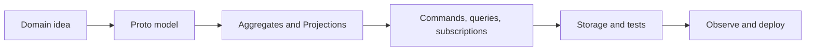
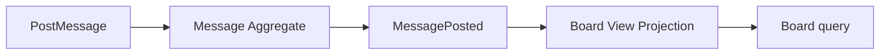
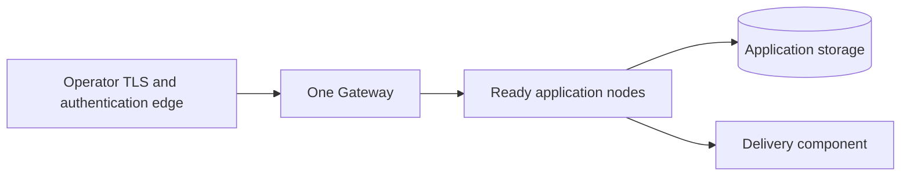

# Spine TS User Guide

This guide takes a small idea—a message board where people post messages—and
turns it into a tested, observable Spine TS application. It explains the next
useful step, then links to the detailed contract when you need more precision.



## 1. Begin with the domain

Before writing TypeScript, describe what happens in the business. An
EventStorming session is a practical way to do this: put domain events in time
order, name the commands that cause them, and identify the people or systems
that send those commands.

For Message Board, a first pass can be small:

| Domain question                   | Initial answer                       |
| --------------------------------- | ------------------------------------ |
| What changes?                     | A board receives a message.          |
| What command asks for it?         | `PostMessage`.                       |
| What fact happened?               | `MessagePosted`.                     |
| What must be remembered?          | A posted message and a board view.   |
| What can fail as a business rule? | The same message ID is posted twice. |

Group related language and behavior into a **Bounded Context**: a boundary where
one model has one meaning. The Message Board context can accept messages and
maintain a readable board without becoming the place to model authentication,
deployment, or another product's rules.

Use an Aggregate for a consistency boundary, a Projection for a query-side view,
and a Process Manager when a long-running reaction coordinates work across
entities. Start with the smallest boundary that makes the command and event
names unambiguous.

Continue with the [architecture notes](architecture/README.md) for the runtime
and Bounded Context boundary.

## 2. Create a project

Create a Node.js TypeScript application with separate model and application
code. The repository examples use this shape:

```text
message-board/
├── model/       # Proto source and generated schemas
├── app/         # bounded context and handlers
└── web/         # optional React browser client
```

Build generated Proto and TypeScript before starting an application:

```sh
pnpm install --frozen-lockfile
pnpm typecheck:build
```

The build generates Protobuf-ES schemas and the handler registry used by
bare-decorated application classes. Generated directories are build output; do
not hand-edit or commit them.

Your application assembles a `BoundedContext`, selects storage, and starts a
`Server`. For a process managed by Spine TS, use `run()`; an embedded
application uses `start()` and closes the server itself.

```ts
// docs-snippet-path: packages/server/test/context/bounded-context.test.ts
import { BoundedContext } from "@spine-event-engine/server";

const context = await BoundedContext.singleTenant("MessageBoard").buildAsync();
await context.close();
```

Continue with the [server introduction](../packages/server/README.md) for
application assembly and lifecycle.

## 3. Describe the model in Proto

Proto is the shared language between your server and clients. Define identifiers,
commands, events, and entity state there. A command says what a caller wants;
an event records a fact that happened; entity state is the current readable
form of an Aggregate, Projection, or Process Manager.

Keep each Bounded Context's domain language in its own model package. The server
application composes the top-level Proto modules for all assembled contexts
into one deterministic application `TypeRegistry`; a client application
depends on and composes the published context model modules it needs. This is
explicit build/application composition, not runtime package scanning or mutable
global schema registration.

Keep the identifier as the first field of a command and the entity state. That
is the implicit default target ID for Spine TS: it needs no extra routing
annotation. A missing or invalid default command ID is rejected before a
handler runs.

```proto
message PostMessage {
  MessageId id = 1;
  string board = 2;
  string text = 3;
}

message MessagePosted {
  MessageId id = 1;
  string board = 2;
  string text = 3;
}
```

Declare a domain rejection in a `rejections.proto` file when a valid command
breaks a business rule. For example, `MessageAlreadyPosted` communicates a
duplicate message ID. This differs from invalid input: validation failures are
non-OK command responses, while a handled domain rejection rolls back the
state change and is published independently on a best-effort event path.

Mark only fields that must be queried or sorted with `(column)`. The complete
Proto record remains authoritative bytes; a field does not become a physical
provider column simply because it appears in a message.

Continue with the [Proto model reference](../packages/proto/REFERENCE.md) for
the complete generated-contract and source-provenance rules.

## 4. Implement behavior

Put behavior in entity classes. An Aggregate accepts a command and returns a
generated event. A Projection subscribes to that event and builds queryable
state. Handlers use bare `@Assign`, `@Command`, `@React`, and `@Subscribe`
decorators; generated registry tooling discovers their schemas and signatures.



Use an exact route when the first field is not the correct target. `CommandRouting`,
`EventRouting`, and `StateUpdateRouting` accept both `.route(Schema, via)` and
`.route(Token, via)`. Selection is exact schema, then the first registered
matching token, then the replacement/default route. Route functions run once at
accepted admission and stored typed targets are replayed on retry. The
legacy-named local `catchUpReadSide()` helper resets and replays the entire
process-local read side; it is not Projection catch-up.

Proto `ts_type` options describe those TypeScript interfaces and tokens.
TypeScript ignores Java-only option fields and does not create semantic tags or
topics from them. See the [To-Do interface-routing walkthrough](../examples/todo/USER_GUIDE.md)
for generated versus authored interfaces and compiler boundaries.

Use one `@Where({ eventField, equals })` equality filter after type routing on
an event- or rejection-consuming `@Subscribe`, `@React`, or `@Command` handler.
Both values are typed string literals; invalid or repeated declarations fail
closed. A filter narrows an already routed event—it is not another routing
system.

Do not manually start or commit transactions in application handlers. Return
generated domain messages, let the framework wrap them, and throw the generated
rejection when the domain rule fails. The framework rolls back the rejected
transition before the typed rejection event is scheduled.

Continue with the [server reference](../packages/server/REFERENCE.md) for
handlers, routing, filters, logging, and rejection contracts.

## 5. Send Commands and read state

Commands change the model. Queries read current Projection state. Subscriptions
deliver later state or event updates. Treat a command acknowledgement as the
immediate result of acceptance, not proof that an asynchronous Projection is
already visible.

Message Board's React UI posts `PostMessage`, queries the board for its initial
rows, then listens for complete Projection payloads. A valid complete payload
updates the browser locally. A healthy browser stream remains active across
ordinary successive updates. The UI uses an authoritative query for initial
state, a reconnect, a possible best-effort gap, malformed data, or recovery
after posting while disconnected; those recovery paths do not make ordinary
stream termination acceptable.

For a browser, put native services behind one authenticated Gateway. The
Gateway resolves credentials into trusted context and forwards approved browser
traffic; private backends do not receive browser credentials directly. Browser
clients choose gRPC-Web or an explicitly configured Connect endpoint—there is
no probing or fallback.

Make client effects idempotent. A reconnect or an uncertain response can repeat
work, and subscription delivery is best effort rather than an ordered replay
log. Keep a query path that can restore authoritative state.

Continue with the [Node client reference](../packages/client-node/REFERENCE.md)
for the complete command, query, and subscription contract.

## 6. Persist application data

Begin locally with in-memory storage. It is fast and useful for tests, but its
state disappears when the process stops. Move to MySQL or Google Cloud
Datastore when the application needs durable provider storage.

Storage uses typed mappings. A generated message ID or message column uses a
reversible `Stringifier`; primitive values use a provider-native form. Use the
same mapping for stored values, query operands, and continuation values. Supply
a `TypeRegistry` when compact Proto JSON must expand `Any` values.

| Concern           | What to choose deliberately                                                                |
| ----------------- | ------------------------------------------------------------------------------------------ |
| Querying          | Mark query/sort fields with `(column)` and use declared columns.                           |
| MySQL tenancy     | Select a configured database per tenant.                                                   |
| Datastore tenancy | Select a native namespace per tenant.                                                      |
| Physical layout   | Configure provider record families; a Bounded Context name is diagnostic, not a partition. |
| Migration         | Plan it with the provider; Spine TS does not migrate layouts automatically.                |

Normalized provider plans are capability-gated execution contracts. MySQL
pushes every admitted filter, order, and finite bound into parameterized SQL in
the selected tenant database and resolved storage-group table; it does not read
a storage group for Node filtering. The default accepted query budget is
10,000 records; an explicit query budget must be a positive safe integer no
greater than 10,000. MySQL may fetch one additional overflow-lookahead row
(10,001 raw rows) to reject an oversized result. Datastore accepts at most
1,000 records and may read one additional lookahead row (1,001 raw rows).
Normalized plans do not support offset (`RecordQuery.offset` remains a separate
API). Datastore supports only its provider-legal overlap; see the storage
provider references before selecting indexes or query shapes.

Queries can push supported filters, sort order, IDs, limits, and continuations
to the provider. Keep a bounded query and use the provider's documented
continuation behavior rather than treating a query as an unbounded scan.

Continue with the [storage reference](../packages/storage/REFERENCE.md) for
storage, query, mapping, and tenancy contracts.

## 7. Test the application

Test domain behavior first, then the application path around it. Message Board
tests can prove that a message becomes board state; To-Do is a compact example
of command, rejection, and Projection tests. Add provider integration tests
only when the selected provider behavior is part of the feature.

`BlackBox` starts a bounded context through the same local server and client
boundary that an application uses. It is useful for posting commands, reading a
Projection, and waiting for genuinely asynchronous visibility.

```ts
// docs-snippet-path: packages/testing/src/black-box/black-box.ts
import { BlackBox } from "@spine-event-engine/testing";
import { BoundedContext } from "@spine-event-engine/server";

const box = await BlackBox.from(BoundedContext.singleTenant("MessageBoard"));
try {
  const guest = box.asGuest();
  void guest;
} finally {
  await box.close();
}
```

Test an immediate command result directly. Use bounded polling only for a
Projection or other result that becomes visible later. Browser, cross-process
delivery, authentication infrastructure, and durable-provider behavior need
their own focused tests.

Continue with the [testing reference](../packages/testing/REFERENCE.md) for
the complete BlackBox contract and limits.

## 7a. Connect bounded contexts with external events

An integration broker is created privately for every bounded context. Declare
an external receptor with the type-only `External<T>` marker on its first
parameter; the generated registry then filters imported events to that
handler:

```ts
// docs-snippet-path: examples/message-board/app/src/index.ts
import { Subscribe, type External } from "@spine-event-engine/server";
import type { MessagePosted } from "@spine-event-engine/example-message-board-model/generated/spine/examples/messageboard/events_pb.js";

class ImportedBoard {
  @Subscribe
  onMessage(event: External<MessagePosted>): void {
    void event;
  }
}
```

The exporting context publishes only requested event types. Domestic events go
to domestic handlers and imported events go to external handlers; this
origin/tenant filtering prevents loops. External commands are not supported.
Received unknown or malformed broker frames are logged safely, dropped, and
the broker continues. The transport is best effort: it has no broker retry,
replay, deduplication, or durable queue, so consumers should re-query or make
effects idempotent when appropriate.

For one process, the default `InMemoryTransportFactory` is sufficient. For two
Node processes on one host, call `createZeroMqTransportFactory()` with
`ZeroMqConfig.create({ ipcDirectory })` in both applications; this is local IPC,
not a multi-machine transport. In production, configure `ServerEnvironment`
with storage, signal transport, message `transportFactory`, and the complete
application `typeRegistry`.

To import an event from a third-party producer, use `ThirdPartyContext`. The
single-tenant form forbids an actor tenant, the multitenant form requires one,
and the actor timestamp is preserved. This assumes `ServerEnvironment` was
configured first with the complete application `typeRegistry` that contains
`MessagePosted`:

```ts
// docs-snippet-path: examples/message-board/app/src/index.ts
import { ThirdPartyContext } from "@spine-event-engine/server";
import type { ActorContext } from "@spine-event-engine/proto";
import type { MessagePosted } from "@spine-event-engine/example-message-board-model/generated/spine/examples/messageboard/events_pb.js";

declare const messagePosted: MessagePosted;
declare const actorContext: ActorContext;

const imported = await ThirdPartyContext.multitenant("Partner");
await imported.emittedEvent(messagePosted, actorContext);
await imported.close();
```

Unknown local generated message schemas fail clearly; a valid event with no interested
external receptor is simply not delivered. See the [server reference](../packages/server/REFERENCE.md)
and [transport reference](../packages/transport/REFERENCE.md) for exact
contracts.

## 8. Run and observe it

Start a local Message Board server and UI in separate terminals after the
workspace build:

```sh
pnpm --dir examples/message-board/app start
pnpm --dir examples/message-board/web start
```

Use the framework's configured LogLayer logger for operational context. Log
records help diagnose lifecycle, warnings, and failures; they are not a durable
record of a domain fact. Put business facts in events or storage, and keep
secrets and credential values out of application logs.

Durable delivery stores pending and delivered Inbox rows. A shard lease prevents
concurrent delivery, but a handler effect and the delivered transition are not
one transaction. A lost acknowledgement can redeliver after restart, so make
downstream effects idempotent. The framework does not add attempt history,
quarantine records, scheduled retry policy, or exactly-once side effects.

Continue with the [server reference](../packages/server/REFERENCE.md) for
framework and server contracts.

## 9. Package and deploy it

A combined deployment can keep application and Gateway concerns close together.
A distributed deployment runs identical application nodes, a single Gateway,
application-selected storage, and the appropriate delivery component. Start
with the local Distributed Message Board topology before taking on cloud
operations.



The supported GKE and GCE templates use one standalone Gateway. GKE discovers
ready application Pods through headless-Service DNS; GCE uses a durable leased
node registry.

The simple Delivery server is in-memory, single-replica, and not highly
available. Choose an operationally suitable delivery design before depending
on it for a critical workload. Shut down orderly: stop new listener work, let
the application release its resources, and use the template's rollout or
replacement steps rather than terminating a process without its lifecycle
close path.

Continue with the [deployment reference](../packages/deployment/REFERENCE.md)
for the common packaging and discovery contract.

## 10. Continue from examples

Use the examples to choose the next narrow learning step:

| Example                                                                      | Best next question                                                       |
| ---------------------------------------------------------------------------- | ------------------------------------------------------------------------ |
| [Message Board](../examples/message-board/README.md)                         | How do a browser, Aggregate, and Projection work together?               |
| [Distributed Message Board](../examples/distributed-message-board/README.md) | How do two equal nodes, delivery, and one Gateway run locally?           |
| [To-Do](../examples/todo/README.md)                                          | What is the smallest server-side command/query application?              |
| [Orders](../examples/orders/README.md)                                       | How do provider-oriented records and durable storage fit an application? |
| [Projects](../examples/projects/README.md)                                   | How do queries and data-oriented views shape a larger model?             |

Keep the loop small: model one command and event, implement one visible
behavior, test it, observe it, and only then add another boundary. The detailed
references remain the source for limits and operational contracts; the examples
show how those contracts feel in a running application.

Continue with the [Message Board example](../examples/message-board/README.md)
for the primary runnable flow.
