# Architecture Notes

These notes are for framework maintainers and coding agents. Application
developers should start with the [end-user guide](../USER_GUIDE.md).

## Generated interfaces and admission routing

The Proto compiler turns `ts_type` declarations into structural TypeScript
interfaces and nominal runtime tokens. Generated `every_is` interfaces live under a
model's `generated/interfaces/`; `is.ts_type` resolves an authored interface
from the same model module, although its property types may be external. The
route-selection order is exact schema, first registered matching token, then
replacement/default. Accepted admission stores typed targets; retry reuses them;
the legacy-named local `catchUpReadSide()` helper resets and replays the whole
process-local read side and is not Projection catch-up. Generated source records
provenance and has no copyright header.

They explain the server scope: delivery/inbox processing and
command/query/subscription services. `Server` owns one ordinary application
process. For a Node deployment that needs complete replicas on one machine,
`ManagedServerApplication` supervises the deployer-configured child cohort and
its HTTP/2 Coordinator. Gateway hosting and remote
delivery are supported integration paths, not a prescribed topology.
Read the [browser and Gateway guide](../BROWSER_CLIENT_AUTH_EXTENSION_GUIDE.md)
and the [delivery-client](../../packages/delivery-client/README.md) and
[delivery-server](../../packages/delivery-server/README.md) guides for those
boundaries.

The notes describe current code rather than a learning sequence. Use the package
READMEs for beginner examples and the adjacent `REFERENCE.md` files for
package-specific details. The [API reference](../api/README.md) is the canonical
index for public declarations; this page is the canonical explanation of the
runtime and Bounded Context boundaries.

## How the detailed references fit together

| Question                                                               | Continue with                                                            |
| ---------------------------------------------------------------------- | ------------------------------------------------------------------------ |
| How do I assemble handlers, routing, `@Where`, logging, or rejections? | [Server reference](../../packages/server/REFERENCE.md)                   |
| How does a Node client reconnect and recover state?                    | [Node client reference](../../packages/client-node/REFERENCE.md)         |
| How does a browser client reconnect and recover state?                 | [Browser client reference](../../packages/client-web/REFERENCE.md)       |
| How does a React client consume client state?                          | [React client reference](../../packages/client-react/REFERENCE.md)       |
| How are storage, queries, and tenant layouts selected?                 | [Storage reference](../../packages/storage/REFERENCE.md)                 |
| What does remote delivery coordination guarantee?                      | [Delivery client reference](../../packages/delivery-client/REFERENCE.md) |
| What are the local in-memory Delivery server limits and lifecycle?     | [Delivery server reference](../../packages/delivery-server/REFERENCE.md) |
| What common deployment and discovery contract applies?                 | [Deployment reference](../../packages/deployment/REFERENCE.md)           |
| How does the GCE deployment operate?                                   | [GCE deployment reference](../../packages/deployment-gce/REFERENCE.md)   |
| How does the GKE deployment operate?                                   | [GKE deployment reference](../../packages/deployment-gke/REFERENCE.md)   |

## Distributed command, delivery, query, and subscription path

```mermaid
flowchart LR
  Browser --> Gateway[One standalone Gateway]
  Gateway --> Discovery[GKE DNS or GCE leased discovery]
  Discovery --> Select[Unary router: selects one current backend]
  Select -->|one bounded round-robin attempt| AppA[Application node A]
  Select -->|one bounded round-robin attempt| AppB[Application node B]
  AppA --> Inbox[(Entity Inbox)]
  AppB --> Inbox
  Inbox --> Delivery[Shared remote delivery shard]
  Delivery -->|one active lease owner performs one bounded drain| Entity[Entity handler]
  Entity --> DomainEvents[Domain events]
  DomainEvents --> DomainStore[(Domain EventStore)]
  Entity --> SystemEvents[System entity-state events]
  SystemEvents --> SystemBus[System Context EventBus]
  SystemBus --> Stand[Stand: queries and subscription updates]
  Stand -->|complete payload fan-in| Gateway
  Gateway -->|best-effort payload| Browser
```

An `@Assign` command to an Aggregate or Process Manager is persisted in its
Entity Inbox before delivery. Every server node can attempt a shared delivery
shard, while one active lease owner performs one bounded drain; a later drain
can have a different owner. The bound applies to one drain page, not the total
pending workload: the active owner can take later pages while its policy keeps
the shard. Process Manager delivery uses the same mechanism.
Domain events stay on the domain EventBus and in the domain EventStore.
`EntityStateChanged` is a System Context event: it never enters either domain
facility. System-event persistence is optional and uses separate system storage
when enabled. Stand serves authoritative queries and routes complete entity
payloads through the Gateway. Normal complete payloads update a client locally;
healthy browser streams remain active across ordinary successive updates.
Clients query only for initial state, a real reconnect, a possible gap, malformed
payload, or another explicit recovery need. One standalone Gateway dynamically
discovers application nodes on GKE or GCE: GKE headless-Service DNS or GCE
leased discovery provides the authoritative complete membership. It reconciles
every discovered node with bounded connection starts; the expected count of 32
is an operational expectation, not a hard runtime maximum. The platform, not
Spine TS, scales identical application versions. Cloud Run and multiple
Gateways are outside this deployment model.

## Proto Contract Boundary

The `proto/` tree contains verbatim copied Spine contract closures.
`@spine-event-engine/proto` compiles those contracts and exposes a curated root
API with Protobuf-ES schemas, descriptors, message types, enum descriptors, enum
values, and custom options. This boundary is intentionally contract-only:

- generated schemas support metadata and validation;
- copied source provenance is verified by `proto/spine-sources.json`;
- canonical `Command`, `Event`, `Ack`, `Response`, `ActorContext`,
  `TenantId`, `UserId`, `Version`, diagnostics, enrichment, Spine client query,
  subscription, and service contracts, and transitive time/net/UI support
  contracts are available without hand-written TypeScript shapes; and
- buses, transport, and entity runtime behavior remain out of scope for this
  package boundary. Runtime signal metadata belongs to the server/runtime
  layer rather than the proto package.

## Repository routing boundary

Repository routing is explicit TypeScript code. `CommandRouting`,
`EventRouting`, and `StateUpdateRouting` accept `.route(schema, via)` for an
exact generated schema and `.route(token, via)` for an interface token. Matching
uses exact schema, then the first registered matching token, then the
replacement/default route. Each route runs deterministically during accepted
admission, and durable replay uses stored typed targets instead of running it
again.

The copied Java-only option definitions remain preserved wire definitions only.
TypeScript reads `ts_type`; it does not create TypeRegistry/entity metadata,
repository-routing input, semantic tags, or runtime topics from Java fields.
One `@Where({ eventField, equals })` equality filter may be used after type
routing on an event- or rejection-consuming `@Subscribe`, `@React`, or
`@Command` handler. Its two values must be typed string literals; invalid or
repeated declarations fail closed. It is not another routing mechanism. The
[server reference](../../packages/server/REFERENCE.md) contains the complete
handler and routing contract.

## Core Metadata Registry

`@spine-event-engine/core` provides runtime lookup over generated schemas. Its
registry consumes curated exports from `@spine-event-engine/proto`, derives type
URLs from descriptor file options, and exposes immutable metadata by full type
name, type URL, and schema identity.

The shared `spineCoreRegistry` export is a read-only lookup view over the
curated schemas, including the core signal envelope/context closure. Mutable
registration stays on `TypeRegistry` instances created by the caller, including those
returned by `TypeRegistry.spineCore()`, to avoid process-wide state mutation.

The registry fails fast on duplicate full names, duplicate type URLs, and
conflicting descriptor identities. This intentionally differs from the JVM
`TypeDictionary.Builder` overwrite behavior because silent replacement would
corrupt later routing and validation decisions.

Descriptor-backed metadata includes:

- full Protobuf type name and canonical type URL;
- generated schema/message descriptor;
- declaring file descriptor and file name;
- first declared field, preserving descriptor declaration order; and
- file option helpers for validation and runtime code.

The copied Proto set defines the Spine `(is)` and `(every_is)` options as wire
metadata. Core `TypeRegistry` and descriptor-derived entity metadata do not
register or expose those tags, and repository routing and runtime topics do not
consume them.

`TypeRegistry` is the application schema universe used by integration boundaries.
`TypeRegistry.from(...modules)` composes generated Proto modules in deterministic
dependency-first order, while `TypeRegistry.spineCore()` supplies the curated
Spine closure. A production `ServerEnvironment` must receive the application's
read-only `typeRegistry`; local and test environments default to
`spineCoreRegistry`. This registry is used to validate and encode generated
third-party events, so application event schemas must be included in production.

## External-event integration boundary

Each `BoundedContext` owns one private `IntegrationBroker`, created from the
environment's `TransportFactory` and closed with the context. The broker keeps
status, configuration, and event exchanges separate. Status/configuration use
their canonical singleton `ChannelId`; each wanted event type has its own event
channel. Contexts publish complete `ExternalEventsWanted` documents, and producer
registration is reference-counted by requesting context. The public application
surface does not construct or access the broker.

Handler origin is build-time metadata. The server exports the type-only marker
`External<T>`; on the first receptor parameter, the canonical marker unwraps to
`T` and generated registry v3 emits `origin: "external"`. Unmarked handlers emit
`origin: "domestic"`. `EventDispatcher.messageSchemas()` remains the complete
schema universe; optional `externalEventSchemas()` declares its external subset,
from which the domestic complement is derived. Event-bus and repository dispatch
filter by `EventContext.external`, including mixed-origin handlers for one event
type. External commands are rejected; external events, rejections, and supported
state subscriptions use the origin-aware handler path.

Incoming broker frames are the exact generated `ExternalMessage` Protobuf. The
receiver validates wrapper identity and payload, obtains the tenant from the
complete Event origin through the existing `TenantBoundary`, copies only the
external flag, and posts through the ordinary domain `EventBus`. Corrupt intake
is logged and dropped. Imported events are delivered to external handlers and
are never republished as domestic events, which is the loop-prevention boundary.
The integration broker does not add Inbox persistence, retry, replay,
deduplication, fencing, or producer election; delivery strength belongs to the
configured message transport. Many bounded contexts may consume an event, while
one domain producer publishes it for each requesting origin.

`ThirdPartyContext` is the public import facade. Its single-tenant form accepts a
`UserId`; its multitenant form requires an `ActorContext` with a tenant. It
creates a hidden context, validates actor tenancy, encodes the generated event
using the environment schema registry, publishes through that context's broker,
and closes the private context and broker resources.

## Core Validation Facade

`@spine-event-engine/core` provides the validation interface exposed to framework users.
Single-message validation is delegated to
`@spine-event-engine/validation@2.0.0-snapshot.7`, but
callers use `Validate.message()` and `Validate.check()` from core. This keeps the
experimental upstream API and generated upstream validation error types behind a
framework seam.

The facade converts upstream violations into repo-local
`spine.validation.ConstraintViolation` messages and builds
`spine.validation.ValidationError` data through `Validate.createError()`.
`ValidationException.asMessage()` returns that structured message data for
throwing validation paths. The public contract is the repo-local
`spine.validation.*` namespace.

Validation details are safe by default. The adapter omits raw invalid
`fieldValue` payloads, redacts every upstream or transition-rule placeholder
value while preserving placeholder keys, and translates upstream validator
exceptions into structured `spine.validation.ConstraintViolation` data instead
of leaking raw exception objects or messages.

State-transition validation is a separate framework seam because rules
such as `(set_once)` need both previous and proposed state. The
`Validate.transition()` API aggregates transition rule violations into the same
structured result shape and remains the sanitizer for built-in server
entity rules. Rule-returned violations are sanitized before aggregation, and
throwing transition rules are isolated into structured transition-rule failures
so remaining rules still run deterministically.

## Core Envelope Construction

`@spine-event-engine/core` provides Spine-aware `Any` packing. `AnyMessages.pack()` derives
the canonical type URL with `TypeUrls.derive(schema)` and serializes the payload
with Protobuf-ES `toBinary()`. The implementation intentionally does not call
Buf `anyPack()` directly for Spine domain payloads because that helper emits the
standard `type.googleapis.com/...` prefix rather than the Spine
`type.spine.io/...` prefix required for routing.

Framework-packed payloads pass `writeUnknownFields: false` to the Protobuf-ES
binary writer. This gives the helper stable behavior for messages that carry
retained unknown fields. Protobuf-ES 2.12.1 does not expose deterministic
map-key ordering. It does not claim fully canonical map ordering.

`AnyMessages.unpack()` performs exact type URL matching against the requested schema
before binary decoding and returns `undefined` on decode failure, keeping type
URL comparison and malformed payload handling inside the core module interface.
Callers should not parse or concatenate type URL strings directly.

`SignalEnvelopes.command()` and `SignalEnvelopes.event()` construct generated `spine.core.Command` and
`spine.core.Event` messages from caller-supplied generated IDs, generated
contexts, schemas, and already-built domain messages. They validate the enclosed
domain message through the core validation facade by default, then pack it as
Spine-aware `Any`. Supplied IDs and contexts are cloned before embedding so
later caller-side mutation does not mutate returned envelopes.

The helpers deliberately define no runtime policy. They do not generate UUIDs,
timestamps, actor or tenant context, event producer IDs, entity versions,
origins, command system properties, storage records, acknowledgements, delivery
state, bus dispatch, handler registration, or transport metadata. Those
responsibilities belong to the server/runtime layers that run the workflow.

## Server Entity Metadata

`@spine-event-engine/server` provides descriptor-derived entity metadata,
explicit handler metadata, a handler registry supplied by the caller, a
standard decorator adapter, and built-in set-once transition validation. It
also provides thin entity-family marker
classes over the transactional entity shell. The package consumes curated
option exports from `@spine-event-engine/proto` and delegates transition result shaping
to `@spine-event-engine/core`.

Server metadata is pure and deterministic:

- `(entity).kind` is normalized to server-facing entity kinds;
- `(entity).visibility` preserves explicit values and applies Spine defaults
  (`full` for projections, `none` for aggregates/process managers/generic
  entities);
- the first declared field becomes both the canonical entity ID field and the
  first-field routing hint for handler and repository code;
- fields marked `(column) = true` are surfaced in descriptor order only for
  projections and process managers, and `(set_once) = true` fields are surfaced
  for every entity kind.

Copied `(is)` and `(every_is)` options remain Proto wire metadata. They are not
entity metadata or inputs to repository routing or runtime topics.

The entity extractor throws typed `DescriptorMetadataError` failures for non-entity
schemas, unknown entity kinds, repeated/map column declarations, and other
unsupported combinations in this implementation. Aggregate and generic entity
column declarations are ignored to match the source option contract.

Server transition validation currently compares descriptor-derived
`(set_once)` fields through the core transition facade and Protobuf-ES
canonicalization for scalar, enum, bytes, and singular message values. Repeated,
map-valued, and explicit optional `(set_once)` fields are intentionally
unsupported here, matching the JVM generation boundary; they fail
closed with field-specific violations and no raw previous/next value leakage.

`EntityHandlers.define()` is the low-level explicit metadata constructor that
remains public for framework tests, generated-registry ingestion, and legacy
non-decorator migration tooling. Ordinary application code should use bare
decorators plus generated registry assembly instead. The explicit constructor
accepts an entity class, a state schema, and a builder callback whose methods
record command assignment, command reaction, event subscription, event
reaction, and event application metadata. Each handler record keeps the
generated Protobuf-ES schema, message full type name, handler kind, and entity
method name. Event application metadata also records `allowImport` only for
legacy `@Apply` compatibility metadata. It is retained only so
unsupported legacy metadata can be detected; event import is removed from the
active runtime plan by upstream ADR 0001 D1.

Handler metadata is deterministic and frozen. The all-handlers array preserves
the user declaration order, and role-specific arrays preserve the same relative
order after filtering. Registration validates only that explicitly named
handlers are prototype data methods declared with normal class method
syntax; accessors, `constructor`, inherited methods, and instance fields are
rejected without invoking user code.

`HandlerMetadataRegistry` is a caller-created lookup and duplicate-policy
layer over explicit `EntityHandlersMetadata`. It registers existing metadata
objects, keeps deterministic frozen listing/lookup arrays in registration and
handler declaration order, and indexes handlers by entity state full type name,
handler kind, and command/event message full type name. Its duplicate
policy rejects one ambiguous command assignment per command message full type
name and one ambiguous event application per entity state full type name plus
event message full type name. Command reactions, event subscriptions, and event
reactions intentionally allow multiple handlers for the same message type so
runtime fan-out remains possible.

The standard decorator adapter is metadata-only syntax over the same explicit
contract. Bare `@Assign`, `@Command`, `@Subscribe`, and `@React` are the
ordinary application syntax collected from public instance methods into
standard per-class decorator metadata. They are the only public decorator
signatures. Schema-bearing handler metadata is generated/internal tooling input
and framework materialization state, not an application decorator form.
`@Apply` and `materializeDecoratedEntityHandlers()` remain framework-only
compatibility. Generated registry tooling performs ordinary schema inference from
handler parameter and return types, keeps decorated classes compatible with
`HandlerMetadataRegistry`, and leaves `EntityHandlers.define()` available only
for framework tests, generated-registry ingestion, and legacy non-decorator
migration tooling. The adapter does not use legacy `emitDecoratorMetadata`,
`reflect-metadata`, parameter decorators, or a process-wide handler registry.

`validateEntityStateTransition()` is the high-level server validation API
over previous and proposed entity state. It calls `describeEntityMetadata()` to
derive the schema's descriptor-ordered `(set_once)` fields, allows creation
transitions where `previous === undefined` to initialize supported set-once
fields, and rejects existing-state transitions when a supported set-once field
value changes. Repeated, map-valued, and explicit optional set-once fields are
unsupported and fail closed even on creation transitions. The low-level
set-once rule remains private; callers receive the core
`TransitionValidationResult` shape with repo-local `spine.validation.*`
messages, field paths, and no raw previous/next values.

`Entity` is the common OOP entity state shell. It binds a caller-supplied
ID to one descriptor-backed Protobuf-ES state schema, derives and caches
`EntityMetadata`, snapshots state on construction and read access, snapshots
plain version metadata supplied by the caller without computing increments, and exposes
lifecycle flags plus `isActive`, `isArchived`, `isDeleted`, and sticky
`lifecycleFlagsChanged` accessors. Protected replacement hooks give
framework subclasses a narrow place to apply accepted state/version or
lifecycle evidence, but the public shell has no state setters or Java builders
and does not manage transactions, repositories, handler invocation, storage,
lifecycle events, routing, queries, buses, transports, or process-global runtime
state.

`TransactionalEntity` is the protected OOP draft layer over `EntityTransaction`.
It adds one active transaction slot per entity instance, scoped helpers for
reading and updating draft state, draft version metadata, and draft lifecycle
flags, and commit/rollback helpers that close over the existing transaction
kernel. Accepted commits apply only the accepted state, explicit version
metadata, and lifecycle flags back through the `Entity` replacement hooks.
Rejected commits apply nothing and intentionally keep the transaction active so
subclass code can correct the draft or roll it back explicitly, matching the
current `EntityTransaction.commit()` behavior. The `changed` signal records
accepted state changes or committed lifecycle flag changes without making
repository storage decisions. Scope errors are deterministic
`TransactionalEntityScopeError` instances for missing or duplicate active
transactions. The layer still avoids handler invocation, repositories, storage,
lifecycle events, Java builders, automatic version increments, transaction
listeners, recent history, async-local/global transaction state, and
entity-family-specific aggregate/projection/process-manager behavior.

`Aggregate`, `Projection`, and `ProcessManager` are public abstract entity
family markers. Each extends `TransactionalEntity<Id, Schema, Version>` and
adds only a stable readonly `entityFamily` property typed by the exported
`EntityFamily` union. This follows the JVM family shape only as far as the
TypeScript runtime supports safely: JVM `Projection` directly
extends `TransactionalEntity`, while JVM aggregate and process-manager behavior
is mostly supplied by assignee, dispatch, event-history, repository, querying,
and bounded-context collaborators that this implementation has not implemented. The
TypeScript family classes therefore do not expose public transaction mutators,
repository hooks, dispatch APIs, command posting, query clients, aggregate event
history, snapshots, process workflow execution, idempotency guards, lifecycle
events, handler invocation, or async-local/global transaction state.

`Repository` connects entity behavior to context registration.
It accepts one entity constructor and one
descriptor-backed state schema, infers the family from a declared ES class
constructor whose constructor and instance prototype chains reach `Aggregate`,
`Projection`, or `ProcessManager`, and verifies that the state schema's
`(entity).kind` matches that family. Alias imports, namespace/member base-class
expressions, and intermediate domain base classes are valid because the runtime
trusts the actual same-realm prototype metadata rather than parsing source base
names. This is a metadata boundary, not a sandbox boundary: same-realm code that
explicitly reparents an ES class onto an entity family is trusted as an entity
constructor. The snapshot surface records only immutable identity facts:
constructor identity, family, state schema, descriptor metadata, state full type
name, and ID-field metadata. `BoundedContextBuilder.build()` creates repository
registration, rejects duplicate entity or state identities, opens state record
storage through the context `StorageFactory`, and exposes registered
repositories as frozen snapshot-backed `RepositoryView` values. Direct
repository registration is not public API. Built contexts also register
repository state schemas with the context's direct `Stand`, so the read side can
reject unknown state types before service adapters execute queries or
subscriptions.
This follows the JVM `Repository` identity surface (`entityClass()`,
`idClass()`, and `entityStateType()`) plus a context lifecycle step.
When authentic explicit handler metadata is supplied, repositories
calculate command/event routes and bounded-context assembly registers internal
dispatcher adapters for those routes. Aggregate repositories can then load or
create one aggregate, invoke one assignee in a framework transaction,
persist the latest current state, optional state history and diagnostic event
journal, store returned domain events, and queue already-stored events for
event-bus delivery without a second append. The TypeScript seam still omits public `create`,
`find`, `store`, record conversion APIs,
entity storage/cache/catch-up, inbox/delivery, lifecycle monitors, gRPC server
lifecycle, and transport.

`EntityTransaction` is the server's draft/result commit boundary over
one entity state. It buffers a draft state, explicit previous/draft version
metadata, lifecycle flags, and visible status (`active`, `committed`, or
`rolled-back`). The compatibility contract is intentionally small and
JVM-familiar: this API records only in-memory transaction evidence for
framework-controlled entity bases, not repository storage, database
transactions, dispatch phases, event emission, or process-wide transaction
state. `update()` mutates the live buffered draft and returns its resulting
snapshot. `tryUpdate()` instead mutates a deeply independent scratch draft,
validates it, and applies it only when valid; it returns an immutable violations
array and propagates unrelated mutator errors without changing the live draft.
The `previous` and `currentDraft` accessors return snapshots so callers do not
mutate the transaction's stored previous state by accident. `archive()`, `unarchive()`,
`markDeleted()`, and `restore()` replace only buffered lifecycle flags, and
`updateVersionMetadata()` replaces only draft version metadata supplied by the caller.
These helpers deliberately do not compute automatic version increments, emit
lifecycle events, write storage, or filter read-side queries. `requireActive()`
is the local active-state guard: it rejects committed/rolled-back transactions
and active drafts already marked archived or deleted with deterministic errors
that do not include entity state payloads. `commit()` validates the
previous-to-draft transition through `validateEntityStateTransition()` before
returning an accepted result. Ordinary validation failures return a rejected
result with validator violations and leave the transaction active for caller
policy to decide; rollback closes the transaction and returns discarded draft
evidence.

The server metadata and validation layer still does not execute routes, invoke
handlers, instantiate entities, deserialize `Any` payloads, assemble
repositories, mutate storage, register buses, mutate a global registry, provide
async-local transaction state, or start transport.

## Server Bounded-Context Shell

`@spine-event-engine/server` exposes a bounded-context assembly shell for
server metadata. It follows the Spine JVM entry points closely while keeping
the implementation boundary deliberately small.

Bounded-context scope is intentionally limited to a small assembly
surface:

- `BoundedContext.singleTenant(name)` and
  `BoundedContext.multitenant(name)` are the only public entry points for
  starting context assembly;
- `ContextSpec` is an immutable framework value exposed through
  `builder.spec` and `context.spec`; it carries the validated bounded-context
  name, tenant mode, and event-storage metadata used when
  `withStorageFactory()` creates the context `EventStore`;
- `BoundedContextBuilder.addCommandDispatcher()` /
  `removeCommandDispatcher()` and `addEventDispatcher()` /
  `removeEventDispatcher()` collect dispatchers for the context being built;
- `BoundedContextBuilder.withStorageFactory(factory)` selects the
  `StorageFactory` used to create the context `EventStore` and repository state
  storage, plus direct `Stand`/read-side state storage;
- `BoundedContextBuilder.add(repository)` and `remove(repository)` maintain the
  context repository registration list;
- `BoundedContextBuilder.build()` is the only supported path for constructing a
  built `BoundedContext`; and
- built contexts expose name, tenant mode, spec, a copy-safe small snapshot,
  frozen snapshot-backed `RepositoryView` values, a post-only `commandBus()`
  endpoint, an event listing/posting `eventBus()` endpoint backed by the
  context's internal buses, plus a direct `stand()` for the context.

This keeps the TypeScript API JVM-familiar without pretending that broader
runtime collaborators already exist. Application code does not subclass
`BoundedContext` or directly instantiate shell classes. Runtime constructor
guards also reject direct JavaScript escape hatches so callers cannot bypass
name validation or the builder-only build path by passing ad hoc objects.

`Stand` is intentionally direct and storage-backed. It manages
known generated state schemas, latest-state `RecordStorage`, direct
read/update methods, versioned point reads, storage-backed queries through
`Stand.queryVersioned()`, storage-order list reads through
`Stand.readAllVersioned()`, and deterministic in-process subscription handles
with explicit `unsubscribe()`. Its authoritative durable current records persist
latest state, version metadata, and lifecycle flags. It preserves read-side/write-side segregation by
remaining the query/subscription facade over read-side state. Built bounded
contexts may update it internally when repository event dispatch invokes
projection subscribers, but application code still does not receive a
repository read/write-side storage API. It does not run catch-up from events or
provide a client query DSL. `SpineServices` adapts this direct read side and
the context command bus to the Connect/Node `CommandService`,
`QueryService`, and `SubscriptionService` routes. Projection-state
`QueryService.Read` calls with `Target.include_all = true` are satisfied through
`Stand.queryVersioned()` over the stand's `RecordStorage.queryEntries()` path.
ID-filter reads for any registered state route use the same path with a storage
ID filter. Projection queries also support top-level `EQUAL` filters over
declared projection `(column)` proto field names, field masks, repeated ordering
directives over declared proto column names, and positive limits when ordering
is present. Absent or zero wire limits use an implicit 1,000-row cap without
requiring ordering; only a positive limit without ordering returns
`INVALID_QUERY`. Non-negative storage offsets are applied after sorting and before
limits. Use proto column names such as `open_task_count`, not generated TS
local names such as `openTaskCount`. Undeclared columns, unsupported operators,
nested or `EITHER` composites, positive limits without ordering, missing criteria, and
`include_all = false` return `INVALID_QUERY` before Stand storage reads.
Direct list reads and `QueryService.Read` include-all calls follow the same
tenant rules as point reads: single-tenant contexts reject tenant options, and
multitenant contexts require `tenantId`.
Service subscription delivery starts only when a client activates the opaque
subscription ID. `Subscribe` creates one definition in the configured Stand
registry; the default uses the application storage factory, while a builder can
supply another implementation. Pending definitions expire after 30 seconds,
active definitions have no framework TTL, and `Cancel` physically deletes the
definition. Every node reconciles a bounded complete snapshot every 10 seconds
and attaches only its local listener. Active streams and slow-consumer queues
remain process-local. State
include-all topics deliver each activated Stand update. Filtered state topics
support optional ID filters plus
`ALL`/`EITHER` composite `EQUAL` field filters over generated entity state
fields, including nested message fields. Missing ID filters match all IDs.
Filtered delivery compares previous and new Stand state: matching new states
are delivered, and matched-to-unmatched transitions emit `no_longer_matching`.
Topic masks are applied only to delivered states. Event topics support
`include_all = true` in this runtime implementation and stream wire-level
`event_updates` with cloned framework `Event` envelopes for matching event
message type URLs. Application handlers remain on generated domain event
messages; framework envelopes stay inside service/runtime data. Client
rejection updates redact rejected-command payload forms and throwable stack;
internal generated handlers retain full defensive context. Single-tenant
subscriptions reject tenant options; multitenant subscriptions require
`tenantId`; state and event delivery are scoped to that tenant scope. Activation
and cancellation are keyed by subscription ID. Activating a missing or expired
definition completes without updates; an active definition is retained without
creating a second local delivery. Cancellation physically deletes the shared
definition, and concurrent same-ID cancellation within one `SpineServices`
instance shares one outcome. Each Stand node reconciles a bounded complete
registry snapshot every 10 seconds, attaches listeners only for active
definitions, and detaches listeners removed from that snapshot. Cleanup is
idempotent across cancellation, stream finalization, expired-pending cleanup,
and queue-limit closure. Active service delivery handles and their queued
updates are local process state: this implementation does not persist stream
positions, replay missed updates, coordinate cross-process streams, or
recover active streams after restart.

The command service error contract remains intentionally small.
`CommandBus` validates each accepted command payload with the existing core
facade before dispatcher callbacks run, including custom
`addCommandDispatcher()` routes. For repository-backed aggregate dispatchers,
that still means validation happens before route calculation, latest persisted
state load, traceability event-journal append, latest-state write, or
stored-event dispatch.
Repository command execution recognizes only core-branded domain rejection
throwables. Aggregate direct-state transactions and process-manager command
transactions roll back before one versionless rejection event is scheduled
through the regular EventBus follow-up path. That event carries the rejection
payload, a cloned original command, available stack trace, causal origin,
timestamp, and producer ID. When the best-effort follow-up post succeeds,
EventBus stores the event independently rather than appending it to aggregate
history. EventStore, EventBus, and internal generated handlers retain the full
context. Client-facing `SubscriptionService` updates clone the envelope and
redact rejected-command payload forms and throwable stack while preserving the typed
payload and other event metadata. A handled process-manager rejection completes
its inbox row, while ordinary and forged errors keep the existing technical
failure and retry behavior. Build-time analysis accepts descriptor-verified
top-level rejection inputs for event-consuming handlers, but not assignment
inputs or normal emitted values. Generated rejection throwables are the
sole domain-rule failure model used by services and the to-do example.
`CommandService.Post` maps invalid payloads to `COMMAND_VALIDATION_ERROR`,
message `Command payload validation failed.`, and packed
`spine.validation.ValidationError` details. A handled domain rejection instead
rolls back state, schedules its typed event independently, and returns an OK
acceptance `Ack`. The EventBus follow-up post is best-effort: when it succeeds,
an active `SubscriptionService` stream with queue capacity may receive the
rejection asynchronously; an inactive, saturated, or closed stream may not
observe it. When posting fails, the context records the failure in
`storedEventDispatchFailures()`, the command client is not notified, and no
retry is currently promised. Managed aggregate command handlers use
`EntityTransaction.commit()` for transition validation. When
that transaction is rejected, repository execution raises
`COMMAND_STATE_TRANSITION_VALIDATION_FAILED` with packed `ValidationError`
details before traceability events or latest state are stored. Legacy/internal
validation failures remain internal and are sanitized as `COMMAND_POST_ERROR`;
ordinary generated-registry aggregate loading uses the latest persisted state.
Unexpected command-bus failures remain sanitized as `COMMAND_POST_ERROR`.

The following runtime pieces are not available in the verified local/example configuration:

- visibility/type-supplier registration and lifecycle callbacks over the
  repository identity seam;
- query/subscription execution over repository routes. A legacy-named local
  whole-read-side reset/replay helper exists on
  `BoundedContext.catchUpReadSide(options?)`: it clears every registered
  Projection state for one tenant scope and replays the whole stored event
  history to matching Projection subscribers through the same process-local
  EventBus queue as live intake. It cannot select a Projection repository,
  entity IDs, or a starting time and has no durable operation identity,
  progress, Inbox catch-up lifecycle, restart, resumption, or cross-process
  historical/live coordination. It is not Projection catch-up;
- production transport-backed/background worker topology and supervision,
  production catch-up orchestration, durable production storage adapters, entity
  storage/cache catch-up, and production tenant-index policy. Durable inbox
  records and shard ownership are present; delivered rows are the deduplication
  fact, with no per-message claim or separate dedup record;
- richer query filtering, retained subscription update replay, and
  cross-process subscription stream coordination;
- full system-context runtime, command-log repositories, system event taxonomy,
  tracing/monitors/debug UI, deployment/authentication/tracing/health
  hardening, and broader production server verification; and
- remote/multi-host transport topology, broker topology/process supervision,
  retry monitors/workers, production delivery policy, and transport-backed
  worker topology beyond the framework's local delivery loop.

## Server Runtime

The single-process runtime is an assembly seam rather than a server graph. Its
public composition is:

- build a `BoundedContext` through the existing builder, optionally collecting
  dispatchers and a storage factory;
- derive command and event registration-readiness metadata from existing
  `HandlerMetadataRegistry` entries; and
- post executable commands/events through the small `CommandBus` and
  `EventBus` seams when a caller already supplies dispatchers and an `EventStore`;
- optionally use `SingleProcessServerRuntime` directly where a caller needs the
  lifecycle/queue kernel.

Command and event readiness remains local metadata used by the normal buses and
generated service assembly.

This gives runtime code shared vocabulary and
tests around "context metadata plus lifecycle plus readiness." It is not an
equivalent of Spine JVM `Server` or a running JVM-style `BoundedContext`.
The readiness views remain metadata-only and do not dispatch or invoke
handlers. The package root exports a small
executable bus layer, direct Stand, repository-backed handler invocation through
built contexts, command payload validation and rejection/Ack mapping through
`SpineServices`, the `SpineServices` route registrar, and this local runtime
lifecycle/queue capability. The package also exports `Server` as a small HTTP/2
owner over `SpineServices`: it defaults to `127.0.0.1`, returns
`host`/`port`/`baseUrl`, and builds its service routing once when `start()` is
called. `Environment` and `ServerEnvironment` are one lazy process singleton
graph for storage, an integration message-channel factory, optional delivery,
and optional tracing. Local environments get in-memory storage and a shared
in-memory channel factory. A production process must set `NODE_ENV=production`
before the first environment or server resolution, then configure storage through
`ServerEnvironment.when(EnvironmentType.Production).use(...)` before that
resolution. `Server` builds added `BoundedContextBuilder` values before listener
open and uses the singleton storage factory unless the builder chose one
explicitly. `start()` is caller-managed: it neither installs process signal
handlers nor closes the environment. `run()` is process-managed: concurrent
same-builder calls coalesce, run-managed siblings share one active generation,
and the last run-managed retirement closes that environment. Mixed active
caller-managed/run-managed admission rejects before listener open. A failed
final close stays reachable for explicit or later-signal retry without
rerunning completed close hooks. This ordinary `Server` lifecycle still does
not export a production transport endpoint runner, durable retry owner, event
storage policy beyond existing seams, retained active-stream/update replay
storage, or worker topology. `ManagedServerApplication` is the separate
Node-only process supervisor for complete replicas: it owns bounded replacement
and its front-facing unary Coordinator while leaving child listener topology
private.

The same local runtime boundary provides a narrow generated-signal metadata
policy through `SignalMetadata`. Repository-produced follow-up commands/events
share one policy for command/event IDs, timestamps, actor/tenant command
context, event origin chains, primitive producer IDs, and validated int32
version metadata. Tests inject `SignalIds` and `Clock` instead of mutating
process-global time or ID state. This seam is still metadata-only: end-user
handlers continue to accept generated domain messages instead of framework
`Event` envelopes, `@Apply` remains absent, manual transaction controls are
not introduced, and the seam does not discover handlers, load generated
registries, materialize application handlers, or widen into transport,
storage, tracing, or application handler APIs.

The integration broker consumes its private typed message channels while normal
command and event work stays in the existing buses and generated services.

## Storage Boundary

`@spine-event-engine/storage` defines a record-storage seam. The package exports
`StorageFactory` with one mandatory adapter method,
`createRecordStorage(context, spec, group?)`, plus `RecordStorage`, `RecordSpec`,
`RecordColumn`, query/mask contracts, and an in-memory implementation. It does
not implement repositories, transactions, buses, delivery workers, service
APIs or delivery workers. Datastore and MySQL RDBMS adapters implement this
contract in their packages; choosing and operating either adapter remains
application deployment work, not a production deployment guarantee.

`RecordSpec` binds one generated Protobuf record schema, optional generated ID
schema, ID extraction, deterministic query columns, and an optional source
type (defaulting to the record type). `RecordStorage` stores
identified Protobuf records, clones them on write/read, deletes by ID, and
queries by exact IDs, exact column filters, deterministic sort order on `id`,
stored columns, or dotted record paths, stable continuations after sorted row
keys, non-negative offsets applied after sorting and before positive limits,
and simple masks on cloned results.
`StorageContext` carries a diagnostic Bounded Context name plus the optional
complete tenant selection for multitenant storage. Providers resolve direct record
families from source type, record type, and optional external `StorageGroup`;
their layouts are structurally validated and never migrated automatically.
Bounded Context names never enter physical provider identity. MySQL selects a
configured database per tenant; Datastore selects a native namespace per
tenant.

Provider values follow the declared Proto types in both directions. Generated
message IDs and ordinary message columns use a reversible `Stringifier`
(compact Proto JSON by default); primitive values use their provider-native
form. The same mapping converts stored values, Query operands, and continuation
values. When compact Proto JSON expands an `Any`, the application supplies its
generated `TypeRegistry` through the provider's `StringifierRegistry`. MySQL
materializes these values in `ID` and declared columns; Datastore materializes
them in the key name and declared properties. Authoritative Protobuf `bytes`
remain the source of the returned state.

`EventStore` is a higher-level framework delegate over
`RecordStorage<EventId, Event>`. It is intentionally created directly by
framework code rather than by `StorageFactory`, so the foundational storage
package stays independent of the event layer. Here `EventStore`
remains storage-only: it persists and reads generated Spine events, and
`EventBus` calls `EventStore.acceptThenAppend()` so event identity fails closed
before custom dispatcher code sees the event and append uses the same captured
storage context. `EventStore` rejects missing, blank, or duplicate event IDs on
the local append path, but still does not dispatch automatically, manage delivery
attempts, fan out to subscribers, or implement retry/bus behavior.

`InMemoryStorageFactory` and `InMemoryRecordStorage` are
test/development adapter. They are process-local, share backing records by
factory backend, tenant boundary, source type, and optional `StorageGroup`; compatible
distinct `RecordSpec` instances therefore share backing records,
return independently closeable handles, and clone stored values so later caller
mutation cannot affect stored records. Payloads must remain cloneable, which
preserves byte arrays used by packed Protobuf `Any` payloads.

Aggregate latest-state, optional state history, and traceability event-journal
storage use the shared entity-storage provider seam. Aggregate loading uses the
latest persisted state; it never reconstructs state by snapshot-plus-replay.
The framework persists pending and delivered `InboxMessage` rows directly
through `RecordStorage`. Shard ownership is the only concurrent-delivery
exclusion; it creates neither a per-message claim nor a separate dedup record.
Delivered rows are the deduplication fact. Handler effects and the delivered-row
compare-and-set are not transactional, so a lost acknowledgement can redeliver
after restart and downstream handling must be idempotent. `DeliveryMonitor`
defines reception-failure policy: its default marks a failed reception delivered
and continues independent targets; applications may choose the immediate repeat
action. It adds no attempts, quarantine, receipts, markers, timers, backoff,
dead-letter storage, or scheduler policy. Callback snapshots copy `Date` values
and `Any.value` bytes. The package exposes no raw worker callback API; replay
stays behind validated endpoints. Local posting handoffs cover command rows,
projection subscriber rows, and process-manager event rows. Command
handlers and projection subscribers wait for the exact received row to replay;
framework replay validates the row label and pending `TO_DELIVER` status
before projection or user handler code runs, and the posting path resolves only
after that row reaches `DELIVERED`. Live
process-manager event routing writes `REACT_UPON_EVENT` rows carrying the
original `Event` payload, original event ID as `signalId`, the
process-manager state type URL, and the routed process-manager ID target, then
replays that exact row. Process-manager replay validates the row label, pending
`TO_DELIVER` status, tenant context, payload/schema, target type URL, and routed
target ID before handler code.

Inbox duplicate admission is limited by its 30-second deduplication window.
That window is not replay retention: accepted rows remain subject to their
Inbox delivery lifecycle and can be replayed after the duplicate window ends.
Bounded contexts create internal system-pairing metadata and a tenant index.
Single-tenant indexes are constant and reject tenant recording. Multitenant
indexes are catalog views: MySQL enumerates configured tenant/database entries,
Datastore enumerates native namespaces, and memory enumerates tenant slices. No
generic `TenantId` row is persisted. Raw system contexts and tenant indexes
remain internal framework details.
Datastore and MySQL RDBMS packages provide durable storage adapters. They do
not by themselves establish production deployment or supervision guarantees.
The distributed Message Board example demonstrates transport-backed delivery
workers and a standalone Gateway. Applications still choose the deployment topology,
provider indexes, operational monitoring, backups, and idempotent downstream
effects. The framework deliberately provides no scheduler, timed retry policy,
attempt history, quarantine, or exactly-once side-effect guarantee.

## Integration message channels

`@spine-event-engine/transport` provides the process-local typed channel SPI
used by IntegrationBroker: `TransportFactory`, `MessageChannel`,
`Publisher`, `Subscriber`, `ConsumerHandle`, and
`InMemoryTransportFactory`. A factory creates channels for exact generated
`ExternalMessage` frames keyed by canonical generated type URLs and owns their
asynchronous close. This boundary does not choose delivery policy, retries,
process supervision, repository dispatch, or generated service behavior.
