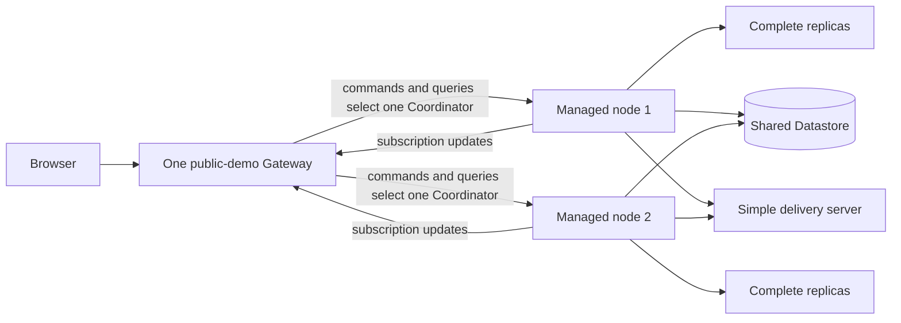

# Distributed Message Board

This example lets you run the existing Message Board model, application package,
and React UI as a local distributed topology. It adds no copied domain or UI
code: use the packages under `../message-board/` for both.



## Start

Build the local images once from the repository root, then start all topology
processes with one command:

```bash
pnpm images:build:local
pnpm --dir examples/distributed-message-board start
```

Start the existing UI separately with its Gateway URL:

```bash
VITE_MESSAGE_BOARD_GATEWAY_URL=http://127.0.0.1:18080 \
  pnpm --dir examples/message-board/web start
```

The Compose file starts exactly two managed Message Board nodes. Each node has
one Coordinator and two complete application replicas (`PROCESS_COUNT=2`),
with a separately selected two-shard Delivery strategy
(`DELIVERY_SHARD_COUNT=2`). It also starts one Gateway, one in-memory simple
delivery server, and one shared Datastore emulator. Both nodes use the same
application-selected storage and delivery endpoint. Delivery chooses which
complete replica performs durable entity work; the Coordinator only selects a
child for an incoming gRPC call. The Gateway separately fans in subscription
updates from both Coordinators. This is a fixed Compose topology with one
Gateway, not a Multiple-Gateway example.

Stop the topology with `Ctrl-C`, or from the repository root run
`docker compose --file examples/distributed-message-board/deploy/compose.yaml down`.

## Limits

The simple delivery server is in-memory and is not highly available. The
Gateway durably remembers that a browser watches a board, but it does not keep a
recording of every update sent to that browser. If the browser disconnects and
misses an update, it asks the Gateway for the board's current state after it
reconnects, replaces its local copy, and resumes listening. It does not make a
new query after every normal update.

See the reused [Message Board model and app](../message-board/README.md) for
the domain and UI implementation, or the [operator reference](REFERENCE.md)
for this topology's exact lifecycle and limits.
