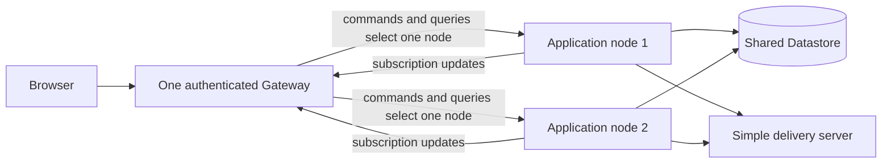

# Distributed Message Board

This example runs the existing Message Board model, application package, and
React UI in a distributed development topology. It adds no copied domain or UI
code: use the packages under `../message-board/` for both.



## Start

Build the local images once from the repository root, then start all topology
processes with one command. Generate a local development key first; do not
commit it:

```bash
pnpm images:build:local
openssl genpkey -algorithm EC -pkeyopt ec_paramgen_curve:P-256 \
  -out examples/distributed-message-board/fixture-private-key.pem
MESSAGE_BOARD_SESSION_PRIVATE_KEY="$(cat examples/distributed-message-board/fixture-private-key.pem)" \
  pnpm --dir examples/distributed-message-board start
```

Start the existing UI separately with its Gateway URL:

```bash
VITE_MESSAGE_BOARD_GATEWAY_URL=http://127.0.0.1:18080 \
  pnpm --dir examples/message-board/web start
```

The Compose file starts exactly two identical Message Board application nodes,
one Gateway, one in-memory simple delivery server, and one shared Datastore
emulator. Both applications use the same application-selected storage and
delivery endpoint. The simple delivery server coordinates which application
node drains command work. The Gateway separately fans in subscription updates
from both equal application nodes; it is not part of command delivery
coordination. Normal complete payloads update the browser locally, while
queries supply initial and recovery state.

Stop the topology with `Ctrl-C`, or from the repository root run
`docker compose --file examples/distributed-message-board/deploy/compose.yaml down`.

## Limits

The simple delivery server is in-memory and is not highly available. Delivery
and subscription updates are best effort. The UI queries through the single
Gateway after reconnects, possible gaps, malformed payloads, or disconnected
posts; it does not query again after every normal complete payload.

See the reused [Message Board model and app](../message-board/README.md) for
the domain and UI implementation, or the [operator reference](REFERENCE.md)
for this topology's exact lifecycle and limits.
