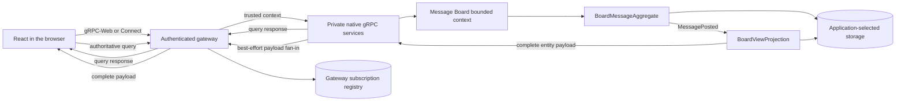
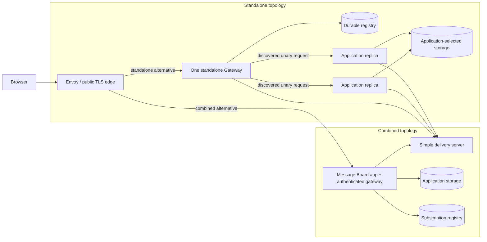

# Message Board — A complete Spine TS web application

Message Board is a small, complete Spine TS application: enter a username and
message in React, send a real command, and see the saved message on a board.
It is the repository's best place to learn how a browser client, a bounded
context, and a query-side view fit together.

## 💡 What you will learn

- ✅ How one Proto model is shared by the Node application and React UI.
- ✅ How an Aggregate accepts a write and a Projection builds the read model.
- ✅ Why browser traffic goes through a public-demo gateway while native
  gRPC remains private.
- ✅ How normal complete subscription payloads update rows locally and when to recover by query.

## 🗺️ Application map

```text
message-board/
├── model/    # Message Board messages, commands, events, and rejections
├── app/      # Bounded context, domain handlers, policy, and server
├── web/      # React UI and browser client
└── README.md # You are here
```

These are private workspace packages. Generated model and handler files are
build outputs, so build them once before starting local processes.

## 🚀 Start locally

| Mode                                | Storage            | Delivery          | Gateway/UI route       | Owner            |
| ----------------------------------- | ------------------ | ----------------- | ---------------------- | ---------------- |
| local single-process                | in-memory          | local             | direct UI to Gateway   | launcher         |
| local multi-process                 | Datastore emulator | local per replica | direct UI to Gateway   | coordinator      |
| local multi-process shared Delivery | Datastore emulator | shared server     | direct UI to Gateway   | coordinator      |
| combined container                  | Datastore emulator | shared server     | stock UI through Envoy | Compose          |
| one-node managed container          | Datastore emulator | shared server     | stock UI through Envoy | Compose          |
| distributed multi-node container    | shared Datastore   | shared server     | stock UI through Envoy | Compose          |
| Kubernetes cluster                  | shared Datastore   | shared server     | stock UI through Envoy | cluster operator |

Install and build from the repository root:

```bash
pnpm install --frozen-lockfile
pnpm typecheck:build
```

For the local single-process mode, use the launcher. It builds the generated
model, starts the in-memory application and Gateway, then keeps the stock UI
in the foreground; `Ctrl-C` stops both processes:

```bash
examples/message-board/scripts/start-local-single-process.sh
```

Open [http://127.0.0.1:5173](http://127.0.0.1:5173), enter a username and a
message, and post it to `general`. Command+Enter on macOS, or Control+Enter
elsewhere, posts; plain Enter adds a line. Stop either process with `Ctrl-C`.

Empty fields demonstrate the validation text declared in
[`commands.proto`](model/proto/spine/examples/messageboard/commands.proto): the
browser displays the server's structured response instead of duplicating rules.

## 🧭 How it works locally



The browser never receives the native backend address. For local development,
`Server` starts a private native HTTP/2 backend and a public loopback browser
gateway on port 8090. The public-demo Gateway rebuilds the trusted actor context
from the request actor and forwards only approved traffic; the bounded context
does not read browser credentials. The React client may use either gRPC-Web or
Connect at that public boundary.

`BoardMessageAggregate` represents one message ID and refuses a duplicate before it
changes state. This is the `postMessage()` handler excerpt from
[`BoardMessageAggregate`](app/src/index.ts); imports and unrelated class members
are omitted to focus on the handler. Its return value feeds the read model:

```ts
// docs-snippet-path: examples/message-board/app/src/index.ts
import { clone, create } from "@bufbuild/protobuf";
import { Aggregate, Assign } from "@spine-event-engine/server";
import {
  BoardMessageSchema,
  MessageIdSchema,
  type MessageId,
} from "@spine-event-engine/example-message-board-model/generated/spine/examples/messageboard/message_board_pb.js";
import { type PostMessage } from "@spine-event-engine/example-message-board-model/generated/spine/examples/messageboard/commands_pb.js";
import {
  MessagePostedSchema,
  type MessagePosted,
} from "@spine-event-engine/example-message-board-model/generated/spine/examples/messageboard/events_pb.js";
import { MessageAlreadyPosted } from "@spine-event-engine/example-message-board-model/generated/spine/examples/messageboard/rejections.js";

class BoardMessageAggregate extends Aggregate<MessageId, typeof BoardMessageSchema> {
  @Assign
  postMessage(command: PostMessage): MessagePosted {
    if (this.state.board !== undefined) throw MessageAlreadyPosted.create({ id: this.id });
    const id = clone(MessageIdSchema, this.id);
    this.update((draft) =>
      Object.assign(
        draft,
        create(BoardMessageSchema, {
          id,
          board: command.board,
          author: command.author,
          username: command.username,
          text: command.text,
          postedAt: command.postedAt,
        }),
      ),
    );
    return create(MessagePostedSchema, {
      id,
      board: command.board,
      author: command.author,
      username: command.username,
      text: command.text,
      postedAt: command.postedAt,
    });
  }
}
```

`BoardViewProjection.onMessagePosted()` turns that event into a
`BoardMessageView` row. The UI queries rows oldest-first and listens to the
same Projection topic. Its `useBoardSync` hook applies a normal complete,
validated payload directly to local rows. It uses an authoritative query only
for initial state, reconnect, a possible gap, malformed data, or a successful
post while disconnected. `Updating live` means the subscription is connected;
posting and recovery remain available when it is not.

Message Board messages are entities, not domain-event subscriptions. Reusing a
`MessageId` leaves the first message unchanged and yields the generated
`MessageAlreadyPosted` rejection.

## 🧪 Tests and local limits

```bash
pnpm --config.verify-deps-before-run=false exec vitest run \
  examples/message-board/app/test \
  examples/message-board/web/test/message-board.test.tsx
pnpm --config.verify-deps-before-run=false --dir examples/message-board/web test:browser
```

The browser suite needs Playwright browsers; install them once with
`pnpm exec playwright install chromium firefox webkit`.

Local mode uses in-memory application storage and subscription bindings. It is
a public demonstration: the actor ID in each command, query, and subscription
context becomes the actor reconstructed by the Gateway; no browser credential is
used. After a reconnect, the UI first queries the current board and then listens
again. Think of live updates as a doorbell: Gateway remembers which doorbell the
browser rang, but does not store every ring while the browser is away.
After a reconnect, the UI must re-query; no subscription stream supplies a
complete historical record.

For the deliberately small distributed development topology—two identical
application nodes, one Gateway, shared storage, and the in-memory simple
delivery server—run [Distributed Message Board](../distributed-message-board/README.md).
The deployment references in this example instead show combined and
replica-oriented standalone application modes.

## 🔗 Learn more

- [Message Board server](app/README.md)
- [Message Board model](model/README.md)
- [Message Board web UI](web/README.md)
- [Browser client, authentication, and gateway guide](../../docs/BROWSER_CLIENT_AUTH_EXTENSION_GUIDE.md)
- [Detailed coding-agent reference](REFERENCE.md)

## Deployment

The same Message Board application image runs in two production alternatives.
In **combined** mode one process runs both the application and browser gateway.
In **standalone** mode that image runs application-only private native gRPC
processes, while the separate gateway image accepts browser traffic behind
Envoy.



The branches leaving the Gateway are alternatives, not broadcast: a unary
request selects one private application node. The
registry and delivery connections represent shared topology and subscription
fan-in, not additional unary request routes.

Application code selects and manages its storage. Gateway code manages the separate durable subscription
registry in one namespace. Operators configure TLS,
image distribution, network policy, and production delivery infrastructure.
The reference simple delivery server is in-memory and not highly available;
the Gateway remembers what a browser watches, not a replayable history of every
update. After a disconnect, the browser queries the current board and then
continues listening.

### Build local images

```bash
pnpm typecheck:build
pnpm images:build:local
```

See the [deployment guide](deploy/README.md) and [container image guide](deploy/container/README.md)
for topology commands, required environment values, and limits.
