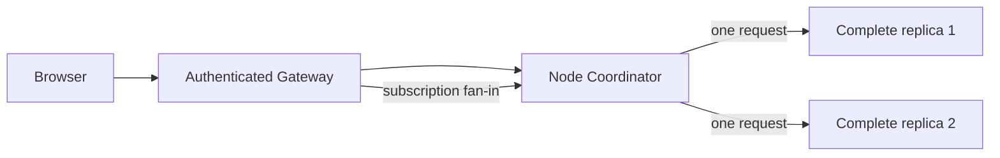

# Message Board deployment references

Use this guide to run the local Message Board deployment examples. The nearby
[reference](REFERENCE.md) holds exact guarantees and environment contracts.

## 🧭 Choose a topology



The two application connections shown for unary routing are alternatives, not
fan-out: one command or query is sent to one selected backend without retry.

Combined mode runs one Message Board application and authenticated browser
gateway in the same process. Use it to understand the smallest browser-facing
deployment. Standalone mode runs a managed application node separately from one
Gateway; Envoy is the only public service and the Gateway reaches its private
Coordinator, never a child listener.

Both modes require application-selected storage and a delivery server. Browser
processes share the session signing values and subscription-registry namespace.
The Gateway remembers each logical subscription, such as “Ada watches board
`general`,” in durable storage. It does **not** store a history of every update
sent to Ada's browser. If the browser disconnects while a message is posted, it
may miss that notification. After reconnecting, the browser queries the current
board, replaces its local copy, and then continues listening. Receiving the same
complete board twice is harmless for the same reason. This is what the reference
means by _best-effort subscription updates_. The supplied simple delivery server
is in-memory and not highly available.

For the smaller runnable development topology of exactly two identical
applications and one Gateway, use
[Distributed Message Board](../../distributed-message-board/README.md). The
standalone reference below is intentionally replica-oriented: it demonstrates
separately scalable application and Gateway processes.

## 🚀 Run the references

Build the local-only images first:

```bash
pnpm typecheck:build
pnpm images:build:local
```

Create the signing key once; keep this file out of source control:

```bash
openssl genpkey -algorithm EC -pkeyopt ec_paramgen_curve:P-256 -out session-key.pem
```

Set a P-256 PKCS#8 private key, then start the combined reference:

```bash
docker compose --file examples/message-board/deploy/compose/combined.compose.yaml up --detach
docker compose --file examples/message-board/deploy/compose/combined.compose.yaml down --volumes --remove-orphans
```

Use `standalone.compose.yaml` for one managed node with two complete replicas.
It sets `PROCESS_COUNT=2` and `DELIVERY_SHARD_COUNT=2` independently, then
starts one Coordinator, one Gateway, Envoy, one shared registry namespace, and
exactly one in-memory delivery server. `BACKEND_URLS` names that Coordinator in
this local-only static fixture, not a child listener.

The Kubernetes YAML files are storage-neutral references. Image distribution is
managed by the operator and out of scope: for Kind, load local images instead of
publishing them; for Minikube, load the same local tags:

```bash
kind load docker-image spine-ts/message-board:local spine-ts/standalone-gateway:local spine-ts/simple-delivery-server:local
minikube image load spine-ts/message-board:local spine-ts/standalone-gateway:local spine-ts/simple-delivery-server:local
```

Create the operator-managed prerequisites in the target namespace before applying
the references:

```bash
kubectl create secret generic message-board-storage --from-literal=DATASTORE_PROJECT_ID=message-board-production
# Add DATASTORE_EMULATOR_HOST only for a local emulator test.
kubectl create secret tls message-board-envoy-tls --cert=tls.crt --key=tls.key
```

Every browser-capable combined process and standalone gateway uses the same
issuer, audience, key ID, private key, and registry namespace; separate values
break authenticated failover. Application-only standalone processes do not
configure browser sessions or the subscription registry. The example does not
persist session revocations; the gateway registry is the durable browser
subscription state. Each process creates its Datastore client and
passes that exact client to its storage factory.

```bash
kubectl apply --filename examples/message-board/deploy/kubernetes/combined.yaml
```

For multiple managed nodes, apply `standalone.yaml`. Each pod chooses its own
explicit process and shard counts. Its public LoadBalancer service exposes Envoy
only; the one Gateway uses `GkeNodeDiscovery` against the application headless
Service and follows ready Coordinator DNS membership rather than fixed child
backend lists.
The durable Gateway registry remembers **what** each client watches, not every
notification the client has seen. A reconnect restores the watch. A normal
query restores the current board if a notification was missed or repeated.
The references use TCP startup/readiness only and intentionally omit liveness
probes and application health endpoints.
