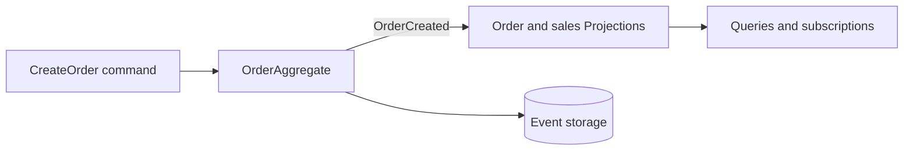

# Orders — Datastore-ready Spine example

This example models ordering work with Aggregates, Process Managers, and
Projections. It runs in memory with one command and can use Google Cloud
Datastore when the application supplies that storage factory.

## 💡 What will you learn?

- ✅ How one bounded context coordinates `Order` and `Sku` Aggregates.
- ✅ How events update ten read-side Projections and two Process Managers.
- ✅ How domain code stays independent of the selected storage provider.
- ✅ How commands, queries, and subscriptions behave under a small local load.

## 🚀 Run it

From the repository root, install dependencies once:

```bash
pnpm install --frozen-lockfile
```

Run the complete in-memory example with ten simulated users:

```bash
SPINE_DATASTORE_ORDERS_LOAD_USERS=10 pnpm --dir examples/orders run load
```

The command generates and builds the required code, starts a loopback server,
runs the scenario, prints one JSON result, and closes the server.

Choose `10`, `100`, or `1000` users by changing
`SPINE_DATASTORE_ORDERS_LOAD_USERS`.

## 🧭 How it works



The load runner posts `CreateOrder` through the local server. `OrderAggregate`
stores the order state and returns `OrderCreated`; the registered Projections
turn that fact into the fixed read-side topology used by the scenario.

This is the `createOrder()` handler excerpt from
[`OrderAggregate`](src/index.ts); imports and the class declaration are omitted
to focus on the handler.

```ts
@Assign createOrder(command: CreateOrder): OrderCreated {
  this.update((draft) =>
    Object.assign(draft, create(OrderSchema, { id: this.id, skuId: command.skuId })),
  );
  return create(OrderCreatedSchema, { id: this.id, skuId: command.skuId });
}
```

`SkuAggregate` follows the same pattern for SKU registration. The example's
many Projections and Process Managers are deliberately a topology exercise,
not a claim that every application needs that many read models.

## 🗄️ Try the same model with durable storage

The local scenario deliberately uses memory. Its application assembly accepts
the common `StorageFactory`, so a deployment can provide the Datastore factory
without teaching `OrderAggregate` or its Projections about provider APIs. Start
by declaring `(column)` only for the Order fields that the application will
filter or sort, then deploy the matching Datastore indexes before serving those
queries. The [Datastore guide](../../packages/storage-datastore/README.md)
shows the native namespace, kind, key, bytes, and declared-property layout.

## 🧪 Run the example tests

```bash
pnpm --config.verify-deps-before-run=false exec vitest run \
  examples/orders/test/proto-module.test.ts \
  examples/orders/test/topology.test.ts \
  examples/orders/test/load-runner.test.ts
```

## ⚠️ What this example does not prove

The command uses in-memory storage. It is a learning and load-checking example,
not a production benchmark or a live Datastore test. Cloud credentials,
indexes, quotas, and deployment belong to the application using the Datastore
adapter.

## 🔗 Learn more

- [Datastore storage](../../packages/storage-datastore/README.md)
- [Storage query contract](../../packages/storage/README.md)
- [Server](../../packages/server/README.md)
- [Reference for coding agents](REFERENCE.md)
