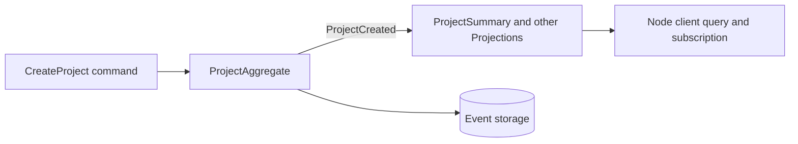

# Projects — Project management in Spine TS

This example creates projects through a real local Spine server and follows the
creation event through a query-side Projection subscription.

## 💡 What will you learn?

- ✅ How a larger bounded context registers Aggregates, Process Managers, and
  Projections.
- ✅ How generated handlers connect commands and events to domain code.
- ✅ How a Node client posts `CreateProject`, queries `ProjectSummary`, and
  observes an update.
- ✅ How to run a bounded, repeatable local load scenario.

## 🚀 Run it

Install workspace dependencies once:

```bash
pnpm install --frozen-lockfile
```

Then run ten independent users:

```bash
SPINE_PROJECT_LOAD_USERS=10 pnpm --dir examples/projects run load
```

The command generates and builds the required code, starts the local server,
runs the scenario, prints one JSON result, and closes every connection.

Supported user counts are `10`, `25`, `50`, and `100`.

## 🧭 How it works



The load scenario sends `CreateProject`, then queries and subscribes through
the local server. The Aggregate writes only its state and returns the
event; generated handlers deliver that event to the registered read models.

This is the `createProject()` handler excerpt from
[`ProjectAggregate`](src/index.ts); imports and the class declaration are
omitted to focus on the handler.

```ts
@Assign
createProject(command: CreateProject): ProjectCreated {
  this.update((draft) =>
    Object.assign(draft, create(ProjectSchema, { id: this.id, name: command.name })),
  );
  return create(ProjectCreatedSchema, { id: this.id, name: command.name });
}
```

`ProjectSummaryProjection` observes `ProjectCreated` to make a queryable
summary. The additional Aggregates, Process Managers, and Projections give the
load topology realistic fan-out; they do not add a production deployment.

## 🗄️ Add persistence deliberately

This example keeps its local run in memory. A durable application supplies a
storage factory at composition time; domain handlers continue to work with
typed IDs and messages, not MySQL rows or Datastore entities. Mark a Proto
field `(column)` only when a read model needs it for filtering or sorting. The
[storage guide](../../packages/storage/README.md) explains the shared query
contract, and the provider guides explain the physical layout and migration.

## 🧪 Run the example tests

```bash
pnpm vitest run \
  examples/projects/test/proto-module.test.ts \
  examples/projects/test/topology.test.ts \
  examples/projects/test/load-runner.test.ts
```

## ⚠️ What this example does not prove

It uses in-memory storage and loopback networking. Its latency numbers are
local diagnostics, not a production benchmark or service-level objective. It
does not configure authentication, persistence, deployment, monitoring, or a
multi-machine transport.

## 🔗 Learn more

- [Server](../../packages/server/README.md)
- [Node client](../../packages/client-node/README.md)
- [Storage API](../../packages/storage/README.md)
- [MySQL storage](../../packages/storage-rdbms/README.md)
- [Reference for coding agents](REFERENCE.md)
