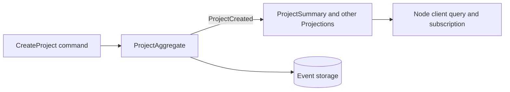

# Projects — Project management in Spine TS

This example creates projects through a real local Spine server and follows the
creation event through a query-side Projection subscription.

## 💡 What will you learn?

- ✅ How a larger bounded context registers Aggregates, Process Managers, and
  Projections.
- ✅ How generated handlers connect commands and events to domain code.
- ✅ How a Node client posts `CreateProject`, queries `ProjectSummary`, and
  observes an update.
- ✅ How to give a Process Manager an application service through its constructor.
- ✅ How to run a bounded, repeatable local load scenario.

## 🚀 Run it

Install workspace dependencies once:

```bash
pnpm install --frozen-lockfile
```

Then run ten independent users:

```bash
SPINE_PROJECT_LOAD_USERS=10 pnpm --dir examples/projects run load
```

The command generates and builds the required code, starts the local server,
runs the scenario, prints one JSON result, and closes every connection.

Supported user counts are `10`, `25`, `50`, and `100`.

## 🧭 How it works


```mermaid
flowchart LR
  Command[CreateProject command] --> Project[ProjectAggregate]
  Project -->|ProjectCreated| Views[ProjectSummary and other Projections]
  Project --> Events[(Event storage)]
  Views --> Client[Node client query and subscription]
```

The load scenario sends `CreateProject`, then queries and subscribes through
the local server. The Aggregate writes only its state and returns the
event; generated handlers deliver that event to the registered read models.

This is the `createProject()` handler excerpt from
[`ProjectAggregate`](src/index.ts); imports and the class declaration are
omitted to focus on the handler.

```text
@Assign
createProject(command: CreateProject): ProjectCreated {
  this.update((draft) =>
    Object.assign(draft, create(ProjectSchema, { id: this.id, name: command.name })),
  );
  return create(ProjectCreatedSchema, { id: this.id, name: command.name });
}
```

`ProjectSummaryProjection` observes `ProjectCreated` to make a queryable
summary. The additional Aggregates, Process Managers, and Projections give the
load topology realistic fan-out; they do not add a production deployment.

## Give a Process Manager an application service

When a task is created, `AssignmentManager` adds its weight to a saved counter.
The application supplies the weight calculation through an
`AssignmentWeightService`. This keeps the calculation separate from the
Process Manager's stored state.

<!-- docs-snippet-path: examples/projects/test/topology.test.ts -->

```ts
import { createProjectManagementContext, type AssignmentWeightService } from "../src/index.js";

// This example service counts each task as three units of work.
const weights: AssignmentWeightService = { weightFor: () => 3 };
const context = await createProjectManagementContext(weights);

// Use the context to handle messages, then close it during shutdown.
await context.close();
```

Inside `createProjectManagementContext()`, registration uses
`onCreate: (options) => new AssignmentManager(options, weights)`. Spine supplies
the ID, state, version, and lifecycle options. The application adds its shared
service. Each restored Process Manager receives that service again; the
service itself is not saved in storage. The callback is synchronous. Prepare
async clients before creating the context and close them after context shutdown.

Without an argument, the example uses weight one, so its existing load scenario
is unchanged. The focused example test supplies weight three, delivers two
`TaskCreated` Events, and checks a saved total of six at version two. This
checks both the first object and a later object restored from its saved state.
See the [Entity dependency guide](../../docs/USER_GUIDE.md#give-an-entity-an-application-service)
for the general API.

## 🗄️ Add persistence deliberately

This example keeps its local run in memory. A durable application supplies a
storage factory at composition time; domain handlers continue to work with
typed IDs and messages, not MySQL rows or Datastore entities. Mark a Proto
field `(column)` only when a read model needs it for filtering or sorting. The
[storage guide](../../packages/storage/README.md) explains the shared query
contract: `RecordQuery<I>` statically types IDs, while query mapping and
validation are provider-specific. The provider guides explain the physical
layout and migration.

## 🧪 Run the example tests

```bash
pnpm vitest run \
  examples/projects/test/proto-module.test.ts \
  examples/projects/test/topology.test.ts \
  examples/projects/test/load-runner.test.ts
```

## ⚠️ What this example does not prove

It uses in-memory storage and loopback networking. Its latency numbers are
local diagnostics, not a production benchmark or service-level objective. It
does not configure authentication, persistence, deployment, monitoring, or a
multi-machine transport.

## 🔗 Learn more

- [Server](../../packages/server/README.md)
- [Node client](../../packages/client-node/README.md)
- [Storage API](../../packages/storage/README.md)
- [MySQL storage](../../packages/storage-mysql/README.md)
- [Reference for coding agents](REFERENCE.md)
