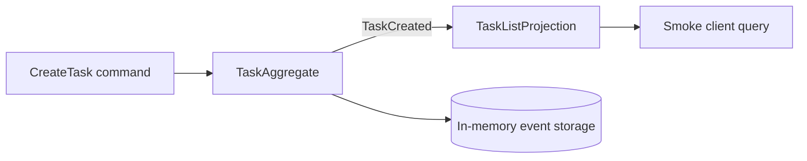

# To-Do — Your first Spine TS application

The To-Do example is the smallest complete Node application in this repository.
It accepts task commands, records events, updates a task-list Projection, and
exposes commands, queries, and subscriptions through a real local server.

## 💡 What will you learn?

- ✅ How Proto messages become generated TypeScript model code.
- ✅ How one generated message interface and one authored interface become routing tokens.
- ✅ How `@Assign` and `@Subscribe` methods handle commands and events.
- ✅ How generated validation and domain rejections protect entity state.
- ✅ How a client posts a command and reads the resulting Projection.

## 🚀 Run it

Install workspace dependencies once:

```bash
pnpm install --frozen-lockfile
```

Start the server in one terminal:

```bash
pnpm --filter @spine-event-engine/example-todo start
```

After it reports `http://127.0.0.1:8080`, run the smoke client in another
terminal:

```bash
pnpm --filter @spine-event-engine/example-todo smoke
```

The smoke client posts one `CreateTask` command and waits for the matching
`TaskList` row. Stop the server with `Ctrl-C`.

## 🧭 How it works



The command handler manages one task's write-side state and returns the domain
event that describes a successful creation. Here is the event-producing part of
[`TaskAggregate.createTask()`](src/index.ts); the aggregate applies the same
ID, title, and initial completion state to its stored state before returning it:

```ts
import { create } from "@bufbuild/protobuf";
import {
  TaskCreatedSchema,
  type TaskCreated,
} from "./generated/spine/examples/todo/task_events_pb.js";
import { type TaskId } from "./generated/spine/examples/todo/task_id_pb.js";

function createTask(id: TaskId, title: string): TaskCreated {
  return create(TaskCreatedSchema, { id, title });
}
```

`TaskListProjection.onTaskCreated()` adds that task to the list and increments
the open-task count. The smoke client waits for this Projection row, which is
why the example demonstrates a command followed by an observable read model.

## 🧩 Route related events together

The To-Do model has a generated `TaskEvent` interface for every task event and
an authored `TaskAssignmentEvent` interface for assignment lifecycle events.
Run `pnpm proto:generate` after changing the Proto model; it writes
`generated/interfaces/task-event.ts` and
`generated/interfaces/task-assignment-event.ts`. The application imports each
exported name in type position for the interface and in value position for the
runtime routing token. The [walkthrough](USER_GUIDE.md) shows the complete
create, assign, reassign, and unassign path.

## 🧪 Run the focused tests

```bash
pnpm vitest run examples/todo/test/black-box.test.ts
pnpm vitest run examples/todo/test/startup-contract.test.ts
```

The first suite uses the public `BlackBox` testing API. The second verifies the
single-process and managed startup contracts, including deployer-supplied
process and Delivery shard counts.

## ⚠️ Single-process mode is local by design

The normal `start` command stores state in memory, which disappears when the
server stops. It does not configure authentication, deployment, tracing,
monitoring, or a multi-machine topology. The managed reference below has a
separate production assembly.

## Managed node reference

The normal `start` command above deliberately remains a single-process local
server. A deployment can instead start a managed node with the same complete
Tasks context in every child process:

```bash
PROCESS_COUNT=2 DELIVERY_SHARD_COUNT=2 \
HOST=0.0.0.0 PORT=8080 \
DATASTORE_PROJECT_ID=todo-production \
DELIVERY_SERVER_URL=http://delivery.example.test:8484 \
pnpm --dir examples/todo start:managed
```

`PROCESS_COUNT` is chosen by the deployer. `DELIVERY_SHARD_COUNT` is a separate
application decision; this example chooses two of each only as a small
reference. The managed parent exposes one Node Coordinator at `HOST:PORT` and
starts the requested number of identical Tasks application replicas behind it.
Each child has the whole bounded context, connects directly to the Delivery
server, and uses the shared Datastore configured for the deployment. A Gateway
or other front-facing proxy sends normal gRPC requests to the Coordinator, not
to a child listener.

## 🔗 Learn more

- [To-Do walkthrough](USER_GUIDE.md)
- [Framework user guide](../../docs/USER_GUIDE.md)
- [Black-box testing](../../packages/testing/README.md)
- [Reference for coding agents](REFERENCE.md)
