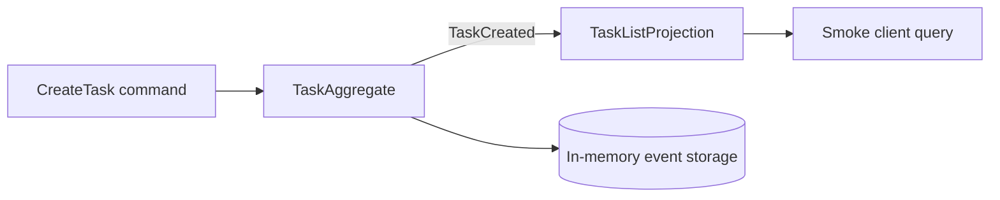

# To-Do — Your first Spine TS application

The To-Do example is the smallest complete Node application in this repository.
It accepts task commands, records events, updates a task-list Projection, and
exposes commands, queries, and subscriptions through a real local server.

## 💡 What will you learn?

- ✅ How Proto messages become generated TypeScript model code.
- ✅ How `@Assign` and `@Subscribe` methods handle commands and events.
- ✅ How generated validation and domain rejections protect entity state.
- ✅ How a client posts a command and reads the resulting Projection.

## 🚀 Run it

Install workspace dependencies once:

```bash
pnpm install --frozen-lockfile
```

Start the server in one terminal:

```bash
pnpm --filter @spine-event-engine/example-todo start
```

After it reports `http://127.0.0.1:8080`, run the smoke client in another
terminal:

```bash
pnpm --filter @spine-event-engine/example-todo smoke
```

The smoke client posts one `CreateTask` command and waits for the matching
`TaskList` row. Stop the server with `Ctrl-C`.

## 🧭 How it works



The command handler manages one task's write-side state and returns the domain
event that describes a successful creation. The complete checked implementation
is [`TaskAggregate`](src/index.ts); this typed view keeps the introduction small
while linking to the real handler:

```ts
import { TaskAggregate } from "./src/index.js";

type CreateTaskHandler = TaskAggregate["createTask"];
void (undefined as unknown as CreateTaskHandler);
```

`TaskListProjection.onTaskCreated()` adds that task to the list and increments
the open-task count. The smoke client waits for this Projection row, which is
why the example demonstrates a command followed by an observable read model.

## 🧪 Run the focused tests

```bash
pnpm vitest run examples/todo/test/black-box.test.ts
pnpm vitest run examples/todo/test/local-multi-process.test.ts
```

The first suite uses the public `BlackBox` testing API. The second starts
separate local processes and therefore needs permission to bind loopback and
same-host IPC endpoints.

## ⚠️ Local by design

State is in memory and disappears when the server stops. This example does not
configure production storage, authentication, deployment, tracing, monitoring,
or a multi-machine topology.

## 🔗 Learn more

- [To-Do walkthrough](USER_GUIDE.md)
- [Framework user guide](../../docs/USER_GUIDE.md)
- [Black-box testing](../../packages/testing/README.md)
- [Reference for coding agents](REFERENCE.md)
