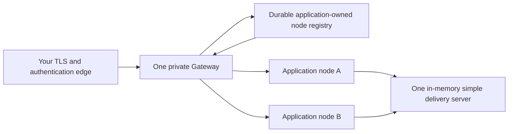

# Deploy a Spine TS application on GCE

`@spine-event-engine/deployment-gce` helps you run one Spine TS application
across several Google Compute Engine (GCE) virtual machines. It includes an
editable Terraform template and small TypeScript entrypoints. The template
keeps application nodes, the Gateway, and the simple delivery server private;
you provide the public TLS, authentication, and traffic-routing edge that fits
your organisation.

For detailed contracts intended for coding agents, read the
[reference for agents](REFERENCE.md).

## Before you begin

You need an existing Google Cloud project, VPC network, regional subnetwork,
and a service account with only the permissions required by your images and
their application-owned configuration. Install [Google Cloud CLI](https://cloud.google.com/sdk/docs/install)
and Terraform 1.6 or newer. Authenticate Terraform through Application Default
Credentials:

```bash
gcloud auth application-default login
```

Build and publish three immutable images: your application, one standalone
Gateway, and the in-memory simple delivery server. Use image digests such as
`@sha256:...`, not mutable tags. The template deliberately does not publish an
image, choose Datastore, MySQL, or another storage backend, create secrets, or
configure an identity provider.

## What this deployment creates

The application managed instance group (MIG) is regional and distributes
identical application nodes across your selected zones. A ready node registers
its private listener in a durable, application-owned registry. The single
Gateway reads the same registry every 10 seconds and routes commands, queries,
and subscriptions to the live nodes.



The template gives the Gateway and delivery server separate one-instance MIGs
and stable private addresses behind internal passthrough load balancers. This
is easy to inspect and lets an operator move them to separate failure or
resource boundaries. A smaller deployment may colocate the two processes, but
the simple delivery server remains in-memory: it is neither durable nor highly
available.

Every listener receives only private VPC traffic and health checks. Terraform
does not create an external IP, public load balancer, TLS certificate,
authentication provider, or Internet firewall rule.

## Configure the template

Copy the values file and replace every placeholder. Keep it outside source
control because it identifies your network and deployment, even though it
contains no secret values.

```bash
cd packages/deployment-gce/terraform
cp terraform.tfvars.example terraform.tfvars
```

Set the project, region, two or more application zones, VPC/subnetwork,
least-privilege service-account email, and the three image digests. Set
`registry_namespace` and `registry_storage_reference` identically for
application and Gateway images. The reference tells those images how to select
their shared durable registry storage; it is not a storage-engine choice made
by Terraform.

`application_secret_reference` and `gateway_secret_reference` are identifiers
your images resolve through your own configuration mechanism. They are passed
as environment values only. Terraform neither reads secret values nor writes
them into state.

## Connect your application entrypoints

The application image must create its normal bounded contexts and storage
factory. It then adds the registrar before starting the private gRPC listener.
The server invokes the registrar only after the listener is ready.

```ts
// docs-snippet-path: packages/deployment-gce/examples/application.ts
import { LeasedNodeRegistry } from "@spine-event-engine/deployment";
import { GceRegistrar } from "@spine-event-engine/deployment-gce";
import { Server, type ServerOptions } from "@spine-event-engine/server";
import type { StorageFactory } from "@spine-event-engine/storage";

import { GceDeploymentSettings, type DeploymentEnvironment } from "./deployment-settings.js";

export interface ApplicationOptions {
  readonly server: Omit<ServerOptions, "host" | "port" | "browser">;
  readonly storageFactory: StorageFactory;
}

export const GceApplicationEntrypoint = Object.freeze({
  async run(
    options: ApplicationOptions,
    environment: DeploymentEnvironment = process.env,
  ): Promise<void> {
    const port = GceDeploymentSettings.port(environment, "PORT");
    const registry = new LeasedNodeRegistry({
      factory: options.storageFactory,
      namespace: GceDeploymentSettings.registryNamespace(environment),
    });
    const registrar = new GceRegistrar({ registry, port });
    const server = Server.atPort(port, { ...options.server, host: "0.0.0.0" });
    server.addListenerLifecycle(registrar.lifecycle());
    await server.run();
  },
});
```

The Gateway uses the same factory and namespace indirectly through its
environment. It refreshes the complete live-node registry snapshot every 10
seconds. Supply your durable subscription bindings, authentication, and browser
collaborators in `browserOptions`.

```ts
// docs-snippet-path: packages/deployment-gce/examples/gateway.ts
import { LeasedNodeRegistry, ScheduledNodeDiscovery } from "@spine-event-engine/deployment";
import { GceRegistryReader } from "@spine-event-engine/deployment-gce";
import { Server, type BrowserServerOptions } from "@spine-event-engine/server";
import type { StorageFactory } from "@spine-event-engine/storage";

import { GceDeploymentSettings, type DeploymentEnvironment } from "./deployment-settings.js";

export interface GatewayOptions {
  readonly browser: Omit<BrowserServerOptions, "host" | "port" | "discovery">;
  readonly storageFactory: StorageFactory;
}

export const GceGatewayEntrypoint = Object.freeze({
  async run(
    options: GatewayOptions,
    environment: DeploymentEnvironment = process.env,
  ): Promise<void> {
    const registry = new LeasedNodeRegistry({
      factory: options.storageFactory,
      namespace: GceDeploymentSettings.registryNamespace(environment),
    });
    const discovery = new ScheduledNodeDiscovery({
      reader: new GceRegistryReader(registry),
    });
    const server = Server.atPort(GceDeploymentSettings.port(environment, "PORT"), {
      host: "0.0.0.0",
      browser: { ...options.browser, discovery },
    });
    await server.run();
  },
});
```

The complete, packaged examples are
[`examples/application.ts`](examples/application.ts) and
[`examples/gateway.ts`](examples/gateway.ts). They deliberately keep business
contexts, storage configuration, identity, and durable subscription bindings
in your application code.

## Deploy

Initialize the provider, inspect the exact resources, then apply them.

```bash
terraform init
terraform plan -out=tfplan
terraform apply tfplan
```

The first VM can take several minutes to start. Autohealing waits for the
configured startup delay (120 seconds by default) before treating a failed
application listener as unhealthy.

## Verify the deployment

Check that GCE created the three groups and that all intended instances become
healthy:

```bash
gcloud compute instance-groups managed list --regions=REGION
gcloud compute instance-groups managed list-instances spine-application --region=REGION
terraform output gateway_private_address
```

From a trusted VPC client or your operator-managed edge, reach the returned
Gateway address. Post a command, query its Projection, and activate a durable
subscription. The Gateway may need one 10-second refresh interval after a
fresh application node becomes ready.

Each application process obtains a unique registration identity, renews its
lease every 20 seconds, and leases it for 60 seconds. A graceful shutdown
removes only its own lease. A crash may leave a row behind temporarily, but it
is ignored after expiry; healthy registrars perform finite cleanup.

## Scale application nodes

With the default `autoscaling_enabled = false`, Terraform owns manual capacity:

```bash
terraform apply -var='application_replicas=4'
terraform apply -var='application_replicas=0'
terraform apply -var='application_replicas=2'
```

At zero nodes, the registry becomes empty after at most the 60-second lease
expiry. The Gateway remains alive but reports backend unavailability until a
node returns; it keeps refreshing every 10 seconds.

To let Compute Engine scale the same application version, set
`autoscaling_enabled = true`, choose `cpu`, `per_instance`, or `whole_group`,
and provide a metric, target, and min/max capacity. Terraform then omits the
MIG size and GCE is the sole capacity owner.

CPU and per-instance metrics require a running VM, so they cannot scale from
zero. For scale-from-zero, use a `whole_group` Cloud Monitoring metric that is
produced while no application VM exists, or use an operator action or schedule.
Internal passthrough load-balancer utilization is not a suitable autoscaling
signal for this topology.

## Replace an application version

For a compatible change, publish a new immutable application digest, set it in
`terraform.tfvars`, and apply. The regional MIG performs a proactive rolling
replacement with one surge instance and no planned unavailable instance. Old
and new nodes can overlap, so they must understand the same stored data and
messages during the rollout.

For an incompatible business-logic or data change, first set application
capacity to zero and wait until the old nodes exit, then apply the new image and
restore capacity. This framework does not negotiate compatibility. Pending
Inbox work may execute under the new version, so make the change safe for those
messages before starting it.

The Gateway normally stays in place during an application replacement. A
Gateway interruption disconnects browser clients. Its durable subscription
definitions survive only when your Gateway bindings use the same application-
owned persistent storage. Clients reconnect and issue an authoritative query.

## Roll back

To roll back a compatible application image, restore the prior immutable digest
and run `terraform apply`. GCE creates the previous instance template and
performs the same rolling update. For an incompatible rollback, use the same
stop-all sequence: reduce the application group to zero, wait for shutdown,
apply the prior image, then restore capacity.

## Troubleshooting

| Symptom                              | Check                                                                                                                                 |
| ------------------------------------ | ------------------------------------------------------------------------------------------------------------------------------------- |
| Gateway has no backend               | Confirm the application group has healthy instances, registry references and namespace match, then allow a 10-second refresh.         |
| A node remains listed after a crash  | Wait up to 60 seconds for lease expiry; cleanup is finite and does not make expired nodes routable.                                   |
| An application VM keeps restarting   | Check the image starts its listener on `HOST=0.0.0.0` and `PORT`, and increase the startup delay only when its real startup needs it. |
| A client cannot reach the Gateway    | Reach the private output from the VPC or configure your own TLS/authentication edge; this module creates no public path.              |
| Autoscaling does not wake zero nodes | CPU and per-instance metrics cannot observe an empty group; use a whole-group metric or set a manual/scheduled minimum.               |
| Delivery state disappeared           | The supplied delivery server is in-memory. Do not describe it as durable or highly available.                                         |

## Remove the deployment

Remove application capacity first when you need a controlled domain shutdown,
then destroy the infrastructure:

```bash
terraform apply -var='application_replicas=0'
terraform destroy
```

`terraform destroy` removes only resources owned by this template. It does not
delete the application-owned registry, application storage, externally managed
secrets, images, VPC, or an operator-managed public edge.
