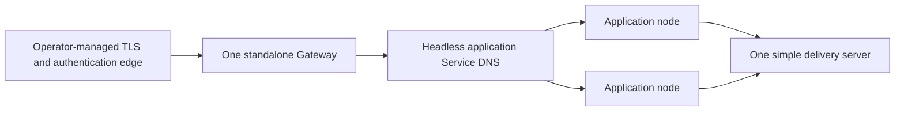

# Deploy a Spine TS application on GKE

`@spine-event-engine/deployment-gke` helps one standalone Gateway find ready
Spine TS application nodes through a Kubernetes headless Service. This guide
adds an editable Terraform starting point for a private, one-Gateway GKE
deployment. It is deliberately storage-neutral: your application chooses its
own storage and supplies its own configuration.

This is a guide for people deploying an application. For exact discovery API
and lifecycle behavior, see the [reference for agents](REFERENCE.md).

## Before you begin

You need an existing GKE cluster, `gcloud`, `kubectl`, Terraform 1.6 or newer,
and images for three processes:

- your Spine TS application-node image;
- your standalone Gateway image; and
- an image running the simple delivery server.

Publish immutable image references before deployment. The template does not
create a GKE cluster, an image registry, an identity provider, or application
secrets. Authenticate `gcloud` and select the cluster first:

```bash
gcloud container clusters get-credentials CLUSTER --location REGION --project PROJECT
kubectl create namespace spine-app
```

Create the two Secrets through your normal secret-management process before
running Terraform. Terraform receives only their names; it never receives or
creates their values. The application Secret holds application-selected
settings, including storage settings when the application needs them. The
Gateway Secret holds its own identity and session settings.

## What this deployment creates

The Terraform module creates three private Kubernetes Deployments and three
ClusterIP Services. One Service is headless: Kubernetes publishes the IP
addresses of ready application Pods in DNS. The Gateway uses that DNS name with
`GkeNodeDiscovery`; it does not call the Kubernetes API or maintain a separate
node registry.



The template intentionally keeps Gateway, application, and delivery traffic
private. It does not create a public load balancer, TLS certificate, or
authentication policy. Connect the `gateway` ClusterIP Service to the public
TLS/authentication edge your operators choose. That edge is responsible for
admitting browser traffic; the Gateway then forwards authorized requests to
the application nodes.

The simple delivery server is useful for this supported topology, but it is
in-memory, single-replica, and not highly available. It loses its state when
it restarts. Choose an operationally suitable delivery design before depending
on it for a critical production workload.

## Configure the template

Copy the supplied variable file and replace every placeholder with values for
your cluster and delivery pipeline:

```bash
cd packages/deployment-gke/terraform
cp terraform.tfvars.example terraform.tfvars
```

`terraform.tfvars` asks for the existing Secret names, immutable images, and
the kubeconfig context selected by `gcloud`. It defaults to two application
nodes, one Gateway, and one delivery server. The Gateway and delivery-server
replica counts are intentionally fixed at one in this topology.

Your application and Gateway entrypoints remain application code. Configure
the Gateway with the headless Service name and application port shown in the
module. For example, an application using HTTP/2 without TLS inside the
cluster can assemble its Gateway like this:

```ts
import { GkeNodeDiscovery } from "@spine-event-engine/deployment-gke";
import { Server } from "@spine-event-engine/server";

declare const options: Omit<
  import("@spine-event-engine/server").ServerOptions,
  "port" | "browser"
> & {
  browser: import("@spine-event-engine/server").BrowserServerOptions;
};

const discovery = new GkeNodeDiscovery({
  serviceName: "application.spine-app.svc.cluster.local",
  port: 8080,
});
const gateway = Server.atPort(8081, {
  ...options,
  browser: { ...options.browser, discovery },
});
await gateway.run();
```

The ConfigMap in the template exposes matching service and port values as a
simple convention. Adapt the names or use your own configuration loader; Spine
TS does not require a particular environment-variable format.

## Deploy

Terraform applies Kubernetes resources to the cluster selected by your
kubeconfig. Keep cluster creation separate from this module, then run:

```bash
terraform init
terraform fmt -check
terraform validate
terraform plan -var-file=terraform.tfvars
terraform apply -var-file=terraform.tfvars
```

`plan` should show one Gateway Deployment, one delivery Deployment, one
application Deployment, and only private Services. Review it before `apply`.

## Verify the deployment

Wait for the Deployments, then inspect the headless Service endpoints:

```bash
kubectl get deployment,pod,service --namespace spine-app
kubectl get endpointslice --namespace spine-app \
  --selector kubernetes.io/service-name=application
kubectl logs --namespace spine-app deployment/gateway
```

A ready application Pod appears in the EndpointSlice and therefore becomes an
available Gateway backend. An unready Pod is not published because the Service
sets `publishNotReadyAddresses` to `false`. The Gateway refreshes the DNS
answer and reconciles its backend connections. A Gateway log or your own
metrics should show the expected ready backend count.

## Scale application nodes

Spine TS never changes replica counts. When autoscaling is disabled, operators
scale the identical application Deployment by changing the Terraform input:

```bash
terraform apply -var-file=terraform.tfvars -var=application_replicas=4
terraform apply -var-file=terraform.tfvars -var=application_replicas=1
```

Scaling to zero is also explicit. The Gateway remains available but reports no
backend until a ready application node returns:

```bash
terraform apply -var-file=terraform.tfvars -var=application_replicas=0
terraform apply -var-file=terraform.tfvars -var=application_replicas=2
```

The optional HPA is disabled by default. When your platform team already
operates an external-metrics adapter, set `autoscaling_enabled = true` and
choose its metric name, target, minimum, and maximum in `terraform.tfvars`.
When it is enabled, Terraform deliberately omits the Deployment replica value
so routine applies do not reset changes made by the HPA. To return to manual
capacity, disable autoscaling and set `application_replicas` in the same apply.
CPU alone cannot wake an application Deployment from zero because no Pod is
running to report CPU. On Standard GKE, Google documents KEDA as the scale from
zero path: an external request or queue metric activates one Pod, after which
ordinary HPA can participate. Add that operator-managed KEDA configuration
separately; this editable template does not install CRDs or assume a metric
provider.

## Replace an application version

Use immutable image digests and keep the previous digest in your deployment
record. A compatible replacement can use Kubernetes' normal rolling update:

```bash
terraform apply -var-file=terraform.tfvars \
  -var='application_image=REGION-docker.pkg.dev/PROJECT/spine/application@sha256:NEW'
```

During overlap, old and new nodes can process work. Pending Inbox work may run
under the new business logic, so operators—not Spine TS—must decide whether the
two versions are compatible. For an incompatible replacement, stop every
application node first, apply the new image, then restore the desired count:

```bash
terraform apply -var-file=terraform.tfvars -var=application_replicas=0
terraform apply -var-file=terraform.tfvars \
  -var='application_image=REGION-docker.pkg.dev/PROJECT/spine/application@sha256:NEW' \
  -var=application_replicas=2
```

Replacing the single Gateway interrupts connected clients. The
Gateway-configured durable subscription registry preserves definitions across
the replacement; clients reconnect and re-query authoritative state after the
Gateway is ready again.

## Roll back

Roll back by applying a known compatible image digest and the prior replica
count. For an incompatible rollback, use the same stop-all, apply-old-image,
start sequence. Confirm ready application endpoints and a successful Gateway
connection before declaring the rollback complete.

## Troubleshooting

| Symptom                    | Check                                                                              | Likely next step                                                                                  |
| -------------------------- | ---------------------------------------------------------------------------------- | ------------------------------------------------------------------------------------------------- |
| Gateway has no backend     | `kubectl get endpointslice -n spine-app -l kubernetes.io/service-name=application` | Check application logs and readiness; only ready Pods enter headless DNS.                         |
| Pods do not start          | `kubectl describe pod -n spine-app POD`                                            | Verify image access, ServiceAccount permissions, and that both existing Secret names are correct. |
| Terraform cannot connect   | `kubectl config current-context`                                                   | Re-run `gcloud container clusters get-credentials` and match `kubeconfig_context`.                |
| HPA shows no data          | `kubectl describe hpa -n spine-app application`                                    | Confirm the external-metrics adapter and metric name; the template does not install either.       |
| Browser clients disconnect | Gateway logs and the public edge                                                   | Expect interruption during Gateway replacement; reconnect and re-query.                           |

## Remove the deployment

Remove only the Terraform-managed resources when the application is no longer
needed:

```bash
terraform destroy -var-file=terraform.tfvars
```

The existing namespace, image registry, public edge, and Secrets are
operator-owned and remain. Delete them separately only after verifying that no
other workload needs them.
