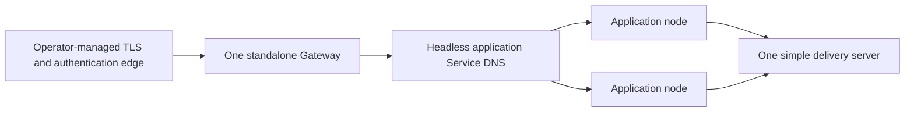

# Deploy a Spine TS application on GKE

`@spine-event-engine/deployment-gke` helps one standalone Gateway find ready
Spine TS application nodes through a Kubernetes headless Service. This guide
adds an editable Terraform starting point for a private, one-Gateway GKE
deployment. It is deliberately storage-neutral: your application chooses the
storage and supplies its configuration.

This is a guide for people deploying an application. For exact discovery API
and lifecycle behavior, see the [deployment reference](REFERENCE.md).

This experimental snapshot package is for operators who already own
an application, images, and a GKE cluster. Install its library API when writing
the Gateway or application entrypoint:

```bash
pnpm add @spine-event-engine/deployment-gke@snapshot
```

Copy the packaged Terraform directory into an operator deployment repository
only when you want its private reference topology. Installing this library, or
copying Terraform, does not create the cluster, public Gateway policy,
authentication/session implementation, application secrets, or storage.

## Before you begin

You need an existing GKE cluster, `gcloud`, `kubectl`, Terraform 1.6 or newer,
an existing Kubernetes ServiceAccount with the image-pull and configuration
access required by your workload, and images for three processes:

- your Spine TS application-node image;
- your standalone Gateway image; and
- an image running the simple delivery server.

Publish immutable image references before deployment. The template does not
create a GKE cluster, an image registry, an identity provider, or application
secrets. Authenticate `gcloud` and select the cluster first:

```bash
gcloud container clusters get-credentials CLUSTER --location REGION --project PROJECT
kubectl create namespace spine-app
```

Create the two Secrets through your normal secret-management process before
running Terraform. Terraform receives only their names; it never receives or
creates their values. The application Secret holds application-selected
settings, including storage settings when the application needs them. The
Gateway Secret holds separate identity and session settings.

## First Terraform plan

Copy the packaged template into an operator-owned deployment repository. The
following commands assume its Terraform directory is your current directory;
fill in its existing cluster, Secret names, and immutable image references,
then validate the private topology before configuring entrypoint details:

```bash
cp terraform.tfvars.example terraform.tfvars
terraform init
terraform fmt -check
terraform validate
terraform plan -var-file=terraform.tfvars
```

A plan showing only the Gateway, application, delivery, and private Services
is the first success. Review it before `terraform apply`.

## What this deployment creates

The Terraform module creates three private Kubernetes Deployments and three
ClusterIP Services. One Service is headless: Kubernetes publishes the ready
Node Coordinator endpoint of each application Pod in DNS. The Gateway uses that
DNS name with `GkeNodeDiscovery`; it does not call the Kubernetes API or
maintain a separate node registry. Managed application children remain
loopback-only and are not Service endpoints.



The template intentionally keeps Gateway, application, and delivery traffic
private. It does not create a public load balancer, TLS certificate, or
authentication policy. Connect the `gateway` ClusterIP Service to the public
TLS/authentication edge your operators choose. That edge is responsible for
admitting browser traffic; the Gateway then forwards authorized requests to
the application nodes.

The simple delivery server is useful for this supported topology, but it is
in-memory, single-replica, and not highly available. It loses its state when
it restarts. Choose an operationally suitable delivery design before depending
on it for a critical production workload.

This template has one Gateway and a fixed deployment shape. Multiple-Gateway
behavior and Cloud Run are outside the supported offering.

## Configure the template

Copy the supplied variable file and replace every placeholder with values for
your cluster and delivery pipeline:

```bash
Edit the existing `terraform.tfvars` copied for the first plan; do not overwrite it.
```

`terraform.tfvars` asks for the existing Secret names, immutable images, and
the kubeconfig context selected by `gcloud`. It defaults to two application
nodes, one Gateway, and one delivery server. The Gateway and delivery-server
replica counts are intentionally fixed at one in this topology.

Your application and Gateway entrypoints remain application code. The template
uses `HOST=0.0.0.0` and the matching `PORT` value for every container so its
private Kubernetes Service can reach the process. Keep that listener convention
in your image entrypoints. Put one small configuration owner beside the two
entrypoints, then have each entrypoint read its injected settings rather than
hard-coding the Terraform defaults:

Both supplied entrypoints bind `host: "0.0.0.0"` so the Kubernetes Service can
reach their listeners.

<!-- docs-snippet-path: packages/deployment-gke/examples/deployment-settings.ts -->

```ts
export type DeploymentEnvironment = Readonly<Record<string, string | undefined>>;

export const DeploymentSettings = Object.freeze({
  port(environment: DeploymentEnvironment, name: "PORT" | "BACKEND_DISCOVERY_PORT"): number {
    const value = environment[name];
    const port = Number(value);
    if (typeof value !== "string" || !Number.isInteger(port) || port < 1 || port > 65_535)
      throw new Error(`${name} must be an integer from 1 through 65535.`);
    return port;
  },

  serviceName(environment: DeploymentEnvironment): string {
    const value = environment.BACKEND_DISCOVERY_SERVICE?.trim();
    if (value === undefined || value.length === 0)
      throw new Error("BACKEND_DISCOVERY_SERVICE must not be blank.");
    return value;
  },
});
```

The [complete shared settings owner](examples/deployment-settings.ts) is a
small source file. Each Node.js entrypoint supplies `process.env` to it.
The Gateway reads `"BACKEND_DISCOVERY_PORT"` and
`BACKEND_DISCOVERY_SERVICE` from the same source.

The standalone Gateway uses the headless Service name and application port from
the module. Choose one admission mode for it: authenticated mode supplies
sessions and may supply named durable subscription bindings; public mode
supplies `publicAccess: true`, and the framework owns process-local bindings.
Both modes supply authorization, trusted actor-context resolution, allowed
origins, a clock, and a type registry. The complete
[server browser guide](https://github.com/SpineEventEngine/spine-ts/blob/main/packages/server/README.md#browser-gateway-migration) and
[browser authentication guide](https://github.com/SpineEventEngine/spine-ts/blob/main/docs/BROWSER_CLIENT_AUTH_EXTENSION_GUIDE.md)
explain those application integration points.

<!-- docs-snippet-path: packages/deployment-gke/examples/gateway.ts -->

```ts
import { GkeNodeDiscovery } from "@spine-event-engine/deployment-gke";
import { BrowserServer, type BrowserServerOptions } from "@spine-event-engine/server/browser";

type GatewayBrowserOptions = BrowserServerOptions extends infer Options
  ? Options extends BrowserServerOptions
    ? Omit<Options, "host" | "port" | "discovery">
    : never
  : never;

import { DeploymentSettings, type DeploymentEnvironment } from "./deployment-settings.js";

export interface GatewayOptions {
  readonly browser: GatewayBrowserOptions;
}

export const GatewayEntrypoint = Object.freeze({
  async run(
    options: GatewayOptions,
    environment: DeploymentEnvironment = process.env,
  ): Promise<void> {
    const discovery = new GkeNodeDiscovery({
      serviceName: DeploymentSettings.serviceName(environment),
      port: DeploymentSettings.port(environment, "BACKEND_DISCOVERY_PORT"),
    });
    await BrowserServer.run({
      host: "0.0.0.0",
      port: DeploymentSettings.port(environment, "PORT"),
      ...options.browser,
      discovery,
    });
  },
});
```

The [complete Gateway entrypoint](examples/gateway.ts) receives your typed
browser collaborators as `GatewayOptions`. In authenticated mode, supply
sessions, authorization, trusted actor-context resolution, allowed origins, a
clock, type registry, and optionally named durable subscription bindings. In
public mode, supply `publicAccess: true` with the shared collaborators; it
cannot accept bindings because the framework owns process-local ones.

The application entrypoint uses the same configuration source for its managed
Coordinator. Set `application_process_count` and `delivery_shard_count`
explicitly in Terraform. The former starts complete local replicas; the latter
is passed to your context assembly and is not inferred from hardware:

<!-- docs-snippet-path: packages/deployment-gke/examples/application.ts -->

```ts
import {
  ManagedServerApplication,
  type ManagedServerApplicationHandle,
  type ManagedServerApplicationOptions,
  type RunningServer,
} from "@spine-event-engine/server";

import { DeploymentSettings, type DeploymentEnvironment } from "./deployment-settings.js";

export interface ApplicationOptions {
  readonly moduleUrl: string;
  readonly createServer: (options: {
    readonly host: string;
    readonly port: number;
    readonly deliveryShardCount: number;
  }) => Promise<RunningServer>;
  readonly synchronize?: ManagedServerApplicationOptions["synchronize"];
  readonly restart?: ManagedServerApplicationOptions["restart"];
}

export const ApplicationEntrypoint = Object.freeze({
  async run(
    options: ApplicationOptions,
    environment: DeploymentEnvironment = process.env,
  ): Promise<ManagedServerApplicationHandle> {
    const deliveryShardCount = DeploymentSettings.deliveryShardCount(environment);
    return await ManagedServerApplication.run({
      processCount: DeploymentSettings.processCount(environment),
      host: "0.0.0.0",
      port: DeploymentSettings.port(environment, "PORT"),
      moduleUrl: options.moduleUrl,
      createServer: async ({ host, port }) =>
        await options.createServer({ host, port, deliveryShardCount }),
      ...(options.synchronize === undefined ? {} : { synchronize: options.synchronize }),
      ...(options.restart === undefined ? {} : { restart: options.restart }),
    });
  },
});
```

The [complete application entrypoint](examples/application.ts) receives its
typed bounded-context, service, and resource configuration as
`ApplicationOptions`.

The ConfigMap in the template exposes matching service and port values as a
simple convention. Adapt the names or use another configuration loader; Spine
TS does not require a particular environment-variable format. Authenticated
production startup rejects missing or volatile bindings before opening its
browser listener. `DurableSubscriptionBindings` is the supplied durable option;
give it a stable namespace and storage factory configured by the Gateway
process. Use shared persistent storage across Gateway replacements; an
in-memory store does not preserve bindings when a Gateway is replaced. Public
mode has no supplied bindings: its framework-owned process-local definitions
end when the Gateway is replaced.

## Deploy

Terraform applies Kubernetes resources to the cluster selected by your
kubeconfig. Keep cluster creation separate from this module, then run:

```bash
terraform init
terraform fmt -check
terraform validate
terraform plan -var-file=terraform.tfvars
terraform apply -var-file=terraform.tfvars
```

`plan` should show one Gateway Deployment, one delivery Deployment, one
application Deployment, and only private Services. Review it before `apply`.

## Verify the deployment

Wait for the Deployments, then inspect the headless Service endpoints:

```bash
kubectl get deployment,pod,service --namespace spine-app
kubectl rollout status deployment/application --namespace spine-app
kubectl rollout status deployment/gateway --namespace spine-app
kubectl rollout status deployment/delivery --namespace spine-app
kubectl get endpointslice --namespace spine-app \
  --selector kubernetes.io/service-name=application
kubectl logs --namespace spine-app deployment/gateway
```

A ready application Pod appears in the EndpointSlice and therefore becomes an
available Gateway backend. An unready Pod is not published because the Service
sets `publishNotReadyAddresses` to `false`. The Gateway refreshes the DNS
answer and reconciles its backend connections. A Gateway log or an application
metrics should show the expected ready backend count.

## Scale application nodes

Spine TS never changes replica counts. When autoscaling is disabled, operators
scale the identical application Deployment by changing the Terraform input:

```bash
terraform apply -var-file=terraform.tfvars -var=application_replicas=4
terraform apply -var-file=terraform.tfvars -var=application_replicas=1
```

Scaling to zero is also explicit. The Gateway remains available but reports no
backend until a ready application node returns:

```bash
terraform apply -var-file=terraform.tfvars -var=application_replicas=0
terraform apply -var-file=terraform.tfvars -var=application_replicas=2
```

The optional HPA is disabled by default. Its minimum is one application node.
When your platform team already operates an external-metrics adapter, set
`autoscaling_enabled = true` and choose its metric name, target, minimum, and
maximum in `terraform.tfvars`.
When it is enabled, Terraform deliberately omits the Deployment replica value
so routine applies do not reset changes made by the HPA. To return to manual
capacity, disable autoscaling and set `application_replicas` in the same apply.
CPU alone cannot wake an application Deployment from zero because no Pod is
running to report CPU. On Standard GKE, Google documents KEDA as the scale from
zero path. For that policy, set `autoscaling_enabled = false` and let
operator-managed KEDA be the sole autoscaler for the Deployment. HPA and KEDA
are mutually exclusive: never run the module HPA and a KEDA-managed HPA
together. Add the KEDA configuration
separately; this editable template does not install CRDs or assume a metric
provider.

## Replace an application version

Use immutable image digests and keep the previous digest in your deployment
record. A compatible replacement can use Kubernetes' normal rolling update:

```bash
terraform apply -var-file=terraform.tfvars \
  -var='application_image=REGION-docker.pkg.dev/PROJECT/spine/application@sha256:NEW'
```

During overlap, old and new nodes can process work. Pending Inbox work may run
under the new business logic, so operators—not Spine TS—must decide whether the
two versions are compatible. For an incompatible replacement, first disable
the module HPA if it controls capacity, stop every application node, apply the new
image, then restore one chosen capacity policy:

```bash
terraform apply -var-file=terraform.tfvars \
  -var=autoscaling_enabled=false -var=application_replicas=0
terraform apply -var-file=terraform.tfvars \
  -var='application_image=REGION-docker.pkg.dev/PROJECT/spine/application@sha256:NEW' \
  -var=application_replicas=2
```

Keep manual capacity by leaving `autoscaling_enabled = false`. Restore the
module HPA by applying `autoscaling_enabled = true` only when KEDA is absent.
For KEDA, leave the module HPA disabled and restore the operator-managed KEDA
policy only after the new application version is ready. Before the stop-all
step, suspend or remove the KEDA policy so it cannot create a node while the
replacement is intentionally at zero.

Replacing the single Gateway interrupts connected clients. The
Gateway-configured durable subscription registry preserves definitions across
the replacement; clients reconnect and re-query authoritative state after the
Gateway is ready again.

## Roll back

Roll back by applying a known compatible image digest and the prior replica
count. For an incompatible rollback, first disable the module HPA, use the
same stop-all, apply-old-image, start sequence, then restore exactly one of
manual replicas, the module HPA, or the operator-managed KEDA policy. Confirm
ready application endpoints and a successful Gateway connection before
declaring the rollback complete. Suspend or remove the KEDA policy before the
stop-all step, then restore it only after the old version is ready.

## Troubleshooting

| Symptom                    | Check                                                                              | Likely next step                                                                                  |
| -------------------------- | ---------------------------------------------------------------------------------- | ------------------------------------------------------------------------------------------------- |
| Gateway has no backend     | `kubectl get endpointslice -n spine-app -l kubernetes.io/service-name=application` | Check application logs and readiness; only ready Pods enter headless DNS.                         |
| Pods do not start          | `kubectl describe pod -n spine-app POD`                                            | Verify image access, ServiceAccount permissions, and that both existing Secret names are correct. |
| Terraform cannot connect   | `kubectl config current-context`                                                   | Re-run `gcloud container clusters get-credentials` and match `kubeconfig_context`.                |
| HPA shows no data          | `kubectl describe hpa -n spine-app application`                                    | Confirm the external-metrics adapter and metric name; the template does not install either.       |
| Browser clients disconnect | Gateway logs and the public edge                                                   | Expect interruption during Gateway replacement; reconnect and re-query.                           |

## Remove the deployment

Remove only the Terraform-managed resources when the application is no longer
needed:

```bash
terraform destroy -var-file=terraform.tfvars
```

The existing namespace, image registry, public edge, and Secrets are
managed by the operator and remain. Delete them separately only after verifying that no
other workload needs them.
